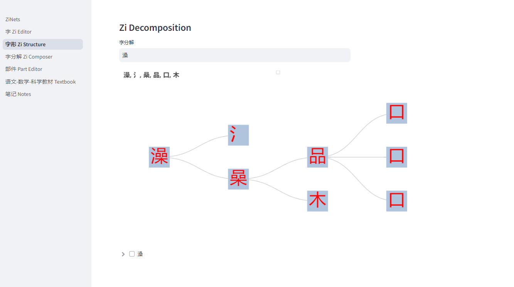
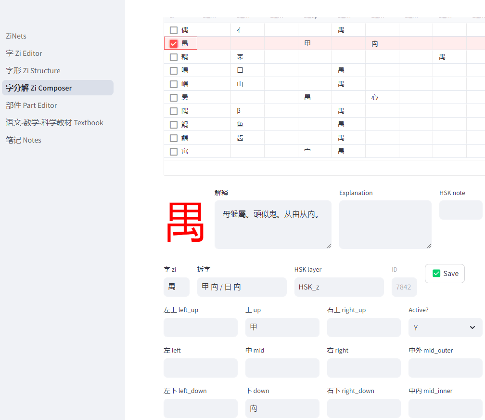
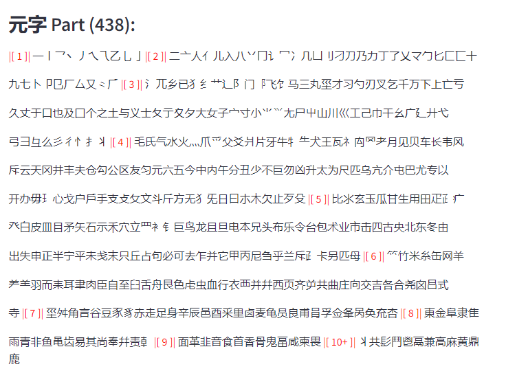

# A Physics-Inspired Computational Approach to Chinese Character Analysis: Network Patterns and Semantic Evolution

Wen G. Gong*
*Corresponding author: digital-duck@outlook.com

2025-01-01

## Abstract
This paper presents a novel perspective on Chinese characters as a naturally evolved system for encoding and transmitting concepts and meaning, following universal principles of organization and growth. By treating character components as fundamental elements that interact through semantic forces, we develop a systematic framework that reveals how Chinese writing mirrors patterns found throughout nature. The approach integrates physics principles, computational analysis, and traditional understanding to demonstrate how characters emerge from elemental characters (元字) through natural combination patterns, similar to physical and biological systems. Using the Fibonacci sequence as an organizing principle, we show how approximately 3,000 Chinese characters can be systematically understood through their evolutionary patterns. Our computational implementation, ZiNets, provides evidence for this perspective by revealing recurring patterns of character composition and semantic development.

## 1. Introduction
Chinese characters, as one of the oldest continuously used writing systems, present a unique opportunity for studying how symbolic systems naturally evolve to encode and transmit meaning. 

Historically and traditionally, Chinese characters are categorized into six types (known as 六书) based on their formation.

- Pictograms (象形): The earliest forms. These characters are stylized representations of concrete objects. Examples are: 日 (sun), 月 (moon), 山 (mountain), 人 (human)

- Simple Ideograms (指事): These characters represent abstract concepts through symbolic forms or by adding strokes to pictograms. Examples are: 上 (above), 下 (below), 一 (one), 二 (two)

- Compound Ideograms (会意): Combine two or more pictograms or ideograms to create a new meaning. The meaning is derived from the logical combination of the parts. Examples are: 休 (rest, 人 person leaning against 木 tree), 明 (bright, 日 sun and 月 moon)

- Phono-semantic Compounds (形声): The most common type. These characters combine a semantic component (giving a hint of meaning) and a phonetic component (giving a hint of pronunciation). Examples are: 媽 (mother; semantic: 女 woman, phonetic: 馬, which was historically pronounced similarly), 湖 (lake; semantic: 氵water, phonetic: 胡 hú)

- Transfer Characters (转注): This category is less clear-cut and more debated among scholars. It generally refers to characters whose meanings have been extended or adapted.

- Loan Characters (假借):  These characters were "borrowed" to represent a different word with a similar pronunciation. Also not as crucial for basic understanding.

While above traditional approaches have often viewed characters as designed constructs, this paper proposes that they represent a naturally evolved system following universal principles of organization and growth seen throughout nature.

The key insights of this paper are:
1. Chinese characters evolved as a coherent system for encoding concepts, following natural principles rather than arbitrary design
2. Character formation patterns mirror physical and biological growth processes
3. The system exhibits properties of self-organization and natural evolution
4. Computational analysis reveals systematic patterns in character composition and development

Through our physics-inspired framework, we demonstrate how:
- Elemental characters (元字) combine following natural patterns
- Character complexity follows Fibonacci-like growth sequences
- Component interactions create stable semantic structures
- The system maintains coherence while enabling evolution

## 2. Methodology

### 2.1 The Concept of 元字 (Elemental Characters)

Unlike traditional radical classification systems that focus primarily on handwriting and structural organization, we introduce the concept of 元字 (elemental characters) as fundamental semantic building blocks, expanding on radicals and phonetic components. These approximately 300 elemental characters serve as the "periodic table" of Chinese characters, each carrying independent semantic meaning that contributes to the formation of more complex characters. They may not look as simple as pictograph, but carry distinct conceptual meaning and semantics.

Key characteristics of 元字:
1. Semantic Independence: Each 元字 carries its own meaningful concept (e.g., 乐 for music/happiness)
2. Combinatorial Power: They combine to form more complex characters following semantic and structural rules
3. Frequency Patterns: Their usage follows natural distribution patterns in character formation
4. Cross-Category Utility: They often participate in multiple semantic domains

This approach differs from the traditional radical system in several key ways:
- Focus on meaning rather than just writing structure
- Inclusion of semantically significant characters that aren't traditional radicals
- Emphasis on combinatorial patterns rather than categorization
- Recognition of independent semantic value

### 2.2 Spatial Framework and Component Interactions

Our physics-inspired approach treats Chinese character composition as a system of components interacting within a well-defined spatial framework:

1. Coordinate Space (九字宫 Enhancement)
   - The traditional nine-grid system serves as a "coordinate space" for component positioning designed for calligraphy.
   - Components interact across specific positions, similar to particle interactions in physics
   - Additional dimensions (mid-inner, mid-outer) handle enclosure structures, analogous to how physics adds dimensions to describe complex systems

2. Topological Patterns
   - Linear arrangements: Components interact in sequential positions (e.g., 明, 街, 尖, 曼)
   - Enclosure patterns: Outer components create boundary conditions for inner elements (e.g. 回)
   - Triangle patterns: components arranged in triangular positions (e.g. 品, 森)
   - Nested structures: Multiple levels of containment create hierarchical relationships (e.g. 藻)

3. Special Case Handling
   - Enclosure characters (回, 国) utilize extended spatial dimensions
   - Mid-inner position represents contained elements
   - Mid-outer position represents containing elements

### 2.3 Fibonacci Organization and 元字 Emergence

The Fibonacci sequence provides a natural framework for understanding how Chinese characters evolved from basic concepts to complex combinations. Each level introduces new 元字 that serve as fundamental building blocks for more sophisticated expressions or representations:

1 (一): 气 (primordial force/energy)
   - The most fundamental 元字
   - Represents the emergence of form from formlessness (无中生有)
   - Base unit for energy and force concepts

2 (二): 日,月 (sun and moon)
   - First pair of naturally contrasting 元字
   - Represents 2 visible solar objects and a fundamental abstraction in the basic dualism philosophy (阴阳)
   - Foundation for temporal and luminance concepts

3 (三): 天,地,人 (heaven, earth, human)
   - Tripartite domain 元字
   - Establishes basic spatial and existential framework for human cognitive psychic
   - Core reference for positioning and relationships

5 (五): 金,木,水,火,土 (metal, wood, water, fire, earth)
   - Material phase 元字
   - Fundamental elements for describing physical and materialistic world
   - Base components for nature-related characters

8 (八): 东,南,西,北,春,夏,秋,冬 (directions and seasons)
   - Spatiotemporal 元字
   - Complete system of orientation and cyclical change
   - Foundation for location and time-based concepts

13 (十三): 生,鼠,牛,虎,兔,龙,蛇,马,羊,猴,鸡,狗,猪 (basic life forms expressed in 12 Zodiac animals)
   - Biological 元字
   - Complex natural phenomena
   - Base set for describing living things

21 (二十一): Quantification and Measurement 元字
This set represents the emergence of systematic measurement and counting:

1. Numerical System (15 characters):
   - Basic numerals: 一,二,三,四,五,六,七,八,九,十
   - Large quantities: 百,千,万,亿,零
   - These form the foundation for all quantitative description

2. Physical Units (6 characters):
   - Time measurement: 秒,分,时
      - Progression from smallest (second) to largest (hour)
      - Reflects natural cycles and human activity patterns
   - Length measurement: 寸,丈,里
      - Traditional Chinese units of length
      - Scales from human body reference (寸) to geographic distance (里)

34 (三十四): Human Form and Action 元字
This set introduces fundamental components for describing human existence and behavior:

1. Body Parts, Actions and Identity:
   - Basic parts: 心,头,首,面,页,口,目,鼻,耳,舌,牙,齿,手,又,足,血,肉,身,尸,骨,皮,毛
   - Action indicators: 忄,扌,辶,走,立
   - Expression: 言,讠
   - Identity: 男,女,子,自,己

### 2.4 Pattern Discovery and Physical Analogies

The systematic analysis of character composition through our spatial framework reveals several key patterns that parallel physical systems:

1. Compositional Rules as Interaction Laws
   - Just as physical particles interact according to fundamental forces, character components combine following specific spatial and semantic rules
   - The nine-grid system acts as a "field" where components interact to form stable configurations
   - Component positions influence each other, similar to how particles create and respond to fields

2. Emergent Patterns
   - Regular combinations: Certain components frequently appear in specific relative positions
   - Stability patterns: Some configurations appear more frequently in the character set, suggesting "stable states"
   - Conservation laws: Semantic meaning is preserved across different spatial arrangements

3. Hierarchical Organization
   - Like physical systems exhibiting different scales of organization, characters show multiple levels of structure
   - Local interactions (between adjacent components) lead to global patterns
   - Complex characters emerge from simpler stable configurations

## 3. Results

### 3.1 Web Application Implementation: ZiNets

Our web-based visualization tool, ZiNets (Zi Network System), implements the theoretical framework through an interactive character decomposition system. The name "ZiNets" reflects its primary function: reconstructing Chinese characters (Zi, 字) into networks of their elemental components.

#### 3.1.1 Character Decomposition Visualization

The core feature of ZiNets is its hierarchical decomposition visualization:

1. Network Structure
   - Characters are represented as nodes in a directed graph
   - Decomposition relationships are shown as edges
   - Left-to-right layout reflects decomposition hierarchy
   - Visual clarity maintained through spatial organization

2. Hierarchical Analysis
   - Multiple levels of decomposition shown simultaneously
   - Clear parent-child relationships between components
   - Preservation of structural relationships
   - Explicit visualization of component reuse

3. Component Identification
   - Each 元字 and component clearly bounded
   - Consistent visual representation of elements
   - Immediate recognition of basic building blocks
   - Clear distinction between levels of composition

### 3.2 Frequency Analysis and Natural Efficiency

Our computational analysis of approximately 3,000 commonly used Chinese characters reveals striking patterns in 元字 usage that support the concept of natural optimization:

1. Frequency Distribution
   - High-frequency components (>300 occurrences):
     * 木(510): earth/wood category
     * 氵(374): water/earth category
     * 口(334): human/speech category
   - This distribution suggests natural selection of efficient building blocks

2. Semantic Categories
   - Earth/Nature elements show high frequency
   - Human-related components are numerous
   - Abstract concepts build upon concrete elements
   - Hierarchy from physical to conceptual domains

3. Efficiency Principles
   - Most common 元字 serve as versatile semantic building blocks
   - System shows optimization between complexity and expressiveness
   - High-frequency components span fundamental conceptual categories
   - Natural selection of most effective semantic encoders

### 3.3 Case Study: The 禺 Family
Detailed analysis of the 禺 component family demonstrates our methodology:

Base Component:
- 禺: Represents fundamental concept of joining/coupling

Derivative Characters:
1. 偶 (ǒu): Person + joining → couple/partner
2. 寓 (yù): Roof + joining → dwelling/metaphorical connection
3. 遇 (yù): Movement + joining → encounter/meet
4. 愚 (yú): Heart/mind + joining → inability to make mental connections
5. 隅 (yú): Wall + joining → corner/intersection

The semantic evolution follows predictable patterns similar to force interactions in physics:
- Spatial joining (寓, 隅)
- Temporal joining (遇)
- Conceptual joining (愚)
- Physical joining (偶)

### 3.4 Computational Pattern Discovery

The computational power of ZiNets reveals fundamental structures and relationships in Chinese characters, demonstrating deep connections between linguistics, mathematics, and physics:

1. Search and Analysis Framework
   - Multi-dimensional querying: Component-based, position-based, and pattern-based search
   - Regular expression-like syntax for complex pattern matching
   - Structured data representation through positional columns (zi_left, zi_mid, etc.)
   - Network relationship discovery through component tracking

2. Physical Analogies in Search Results
   - Component Distribution: Similar to particle distribution in quantum states
   - Position Patterns: Analogous to preferred energy states in atomic structures
   - Character Families: Parallel to particle families in physics
   - Interaction Networks: Mirror force carrier networks in particle physics

3. Mathematical Structure
   - Grid System: Creates a coordinate space for character composition
   - Position Matrices: Track component relationships systematically
   - Pattern Frequencies: Reveal statistical regularities
   - Network Topology: Maps character relationship spaces

## 4. Discussion and Implications

### 4.1 Chinese Writing as a Living System

Our computational and physics-inspired analysis reveals Chinese writing as a living, self-organizing system that mirrors natural growth patterns:

1. Emergent Complexity
   - Like biological systems emerging from simple molecular interactions, complex characters emerge from basic 元字 combinations
   - Component relationships evolve naturally based on semantic needs
   - New meanings emerge through systematic combination patterns
   - Character evolution follows principles of natural growth

2. Self-Organization Principles
   - Characters form stable patterns without centralized design
   - Component combinations follow natural efficiency principles
   - Semantic relationships develop through organic usage
   - System exhibits both stability and adaptability

3. Natural Growth Patterns
   - Character development parallels Fibonacci patterns in nature
   - Component relationships reflect natural force balances
   - Evolution follows paths of least resistance
   - System maintains coherence while allowing innovation

### 4.2 Practical Implications

1. Understanding:
   - Characters as evolved patterns rather than arbitrary symbols
   - System reflects natural organization principles
   - Connection to universal growth patterns
   - Evidence of semantic optimization

2. Learning:
   - Focus on fundamental 元字 and their concepts
   - Reduce the fundamental 元字 set to lower the entry-barrier in learning Chinese language
   - Understanding natural combination patterns
   - Recognition of systematic structure
   - Appreciation of organic relationships
   - Promote concept-based learning and break down artificial subject-barriers among human language, mathematics and science.
   - Make STEM-oriented learning accessible to earlier ages

3. Development:
   - System continues to evolve and adapt
   - New characters follow established patterns
   - Natural selection of effective forms
   - Living language rather than static system

## 5. Conclusion

The Chinese writing system represents a remarkable example of natural optimization in language evolution. Through computational analysis and theoretical reframing in terms of basic physics concepts, we reveal how:

1. The system evolved efficient solutions for encoding meaning
2. Character formation follows universal organization principles
3. A finite set of elemental characters 元字 generates rich semantic expression
4. The system maintains stability while enabling growth

This understanding transforms our view of Chinese characters from a designed writing system to a naturally evolved, living language system that continues to develop according to universal principles of organization and growth.

## Dedication
This work is dedicated to late Professor T.D. Lee, whose pioneering efforts opened doors for many Chinese students to pursue research in the United States, fostering a bridge between Eastern and Western scientific traditions. His vision and support have enabled countless scholars like myself to contribute to global scientific discourse.

I also dedicate this work to my dear parents, who nurtured my intellectual curiosity through challenging times. Their sacrifices and unwavering support made my life journey possible.

## Acknowledgements
This paper represents a collaborative effort between the author and Claude, an AI Assistant from Anthropic. The fusion of human expertise in physics and Chinese language with AI's analytical capabilities enabled the development of novel perspectives and methodologies presented in this work. This collaboration demonstrates the potential of human-AI partnerships in academic research, particularly in interdisciplinary studies bridging traditional knowledge with modern computational approaches.

## References

- https://www.wikiwand.com/en/articles/Chinese_characters
- Sears, Richard. Chinese Etymology research website at https://hanziyuan.net/

- George Lakoff (Cognitive Linguistics)
- Ronald Langacker (Cognitive Linguistics)

- Kenneth Church (Computational Linguistics)
- Christopher Manning (Computational Linguistics)

- Stuart Kauffman (Physics and Complex Systems)

## Appendix

### ZiNets Web App 

- source code : https://github.com/digital-duck/zinets

#### Chinese Character Network Patterns 

#### Decomposition

#### 元字 Collection

#### 元字 Frequency

#### Search

### Citation Research Tools

- [arXiv](https://arxiv.org/): An online repository of research papers, primarily in physics, mathematics, computer science, quantitative biology, quantitative finance, and statistics.
- [Google Scholar](https://scholar.google.com/): A powerful search engine for scholarly literature.
- [JSTOR](https://www.jstor.org/): A digital library of academic journals, books, and primary sources.
- [Web of Science](https://clarivate.com/): A citation index that allows you to track the impact of research.
- [Zotero](https://www.zotero.org/): A free, open-source reference management software.
- [EndNote](https://endnote.com/): A commercial reference management software.