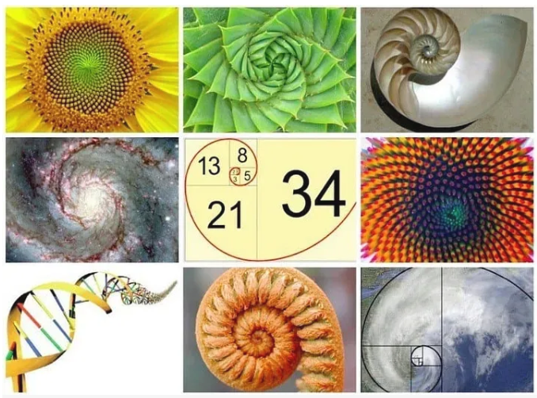
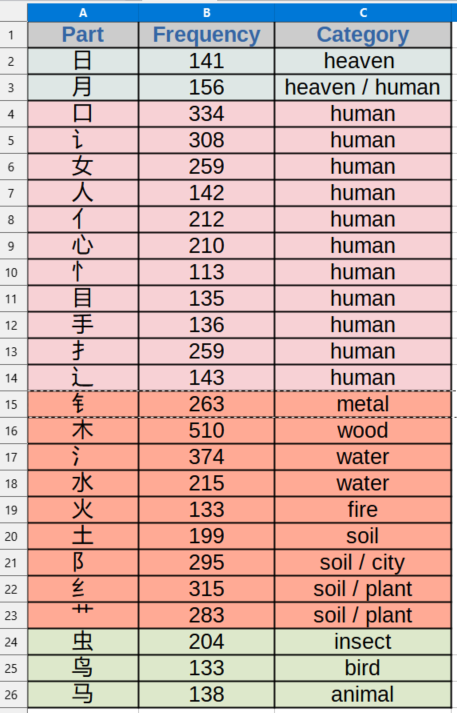
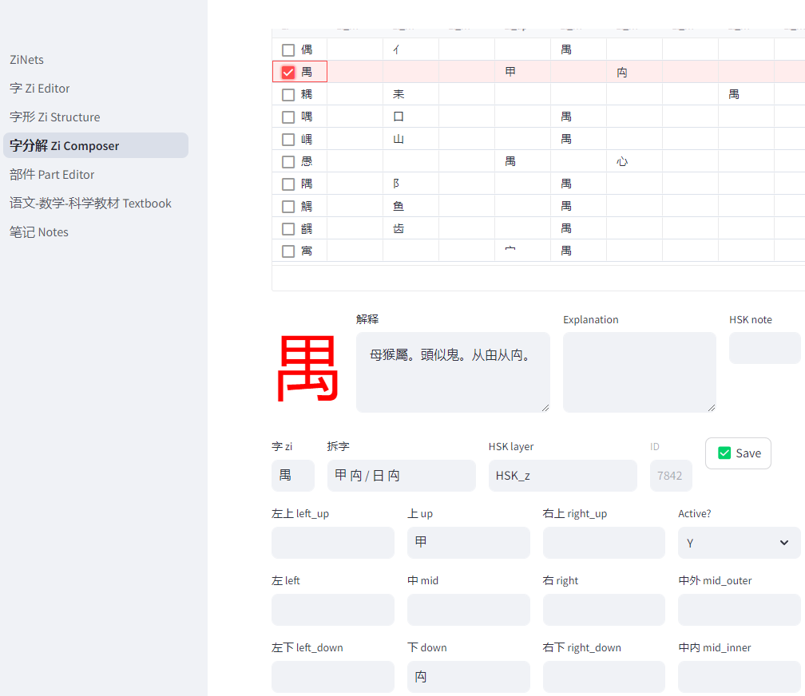
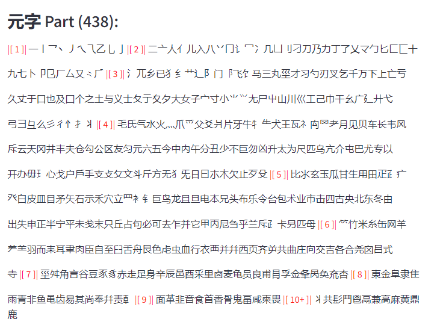

# 一种基于物理启发的计算方法用于汉字分析：网络模式与语义演化

龚文光 *

*通讯作者: digital-duck@outlook.com

2025-01-01

## 摘要
本文提出了一种新颖的视角，将汉字视为一种自然演化的系统，用于编码和传递概念与意义，遵循普遍的组织和生长原则。通过将汉字组件视为通过“语义力”相互作用的基本元素，我们开发了一个系统框架，揭示了汉字书写如何反映自然界中的模式。该方法整合了物理学原理、计算分析和传统理解，展示了汉字如何通过自然组合模式从基本字符（元字）中演化出来，类似于物理和生物系统。使用斐波那契数列作为组织原则，我们展示了如何通过演化模式系统地理解大约3000个汉字。我们的计算实现——ZiNets（字网），通过揭示汉字组成和语义发展的重复模式，为这一视角提供了证据。

## 1. 引言
汉字[1]作为最古老的连续使用的书写系统之一，为研究符号系统如何自然演化以编码和传递意义提供了独特的机会。

传统汉语语言学根据形成原则将汉字分为六类（六书）：

- **象形字**：<br/>
  直接描绘具体物体的图像，形成最早的字符集。例如：日（太阳）、月（月亮）、山（山）、人（人）。

- **指事字**：<br/>
  通过符号形式或修改的象形字表示抽象概念。例如：上（上）、下（下）、一（一）、二（二）。

- **会意字**：<br/>
  两个或多个象形字或指事字的逻辑组合，以创造新的意义。例如：休（休息）显示一个人（人）靠在树（木）上，而明（明亮）结合了日（太阳）和月（月亮）。

- **形声字**：<br/>
  最常见的类型，结合了语义组件（意义指示符）和语音组件（发音指南）。例如：妈（母亲；语义：女，语音：马）和湖（湖；语义：氵水，语音：胡 hu）。

- **转注字**：<br/>
  一个有争议的类别，描述具有扩展或适应意义的字符。

- **假借字**：<br/>
  通过语音借用字符来表示发音相似的词。

尽管关于汉字在不同书写风格中的结构演化有广泛的研究[2]——从甲骨文、金文、篆书、隶书、楷书、行书到草书，传统学术主要关注其形态方面。本文提出了一种新颖的视角：汉字代表了一种自然演化的系统，遵循自然界中普遍的组织和生长原则。

**关键见解**：
- 汉字通过自然原则而非任意设计演化为一个连贯的概念编码系统。
- 汉字形成模式与物理和生物生长过程相似。
- 该系统表现出自组织和自然演化的特征。
- 计算分析揭示了汉字组成中的系统模式。

我们的物理启发框架展示了：
- 基本字符（元字）中的自然组合模式。
- 汉字复杂性中的斐波那契式增长序列。
- 组件相互作用中出现的稳定语义结构。
- 通过演化发展保持的系统连贯性。

## 2. 方法论

### 2.1 元字的概念

与主要关注手写和结构组织的传统部首分类系统不同，我们引入了**元字**的概念，作为扩展部首和语音组件的基本语义构建块。这些大约300-400个元字充当汉字的“元素周期表”，每个元字都带有独立的语义意义，有助于形成更复杂的字符。它们可能并不总是像象形字那样简单，但具有独特的概念意义和语义。

**关键特征**：
- **语义独立性**：<br/>
  每个元字都带有其原始的、有意义的概念（例如，乐表示音乐/幸福）。
- **组合能力**：<br/>
  它们按照语义和结构规则组合成更复杂的字符。
- **频率模式**：<br/>
  它们在字符形成中的使用遵循自然分布模式。
- **跨类别实用性**：<br/>
  它们通常参与多个语义领域。

这种方法与传统部首系统在几个关键方面有所不同：
- 关注意义而非仅仅是书写结构。
- 包含语义重要但不属于传统部首的字符。
- 强调组合模式而非分类。
- 承认独立的语义价值。

### 2.2 空间框架与组件相互作用

我们的物理启发方法将汉字组成视为在一个明确定义的空间框架内相互作用的组件系统：

- **坐标空间（九字宫增强）**
  - 传统的九宫格系统作为书法中组件定位的“坐标空间”。
  - 组件在特定位置上相互作用，类似于物理学中的粒子相互作用。
  - 额外的维度（中内、中外）处理包围结构，类似于物理学中描述复杂系统的维度增加。

- **拓扑模式**
  - 不可约模式：独立的组件，如象形字符（例如，日，月，人）。
  - 线性排列：组件在连续位置上相互作用（例如，明，街，尖，曼）。
  - 包围模式：外部组件为内部元素创建边界条件（例如，回）。
  - 三角形模式：组件在三角形位置上排列（例如，品，森）。
  - 象限模式：组件在方形位置上排列（例如，疑，叕）。
  - 嵌套结构：多层次的包含创建层次关系（例如，藻）。

- **特殊情况处理**
  - 包围字符（回，国）利用扩展的空间维度。
  - 中内位置表示被包含的元素。
  - 中外位置表示包含的元素。

### 2.3 斐波那契组织与元字出现

斐波那契数列（1, 1, 2, 3, 5, 8, 13, 21, 34, 55, ...）在自然界中的生长模式中自然出现。当可视化时，它创建了一个被称为黄金螺旋的优雅螺旋，从向日葵种子的排列到鹦鹉螺的壳中都可以看到。这种模式代表了自然界在生长和组织中的高效方法，复杂的结构建立在更简单的基础上，和谐而平衡[3]。



我们借用斐波那契数列以类似的自然进展来组织汉字：从简单的象形字到复杂的复合字符，从具体物体到抽象概念。正如斐波那契螺旋展示了复杂自然模式如何从简单的数学关系中产生，我们的组织揭示了汉字如何从基本元素（元字）演化成越来越复杂的表达。每个层次都引入了新的基本字符，就像扩展的螺旋一样，作为更丰富语言表示的构建块。这种方法反映了自然界在从简单基础发展复杂系统时的效率。

在下面，我们列出了前8组元字家族。具有独立意义的传统部首在“部首形式映射”下注明（例如，灬表示火）。

- **1（一）：气（原始力/能量）**
  - 最基本的元字。
  - 代表从无形中出现的可见形式（无中生有）。
  - 能量和力概念的基本单位。
  - 炁是气的古老形式，很少使用。但其下部部首（灬）暗示了其与火和能量相关的语义意义。

- **1（一）：点，线（原始低维对象）**
  - 基本部首元字：<br/>
    丶（点），一（水平线），丨（垂直线），丿（东北线），乀（东南线）。
  - 代表可见的简单形式（即点状或线状物体）。

- **2（二）：日，月（太阳和月亮）**
  - 第一对自然对比的元字。
  - 代表两个可见的太阳物体和基本二元哲学（阴阳）中的基本抽象。
  - 时间和亮度概念的基础。
  - 这两个字符都可以用作部首。值得注意的是，月用作部首时表示身体部位肉/肉。这可能是历史上月被采用为肉的简化书写形式的巧合。

- **3（三）：天，地，人（天，地，人）**
  - 三元领域元字。
  - 为人类认知心理建立基本的空间和存在框架。
  - 定位和关系的核心参考。
  - 部首形式映射：<br/>
    土表示地，亻表示人。

  

  这张AI生成的图像[4]体现了6个元字（气，日，月，天，地，人）在一个综合的视觉表示中。

- **5（五）：金，木，水，火，土（金，木，水，火，土）**
  - 物质阶段元字。
  - 古代哲学中描述物理和物质世界的基本五行。
  - 与自然相关字符的基本组件。
  - 部首形式映射：<br/>
    钅表示金，氵冫表示水，灬表示火，木，土在用作部首时通常以较窄的形式呈现。语义意义相同。

- **8（八）：东，南，西，北，春，夏，秋，冬（方向和季节）**
  - 时空元字。
  - 方向和周期性变化的完整系统。
  - 位置和时间概念的基础。

- **13（十三）：生，鼠，牛，虎，兔，龙，蛇，马，羊，猴，鸡，狗，猪（以十二生肖表达的基本生命形式）**
  - 生物对象元字。
  - 复杂的自然现象。
  - 描述生物的基本集合。
  - 部首形式映射：<br/>
    牜表示牛，虫是蛇和其他昆虫的部首，犭是许多动物的部首（例如，猴，狗，猪），羊，⺶，⺷是羊的变体部首形式，马的部首较窄。

- **21（二十一）：量化和测量元字**
  - 数字系统（15个字符）：
    - 基本数字：<br/>
      一，二，三，四，五，六，七，八，九，十。
    - 大数量：<br/>
      百，千，万，亿，零。
    - 这些构成了所有定量描述的基础。
  - 物理单位（6个字符）：
    - 时间测量：秒，分，时。
      - 从最小（秒）到最大（小时）的进展。
      - 反映自然周期和人类活动模式。
    - 长度测量：寸，丈，里。
      - 传统的中国长度单位。
      - 从人体参考（寸）到地理距离（里）的尺度。

这组代表了系统测量和计数的出现。

- **34（三十四）：人类形态和动作元字**
  - 基本部分：<br/>
    心（忄），头，首，面，口，目，眉，鼻，耳，舌，牙，齿，手（扌），又，足，血，肉，身，尸，骨，皮，毛（彡）。
  - 动作指示符：<br/>
    言（讠），口，看，听，思，食（饣），走（辶），立。
  - 身份：<br/>
    男，女，子，自，己。
  - 部首形式映射：<br/>
    忄表示心，扌表示手，辶表示足，讠表示言，饣表示食，通常在动作上下文中（例如，情感思考，持有，行走，交流）。目，口，足，骨，耳也作为部首出现。一些字符（如首，面）可以在不同上下文中既作为名词（头，脸）又作为量词/分类词。

这组引入了描述人类存在和行为的基本组件。

### 2.4 模式发现与物理类比

通过我们的空间框架对汉字组成的系统分析揭示了几个与物理系统相似的关键模式：

- **组合规则作为相互作用法则**
  - 正如物理粒子根据基本力相互作用，字符组件按照特定的空间和语义规则组合。
  - 九宫格系统充当一个“场”，组件在其中相互作用以形成稳定的配置。
  - 组件位置相互影响，类似于粒子如何创建和响应场。

- **涌现模式**
  - 常规组合：某些组件经常出现在特定的相对位置。
  - 稳定性模式：一些配置在字符集中出现得更频繁，表明“稳定状态”。
  - 守恒定律：语义意义在不同的空间排列中得以保留。

- **层次组织**
  - 像物理系统展示不同尺度的组织一样，字符显示多层次的结构。
  - 局部相互作用（相邻组件之间）导致全局模式。
  - 复杂字符从更简单的稳定配置中涌现。

## 3. 结果

### 3.1 网络应用程序实现：ZiNets（字网）

我们的基于网络的可视化工具ZiNets（字网络系统）通过交互式字符分解系统实现了理论框架。名称“ZiNets”反映了其主要功能：将汉字（字）重构为其基本组件的网络。

#### 3.1.1 字符分解可视化

ZiNets的核心功能是其层次分解可视化：

- **网络结构**
  - 字符表示为有向图中的节点。
  - 分解关系表示为边。
  - 从左到右的布局反映了分解层次。
  - 通过空间组织保持视觉清晰度。

- **层次分析**
  - 同时显示多个分解层次。
  - 清晰的父子关系。
  - 保留结构关系。
  - 明确显示组件的重用。

- **组件识别**
  - 每个元字和组件都有明确的边界。
  - 元素的一致视觉表示。
  - 立即识别基本构建块。
  - 明确区分组成层次。

### 3.2 频率分析与自然效率

我们对大约3000个常用HSK汉字的计算分析揭示了元字使用中的显著模式，展示了自然优化原则：

- **高频元素的分布（>100次出现）**：
   
  该表展示了常用汉字中最常用的25个元字/部首。这些元素主要属于第2（日，月）、第3（天地人）和第4（金木水火土）斐波那契数列集。虽然气（空气/能量）未出现在此列表中，但其概念力渗透到字符系统中。分布模式表明，自然演化趋向于高效的结构组件，元素被分组到不同的语义类别中：

  - 天界相关元素：<br/>
      日，月。
  - 人类相关元素：<br/>
      口，女，人（亻），心（忄），目，手（扌），辶。
  - 自然元素：
      - 五行：<br/>
      金（钅），木，水（氵），火，土。
      - 地的变体：<br/>
      阝，艹，纟。
      - 生物：<br/>
      虫，鸟，马。

    

- **语义分布**
  - 地和自然元素的优势。
  - 人类相关组件的高代表性。
  - 从具体到抽象概念的逐步发展。
  - 从物理到抽象领域的清晰概念层次。

- **效率特征**
  - 核心元字作为多功能语义基础。
  - 系统在复杂性和表达力之间取得平衡。
  - 高频组件跨越基本类别。
  - 进化选择优化语义编码的证据。

### 3.3 案例研究 - 复合字符

#### 3.3.1 日家族

<br/>
汉字“日”（rì），意为“太阳”或“日”，是汉字如何高效编码意义、知识和智慧的强大例证。通过考察包含“日”的复合字符，我们可以深入了解书面语言如何捕捉关于世界的基本真理和观察。这些简单的公式提供了对汉语丰富语义的一瞥。
考虑以下示例：

  - 日 + 月 = 明（míng）：<br/>

    在早期文明中，太阳和月亮是主要的照明来源。这两个字符的组合形成了明，意为“明亮”或“清晰”，优雅地捕捉了这一基本真理。
  - 日 + 正 = 是（shì）：<br/>

    当太阳直接位于头顶时，它不会投射阴影。这个字符组合，意为“是/存在”，将概念扩展到清晰和客观地看待事物，不受扭曲。短语“实事求是”（shíshìqiúshì）体现了这一点，敦促我们通过事实寻求真理。
  - 知 + 日 = 智（zhì）：<br/> 

    字符智，表示智慧或知识，结合了“知道”（知）和“太阳”（日）。这封装了真正的智慧来自于理解太阳的方式——无私地辐射光和能量，而不期待回报。
  - 日 + 日 + 日 = 晶（jīng）：<br/> 

    “日”的重复强化了明亮的概念，形成了一个意为“水晶”或“明亮清晰”的字符。这个字符美丽地捕捉了水晶的发光和透明本质。
  - 门 + 日 = 间（jiān）：<br/> 

    当光线穿过门时，它照亮了门框之间的空间或间隔。这个字符巧妙地通过结合“门”和“太阳”的符号来表示间隙、空间或间隔的概念。
  - 日 + 寸 = 时（shí）：<br/> 

    在古代，日晷用于通过跟踪太阳阴影的长度和位置来测量时间。这个字符结合了“太阳”和“寸”，通过太阳运动的隐喻说明了时间的概念。
  - 日 + 生 = 星（xīng）：<br/> 

    “星”字符结合了“太阳”和“出生”或“产生”，暗示星星是从太阳中诞生的，或者它们本身就是太阳。这个字符反映了古代对太阳与天空中天体之间联系的理解。
  - 丿 + 日 = 白（bái）：<br/> 

    “白”字符结合了一笔（丿）和太阳（日）。这代表了科学理解，即阳光由所有颜色组成，如牛顿的棱镜实验所示。阳光的白色外观是可见光谱中所有颜色组合的结果。
  - 日 + 一 = 旦（dàn）：<br/> 

    这个字符结合了太阳和代表地平线的水平笔画，捕捉了太阳从地球地平线上升起的时刻。它象征着新的一天或周期的开始，如“元旦”（新年）。
  - 九 + 日 = 旭（xù）：<br/> 

    “旭”字符意为“旭日”或“明亮辉煌”，结合了数字九（即许多）和太阳。九个太阳一起闪耀的想法唤起了难以想象的明亮和强度的形象。
  - 日 + 十 = 早（zǎo）：<br/> 

    在这里，太阳显示在类似于树顶的符号上方，表示太阳已经升到树上的清晨时分。这个字符封装了“早”或“早晨”的概念。
  - 日 + 干 = 旱（hàn）：<br/> 

    太阳和“干”或“干燥”字符的组合创建了一个意为“干旱”的字符。这说明了强烈阳光与土地干燥之间的因果关系，导致干旱条件。


这些例子仅仅触及了表面，但这个家族展示了汉字如何通过其组成揭示深刻的见解，并以其他书写系统无法比拟的独特高效方式编码知识。学习汉字的孩子们在掌握语言的同时接触到基本的科学概念和知识，这是许多其他语言所不具备的特征。

#### 3.3.2 禺家族

<br/> 

对禺组件家族的详细分析展示了语义结合模式和历史演化原则：

基本组件禺（元字）<br/> 
  代表结合/耦合的基本概念，类似于物理学中的基本力载体。这个字符本身是一个复合字符：甲 + 禸 = 禺。

衍生字符及其结合模式：

- 亻 + 禺 = 偶（ǒu）：<br/> 

  人 + 结合 → 伴侣/伙伴。
  历史演化：从偶然相遇到有意配对。

- 宀 + 禺 = 寓（yù）：<br/> 

  屋顶 + 结合 → 住所/隐喻连接。
  显示从物理空间到抽象空间的扩展。

- 辶 + 禺 = 遇（yù）：<br/> 

  运动 + 结合 → 相遇/遇见。
  展示结合力的时间维度。

- 禺 + 心 = 愚（yú）：<br/> 

  心/思想 + 结合 → 无法建立心理连接。
  揭示结合概念的认知维度。

- 阝 + 禺 = 隅（yú）：<br/> 

  墙 + 结合 → 角落/交叉点。
  说明结合力的空间表现。

- 耒 + 禺 = 耦：<br/> 

  说明莲藕与纤维的结合。

语义演化遵循与物理学中基本力相互作用相似的可预测模式：

- 空间结合（寓，隅）：类似于物理空间中的电磁力。
- 时间结合（遇）：类似于弱核力相互作用。
- 概念结合（愚）：类似于量子纠缠。
- 物理结合（偶）：类似于强核力结合。


这个家族展示了语义力如何像物理力一样创建稳定的配置，这些配置在时间中持续存在，同时允许适应新意义的演化。

#### 3.3.3 乍家族


<br/>

乍意为工作（作为名词和动词），人工制品，已完成的事物。

基本组件乍（元字）<br/>

  代表工作/劳动的基本概念，作为动作和转换的语义力载体。

衍生字符及其结合模式：

- 亻 + 乍 = 作（zuò）：<br/>

  人 + 工作 → 制作/做。
  基本语义力的最直接表达。
- 日 + 乍 = 昨（zuó）：<br/>

  太阳/日 + 工作 → 昨天。
  显示通过完成工作的时间表现。
- 乍 + 心 = 怎（zěn）：<br/>

  工作 + 心/思想 → 如何？
  代表积极的心理工作/提问过程。
- 火 + 乍 = 炸（zhà）：<br/>

  火 + 工作 → 爆炸/油炸。
  双重表现：过程（烹饪工作）和结果（爆炸性工作）。
- 讠 + 乍 = 诈（zhà）：<br/>

  言语 + 工作 → 欺骗。
  过度工作在沟通中导致操纵。
- 口 + 乍 = 咋（zǎ）：<br/>

  口 + 工作 → 如何（口语）。
  心理工作的口头表达/提问。
- 酉 + 乍 = 酢（zuò）：<br/>

  酒 + 工作 → 醋。
  通过工作过程进行化学转化。
- ⺮ + 乍 = 笮（zé）：<br/>

  竹 + 工作 → 按压。
  对材料施加的物理工作。
- 穴 + 乍 = 窄（zhǎi）：<br/>

  洞穴/空间 + 工作 → 狭窄。
  通过限制工作进行空间转换。

语义演化遵循与物理学中力相互作用相似的模式：

- 物理工作（笮，炸）：<br/>
类似于材料转换中的机械力。

- 心理工作（怎，咋）：<br/>
类似于量子力学状态转换。

- 时间工作（昨）：<br/>
类似于时间依赖的相互作用。

- 转换工作（酢，诈）：<br/>
类似于化学力相互作用。

- 空间工作（窄）：<br/>
类似于空间中的场效应。


这个家族展示了“工作”的基本语义力如何与不同的上下文元素结合，创造出从具体物理动作到抽象时间和心理概念的丰富意义谱系。这些组合的系统性表明，汉字形成中存在与物理力相互作用相似的潜在原则。

乍家族特别说明了基本动作概念如何演化为越来越复杂的意义，同时保持其核心语义力，为历史字符发展和认知语言学模式提供了见解。


### 3.4 案例研究 - 拼音 - 一个反例

虽然拼音罗马化系统通过整合拉丁语音组件无疑增强了汉语，但仅依赖拼音并放弃汉字将导致巨大的损失。拼音缺乏表意文字系统固有的“字符”和个性，因为许多词共享相同的发音。在这种情况下，字符确实重要。

在汉语中，声（shēng）、形（xíng）和意（yì）都是一个充满活力的、活生生的系统的组成部分。过分强调任何一个方面而牺牲其他方面将是低效的、误导的和不明智的。

为了说明这一点，考虑词“ma”。在拼音中，它可以代表各种不相关的概念，如妈（mā，母亲）、马（mǎ，马）或骂（mà，喊叫或诅咒）。没有字符提供的视觉区分，语言的丰富性和清晰性将大大降低，导致混淆和歧义。
汉字以其优雅和复杂性编码了视觉和听觉信息，创造了一种和谐的平衡，使语言得以繁荣数千年。在明智地整合现代增强功能（如拼音）的同时，拥抱和保护这一遗产，是确保汉语在21世纪及以后持续活力和相关性的途径。


正如物质将自己组织成越来越复杂的结构——从原子到分子再到分子簇——语言在不同尺度上表现出类似的涌现特性。单个字符（字）作为原子单位，携带基本意义和组合属性。这些形成复合词和短语（词组），类似于具有稳定语义键的分子。在更高的组织层次上，这些语言分子将自己排列成复杂的结构，如诗歌，这些结构像分子簇一样，表现出超越其各部分之和的特性。这种意义的自然层次结构展示了汉语作为一种活生生的、自组织的语言的本质。

这种自组织在语言如何保存和传递智慧方面表现得尤为明显。字符及其复合词不是通过严格的规定而持续存在，而是通过它们与人类认知和经验的共鸣。同样，古典诗歌不是通过制度授权而持久存在，而是通过它们以难忘的、情感共鸣的形式编码普遍人类洞察力的能力。以下案例研究在两个尺度上考察了这些组织原则：复合短语和古典诗歌。


### 3.5 案例研究 - 短语和成语

本案例研究考察了包含字符子（zǐ）的复合短语，以展示网络分析如何揭示汉语演化中的语义模式和认知见解。

#### 3.5.1 子网络分析

字符子表现出显著的语义多样性，在多个领域形成复合词：

- 人类关系
  - 继承：<br/> 
    子女（子女），子孙（后代）。
  - 学术：<br/> 
    学子（学生），弟子（弟子）。
  - 尊称：<br/> 
    夫子（大师），子作为后缀在孔子，老子，墨子（古代哲学家）中。
  - 侵略者：<br/> 
    洋鬼子，毛子，日本鬼子。

- 科学术语
  - 物理：<br/> 
    光子（光子），量子（量子），原子（原子），电子（电子），粒子（粒子），分子（分子），玻色子（玻色子），费米子（费米子）。
  - 生物：<br/> 
    孢子（孢子），种子（种子）。
  - 数学：<br/> 
    因子（因子），系数子（系数）。

- 物理对象
  - 工具：<br/> 
    筷子（筷子），梯子（梯子）。
  - 容器：<br/> 
    箱子（箱子），瓶子（瓶子）。
  - 家具：<br/> 
    桌子（桌子），凳子（凳子）。

- 时间概念
  - 时间：<br/> 
    日子（日子/生活），子时（子时）。

#### 3.5.2 网络分析见解

我们的系统网络分析通过一个意外的发现揭示了一个深刻的认识论见解。尽管通过手动和自动方法对子复合词进行了广泛的计算映射，但我们最初错过了一个关键的复合词：脑子（大脑）。这个疏忽，出现在一次随意散步中而不是主动分析中，展示了关于知识系统的一个基本原则：有时最基本的元素最难看到，正是因为它们的基础性质。

这一发现导致了关于语言作为一个活系统的几个关键见解：

- 语言网络中完全枚举的挑战
  - 即使是系统方法也可能错过基本元素。
  - 网络完整性需要多种分析视角。
  - 某些节点在系统内是“不可见的”。

- 语言理解中的具身认知作用
  - 大脑研究自己面临独特的认识论挑战。
  - 语言理解需要分析和直觉方法。
  - 一些见解只有通过生活经验才能出现。

- 纯粹分析方法的局限性
  - 计算方法虽然强大，但有固有的盲点。
  - 语言分析中的观察者效应。
  - 需要互补的方法论。

缺失的脑子复合词展示了语言如何演化以编码基本的人类经验。我们分析中的这一迟发现情况完美地由以下经典诗歌说明：

```
苏轼 - 题庐山

横看成岭侧成峰，
远近高低各不同。
不识庐山真面目，
只缘身在此山中。
```

（不识庐山真面目，只缘身在此山中。）

正如站在山中无法看到整座山一样，我们的分析工具可能会错过基本元素，正是因为它们是我们认知过程中如此内在的部分。这一限制展示了为什么网络分析必须辅以其他方法以实现对语言结构的全面理解。

此外，这一发现揭示了科学术语如何在语言的活系统中出现和适应：
- 古典复合词（如心表示心/思想）演化为更具体的术语（脑子表示大脑）。
- 新的科学概念建立在现有的语言模式上。
- 语言在保持与人类经验的联系的同时自然发展出精确性。

虽然子网络展示了单个字符如何形成稳定的语义复合词，但汉语作为一个活系统的更引人注目的演示出现在古典诗歌中。在这里，字符和复合词将自己排列成更高层次的结构，以最小的字符使用实现了显著的效率，编码了人类的智慧和经验。以下分析考察了两首20字符的诗歌如何通过互补的组织原则创造意义。


### 3.6 案例研究 - 诗歌

本节考察了古典汉语诗歌如何通过最少的字符使用实现显著的语义密度。这些诗歌跨越千年的生存展示了文化选择的强大原则，其中最大意义与最小结构创造了持久的语言配置。

#### 3.6.1 梅花

```
(I) 王安石 - 梅花

墙角数枝梅，
凌寒独自开。
遥知不是雪，
为有暗香来。
```

王安石的这一永恒杰作是古典汉语诗歌的典型例子，因为它能够在20个字符中传达深刻的意义和美丽：将艺术优雅与语言效率相结合，创造出一部跨越文化和时间的作品。

##### 3.6.1.1 艺术之美：多感官体验**
这首诗以“墙角数枝梅”的生动形象开篇，其精致的白色或粉色花瓣与寒冷的冬季背景形成鲜明对比。这种视觉简单象征着纯洁和坚韧，而“暗香”为花朵增添了嗅觉维度，唤起了微妙和内在美德。梅花“凌寒独自开”，成为坚韧和道德力量的隐喻，体现了逆境中的美。

##### 3.6.1.2 语言效率：简洁中的深度**
这首诗仅由四行组成，每行五个字符，展示了几个精心选择的字符如何传达复杂的语义。关键字符如**梅（梅花）**、**寒（寒冷）**和**香（香气）**具有丰富的意义和文化象征，使其成为重点学习的理想选择。这首诗的简洁结构使学习者能够掌握字面和象征意义，而其生动的意象——如梅花与雪的对比——增强了记忆和理解。

##### 3.6.1.3 文化与哲学共鸣**
梅花植根于中国文化传统，是“四君子”之一，象征着高贵和正直。这首诗的哲学深度体现在“遥知不是雪，为有暗香来”等诗句中，鼓励读者超越表象，欣赏微妙而持久的品质。这一坚韧和内在美的普遍主题使这首诗对广大观众具有可访问性和意义。

##### 3.6.1.4 艺术与语言之间的桥梁**
“梅花”不仅是一件艺术表达的杰作，也是语言学习的宝贵工具。它使用高频字符和上下文意象为学习者提供了一个易于管理的切入点，而其文化和哲学层次提供了对中国思想和美学的更深入见解。这首诗的极简风格展示了简单如何放大影响，使其成为古典汉语诗歌优雅和效率的永恒典范。

“梅花”诗证明了汉字在艺术和语言中的力量。通过其生动的意象、文化象征和简洁的结构，这首诗捕捉了坚韧、美丽和美德的本质。它既是文学宝藏，也是语言瑰宝。


##### 3.6.2 文化演化中的互补杰作

王之涣的“登鹳雀楼”和李白的“静夜思”代表了通过语义效率实现文化生存的完美典范。每首诗都使用了恰好20个字符，这些诗歌跨越十二个世纪得以保存，不仅通过制度保护，还因为它们与基本人类经验的显著共鸣：

```
(II) 王之涣 - 登鹳雀楼

白日依山尽，
黄河入海流。
欲穷千里目，
更上一层楼。


(III) 李白 - 静夜思

床前明月光，
疑是地上霜。
举头望明月，
低头思故乡。
```

这些特定诗歌在唐代无数其他诗歌中的生存展示了语义自然选择的作用。它们的持久性可以归因于几个适应性优势：

- 语义密度：最小空间中的最大意义。
- 普遍可访问性：基本字符携带深刻见解。
- 认知共鸣：与人类思维模式一致。
- 结构平衡：形式和意义的完美对称。

##### 3.6.2.1 表达中的阴阳二元性

这些诗歌在多个维度上体现了阴阳二元性：

- 天体
  - 阳（阳）：<br/> 
    太阳落山（白日依山）。
  - 阴（阴）：<br/> 
    月亮照耀大地（明月光）。

- 运动模式
  - 阳：<br/> 
    持续向上的进展（更上一层楼）。
  - 阴：<br/> 
    抬头和低头的循环运动（举头...低头）。

- 哲学方法
  - 阳：<br/> 
    通过努力积极追求超越。
  - 阴：<br/> 
    通过沉思被动接受洞察。

- 情感记录
  - 阳：<br/> 
    对更广阔视野的渴望。
  - 阴：<br/> 
    对家的怀旧和联系。

这种互补性本身代表了一种进化优势，因为这些诗歌共同创建了一个理解人类经验的完整认知框架——无论是积极还是沉思的智慧方法。

##### 3.6.2.2 表达经济性作为生存优势

这两首诗在字符使用上实现了显著的效率：

- 基本字符 
  - 基本自然元素：<br/> 
    山，河，日，月。
  - 简单动作：<br/> 
    上，望，举，低。
  - 基本概念：<br/> 
    目，光，头，楼。

- 渐进构建
  - 从物理观察到抽象洞察。
  - 从即时场景到扩展意义。
  - 从具体细节到普遍主题。

- 空间运动
  - “登鹳雀楼”中的垂直上升。
  - “静夜思”中的循环沉思。

- 信息压缩
  - 每个字符携带多层意义。
  - 句法关系倍增语义可能性。
  - 上下文激活最大化认知参与。

- 记忆效率
  - 节奏模式有助于记忆。
  - 图像模式支持回忆。
  - 情感共鸣增强传播。

##### 3.6.2.3 智慧编码

这些诗歌展示了两种互补的智慧路径：

- “登鹳雀楼”：通过努力实现超越。
  - 物理提升作为理解的隐喻。
  - 不断努力以获得更广阔的视角。
  - 积极参与限制。

- “静夜思”：通过反思获得洞察。
  - 安静观察导致深刻联系。
  - 自然现象唤起情感真理。
  - 静止揭示深刻理解。

这些杰作共同展示了古典汉语通过最小手段编码复杂智慧的非凡能力，通过精心选择字符和排列实现最大影响。

### 3.7 跨尺度的语义力反思

我们的案例研究揭示了语言作为一个活系统，由类似于物理力的语义力塑造。这些力不仅在不同尺度上绑定语言元素，还通过类似于生物自然选择的过程推动其演化。

#### 3.7.1 语义键的层次结构

汉语展示了与物理系统相似的跨尺度组织原则：

- 字符层次（原子尺度）
  - 组件通过语义和语音吸引力结合（禺家族）。
  - 通过认知共鸣出现稳定配置。
  - 选择压力有利于高效的意义编码。
  - 突变和适应在保持核心模式的同时创造新意义。

- 短语层次（分子尺度）
  - 字符通过语义亲和力形成复合词（子复合词）。
  - 组件相互作用中出现稳定意义。
  - 成功的组合在上下文中复制。
  - 新复合词演化以满足不断变化的认知需求。

- 诗歌层次（有机尺度）
  - 字符自组织成更高层次的结构。
  - 出现超越组件意义的特性。
  - 选择有利于最小空间中的最大意义。
  - 成功的形式跨代传播。

#### 3.7.2 意义的自然选择

文化传播通过类似于生物进化的选择机制运作：

- 变异
  - 多种表达竞争编码相似意义。
  - 通过文化突变出现新组合。
  - 创新发生在所有尺度（字符，短语，诗歌）。

- 选择
  - 高效表达生存（20字符诗歌）。
  - 共鸣意义传播（古典智慧）。
  - 适应性形式出现（科学术语）。

- 继承
  - 成功模式通过教学复制。
  - 核心意义在文化变化中持续存在。
  - 适应性实现持续演化。

#### 3.7.3 AI增强的模式识别

现代计算方法，特别是通过AI分析，揭示了以前不可见的模式：
- 网络分析揭示隐藏的语义关系。
- 系统映射揭示组织原则。
- 跨尺度模式从大规模分析中出现。
- 人类-AI合作弥合分析差距。

人类洞察力与人工智能之间的合作展示了新工具如何照亮古老模式，揭示语言作为一个活系统的深层结构。

#### 3.7.4 天人合一：自然与人类系统的统一

天人合一（天与人的统一）的古老概念在我们的语义力分析中找到了新的共鸣。这一传统上表达人与自然世界和谐的原则，现在在我们观察到的物理和语言领域之间的平行组织原则中显现出来：

- 自组织（自组）
  - 物理世界：原子 → 分子 → 复杂结构。
  - 语言：字符 → 短语 → 诗歌。
  - 两者：通过自然力出现稳定模式。

- 效率（效率）
  - 物理世界：最小能量配置。
  - 语言：最小表达中的最大意义。
  - 两者：通过自然选择优化。

- 演化（演化）
  - 物理世界：适应环境压力。
  - 语言：适应认知和文化需求。
  - 两者：持久但动态的系统。

通过AI增强的分析，科学与人文（天与人）之间的桥梁变得尤为明显，其中计算方法揭示了超越传统学科界限的模式。人类洞察力与人工智能之间的这种合作为理解物理和语义世界背后的深层统一开辟了新途径。

### 3.8 计算模式发现

ZiNets的计算能力揭示了汉字中的基本结构和关系，展示了语言学、数学和物理学之间的深层联系：

- 搜索和分析框架
   - 多维查询：基于组件、位置和模式的搜索。
   - 类似正则表达式的语法用于复杂模式匹配。
   - 通过位置列（zi_left，zi_mid等）的结构化数据表示。
   - 通过组件跟踪发现网络关系。

- 搜索结果中的物理类比
   - 组件分布：类似于量子状态中的粒子分布。
   - 位置模式：类似于原子结构中的首选能量状态。
   - 字符家族：类似于物理学中的粒子家族。
   - 交互网络：类似于粒子物理学中的力载体网络。

- 数学结构
   - 网格系统：为字符组成创建坐标空间。
   - 位置矩阵：系统跟踪组件关系。
   - 模式频率：揭示统计规律。
   - 网络拓扑：映射字符关系空间。

## 4. 讨论与启示

### 4.1 汉语书写作为一个活系统

我们的计算和物理启发分析揭示了汉语书写作为一个活生生的、自组织的系统，反映了自然生长模式：

- 涌现的复杂性
   - 像生物系统从简单分子相互作用中涌现一样，复杂字符从基本元字组合中涌现。
   - 组件关系根据语义需求自然演化。
   - 通过系统组合模式出现新意义。
   - 字符演化遵循自然生长原则。

- 自组织原则
   - 字符在没有集中设计的情况下形成稳定模式。
   - 组件组合遵循自然效率原则。
   - 语义关系通过有机使用发展。
   - 系统表现出稳定性和适应性。

- 自然生长模式
   - 字符发展与自然界中的斐波那契模式相似。
   - 组件关系反映自然力平衡。
   - 演化遵循最小阻力路径。
   - 系统在允许创新的同时保持连贯性。

### 4.2 实际启示

- 理解：
   - 字符作为演化模式而非任意符号。
   - 系统反映自然组织原则。
   - 与普遍生长模式的联系。
   - 语义优化的证据。

- 学习：
   - 关注基本元字及其概念。
   - 减少基本元字集以降低学习汉语的门槛。显然，首先学习300-400个元字比学习3000个汉字的艰巨任务更高效且不那么令人不知所措。
   - 理解自然组合模式。
   - 识别系统结构。
   - 欣赏有机关系。
   - 促进基于概念的学习，打破人类语言、数学和科学之间的人为学科障碍。
   - 使STEM导向的学习更早可及。

- 发展：
   - 系统继续演化和适应。
   - 新字符遵循既定模式。
   - 自然选择有效形式。
   - 活语言而非静态系统。

## 5. 结论

汉语书写系统代表了语言演化中自然优化的一个显著例子。通过计算分析和基于基本物理概念的理论重构，我们揭示了：

- 系统演化为编码意义的高效解决方案。
- 字符形成遵循普遍的组织原则。
- 有限的元字集生成丰富的语义表达。
- 系统在允许增长的同时保持稳定。

这种理解将我们对汉字的看法从一个设计的书写系统转变为一个自然演化的、活生生的语言系统，继续根据普遍的组织和生长原则发展。

## 致谢

这项工作献给已故的李政道教授，他的开创性努力为许多中国学生在美国追求研究打开了大门，促进了东西方科学传统之间的桥梁。他的愿景和支持使无数像我这样的学者能够为全球科学话语做出贡献。

我也将这项工作献给我亲爱的父母，他们在充满挑战的时期培养了我的求知欲。他们的牺牲和坚定不移的支持使我的生命旅程成为可能。

## 鸣谢

本文代表了作者、Anthropic的AI助手Claude和DeepSeek V3（来自DeepSeek的AI助手）之间的合作努力。人类在软件开发、物理学和汉语方面的知识与AI的分析能力相结合，使得本文中提出的新颖视角和方法得以发展。这种合作展示了人类-AI伙伴关系在研究中，特别是在将传统知识与现代计算方法相结合的跨学科研究中的潜力。

## 免责声明

本文的一个更易理解的标题可能是**“简化学习汉字的还原论方法”**，因为作者并非物理学、计算语言学或汉语研究领域的专业研究人员。然而，出于对理解汉字（汉字）的浓厚兴趣，作者希望分享这一旨在简化学习过程的跨学科探索，如本文所述。  

诸如**“物理”、“结构”、“相互作用”、“力”、“涌现”**和**“斐波那契数列”**等术语被启发式和隐喻地使用，以激发对汉字的新思考方式。在计算方法中，诸如**“数据结构”、“节点”**和**“组件”**等术语通常代表物理学中的“结构”；**“关系”**和**“链接”**代表物理学中的“相互作用”或“力”；**“网络”**和**“系统”**代表物理学中的“复杂物质”。  

作者真诚欢迎**批评、反馈和建议**，以进一步加深我们对汉字的集体理解，并改进本文提出的框架。


## 参考文献

[1] https://www.wikiwand.com/en/articles/Chinese_characters

[2] Sears, Richard. Chinese Etymology research website at https://hanziyuan.net/

[3] Aishani Bal. The Fibonacci Series: A Hidden Order to Nature's Designs (https://teach-technology.org/blog/f/the-fibonacci-series-a-hidden-order-to-natures-designs)

[4] Google ImageFx text-to-image generation tool: https://labs.google/fx/tools/image-fx

[5] 书同文 汉字网 HSK 汉语水平考试汉字列表: https://hanzi.unihan.com.cn/School/HSK

[6] CC-CEDICT dictionary dataset : https://www.mdbg.net/chinese/dictionary?page=cc-cedict

## 附录

### ZiNets (字网) 网络应用程序 

#### 概述

ZiNets 网络应用程序是一个定制工具，用于进行汉字网络研究和研究。它允许作者高效地分解3000个常用汉字[5]。
它还提供搜索和报告功能。基于数据库和网络数据结构设计，它使人们能够发现不易获得的模式。

它使用MDBG免费在线英汉字典中提供的CC-CEDICT数据集[6]。

我们计划在不久的将来开源此网络应用程序。该应用程序使用本文描述的组织原则可视化和分析字符网络。通过公开此工具，我们旨在支持研究人员、教育工作者和语言爱好者探索汉字以及其他人类自然语言作为自然演化的语义系统。ZiNets的模块化设计允许适应不同的书写系统，从而能够比较研究各种语言如何通过其基本元素组织和连接意义。

- 源代码：https://github.com/digital-duck/zinets（准备公开发布）

以下是突出其功能的几张截图。


#### 定制字典 


#### 汉字网络模式 


#### 分解字符





#### 元字集合



#### 搜索


```

