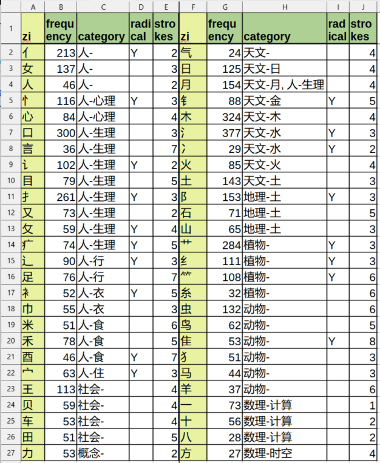

# A New Exploration into Chinese Characters: from Simplification to Deeper Understanding

## Motivation

Learning 汉字 (Hànzì) and, by extension, the Chinese language presents a unique and substantial challenge for learners, particularly those whose native languages utilize alphabetic systems. The difficulty stems primarily from the logographic nature of 汉字, where each character represents a morpheme (or word) rather than a sound. Unlike phonetic scripts, there's often no readily apparent connection between a character's visual form and its pronunciation, demanding rote memorization of thousands of distinct characters to achieve basic literacy. This is compounded by the tonal nature of Mandarin Chinese, where changes in pitch can drastically alter the meaning of a word, adding another layer of complexity. Furthermore, the sheer volume of characters, the subtle nuances in stroke order and character composition, and the existence of both traditional and simplified forms, require a sustained and dedicated learning effort over a prolonged period, making the acquisition of fluency in written and spoken Chinese a significantly time-intensive undertaking compared to many other languages.

Inspired by the success of reductionism in science, such as the discovery of fundamental particles in physics and the organization of the periodic table in chemistry, this research seeks to apply similar principles to the learning of 汉字. This involves three key approaches:

- **Network Analysis**: Leveraging computer science and network analysis techniques, this study aims to uncover the hidden relationships and underlying structures within the large collection of Chinese characters. By mapping these connections, the research hopes to reveal patterns and simplify the seemingly chaotic complexity of the character system.

- **Artificial Intelligence (AI) Assistance**: Recognizing the burden of rote memorization in traditional 汉字 learning, this research explores the use of AI to alleviate this challenge. The goal is to develop AI-powered tools that can assist learners in memorizing the form, pronunciation, and meaning of characters, as well as their complex interactions and contextual usage.

- **Improve learning and learning expeirence**: The overarching research goal, built upon by applying network analysis and AI asisstance, is to reduce the learning burdens for students and enrich their learning experiences.

By combining these computational and AI-driven approaches with a reductionist perspective, the research aims to provide a novel exploration into understanding and learning 汉字, ultimately making the process more efficient, intuitive, and enjoyable for learners.

## ZiNets: Computational Network Analysis on Chinese Characters

The foundational work Shuowen Jiezi (《说文解字》), compiled by Xu Shen (许慎) during the Eastern Han Dynasty, represents the first systematic attempt to analyze the structure and etymology of Chinese characters [r_zi, r_xushen, r_sears]. Xu Shen identified 540 radicals (部首, bùshǒu) and used his "six scripts" (六书, liùshū) theory to explain character formation, categorizing characters based on their composition: pictographs (象形), ideographs (指事), compound ideographs (会意), phono-semantic compounds (形声), and two less-common categories (转注 and 假借). While groundbreaking, the Shuowen Jiezi's analysis, focused on the Small Seal Script (小篆), doesn't perfectly reflect the modern forms of many characters, and its 540 radicals, while valuable, do not always represent the smallest, irreducible components. 

The later Zihui dictionary and the Kangxi Dictionary (康熙字典) refined and reduced this system, ultimately settling on the 214 Kangxi radicals [r_kangxi], which serve as a standard indexing system. These radicals, based primarily on shared visual components, often relating to meaning (semantic radicals, or 形旁, xíngpáng), provide a method for dictionary lookups. While many radicals also hint at pronunciation (phonetic radicals, or 声旁, shēngpáng), this is not always reliable. The Kangxi system, though widely used, has limitations: ambiguous categorization, inconsistent semantic and phonetic roles, and some radicals that, due to their complexity or low frequency of occurrence, are not always the most informative units for understanding character structure. 

Building upon the legacy of Xu Shen and Kangxi systems, the author has developed a web application called "ZiNets".
With this tool and computational network structure, we decomposed 6190 chinese characters [r_mdbg] (including 3910 HSK common characters [r_hsk]). Elemental characters were identified as those components appearing with a frequency above a defined threshold.

To systematically analyze the structure of Chinese characters, we introduce a novel spatial decomposition model, the "Zi Matrix." This model represents each character as a matrix of up to eleven distinct positional components. These positions are defined as: Top (上), Bottom (下), Left (左), Right (右), Center (中), Top-Left (左上), Top-Right (右上), Bottom-Left (左下), Bottom-Right (右下), Center-Inside (中内), and Center-Outside (中外). Each position within the matrix can be either occupied by a specific character component (a radical, a stroke, or a more complex sub-component) or remain empty. This 11-component matrix allows for a consistent and structured representation of the spatial relationships between the constituent parts of any Chinese character, regardless of its complexity.

The decomposition of each character into the Zi Matrix is performed manually using a hierarchical approach. This process involves a series of decomposition steps. First, the character is broken down into its major components, assigning each to its appropriate position within the matrix. If a component itself is complex, it is further decomposed, recursively, into its constituent parts, again assigning them to positions within a sub-matrix representing that component. This hierarchical decomposition continues until the most fundamental components – those that cannot be reasonably further divided – are identified. These fundamental components become candidates for the "elemental character" set. This manual, hierarchical approach ensures a consistent and considered analysis of character structure, leveraging expert linguistic knowledge to guide the decomposition.

## Elemental Characters Analysis

Through manual decomposition of 6190 Chinese characters using the Zi Matrix method, we identified 422 unique, irreducible components as "elemental characters" (元字). These components represent the fundamental building blocks that emerged during our hierarchical decomposition process. Table 1 presents these elemental characters organized by stroke count, ranging from simple single-stroke elements to more complex components.

### Elemental Characters (元字) by Stroke Count - Table 1

| 笔画数 (Stroke Count) | 元字 (Elemental Characters) | 
|----------|----------|
|1|	丨丶丿乀乁乚乛亅一乙|
|2|	⺀丷乂龴亠亻冂冖冫凵⺈刂勹匚匸卩㔾⺁厶讠丁七乃九了二人儿入八几刀刁力匕十卜厂又|
|3|	亍兀夂夊宀⺌⺍尢屮巛廴彐彑彡彳忄扌氵丬纟艹辶⻏阝饣万丈三上下与个丸义久么之乞也习于亏亡刃勺千叉及口囗土士夕大女子寸小尸山川工己已巾干乡幺广廾弋弓才犭门飞马|
|4|	攴攵旡朩殳灬爫爻爿⺧牜⺩礻禸罓耂不丑专中丰为乌云五井亢今介仓以元公六内冈凶分办勾勿匀匹区升午友天太夫少尤尺屯巨巴开心戈戶户手支文斗斤方无日曰月木欠止歹毋比毛氏气水火爪父片牙牛犬王瓦见贝车长韦风|
|5|	乍刍戋氺疋𤴔疒癶罒衤钅且丘丙业东乎乐令兄兰冬出击包北半占卡去古句另只可台四央失头宁它尼市布平必斥旦未末本术正母玄玉瓜甘生用田由甲申电白皮皿目矛矢石示禾穴立鸟龙|
|6|	囟尧屰⺮⺶⺷聿艮虍覀交共各合吉向吕寺并庄式曲竹米糸缶网羊羽老而耒耳肉臣自至臼舌舟色虫血行衣西页齐|
|7|	㐬佥呙坙夆奂孚肙豕豸酉卤员㕻甫舛良角言谷豆赤走足身辛辰邑釆里麦龟|
|8|	龺幷隹黾其奉尚易東责金阜隶雨青非鱼齿|
|9|	畐咸柬畏禺 面革韭音食首香骨鬼|
|10|	高鬥|
|11|	麻鹿|
|12|	黍黄黑|
|13|	鼓|
|14|	鼻|

The identified elemental character set subsumes the traditional 214 Kangxi radicals while introducing approximately 200 additional components. These additional components, though not traditionally recognized as independent units in standard dictionaries, serve crucial phonetic and/or semantic roles in character formation. For instance, components like 禺 and 乍, while not classified as radicals in traditional systems, demonstrate consistent semantic contributions in compound characters, as we will explore in our case studies (Section [Section Number]).

Our elemental character set reveals a finer granularity in Chinese character composition than the traditional Kangxi system. It encompasses three main types of components: familiar semantic radicals (e.g., 氵[water], 木[wood], 日[sun], 月[moon], 心[heart], 手[hand], 口[mouth]), basic structural elements (e.g., 一, 丨, 丿, 丶, 乙, 口, 凵, 冂), and frequently occurring components that carry both phonetic and semantic information (e.g., 方, 占, 且, 戋, 乍, 禺, 尧, 佥). Some components inherited from the Kangxi system, such as 鼓(drum), while historically significant, may be reconsidered for practical modern applications. This comprehensive set of elemental characters provides a more nuanced foundation for understanding and teaching Chinese character composition, potentially simplifying the learning process while maintaining semantic integrity.

### Elemental Characters: Occurrence Frequency and Categorization

Analysis of high-frequency elemental characters (with occurrences ≥ 23, a threshold chosen to include 气 [qi/breath/energy], given its fundamental importance in Chinese philosophy and culture) reveals clear patterns in character composition. The frequency distribution shows strong clustering around fundamental human concepts and natural elements. For instance, in human-related categories (人-), elements like 口 (mouth, 300 occurrences) and 手 (hand, 261 occurrences) show remarkably high usage rates, reflecting their importance in expressing human actions and experiences. Similarly, in the natural world categories, 水 (water, 377 occurrences) and 木 (wood, 324 occurrences) demonstrate high frequencies, indicating their crucial role in character formation related to natural phenomena. Notably, 亻(human radical, 213 occurrences) and 女 (female, 137 occurrences) also show high frequencies, underlining the human-centric nature of character formation.

The categorization system reveals a hierarchical organization centered on major conceptual domains. The system distinguishes between human-centered categories (人-系列) including physiological (生理), psychological (心理), and behavioral (行) aspects; natural elements (天文-) including the traditional five elements (金木水火土); and categories for flora (植物-), fauna (动物-), mathematical concepts (数理-), and abstract concepts (概念-). This classification not only reflects traditional Chinese philosophical understanding of the world but also provides a systematic framework for understanding character composition. Notably, the frequency distribution within these categories suggests that characters related to human experience and basic natural elements form the core building blocks of the writing system, while more specialized or abstract concepts show lower frequencies. The inclusion of 气 (24 occurrences) in this analysis proves particularly significant, as it represents a threshold case that bridges fundamental philosophical concepts with practical character formation patterns.

### Visualizing Categorization

*Figure 4: Distribution of Chinese characters across conceptual categories, showing frequency of occurrence ordered from cosmic to human to abstract realms.*

The visualization reveals a remarkable pattern in the distribution of Chinese characters that reflects ancient Chinese cosmological understanding. Beginning with celestial elements (天文-), the categories flow through natural phenomena to human experience, creating a narrative that resonates deeply with traditional Chinese philosophical principles. The striking prominence of human-related physiological characters (人-生理, 1106 occurrences) at the center of this distribution, bridged between natural elements and social constructs, echoes the classical Chinese view of humans as the connecting point between Heaven and Earth (天人合一). This central position is flanked by substantial representations in both natural domains—flora (植物-, 558 occurrences) and fauna (动物-, 466 occurrences)—and social spheres (社会-, 815 occurrences).

Within the astronomical/natural elements category (天文-), water (水, 406 occurrences) and wood (木, 324 occurrences) show notably higher frequencies than fire (火), metal (金), and earth (土), suggesting their greater significance in character formation. The systematic progression from celestial phenomena through natural elements, human experience, and finally to abstract mathematical concepts (数理-) reveals an elegant hierarchical structure that mirrors traditional Chinese cosmological ordering. This distribution pattern suggests an underlying organizational principle in Chinese character evolution that reflects both human cognitive development and natural world observations, a relationship that will be further explored through its connection to the Fibonacci sequence.

## Storytelling Characters

## Natural Evolution of Characters

## Conclusion

## Dedication

This work is dedicated to late Professor T.D. Lee（李政道）, whose pioneering efforts opened doors for many Chinese students to pursue studies and research in the United States, fostering a bridge between Eastern and Western scientific traditions. His vision and support have enabled countless scholars like myself to contribute to global scientific discourse.

This work is also dedicated to author's parents (龚永权，文国芳), who nurtured his intellectual curiosity through hardships and challenging times. Their sacrifices and unwavering support are forever remembered.

## Acknowledgements

This paper represents a collaborative effort between the author, and a team of AI assistants (Claude 3.5 from Anthropic, Gemini 2 from Google, Qwen2.5-Max from Alibaba, and DeepSeek V3 from DeepSeek). The fusion of human knowledge and insight in software development, physics, and Chinese language with AI's analytical capabilities enabled the development of the novel perspectives and methodologies presented in this work. This collaboration demonstrates the potential of human-AI partnerships in research and learning, particularly in interdisciplinary studies bridging traditional knowledge with modern computational technologies.

## References

[r_zi] https://www.wikiwand.com/en/articles/Chinese_characters

[r_xushen] 說文解字 : https://www.shuowen.org/

[r_kangxi] Kangxi radicals : https://en.wikipedia.org/wiki/Kangxi_radicals

[r_sears] Sears, Richard. Chinese Etymology research website at https://hanziyuan.net/

[r_mdbg] CC-CEDICT dictionary dataset : https://www.mdbg.net/chinese/dictionary?page=cc-cedict

[r_hsk] 书同文 汉字网 HSK 汉语水平考试汉字列表 : https://hanzi.unihan.com.cn/School/HSK

[r_chaizi] 漢語拆字字典 : https://github.com/kfcd/chaizi

[r_google_img] Google ImageFx text-to-image generation tool: https://labs.google/fx/tools/image-fx

[r_qwen] Qwen2.5-MAX text-to-image generation tool: https://chat.qwenlm.ai/

[r_fibonacci] https://www.wikiwand.com/en/articles/Fibonacci_sequence

## Appendix

# =============================================================
# Outline
**Title:** "Hanzi: A New Exploration, from Simplification to Deeper Understanding" (This is a more idiomatic translation of your title)

**Abstract:** (We'll write this last, after the main body is complete)

**1. Introduction (缘起 - Motivation):**

    * Briefly introduce the challenge of learning Hanzi. (Use the paragraph we already worked on).

    * Highlight the limitations of traditional rote memorization methods.

    * Introduce the core idea: Applying a reductionist approach inspired by physics (fundamental particles, periodic table).

    * State the goals:

        * Simplify the learning process using network analysis (ZiNets) and AI.

        * Deepen understanding of character meaning and etymology.

        * Present three key areas of exploration: elemental character identification, pattern analysis, and character etymology ("storytelling").

        * Mention anniversary reason

**2. ZiNets and Elemental Character Identification (汉字网络 ZiNets 与元字):**

    * **2.1 Methodology:**

        * Explain the ZiNets software and its functionality.

        * Describe the data source (HSK 3000 characters).

        * Define "elemental character" (元字) – your operational definition. This is *crucial*. Are these the smallest indivisible units, or are they characters that frequently act as components? Are they purely *structural* components, or do they also need to have a consistent semantic or phonetic role?

        * Detail the algorithm used to decompose characters and identify elemental characters. Be very specific here.

    * **2.2 Results:**

        * Present the list of identified elemental characters (元字).

        * Provide statistics: How many elemental characters were found?

        * Visualize the network (a key figure). Show a sample of the network, highlighting elemental characters.

**3. Elemental Character Analysis (元字概念与频率):**

    * **3.1 Categorization:**

        * Classify elemental characters into categories: form radicals (形旁), phonetic radicals (声旁), and semantic radicals (义旁, also consider if some are purely structural and don't fit neatly into these traditional categories).

        * Explain the criteria used for this classification.

    * **3.2 Frequency Analysis:**

        * Present the frequency distribution of elemental characters. Which are the most common?

        * Compare the frequency of elemental characters to the overall frequency of characters in the HSK 3000.

        * Visualize this data (e.g., a bar chart or table).

    * **3.3 Combination rules:**

    * Present statistics of different combination patterns

    * Visualize this data (e.g., a bar chart or table).

**4. Character Etymology and "Storytelling" (汉字故事):**

    * **4.1 Methodology:**

        * Explain your approach to reconstructing character etymologies. Are you using existing etymological dictionaries (like 說文解字), or are you deriving etymologies from the ZiNets analysis? This is important to clarify.

        * Explain how AI is used (if at all) in this section. Is it used for generating stories, or for analyzing etymological data? Be precise.

    * **4.2 Examples:**

        * Present detailed etymological analyses of several key characters (日, 禺, 乍, 寺, 子, and others). Show how they are built from elemental characters.

        * Use these examples to illustrate the principles of character formation.

        * Show how understanding the etymology can aid memorization and comprehension.

        * Explain 诗: temple of words

**5. Natural Evolution of Characters (文字自然演化):**

    * **5.1 Fibonacci Sequence Pattern:**

        * Explain the connection you've found between character structure/formation and the Fibonacci sequence. This needs a strong, clear explanation with visual examples. What aspect of characters exhibits this pattern? Is it the number of strokes, the number of components, the frequency of certain combinations?

        * Provide statistical evidence to support your claim.

        * Discuss the implications of this finding. Does it suggest an underlying principle of efficiency or aesthetics in character evolution?

**6. Conclusion (结语):**

    * Summarize the key findings of the research.

    * Reiterate the benefits of the ZiNets approach and the use of AI for learning Hanzi.

    * Suggest future research directions.

    * Mention 40th year since graudation