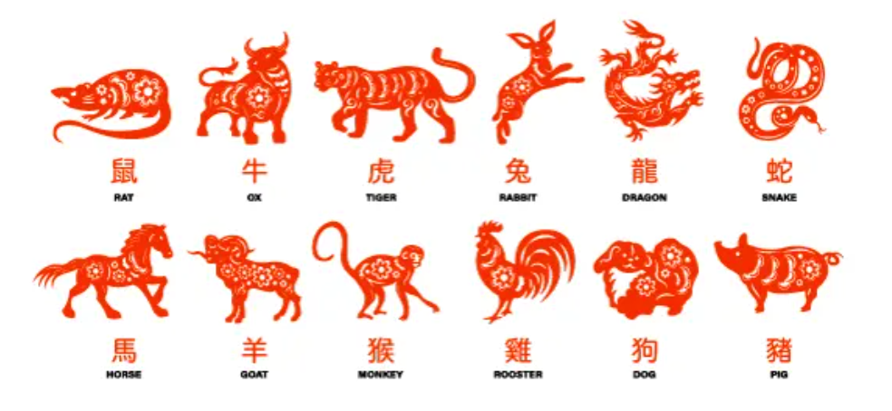
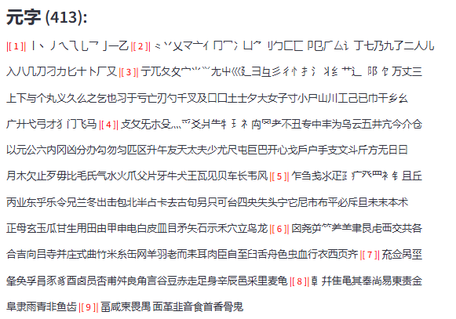
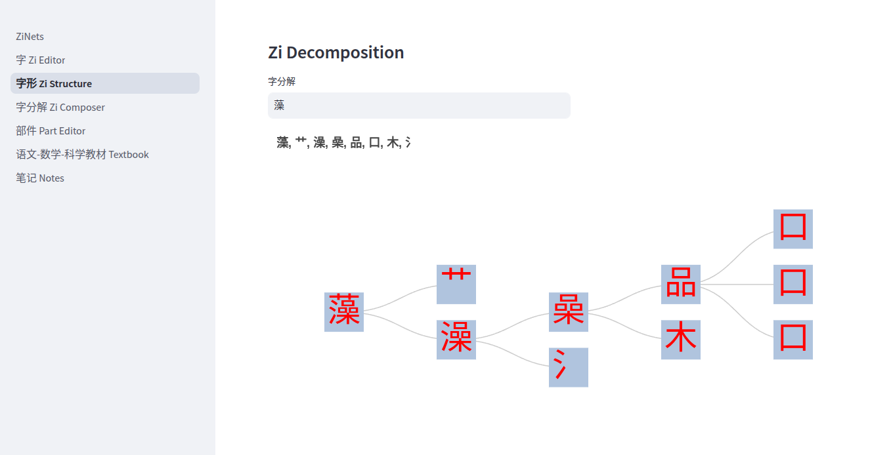
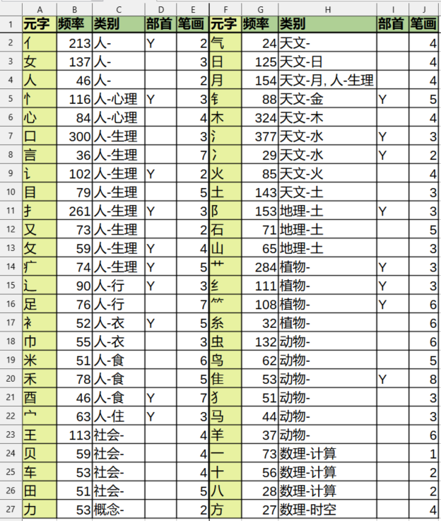
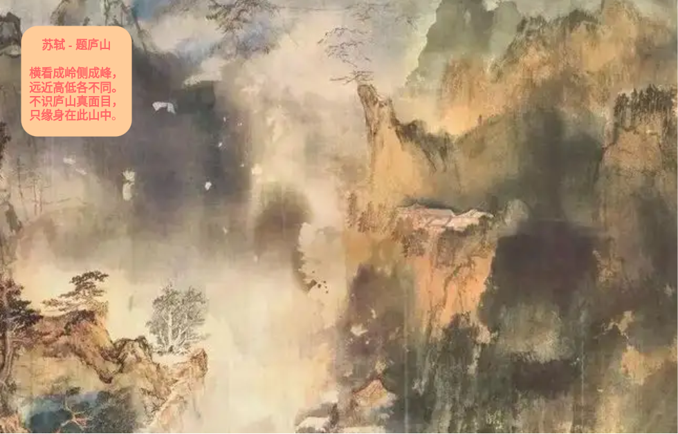
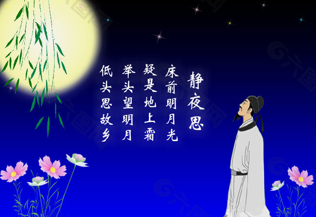

# A Physics-Inspired Computational Approach to Chinese Character Analysis: Network Patterns and Semantic Evolution

Wen G. Gong*

*Corresponding author: digital-duck@outlook.com

2025-01-01

## Abstract
This paper presents a novel perspective on Chinese characters as a naturally evolved system for encoding and transmitting concepts and meaning, following universal principles of organization and growth. By treating character components as fundamental elements that interact through "semantic forces", we develop a systematic framework that reveals how Chinese writing mirrors patterns found throughout nature. The approach integrates physics principles, computational analysis, and traditional understanding to demonstrate how characters emerge from elemental characters (元字) through natural combination patterns, similar to physical and biological systems. Using the Fibonacci sequence as an organizing principle, we show how about 3,000 commonly used Chinese characters can be systematically understood through their evolutionary patterns. Our computational implementation, ZiNets (字网), provides evidence for this perspective by revealing recurring patterns of character composition and semantic development.


## 1. Introduction
Chinese characters [1], as one of the oldest continuously used writing systems, present a unique opportunity for studying how symbolic systems naturally evolve to encode and transmit meaning. 

Traditional Chinese linguistics classifies characters into six categories (六书) based on their formation principles:

- Pictograms (象形): 
Direct pictorial representations of concrete objects, forming the earliest character set. Examples include 日 (sun), 月 (moon), 山 (mountain), and 人 (human).

- Simple Ideograms (指事): 
Abstract concepts represented through symbolic forms or modified pictograms. Examples include 上 (above), 下 (below), 一 (one), and 二 (two).

- Compound Ideograms (会意): 
Logical combinations of two or more pictograms or ideograms to create new meanings. For instance, 休 (rest) shows a 人 (person) leaning against a 木 (tree), while 明 (bright) combines 日 (sun) and 月 (moon).

- Phono-semantic Compounds (形声): 
The most prevalent type, combining a semantic component (meaning indicator) with a phonetic component (pronunciation guide). Examples include 妈 (mother; semantic: 女 woman, phonetic: 马) and 湖 (lake; semantic: 氵water, phonetic: 胡 hu).

- Transfer Characters (转注): 
A debated category describing characters with extended or adapted meanings.

- Loan Characters (假借): 
Characters borrowed phonetically to represent words with similar pronunciations.

While extensive research exists on the structural evolution of Chinese characters through various writing styles [2] - ranging from Oracle Bone Script (甲骨文), Bronze Script (金文), Seal Script (篆书), Clerical Script (隶书), Regular Script (楷书), Semi-cursive Script (行书), to Cursive Script (草书), traditional scholarship has primarily focused on their morphological aspects. This paper proposes a novel perspective: Chinese characters represent a naturally evolved system that follows universal principles of organization and growth observed throughout nature.


Key insights:
(1) Chinese characters evolved as a coherent conceptual encoding system through natural principles rather than arbitrary design; 
(2) Character formation patterns parallel physical and biological growth processes;
(3) The system exhibits self-organization and natural evolution characteristics; 
(4) Computational analysis reveals systematic patterns in character composition.

Our physics-inspired framework demonstrates:
(1) Natural combinatorial patterns in elemental characters (元字);
(2) Fibonacci-like growth sequences in character complexity;
(3) Stable semantic structures emerging from component interactions;
(4) System coherence maintained through evolutionary development.

## 2. Methodology

### 2.1 The Concept of Elemental Characters (元字)

Unlike traditional radical classification systems that focus primarily on handwriting and structural organization, we introduce the concept of 元字 (elemental characters) as fundamental semantic building blocks, expanding on radicals and phonetic components. These approximately 400 elemental characters serve as the "periodic table" of Chinese characters, each carrying independent semantic meaning that contributes to the formation of more complex characters. They may not always look as simple as pictograph, but carry distinct conceptual meaning and semantics.

Key characteristics:

- **Semantic Independence**: 
  Each 元字 carries its own primitive, meaningful concept (e.g., 乐 for music/happiness)
- **Combinatorial Power**: 
  They combine to form more complex characters following semantic and structural rules
- **Frequency Patterns**: 
  Their usage follows natural distribution patterns in character formation
- **Cross-Category Utility**: 
  They often participate in multiple semantic domains

This approach differs from the traditional radical system in several key ways:

- Focus on meaning rather than writing structure
- Inclusion of semantically significant characters that aren't traditional radicals
- Emphasis on combinatorial patterns rather than categorization
- Recognition of independent semantic value

### 2.2 Spatial Framework and Component Interactions

Our physics-inspired approach treats Chinese character composition as a system of components interacting within a well-defined spatial framework:


- Coordinate Space (九字宫 Enhancement)
  - The traditional nine-grid system serves as a "coordinate space" for component positioning designed for calligraphy.
  - Components interact across specific positions, similar to particle interactions in physics
  - Additional dimensions (mid-inner, mid-outer) handle enclosure structures, analogous to how physics adds dimensions to describe complex systems

- Topological Patterns
  - **Irreducible patterns**: independent components like pictograph characters (e.g. 日，月，人)
  - **Linear arrangements**: Components interact in sequential positions (e.g., 明, 街, 尖, 曼)
  - **Enclosure patterns**: Extended spatial dimensions are utilized (e.g., 回, 国) where (1) Mid-inner position represents contained elements (口, 玉); (2) Mid-outer position represents containing elements (口). 
  - **Triangle patterns**: components arranged in triangular positions (e.g. 品, 森)
  - **Quadrant patterns**: components arranged in square positions (e.g. 疑，叕)
  - **Nested structures**: Multiple levels of containment create hierarchical relationships (e.g. 藻)

### 2.3 Fibonacci Organization and 元字 Emergence

The Fibonacci sequence (1, 1, 2, 3, 5, 8, 13, 21, 34, 55, ...) naturally emerges in growth patterns throughout nature. When visualized, it creates an elegant spiral known as the golden spiral, seen in countless natural forms - from the arrangement of sunflower seeds to the shell of a nautilus, and to the spiral galaxy. This pattern represents nature's efficient approach to growth and organization, where complex structures build upon simpler foundations in a harmonious and balanced way [3].


We borrow the Fibonacci sequence to organize Chinese characters in a similar natural progression: from simple pictographs to sophisticated composite characters, from concrete objects to abstract concepts. Just as the Fibonacci spiral demonstrates how complex natural patterns emerge from simple mathematical relationships, our organization reveals how Chinese writing evolved from basic elements (元字) into increasingly complex expressions. Each level introduces new fundamental characters that, like the expanding spiral, serve as building blocks for richer linguistic representations. This approach mirrors nature's own efficiency in developing complex systems from simple foundations.

In the following, we list the first 9 sets of 元字 families.
Traditional radicals with independent meaning are noted under "Radical form mapping" (e.g. 灬 means fire).

- 1 (一): 气 (primordial force/energy)
  - The most fundamental 元字
  - Represents the emergence of invisible form from formlessness (无中生有)
  - Base unit for energy and force concepts
  - 炁 is an uncommon and old form for 气, rarely used. But its lower radical (灬) hints its semantic meaning related to fire and energy.
  - Radical form mapping: 气 is a radical, all characters containing 气 are related to fundamental nuclear and chemical elements or matter in gaseous form, e.g., 氢 (hydrogen gas), 氦 (Hellium), 氧 (oxygen), 汽 (vapor), 氛 (atmosphere)

- 1 (一): 点，线 (primitive low-dimensional object)
  - Basic radicals 元字: 
   丶(dot), 一 (horizontal line), 丨 (vertical line), 丿 (north-east line), 乀 (south-east line)
  - Represents visible simple form (i.e., point- or line-like objects), although carrying no indenpendent semantic meaning, they derive meaning together with other composing character part. As an example, we build upon the first elemental character 气, 
    - 气 + 丿 = 氕 is Protium, the most common and stable isotope of hydrogen with one proton (i.e., 1 nucleon); 
    - 气 + 刂 = 氘 is Deuterium, stable and 0.02% of naturally occurring hydrogen, with one proton and one neutron (i.e., 2 nucleons); 
    - 气 + 川 = 氚 is Tritium, a radioactive isotope of hydrogen, with one proton and two neutrons (i.e., 3 nucleons). 
    Here, 丿, 刂, 川 indicate 1,2,3 nucleons in the respective hydrogen isotopes.

- 2 (二): 日,月 (sun and moon)
  - First pair of naturally contrasting 元字
  - Represents 2 visible solar objects and a fundamental abstraction in the basic dualism philosophy (阴阳)
  - Foundation for temporal and luminance concepts
  - Both characters can be used as radicals. It is worthwhile to note that 月 means body part meat/flesh 肉 when used as radical. This is likely a historical coincidence where 月 was adopted as the simplified writing form for 肉.

- 3 (三): 天,地,人 (heaven, earth, human)
  - Tripartite domain 元字
  - Establishes basic spatial and existential framework for human cognitive psychic
  - Core reference for positioning and relationships
  - Radical form mapping: 
  土 for 地, 亻for 人.


  This AI generated image [4] embodies 6 元字 (气,日,月,天,地,人) in an integral and wholistic visual-representation.

- 5 (五): 金,木,水,火,土 (metal, wood, water, fire, earth)
  - Material phase 元字
  - Fundamental 5 elements (五行) for describing physical and materialistic world in ancient philosophy.
  - Base components for nature-related characters
  - Radical form mapping: 
  钅for 金, 氵冫for 水, 灬 for 火, 木, 土 are often rended in narrower form when used as radicals. The semantic meanings are the same.


- 8 (八): 东,南,西,北,春,夏,秋,冬 (directions and seasons)
  - Spatiotemporal 元字
  - Complete system of orientation and cyclical change
  - Foundation for location/directional and time-based concepts


- 13 (十三): 生,鼠,牛,虎,兔,龙,蛇,马,羊,猴,鸡,狗,猪 (basic life forms expressed in 12 Zodiac animals)
  - Biological object 元字
  - Complex natural phenomena
  - Base set for describing living things
  - Radical form mapping: 
  牜for 牛, 虫 is a radical for 蛇 and other insects, 犭is a radical for many animals (e.g. 猴,狗,猪), 羊,⺶,⺷ are variant radical forms for 羊(Sheep), radical for 马 appears narrower.



- 21 (二十一): Quantification and Measurement 元字
  - Numerical System (15 characters):
    - Basic numerals: 
      一 (1),二 (2),三 (3),四 (4),五 (5),六 (6),七 (7),八 (8),九 (9),十 (10)
    - Large quantities: 
      百 (100),千 (1000),万 (10,000),亿 (100,000,000),零 (0)
    - These form the foundation for all quantitative description

  - Physical Units (6 characters):
    - Time measurement: 秒 (s),分 (m),时 (h)
      - Progression from smallest (second) to largest (hour)
      - Reflects natural cycles and human activity patterns
    - Length measurement: 寸 (cm),丈 (m),里 (km)
      - Traditional Chinese units of length
      - Scales from human body reference (寸) to geographic distance (里)

This set represents the emergence of systematic measurement and counting.


- 34 (三十四): Human Form and Action 元字
  - Basic parts: 
      心(忄),头,首,面,口,目,眉,鼻,耳,舌,牙,齿,手(扌),又,足,血,肉,身,尸,骨,皮,毛(彡)
  - Action indicators: 
      言(讠), 看,听,思,食(饣),走(辶),立
  - Identity: 
      男,女,子,自,己
  - Radical form mapping: 
      忄for 心, 扌,又 for 手, 辶 for 足, 讠for 言, 饣for 食, often (not always) in action context, e.g. emotional thinking, holding, walking, communicating, respectively. 目, 口, 足, 骨, 耳 appear as radicals too. Some of these characters (like 首, 面) can function as both nouns (head, face) and measure words/classifiers in different contexts.

This set introduces fundamental components for describing human existence and behavior.


List of all the elemental characters (元字) identified by our ZiNets web application:




### 2.4 Pattern Discovery and Physical Analogies

The systematic analysis of character composition through our spatial framework reveals several key patterns that parallel physical systems:

- Compositional Rules as Interaction Laws
  - Just as physical particles interact according to fundamental forces, character components combine following specific spatial and semantic rules
  - The nine-grid system acts as a "field" where components interact to form stable configurations
  - Component positions influence each other, similar to how particles create and respond to fields

- Emergent Patterns
  - Regular combinations: Certain components frequently appear in specific relative positions
  - Stability patterns: Some configurations appear more frequently in the character set, suggesting "stable states"
  - Conservation laws: Semantic meaning is preserved across different spatial arrangements

- Hierarchical Organization
  - Like physical systems exhibiting different scales of organization, characters show multiple levels of structure
  - Local interactions (between adjacent components) lead to global patterns
  - Complex characters emerge from simpler stable configurations

## 3. Results

### 3.1 Web Application Implementation: ZiNets (字网)

Our web-based visualization tool, ZiNets (Zi Network System), implements the theoretical framework through an interactive character decomposition system. The name "ZiNets" reflects its primary function: reconstructing Chinese characters (Zi, 字) into networks of their elemental components. See Appendix for more details.

#### 3.1.1 Character Decomposition Visualization



The core feature of ZiNets is its hierarchical decomposition visualization:

- Network Structure
  - Characters are represented as nodes in a directed graph
  - Decomposition relationships are shown as edges
  - Left-to-right layout reflects decomposition hierarchy
  - Visual clarity maintained through spatial organization

- Hierarchical Analysis
  - Multiple levels of decomposition shown simultaneously
  - Clear parent-child relationships between components
  - Preservation of structural relationships
  - Explicit visualization of component reuse

- Component Identification
  - Each 元字 and component clearly bounded
  - Consistent visual representation of elements
  - Immediate recognition of basic building blocks
  - Clear distinction between levels of composition

### 3.2 Frequency Analysis and Natural Efficiency

Our computational analysis of about 3,000 commonly-used HSK Chinese characters [5] reveals striking patterns in 元字 usage that demonstrate natural optimization principles:

- Distribution of High-frequency Elements (>100 occurrences): 
   
  The table presents the 25 most frequently used elemental characters/radicals in commonly used Chinese characters. These elements primarily belong to the 2nd (日,月), 3rd (天地人) and 4th (金木水火土) Fibonacci sequence number sets. While 气 (air/energy) is not present in this list, its conceptual force permeates the character system. The distribution pattern suggests a natural evolution toward efficient structural components, with elements grouped into distinct semantic categories:

  - Heaven-related elements (天界): 
      日, 月
  - Human-related elements (人类): 
      口, 女, 人(亻), 心 (忄), 目, 手(扌), 辶
  - Natural elements (自然):
      - Five elements (五行): 
      金(钅), 木, 水(氵), 火, 土
      - Earth variations: 
      阝, 艹, 纟
      - Living beings (生物): 
      虫, 鸟, 马

       

- Semantic Distribution
  - Predominance of earth and nature elements
  - High representation of human-related components
  - Progressive development from concrete to abstract concepts
  - Clear conceptual hierarchy from physical to abstract domains

- Efficiency Characteristics
  - Core 元字 function as versatile semantic foundations
  - System balances complexity with expressive power
  - High-frequency components span fundamental categories
  - Evidence of evolutionary selection for optimal semantic encoding

### 3.3 Case Studies - Composite Characters 

#### 3.3.1 The 日 Family 


The Chinese character "日" (rì), meaning "sun" or "day" (a time-unit derived from daily cycle of solar movement), serves as a powerful illustration of how Chinese characters efficiently encode meaning, knowledge and wisdom. By examining composite characters that incorporate "日", we gain insight into the profound ways in which the written language captures essential truths and observations about the world. These simple formulas provide a peek into the rich semantics of the Chinese language.

Consider the following examples:

  - 日 + 月 = 明 (míng): 

    In early civilizations, the sun and moon were the primary sources of illumination. The combination of these two characters to form 明, meaning "bright" or "clear", elegantly captures this fundamental truth.

  - 日 + 正 = 是 (shì): 

    When the sun is directly overhead, it casts no shadows. This character combination, meaning "is/to be", extends the concept to seeing things clearly and objectively, free from distortion. The phrase "实事求是" (shíshìqiúshì) embodies this, urging us to seek truth through facts.

  - 知 + 日 = 智 (zhì): 

    The character 智, signifying wisdom or knowledge, combines "to know" (知) with "sun" (日). This encapsulates the idea that true wisdom comes from understanding the way of the sun - selflessly radiating light and energy without expectation of reward.

  - 日 + 日 + 日 = 晶 (jīng):  

    The repetition of "日" intensifies the concept of brightness, resulting in a character that means "crystal" or "bright and clear." This character beautifully captures the essence of a crystal's luminosity and transparency.

  - 门 + 日 = 间 (jiān):  

    When light shines through a doorway, it illuminates the space or interval between the door frames. This character cleverly represents the idea of a gap, space, or interval by combining the symbols for "door" and "sun."

  - 日 + 寸 = 时 (shí):  

    In ancient times, sundials were used to measure time by tracking the length and position of the sun's shadow. This character combines "sun" and "inch," illustrating the concept of time through the metaphor of the sun's movement.

  - 日 + 生 = 星 (xīng):  

    The character for "star" combines "sun" and "to be born" or "to produce," suggesting that stars are born from the sun or are suns themselves. This character reflects the ancient understanding of the connection between the sun and the celestial bodies in the sky.

  - 丿 + 日 = 白 (bái):  

    The character for "white" combines a stroke (丿) with the sun (日). It describes light emitting from the Sun. Sunlight is white, because it has all colors, as demonstrated by Newton's prism experiment. 

  - 日 + 一 = 旦 (dàn):  

    This character combines the sun with the horizontal stroke representing the horizon, capturing the moment when the sun rises above the earth's horizon at dawn. It signifies the beginning of a new day or cycle, as in "元旦" (New Year's Day).

  - 九 + 日 = 旭 (xù):  

    The character for "rising sun" or "bright and splendid" combines the symbol for the number nine (i.e. many) with the sun. The idea of nine suns shining together evokes an image of unimaginable brightness and intensity.

  - 日 + 十 = 早 (zǎo):  

    Here, the sun is shown above a symbol resembling a treetop, indicating the early morning hours when the sun has risen above the trees. This character encapsulates the concept of "early" or "morning."

  - 日 + 干 = 旱 (hàn):  

    The combination of the sun and the character for "dry" or "to dry" creates a character meaning "drought." This illustrates the cause-and-effect relationship between intense sunlight and the drying out of the land, leading to drought conditions.

  - 三 + 八 + 日 = 春 (Chūn):

    The combination of "three/many" (三), "split/break" (八), and "sun" (日) creates a character meaning "spring." This illustrates when abundant sunlight causes numerous seeds to break through the frozen ground, capturing the essence of Spring season when plants "wake up" and "spring up" from the earth soil (土).


These examples barely scratch the surface, but this family demonstrates how Chinese characters, through their composition, reveals profound insights and encodes knowledge in a uniquely efficient manner unmatched by other writing systems. Children learning Chinese characters are exposed to basic scientific concepts and knowledge while mastering the language, a feature not found in many other languages.

#### 3.3.2 The 坙 (𢀖) Family


In pre-history, wheel was made of stone, therefore, very heavy. It later evolved into wooden wheel, may still be a solid piece. When most materials were removed, the wheel became lighter. 坙 means stem, fiber, thread, or the core component of thing.

Derivative Characters and Their Bonding Patterns:

- 气 + 坙 = 氢 (qīng):

  Gas + core element → hydrogen

  Shows fundamental nature: simplest atomic element with single proton core

- 艹 + 坙 = 茎 (jīng):

  Plant + core element → stem

  Represents essential structural support that maintains plant integrity

- 纟 + 坙 = 经 (jīng):

  Thread + core element → classics/scripture

  Illustrates fundamental texts that weave through cultural fabric

- 坙 + 力 = 劲 (jìn):

  Core element + force → strength/vigor

  Reflects how muscle fibers generate physical power

- 坙 + 页 = 颈 (jǐng):

  Core element + head → neck

  Captures crucial connecting structure between body and brain

- 彳 + 坙 = 径 (jìng):

  Path + core element → radius/direct path

  Represents essential structural support or most direct route

- 车 + 坙 = 轻 (qīng):

  Chariot + core element → light(weight)

  Shows how structural efficiency reduces mass through essential components

This family demonstrates how its composite characters derives the semantic meaning through multiple aspects: core/essential structure, connecting/supporting function, power generation, inherent strength, and structural efficiency.

#### 3.3.3 The 禺 Family


Detailed analysis of the 禺 component family demonstrates both semantic bonding patterns and historical evolution principles:

Base Component 禺 (元字) represents fundamental concept of joining/coupling, analogous to a basic force carrier in physics. This character itself is a composite: 甲 + 禸 = 禺

Derivative Characters and Their Bonding Patterns:

- 亻 + 禺 = 偶 (ǒu): 

  Person + joining → couple/partner

  Historical evolution: from chance meeting to deliberate pairing

- 宀 + 禺 = 寓 (yù): 

  Roof + joining → dwelling/metaphorical connection

  Shows extension from physical to abstract space

- 辶 + 禺 = 遇 (yù): 

  Movement + joining → encounter/meet

  Demonstrates temporal dimension of joining force

- 禺 + 心 = 愚 (yú): 

  Heart/mind + joining → inability to make mental connections

  Reveals cognitive dimension of joining concept

- 阝 + 禺 = 隅 (yú): 

  Wall + joining → corner/intersection

  Illustrates spatial manifestation of joining force

- 耒 + 禺 = 耦: 

  Illustrate lotus root joining together with fibers

The semantic evolution follows predictable patterns analogous to fundamental force interactions in physics:

- **Spatial joining** (寓, 隅): Like electromagnetic forces in physical space
- **Temporal joining** (遇): Similar to weak nuclear force interactions
- **Conceptual joining** (愚): Parallels quantum entanglement
- **Physical joining** (偶): Resembles strong nuclear force binding


This family demonstrates how semantic forces, like physical forces, create stable configurations that persist through time while allowing for evolutionary adaptation to new meanings.

#### 3.3.4 The 乍 Family


乍 means work (as both noun and verb), artifact, thing completed.

Base Component 乍 (元字) represents fundamental concept of work/labor, functioning as a semantic force carrier for action and transformation.

Derivative Characters and Their Bonding Patterns:

- 亻 + 乍 = 作 (zuò): 

  Person + work → to make/to do

  Most direct expression of the base semantic force

- 日 + 乍 = 昨 (zuó): 

  Sun/day + work → yesterday

  Shows temporal manifestation through work completed

- 乍 + 心 = 怎 (zěn): 

  Work + heart/mind → how?

  Represents active mental work/questioning process

- 火 + 乍 = 炸 (zhà): 

  Fire + work → to explode/to fry

  Dual manifestation: process (cooking work) and result (explosive work)

- 讠 + 乍 = 诈 (zhà): 

  Speech + work → to deceive

  Excessive work in communication leading to manipulation

- 口 + 乍 = 咋 (zǎ): 

  Mouth + work → how (colloquial)

  Verbal expression of mental work/questioning

- 酉 + 乍 = 酢 (zuò): 

  Wine + work → vinegar

  Chemical transformation through work process

- ⺮ + 乍 = 笮 (zé): 

  Bamboo + work → to press

  Physical work applied to materials

- 穴 + 乍 = 窄 (zhǎi): 

  Cave/space + work → narrow

  Spatial transformation through constraining work


The semantic evolution follows patterns analogous to force interactions in physics:

- **Physical work** (笮, 炸): Like mechanical forces in material transformation
- **Mental work** (怎, 咋): Parallels quantum mechanical state transitions
- **Temporal work** (昨): Similar to time-dependent interactions
- **Transformative work** (酢, 诈): Resembles chemical force interactions
- **Spatial work** (窄): Analogous to field effects in space


This family demonstrates how the fundamental semantic force of "work" combines with different contextual elements to create a rich spectrum of meanings, from concrete physical actions to abstract temporal and mental concepts. The systematic nature of these combinations suggests underlying principles in character formation that mirror physical force interactions.

The 乍 family particularly illustrates how a basic action concept can evolve into increasingly sophisticated meanings while maintaining its core semantic force, providing insights into both historical character development and cognitive linguistics patterns.


### 3.4 Case Studies - Pinyin - A Counter-Argument

While the Pinyin romanization system has undeniably augmented the Chinese language by integrating Latin phonetic components, relying solely on Pinyin and abandoning Chinese characters would result in a tremendous loss. Pinyin lacks the "character" and personality inherent in the logographic writing system, as many words share identical pronunciations. In this case, character truly matters.

In the Chinese language, sound (声 shēng), form (形 xíng), and meaning (意 yì) are all integral components of a vibrant, living system. Over-emphasizing any single aspect at the expense of the others would be inefficient, misguided, and unwise.

To illustrate this point, consider the word "ma". In Pinyin, it could represent various unrelated concepts such as 妈 (mā, mother), 马 (mǎ, horse), or 骂 (mà, yell or curse). Without the visual distinction provided by characters, the richness and clarity of the language would be diminished, leading to confusion and ambiguity.
Chinese characters, in their elegance and complexity, encode both visual and auditory information, creating a harmonious balance that has allowed the language to flourish for millennia. Embracing and preserving this heritage, while judiciously integrating modern enhancements like Pinyin, is the path to ensuring the continued vitality and relevance of the Chinese language in the 21st century and beyond.


### 3.5 Case Studies - Phrases and Idioms

Just as matter organizes itself into increasingly complex structures - from atoms to molecules to molecular clusters - language exhibits similar emergent properties at different scales. Individual characters (字) serve as the atomic units, carrying fundamental meanings and combining properties. These form compounds and phrases (词组), analogous to molecules with stable semantic bonds. At a higher level of organization, these linguistic molecules arrange themselves into sophisticated structures like poems, which, like molecular clusters, exhibit properties beyond the sum of their parts. This natural hierarchy of meaning-making demonstrates the living, self-organizing nature of Chinese language.

This self-organization manifests particularly clearly in how the language preserves and transmits wisdom across generations. Characters and their compounds persist not through rigid prescription but through their resonance with human cognition and experience. Similarly, classical poems endure not by institutional mandate but through their ability to encode universal human insights in memorable, emotionally resonant forms. The following case studies examine these organizing principles at two scales: compound phrases and classical poems.

#### 3.5.1 The 子 Network Analysis

This case study examines compound phrases containing the character 子 (zǐ) to demonstrate how network analysis reveals semantic patterns and cognitive insights in Chinese language evolution.

The character 子 exhibits remarkable semantic versatility, forming compounds across multiple domains:

- **Human Relations**
  - **Inheritance**: 
    子女 (children), 子孙 (descendants) 

  - **Academic**: 
    学子 (student), 弟子 (disciple)

  - **Honorific**: 
    夫子 (master), 子 as suffix in 孔子, 老子, 墨子 (ancient philosophers)

  - **Aggressor**: 
    洋鬼子, 毛子, 日本鬼子

- **Scientific Terms**
  - **Physics**: 
    光子 (photon), 量子 (quantum), 原子 (atom), 电子 (electron), 粒子 (particle), 分子 (molecule), 玻色子 (boson), 费米子 (fermion)

  - **Biology**: 
    孢子 (spore), 种子 (seed)

  - **Mathematics**: 
    因子 (factor), 系数子 (coefficient)

- **Physical Objects**
  - **Tools**: 
    筷子 (chopsticks), 梯子 (ladder)

  - **Containers**: 
    箱子 (box), 瓶子 (bottle)

  - **Furniture**: 
    桌子 (table), 凳子 (stool)

- **Temporal Concepts**
  - **Time**: 
    日子 (days/life), 子时 (midnight hour)

#### 3.5.2 Network Analysis Insights

Our systematic network analysis revealed a profound epistemological insight through an unexpected discovery. Despite extensive computational mapping of 子-compounds through both manual and automated methods, we initially missed a crucial compound: 脑子 (brain). This oversight, emerging during a casual walk rather than active analysis, demonstrates a fundamental principle about knowledge systems: sometimes the most essential elements are the hardest to see precisely because of their foundational nature.

This discovery led to several key insights about language as a living system:

- The challenge of complete enumeration in language networks
  - Even systematic approaches may miss fundamental elements
  - Network completeness requires multiple analytical perspectives
  - Some nodes are "invisible" from within the system

- The role of embodied cognition in language understanding
  - The brain studying itself faces unique epistemological challenges
  - Language understanding requires both analytical and intuitive approaches
  - Some insights emerge only through lived experience

- The limitations of purely analytical approaches
  - Computational methods, while powerful, have inherent blind spots
  - The observer effect in linguistic analysis
  - The need for complementary methodologies

The missing 脑子 compound exemplifies how language evolves to encode fundamental human experiences. This situation of late discovery in our analysis is perfectly illustrated by the following classic poem:

```
(I) 苏轼 - 题庐山

横看成岭侧成峰，
远近高低各不同。
不识庐山真面目，
只缘身在此山中。
```

(One cannot recognize the true face of Lu Mountain, Because one is standing within it.)



Just as one cannot see the whole mountain while standing on it, our analytical tools may miss fundamental elements precisely because they are so intrinsic to our cognitive process. This limitation demonstrates why network analysis must be complemented by other approaches to achieve comprehensive understanding of linguistic structures.

Furthermore, this discovery reveals how scientific terminology emerges and adapts within the living system of language:
- Classical compounds (like 心 for heart/mind) evolve into more specific terms (脑子 for brain)
- New scientific concepts build on existing linguistic patterns
- Language naturally develops precision while maintaining connection to human experience

While the 子 network demonstrates how individual characters form stable semantic compounds, an even more striking demonstration of Chinese as a living system appears in classical poetry. Here, characters and compounds arrange themselves into higher-order structures that achieve remarkable efficiency in encoding human wisdom and experience. The following analysis examines how three 20-character poems create meaning through complementary organizing principles.


### 3.6 Case Studies - Poems

This section examines how classical Chinese poetry achieves remarkable semantic density through minimal character usage. The survival of these poems across millennia demonstrates powerful principles of cultural selection, where maximum meaning with minimum structure creates enduring linguistic configurations.

#### 3.6.1 Plum Blossoms

```
(II) 王安石 - 梅花

墙角数枝梅，
凌寒独自开。
遥知不是雪，
为有暗香来。
```


This timeless masterpiece by Wang Anshi is a quintessential example of classical Chinese poetry, for its ability to convey profound meaning and beauty in 20 characters: blending artistic elegance with linguistic efficiency to create a work that resonates across cultures and times.

##### 3.6.1.1 Artistic Beauty: A Multi-Sensory Experience

The poem opens with a vivid image of "a few branches of plum blossoms by the corner of a wall" (墙角数枝梅), their delicate white or pink petals standing in stark contrast to the cold winter backdrop. This visual simplicity symbolizes purity and resilience, while the "faint fragrance" (暗香) of the blossoms adds an olfactory dimension, evoking subtlety and inner virtue. The plum blossom, blooming "alone in the cold" (凌寒独自开), becomes a metaphor for perseverance and moral strength, embodying the ideals of beauty in adversity.

##### 3.6.1.2 Linguistic Efficiency: Depth in Brevity

Composed of only four lines, each with five characters, the poem demonstrates how a few carefully chosen characters can convey complex semantics. Key characters like **梅 (plum)**, **寒 (cold)**, and **香 (fragrance)** are rich in meaning and cultural symbolism, making them ideal for focused study. The poem's concise structure allows learners to grasp both literal and symbolic meanings, while its vivid imagery—such as the contrast between plum blossoms and snow—enhances memory and comprehension.

##### 3.6.1.3 Cultural and Philosophical Resonance

Rooted in Chinese cultural traditions, the plum blossom is one of the "Four Gentlemen," symbolizing nobility and integrity. The poem's philosophical depth is evident in lines like "From afar, I know it’s not snow, because of the faint fragrance" (遥知不是雪，为有暗香来), which encourages readers to look beyond appearances and appreciate subtle, enduring qualities. This universal theme of resilience and inner beauty makes the poem accessible and meaningful to a wide audience.

##### 3.6.1.4 A Bridge Between Art and Language

"Plum Blossoms" is not only a masterpiece of artistic expression but also a valuable tool for language learning. Its use of high-frequency characters and contextual imagery provides a manageable entry point for learners, while its cultural and philosophical layers offer deeper insights into Chinese thought and aesthetics. The poem's minimalist style demonstrates how simplicity can amplify impact, making it a timeless example of the elegance and efficiency of classical Chinese poetry.

"Plum Blossoms" poem is a testament to the power of Chinese characters in art and language. Through its vivid imagery, cultural symbolism, and concise structure, the poem captures the essence of resilience, beauty, and virtue. It serves as both a literary treasure and a linguistic gem.


##### 3.6.2 Complementary Masterpieces in Cultural Evolution

Wang Zhihuan's "登鹳雀楼" and Li Bai's "静夜思" represent perfect exemplars of cultural survival through semantic efficiency. Each using exactly 20 characters, these poems have persisted across twelve centuries not through institutional preservation alone, but through their remarkable resonance with fundamental human experiences:

```
(III) 王之涣 - 登鹳雀楼

白日依山尽，
黄河入海流。
欲穷千里目，
更上一层楼。
```


```
(IV) 李白 - 静夜思

床前明月光，
疑是地上霜。
举头望明月，
低头思故乡。
```



The survival of these particular poems, out of countless others written during the Tang Dynasty, demonstrates semantic natural selection in action. Their persistence can be attributed to several adaptive advantages:

- Semantic Density: Maximum meaning in minimum space
- Universal Accessibility: Basic characters carrying profound insights
- Cognitive Resonance: Alignment with human thought patterns
- Structural Balance: Perfect symmetry in form and meaning

##### 3.6.2.1 Yin-Yang Duality in Expression

These poems embody the Yin-Yang duality in multiple dimensions:

- Celestial Bodies
  - Yang (阳)     Sun setting behind mountains (白日依山)
  - Yin (阴):     Moon casting light on earth (明月光)

- Movement Patterns
  - Yang (阳):    Continuous upward progression (更上一层楼)
  - Yin (阴):      Circular motion of raising and lowering head (举头...低头)

- Philosophical Approach
  - Yang (阳):     Active pursuit of transcendence through effort
  - Yin (阴):     Passive reception of insight through contemplation

- Emotional Register
  - Yang (阳):     Aspiration toward broader horizons
  - Yin (阴):     Nostalgia and connection to home

This complementarity itself represents an evolutionary advantage, as the poems together create a complete cognitive framework for understanding human experience - both active and contemplative approaches to wisdom.

##### 3.6.2.2 Economy of Expression as Survival Advantage

Both poems achieve remarkable efficiency in their use of characters:

- Elementary Characters 
  - Basic natural elements: 
    山, 河, 日, 月
  - Simple actions: 
    上, 望, 举, 低
  - Fundamental concepts: 
    目, 光, 头, 楼

- Progressive Construction
  - From physical observation to abstract insight
  - From immediate scene to expansive meaning
  - From concrete details to universal themes

- Spatial Movement
  - Vertical ascent in "登鹳雀楼"
  - Circular contemplation in "静夜思"

- Information Compression
  - Each character carries multiple layers of meaning
  - Syntactic relationships multiply semantic possibilities
  - Context activation maximizes cognitive engagement

- Mnemonic Efficiency
  - Rhythmic patterns aid memory
  - Image patterns support recall
  - Emotional resonance enhances transmission

##### 3.6.2.3 Wisdom Encoding

These poems demonstrate two complementary paths to wisdom:

- "登鹳雀楼": Transcendence Through Effort
  - Physical elevation as metaphor for understanding
  - Continuous striving for broader perspective
  - Active engagement with limitations

- "静夜思": Insight Through Reflection
  - Quiet observation leading to deep connection
  - Natural phenomena evoking emotional truth
  - Stillness revealing profound understanding

Together, these masterpieces illustrate the remarkable capacity of Classical Chinese to encode complex wisdom through minimal means, achieving maximum impact through careful character selection and arrangement.

### 3.7 Reflection on Semantic Forces Across Scales

Our case studies reveal language as a living system shaped by semantic forces analogous to physical forces. These forces not only bind linguistic elements across different scales but also drive their evolution through processes remarkably similar to biological natural selection.

#### 3.7.1 Hierarchy of Semantic Bonds

The Chinese language demonstrates organizing principles that mirror physical systems across scales:

- Character Level (Atomic Scale)
  - Components bond through semantic and phonetic attraction (禺 family)
  - Stable configurations emerge through cognitive resonance
  - Selection pressure favors efficient meaning encoding
  - Mutation and adaptation create new meanings while preserving core patterns

- Phrase Level (Molecular Scale)
  - Characters form compounds through semantic affinity (子-compounds)
  - Stable meanings emerge from component interactions
  - Successful combinations replicate across contexts
  - New compounds evolve to meet changing cognitive needs

- Poetry Level (Organic Scale)
  - Characters self-organize into higher-order structures
  - Emergence of properties beyond component meanings
  - Selection favors maximum meaning in minimum space
  - Successful forms transmit across generations

#### 3.7.2 Natural Selection of Meaning

Cultural transmission operates through selection mechanisms parallel to biological evolution:

- Variation
  - Multiple expressions compete to encode similar meanings
  - New combinations arise through cultural mutation
  - Innovation occurs at all scales (character, phrase, poem)

- Selection
  - Efficient expressions survive (20-character poems)
  - Resonant meanings propagate (classical wisdom)
  - Adaptive forms emerge (scientific terminology)

- Inheritance
  - Successful patterns replicate through teaching
  - Core meanings persist across cultural changes
  - Adaptability enables continuous evolution

#### 3.7.3 AI-Enhanced Pattern Recognition

Modern computational approaches, particularly through AI analysis, reveal previously invisible patterns:
- Network analysis uncovers hidden semantic relationships
- Systematic mapping reveals organizational principles
- Cross-scale patterns emerge from large-scale analysis
- Human-AI collaboration bridges analytical gaps

The partnership between human insight and artificial intelligence demonstrates how new tools can illuminate ancient patterns, revealing the deep structure of language as a living system.

#### 3.7.4 天人合一: The Unity of Natural and Human Systems

The ancient Chinese concept of 天人合一 (the unity of heaven and humanity) finds new resonance in our analysis of semantic forces. This principle, traditionally expressing the harmony between human and natural worlds, now reveals itself in the parallel organizing principles we observe across physical and linguistic domains:

- **Self-Organization** (自组)
  - Physical world: atoms → molecules → complex structures
  - Language: characters → phrases → poetry
  - Both: emergence of stable patterns through natural forces

- **Efficiency** (效率)
  - Physical world: minimum energy configurations
  - Language: maximum meaning in minimal expression
  - Both: optimization through natural selection

- **Evolution** (演化)
  - Physical world: adaptation to environmental pressures
  - Language: adaptation to cognitive and cultural needs
  - Both: persistent yet dynamic systems

The bridge between sciences (天) and humanities (人) becomes particularly visible through AI-enhanced analysis, where computational approaches reveal patterns that transcend traditional disciplinary boundaries. This collaboration between human insight and artificial intelligence opens new pathways for understanding the deep unity underlying both physical and semantic worlds. 

To celebrate this relationship, the author composed a poem with an image of Sun. 


```
太阳

日红万里天空悬，  
光茫普照山水间。  
千载轮回皆浮云，
不来不去留心田。

A crimson sun hangs in the endless sky,  
Shining light bathes the mountains and streams nearby.  
Ten thousand cycles like how clouds flow,  
Neither coming nor going - it rests where hearts know.
```

### 3.8 Computational Pattern Discovery

The computational power of ZiNets reveals fundamental structures and relationships in Chinese characters, demonstrating deep connections between linguistics, mathematics, and physics:

- **Search and Analysis Framework**
   - Multi-dimensional querying: Component-based, position-based, and pattern-based search
   - Regular expression-like syntax for complex pattern matching
   - Structured data representation through positional columns (zi_left, zi_mid, etc.)
   - Network relationship discovery through component tracking

- **Physical Analogies in Search Results**
   - Component Distribution: Similar to particle distribution in quantum states
   - Position Patterns: Analogous to preferred energy states in atomic structures
   - Character Families: Parallel to particle families in physics
   - Interaction Networks: Mirror force carrier networks in particle physics

- **Mathematical Structure**
   - Grid System: Creates a coordinate space for character composition
   - Position Matrices: Track component relationships systematically
   - Pattern Frequencies: Reveal statistical regularities
   - Network Topology: Maps character relationship spaces

## 4. Discussion and Implications

### 4.1 Chinese Writing as a Living System

Our computational and physics-inspired analysis reveals Chinese writing as a living, self-organizing system that mirrors natural growth patterns:

- **Emergent Complexity**
   - Like biological systems emerging from simple molecular interactions, complex characters emerge from basic 元字 combinations
   - Component relationships evolve naturally based on semantic needs
   - New meanings emerge through systematic combination patterns
   - Character evolution follows principles of natural growth

- **Self-Organization Principles**
   - Characters form stable patterns without centralized design
   - Component combinations follow natural efficiency principles
   - Semantic relationships develop through organic usage
   - System exhibits both stability and adaptability

- **Natural Growth Patterns**
   - Character development parallels Fibonacci patterns in nature
   - Component relationships reflect natural force balances
   - Evolution follows paths of least resistance
   - System maintains coherence while allowing innovation

### 4.2 Practical Implications

- **Understanding**:
   - Characters as evolved patterns rather than arbitrary symbols
   - System reflects natural organization principles
   - Connection to universal growth patterns
   - Evidence of semantic optimization

- **Learning**:
   - Focus on fundamental 元字 and their concepts
   - Reduce the fundamental 元字 set to lower the entry-barrier in learning Chinese language. Evidently, learning 400 元字 first would be more efficient and less overwhelming than the daunting task of studying 3000 Chinese characters.
   - Understanding natural combination patterns
   - Recognition of systematic structure
   - Appreciation of organic relationships
   - Promote concept-based learning and break down artificial subject-barriers among human language, mathematics and science.
   - Make STEM-oriented learning accessible to earlier ages

- **Development**:
   - System continues to evolve and adapt
   - New characters follow established patterns
   - Natural selection of effective forms
   - Living language rather than static system

## 5. Conclusion

The Chinese writing system represents a remarkable example of natural optimization in language evolution. Through computational analysis and theoretical reframing in terms of basic physics concepts, we reveal how:

- The system evolved efficient solutions for encoding meaning
- Character formation follows universal organization principles
- A finite set of elemental characters 元字 generates rich semantic expression
- The system maintains stability while enabling growth

This understanding transforms our view of Chinese characters from a designed writing system to a naturally evolved, living language system that continues to develop according to universal principles of organization and growth.

## Dedication

This work is dedicated to late Professor T.D. Lee（李政道）, whose pioneering efforts opened doors for many Chinese students to pursue studies and research in the United States, fostering a bridge between Eastern and Western scientific traditions. His vision and support have enabled countless scholars like myself to contribute to global scientific discourse.

This work is also dedicated to author's parents (龚永权，文国芳), who nurtured his intellectual curiosity through challenging times. Their sacrifices and unwavering support are forever remembered.

## Acknowledgements

This paper represents a collaborative effort between the author, Claude (an AI assistant from Anthropic), and DeepSeek V3 (an AI assistant from DeepSeek). The fusion of human knowledge in software development, physics, and Chinese language with AI's analytical capabilities enabled the development of the novel perspectives and methodologies presented in this work. This collaboration demonstrates the potential of human-AI partnerships in research, particularly in interdisciplinary studies bridging traditional knowledge with modern computational approaches.


## References

[1] https://www.wikiwand.com/en/articles/Chinese_characters

[2] Sears, Richard. Chinese Etymology research website at https://hanziyuan.net/

[3] https://www.wikiwand.com/en/articles/Fibonacci_sequence

[4] Google ImageFx text-to-image generation tool: https://labs.google/fx/tools/image-fx

[5] 书同文 汉字网 HSK 汉语水平考试汉字列表: https://hanzi.unihan.com.cn/School/HSK

[6] CC-CEDICT dictionary dataset : https://www.mdbg.net/chinese/dictionary?page=cc-cedict


## Disclaimer 

An alternative title for this paper might be **"A Reductionist Approach to Simplify Learning Chinese Characters"**, as the author is not a full-time researcher in the fields of physics, computational linguistics, or Chinese language studies. However, with a deep interest in understanding Chinese characters (汉字), the author wishes to share this interdisciplinary exploration aimed at simplifying the Chinese learning process and enriching the learning experience.

Terms such as **"physics", "structure", "interaction", "force", "emergence,", "field"**, and **"Fibonacci sequence"** are used heuristically and metaphorically to inspire new ways of thinking about Chinese characters. In the computational approach, terms like **"data structure", "node,"** and **"component"** often represent "structure" in physics; **"relationship"** and **"link"** represent "interaction" or "force" in physics; and **"network"** and **"system"** represent "complex matter" in physics.  

The author sincerely welcomes **criticism, feedback, and suggestions** to further our collective understanding of Chinese characters and improve the framework presented here.


## Appendix

### ZiNets (字网) Web App 

#### Overview


ZiNets Web App is a custom-built tool used to conduct network research and studies on Chinese characters. It allows the author to decompose 3000 commonly used Chinese characters efficiently [5].
It also offers search and report features. Being based in database and network data-structure design, it enables one to discover patterns not easily available.
The application visualizes and analyzes character networks using the organizational principles described in this paper. 

This app uses CC-CEDICT dataset available at MDBG free online English to Chinese dictionary [6].

We plan to open-source this web app in future at https://github.com/digital-duck/zinets (currently being prepared for release). By making this tool publicly available, 

- This paper only illustrates a few selected cases, many other interesting 元字 families should be explored, studied and discussed further.
- This application should be further developed to support researchers, educators, and language enthusiasts in exploring not only Chinese characters but also potentially other human natural languages as naturally evolving semantic systems. The modular design of ZiNets allows for adaptation to different writing systems, enabling comparative studies of how various languages organize and connect meaning through their basic elements.

Below are a few screenshots to highlight its features.

#### Search

Search by any character and English word


#### De-Compositing Characters

Analyze a composite character by its components - 禺 (Example-1)


Analyze a composite character by its components - 愚 (Example-2)


#### List of 元字

- (1 stroke) 一丨乛丶丿乀乁乙乚亅 
- (2 strokes) 二亠人亻儿入八丷冂讠冖冫几凵刂刁刀乃力丁了乂龴勹匕匚匸十九七卜卩㔾厂厶又⺀⺁ 
- (3 strokes) 氵兀乡已犭纟艹辶阝门⻏飞饣马三丸坙才习勺刃叉乞千万下上亡亏久丈于口也及囗个之土与义士夂亍夊夕大女子宀寸小⺌⺍尢尸屮山川巛工己巾干幺广廴廾弋弓彐彑么彡彳忄扌丬 
- (4 strokes) 毛氏气水火灬爪爫父爻爿片牙牛牜⺧犬王瓦礻禸罓耂月见贝车长韦风斥云天冈井丰夫仓勾公区友匀元六五今中内午分丑少不巨勿凶升太为尺匹乌亢介屯巴尤专以开办毋⺩心戈户戶手支攴攵文斗斤方无犭旡日曰朩木欠止歹殳 
- (5 strokes) 比氺玄玉瓜甘生用田疋𤴔疒癶白皮皿目矛矢石示禾穴立罒衤钅巨鸟龙且旦电本兄头布乐令台包术业市击四古央北东冬由出失申正半宁平未戋末只丘占句必可去乍并它甲丙尼刍乎兰斥⺪卡另匹母 
- (6 strokes) ⺮竹米糸缶网羊⺶⺷羽而耒耳聿肉臣自至臼舌舟艮色虍虫血行衣覀并幷西页齐屰共曲庄向交吉各合尧囟吕式寺 
- (7 strokes) 坙舛角言谷豆豕豸赤走足身辛辰邑酉釆里卤麦龟员良甫肙孚佥夆呙奂㐬㕻 
- (8 strokes) 東金阜隶隹雨青非鱼黾齿易其尚奉幷责龺 
- (9 strokes) 面革韭音食首香骨鬼畐咸柬畏


