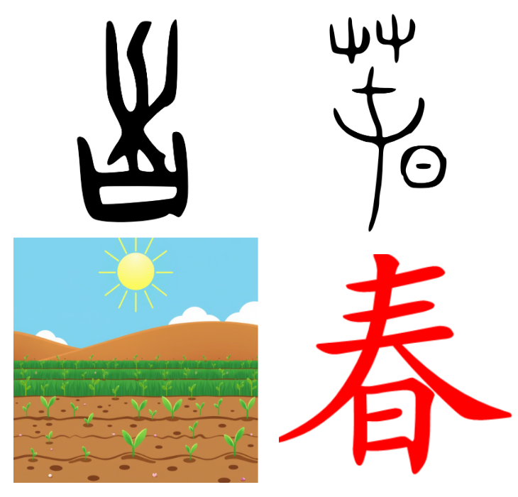
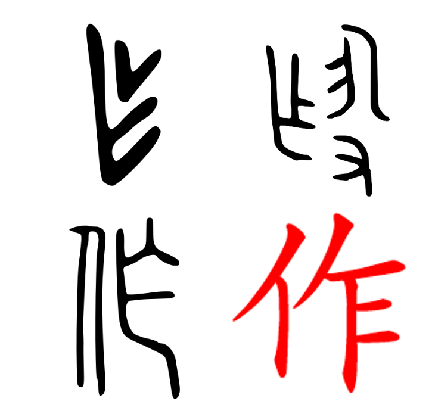
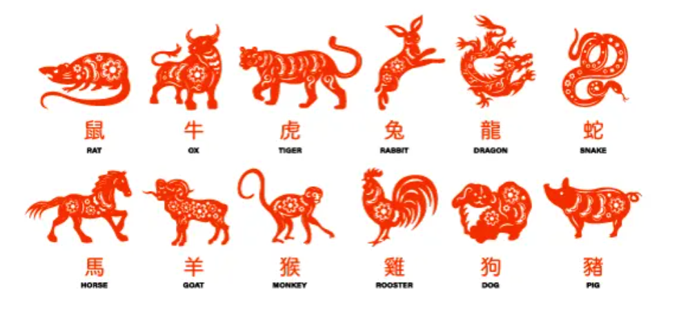

# 汉字：从简化到深化的新探索

*龚文光* 

(wen_gong@vanguard.com)

## 摘要
本文提出了一种研究汉字的新方法： 用物理学、网络分析和自然系统的视角，计算分析了6000多个汉字，识别出422个可作为基本构建块的“元字”。利用受物理学启发的“字矩阵”模型，我们拆解汉字在十一个空间位置上，以发现汉字组成结构及语义扩展的系统性模式。

研究发现汉字具有自然系统的特性：涌现复杂性、自组织性和适应性韧性。斐波那契数列提供了组织框架，帮助我们理解汉字从简单象形字到复杂抽象字的演化。通过多个案例研究，我们看到字义从具体领域到抽象领域的有效延伸。

本研究视汉字为一个活系统，它不仅是语言交流工具，也提供理解人类认知的一个窗口，发现语言、思维和自然模式之间的深刻联系。通过优先学习元字，结合人工智能辅助学习方法，我们希望本工作为简化学习中文的过程，深化学习中文的体验，提供参考与尝试。

关键词：汉字，网络分析，自然系统，认知语言学，计算语言学，语言学习，知识组织


# 缘起

对使用字母系统的学生，学习中文汉字尤其是个巨大的挑战。
这种困难主要源于汉字的表意性质，每个汉字代表一个语素（或词），而不是声音。与拼音文字不同，汉字的视觉形式与其发音之间通常没有明显的联系，这要求学生通过机械记忆掌握上千个不同的汉字，以达到基本的读写能力。此外，普通话的声调特性进一步增加了复杂性，音高的变化可能改变词义。汉字的数量庞大、笔画顺序和字形构成的细微差别，以及繁体字和简体字并存的情况，使得学生需要投入长期而专注的努力，才能在书面和口语中达到流利水平。相比于许多其他语言，掌握中文无疑是一项耗时的任务。

现代科学还原论取得了巨大成功，例如物理学中基本粒子的发现和化学中元素周期表的建立，极大地推动了社会与科学进步。本研究试图将还原论应用于汉字的学习与研究中。具体而言，我们采用了以下三种关键方法：
- **网络分析**：借助计算机科学和网络分析技术，本研究旨在揭示大量汉字之间的隐藏关系，从而简化看似混乱复杂的汉字系统。
- **人工智能（AI）辅助**：认识到传统汉字学习中机械记忆的负担，本研究探索利用人工智能来缓解这一难题。目标是开发基于AI的工具，帮助学生记忆汉字的形状、发音和意义，并理解其复杂的交互关系及上下文用法。
- **优化学习过程与体验**：通过结合网络分析和AI辅助技术，本研究的总体目标是减轻学生的学习负担，同时丰富他们的学习体验。

通过结合网络分析、AI辅助技术和计算驱动的方法，本研究旨在为理解和学习汉字提供一种全新的方式，最终使学习过程更加高效、直观且愉快。

# 汉字的计算网络分析

《说文解字》是东汉许慎编撰的一部奠基性著作，代表了对汉字结构和词源进行系统分析的首次尝试 [1,2,3]。许慎识别出540个部首，运用开创性“六书”理论解释汉字的构成，将汉字按照其组成分类为象形、指事、会意、形声，转注，和假借。他的分析主要基于小篆，而其540个部首并非代表字的组成单元。

后来《康熙字典》对汉字进行了系统分析，最终确定了214个部首 [4]，这些部首主要基于共享的视觉成分，通常与意义相关（形旁），许多部首也暗示了发音（声旁）。康熙部首系统被广泛使用，为字典查询提供了有效方法。

在继承许慎和康熙部首的基础上，作者结合计算网络结构，对6190个汉字 [5]（包括3910个HSK常用汉字 [6]）进行了分解。为了系统地分解汉字，作者引入了一种空间分解模型（像个“字矩阵” ，见图1）。该模型将每个汉字表示为一个最多包含11个不同位置组件的矩阵。这些位置定义为：上、下、左、右、中、左上、右上、左下、右下、中内、中外。矩阵中的每个位置可以由字组件（部首、笔画或更复杂的字）占据，也可以为空。这11组件的矩阵提供了一致的且结构化的表示方式，来描述任何汉字的组成。

每个汉字的分解过程涉及一系列分解步骤，采用层次化方法完成，这种层次化方法确保了对汉字结构的一致分析。首先，将汉字拆分为其主要组成部分，并将其分配到矩阵中的适当位置。如果某个组成部分本身较为复杂，则进一步递归分解为其子部分，并将其分配到表示该组件的子矩阵中的相应位置。这种层次化分解持续进行，直到识别出最基本的组成部分，指那些无法合理进一步拆分的部分（如图2所示）。这些组成部分代表了在层次化分解过程中浮现的基本构建单元， 成为“元素字”集的候选者。通过设定频率阈值，获得422个高频出现的，独特的，且不可再分的组成部分，以下为方便起见，简称“元素字”为“元字”。


# 元字分析

表1按笔画数列出了这422识别出的元字集，其中包含245个源自传统康熙部首系统的组成部分，另新增177个元字。这一扩展反映了我们在汉字分解过程中采用了更精细的方法，这些新识别的元字，虽然在标准字典中未被传统地视为独立单元，但在汉字构成中发挥了重要的语音语义作用。例如，像“禺”和“乍”这样的元字，尽管在传统字典中未被归类为部首，但在复合字中表现出一致的语义，对此我们将在后面的案例研究中进一步探讨。

## 元字表

表1： 按笔画数与来源分类的元字, 并明确区分了传统的康熙部首与新识别的组成部分。

 | 笔画数  | 康熙部首 | 元字 |
 |------------|--------------|----------|
 | 1  |  丨丶丿乀乁乚乛亅一 | |乙                                                                                       
 | 2 |  丷亠亻冂冖冫凵⺈刂勹匚匸卩㔾厶讠二人儿入八几刀力匕十卜厂又 |  ⺀乂龴⺁丁七乃九了刁 |
 |3   |  夂夊宀尢屮巛廴彐彑彡彳忄扌氵丬纟艹辶阝饣口囗土士夕大女子寸小尸山川工己巾干幺广廾弋弓犭门飞马 |  亍兀⺌⺍⻏万丈三上下与个丸义久么之乞也习于亏亡刃勺千叉及已乡才  |
  | 4   |  攴攵殳灬爫爻爿牜⺩礻禸罓耂心戈戶户手支文斗斤方无日曰月木欠止歹毋比毛氏气水火爪父片牙牛犬王瓦见贝车长韦风  | 旡朩⺧不丑专中丰为乌云五井亢今介仓以元公六内冈凶分办勾勿匀匹区升午友天太夫少尤尺屯巨巴开  |
  |5 |  氺疋疒癶罒衤钅母玄玉瓜甘生用田白皮皿目矛矢石示禾穴立鸟龙 |  乍刍戋𤴔且丘丙业东乎乐令兄兰冬出击包北半占卡去古句另只可台四央失头宁它尼市布平必斥旦未末本术正由甲申电  |
  |6 |   ⺮⺶聿艮虍覀竹米糸缶网羊羽老而耒耳肉臣自至臼舌舟色虫血行衣西页齐 |  囟尧屰⺷交共各合吉向吕寺并庄式曲  |
  |7 |  豕豸酉卤舛角言谷豆赤走足身辛辰邑釆里麦龟  |  㐬佥呙坙夆奂孚肙员㕻甫良  |
  |8 | 隹黾金阜隶雨青非鱼齿   |   龺幷其奉尚易東责  |
  |9 | 面革韭音食首香骨鬼   |   畐咸柬畏禺  |
  |10 |  高鬥  | |
  |11 |  麻鹿  | |
  |12 |  黍黄黑  | |
  |13 |  鼓   | |
  |14 |  鼻   | |


这个元字集涵盖了三种主要类型的组件：（1）熟悉的表意部首（如氵、水、木、日、月、心、手、口），（2）基本结构部首（如一、丨、丿、丶、乙、口、凵、冂），（3）以及频繁出现且兼具语音和语义信息的部首（如方、占、且、戋、乍、禺、尧、佥）有些康熙部首（如鼓），虽然具有历史意义，但可能需要重新评估其在现代实际应用中的适用性。

这个元字集注重语义的完整性， 为理解和学习汉字构成提供了更为细致的、全面的基础。


## 元字出现频率与分类

对高频元字（出现次数超过23次，此阈值选定是为了包括“气”（意为空气、呼吸和能量），因其在中国哲学和文化中的根本重要性）的分析揭示了汉字构成中的清晰模式。图3频率分布显示，基本人类概念和自然元素周围存在显著的聚集现象。例如，在与人类相关的类别（人-）中，像“口”（嘴，300次出现）和“手”（261次出现）等元素表现出极高的使用率，反映了它们在表达人类行为和经验中的重要性。同样，在自然界相关类别中，“水”（377次出现）和“木”（324次出现）也显示出高频率，表明它们在与自然现象相关的汉字构成中的关键作用。值得注意的是，“亻”（人字旁，213次出现）和“女”（女性，137次出现）也表现出高频率，进一步凸显了汉字构成中以人类为中心的特点。


分类系统揭示了一种围绕主要概念领域的层级组织结构。该系统区分了以人为中心的类别（人-系列），包括生理、心理和行为（衣食住行）方面；自然元素（天文-），包括传统的五行（金木水火土）；以及植物、动物、数学概念和抽象概念的类别。这种分类不仅反映了中国传统哲学对世界的理解，还为理解汉字构成提供了一个系统化的框架。值得注意的是，这些类别内的频率分布表明，与人类经验和基本自然元素相关的字符构成了书写系统的核心构建块，而更专业化或抽象的概念则表现出较低的频率。“气”（24次出现）在本分析中的纳入尤为显著，因为它代表了一个阈值案例，将基本哲学概念与实际的汉字构成模式联系起来。

## 元字可视化分类

图4把元字分类进一步可视化，以揭示汉字分布中的显著模式。从天体元素（天文- ）开始，这些类别贯穿自然现象到人类经验，形成了一条与传统中国哲学原则深刻共鸣的叙事线索。在这一分布中，与人类生理相关的字符（人-生理 , 1106次出现）占据了中心位置，成为连接自然元素与社会结构的桥梁，呼应了古典中国“天人合一”的观念。这一核心位置两侧分别是自然领域——植物（植物- , 558次出现）和动物（动物- , 466次出现）——以及社会领域（社会- , 815次出现）的重要体现。

在天文/自然元素类别（天文- ）中，水（水 , 406次出现）和木（木 , 324次出现）的频率显著高于火（火 ）、金（金 ）和土（土 ），表明它们在汉字构成中的重要性更高。从天体现象到自然元素，再到人类经验，最后到抽象数学概念（数理- ）的系统性递进，揭示了一种优雅的层级结构，映射了中国传统宇宙观的秩序。这种分布模式表明，汉字演化中存在一种潜在的组织原则，既反映了人类认知的发展，也体现了对自然世界的观察。这一关系将通过其与斐波那契数列的联系稍后作进一步探讨。


## 汉字构成模式

对汉字构成的分析揭示了与自然界分子组织极为相似的模式。正如原子通过相互作用结合一样，元字在空间上相互作用以形成更复杂的汉字（见图5）。“体数”列出有几个元字参加组合，“构成模式”列出元字在字矩阵中的空间位置， “频率”列出那种构成模式的出现次数，“范例”列出一个例字的分解。

最常见的排列方式类似于基本的两体相互作用，表现为不同方向上的形声组合：“左-中”（3033个汉字）、“上-下”（732个汉字）、“上-中”（694个汉字）和 “左-右”（568个汉字），等等。这些相对位置虽然用现代方向术语描述，但反映了更为基本的空间关系，超越了从竖排到横排书写系统的历史演变。更复杂的模式展示了类似于物理学中多体相互作用的复杂几何排列。

三体相互作用表现为三角形配置，例如，“上-中-下”（139个汉字）， “左上-右上-下”（51个汉字）和 “左-右上-右下”（46个汉字）；而四体相互作用则表现为对称的包围模式，尽管出现频率较低（23个汉字）。这种三维空间组织使汉字区别于字母书写系统的线性序列，反映了自然系统中观察到的多维相互作用。对简单两体排列的明显偏好，以及随着复杂几何模式频率递减的现象，反映了自然界趋向高效、稳定配置的趋势。这种分布不仅为理解汉字构成原则提供了宝贵的见解，也为基于基本空间关系开发有效的学习策略奠定了基础。


# 汉字中的故事叙述
汉字不仅仅是记录语言的符号，它们是复杂的故事载体，通过其结构编码了观察、智慧和自然法则。基于我们对元字及其构成模式的分析，我们现在探讨这些基本单元如何在多个尺度上组合起来讲述故事——从单个汉字家族到完整的诗歌。正如分子通过其键合与相互作用讲述物质组织的故事，汉字则通过其语义关系和不断演变的组合揭示更深层次的叙事。本节将探讨意义如何通过日益复杂的排列方式浮现：从共享共同元素的汉字家族，到类似网络的复合结构，再到古典诗歌的结晶化结构。每一层次都展示了汉字书写系统如何像自然系统一样，在高效编码信息的同时保持深刻的艺术与哲学一致性。


## 案例研究： 组合汉字

### “日”字家族

元字“日”，意为“太阳”或“日子”，从甲骨文中的象形符号，描绘一个带有中心点的圆形太阳，到其现代形式的演变，展现了在保留核心视觉概念的同时，获得了书法上的简洁性。这种演变不仅反映了古代人对自然现象的直观理解，也体现了汉字在形式简化与意义传承之间的平衡（见图6）。


以下列表显示由元字“日”构建出的汉字及字意解释：

| 拆字 | 字意 | 解释 | 拼音 |
| ------------------- | ---------------- | ----------------------------------------------------------------------------------------------------------------------------------------------------------- | ------------ |
| 日 + 月 = 明 | 明亮 | 日月为天地间两大天然光源 | míng |
| 日 + 正 = 是 | 真实 | 日正当中，无影可寻，万物显真形 | shì |
| 知 + 日 = 智 | 智慧 | 太阳无穷能量，启迪智慧之源 | zhì |
| 日 + 日 + 日 = 晶   | 明亮 / 结晶体 | 日字重复强化光亮与清晰 | jīng |
| 门 + 日 = 间 | 空间 / 间隔 | 门框间透入的光线显示空间 | jiān |
| 日 + 寸 = 时 | 时间 | 古代以日影测量时间 | shí |
| 日 + 生 = 星 | 恒星 | 恒星与太阳共生 | xīng |
| 丿 + 日 = 白 | 白色 | 太阳散发纯净洁白的光线 | bái |
| 日 + 一 = 旦 | 黎明 | 日出地平线 | dàn |
| 九 + 日 = 旭 | 朝阳 | 清晨太阳，光芒万丈 | xù |
| 日 + 十 = 早 | 早晨 | 清晨时分，日挂树梢 | zǎo |
| 日 + 干 = 旱 | 干旱 | 烈日导致干旱 | hàn |
| 三 + 八 + 日 = 春  | 春季 | 阳光普照大地，种子破土，万物竞生，象征春天 | chūn |

图7对“春”字进一步解释，通过其组成部分展示了高效的语义编码：其中“三”代表多重含义，生命萌发的繁茂、层层冻土；“八”表示分裂或破开；“日”则象征太阳。这些元素共同捕捉了春天到来的动态过程，增强的阳光、大地层次与新生生命的相互作用。这种结构展示了汉字如何在一个元字“日”单一且连贯的形式中叠加多重相关意义。




### “坙”字家族

元字“坙”展示了中文书写系统如何保存人类创新的基本原则。除了其基本含义“核心”和“轻盈”之外，这个字还记录了人类认知中的一次关键转变：即人们认识到效率来源于优化的结构，而非单纯的物质堆积。从实心石轮到带辐条的木制车轮的设计演变，不仅代表了技术的进步，也标志着概念上的突破, 即核心原则往往通过简化而非叠加得以显现（见图8）。


以下列表显示由元字“坙”构建出的汉字及字意解释：

| 拆字 | 字意 | 解释 | 拼音 |
| -------------- | ------------------------ | ---------------------------------------------------------- | ------------ |
| 气 + 坙 = 氢 | 氢气 | 最简单的化学元素，核心仅含一个质子 | qīng |
| 艹 + 坙 = 茎 | 植物茎 | 支撑植物整体结构的重要部分 | jīng |
| 纟 + 坙 = 经 | 经典 / 经络 | 贯穿文化或人体的核心内容与脉络结构 | jīng |
| 坙 + 力 = 劲 | 力量 / 劲力 | 核心纤维产生的力量与韧劲 | jìn |
| 坙 + 页 = 颈 | 颈部 | 连接身体与头部的关键枢纽 | jǐng |
| 彳 + 坙 = 径 | 捷径 / 半径 | 从中心直达外围的最短路径 | jìng |
| 车 + 坙 = 轻 | 轻巧 | 精简结构以实现轻便高效 | qīng |

这一元字家族展示了汉字书写系统,在跨代传递复杂原则方面的能力。每个衍生汉字都将“结构效率”这一核心概念扩展到不同领域，从原子物理（氢）到生物系统（茎），不仅保存了最终结果，还保留了创新背后的深层原则。


### “禺”字家族

元字“禺”代表了中文书写系统中一个基本的“连接”或“结合”概念，作为各种类型连接与交互的语义载体发挥作用（见图9）。


以下列表显示由元字“禺”构建出的汉字及字意解释：

| 拆字 | 字意 | 解释 | 拼音 |
| -------------- | ---------------------------------------------------------- | ---------------------------------------------------------------------------------------------------------- | ------------ |
| 亻 + 禺 = 偶 | 伴侣，偶然，偶数 | 捕捉有意的配对，包含着偶然因素，而“偶数”则暗示平衡稳定的状态 | ǒu |
| 宀 + 禺 = 寓 | 寓所，隐喻 | 物理空间促成相互的联系 | yù |
| 辶 + 禺 = 遇 | 遇见，相遇 | 通过动态会合产生的联系 | yù |
| 禺 + 心 = 愚 | 无法连接 | 认知维度冻结，导致认知缺陷 | yú |
| 阝 + 禺 = 隅 | 角落，交界 | 空间联系的表现 | yú |
| 耒 + 禺 = 耦 | 连接的根系 | 植物系统展示联系 | ǒu |

这一元字家族展示了中文书写系统如何将不同类型的连接概念化, 从物理上的连接到空间关系，再到认知上的关联, 所有这些都源自于一个单一的基本概念：“结合”。


### “乍”字家族

元字“乍”代表了工作、创造和转化的基本概念。其历史形态暗示了制作或转化材料的过程，作为各种生产活动的语义载体发挥作用（见图10）。




以下列表显示由元字“乍”构建出的汉字及字意解释：

| 拆字 | 字意 | 解释 | 拼音 |
| -------------- | ---------------------- | ------------------------------------------------------ | ------------ |
| 亻 + 乍 = 作 | 制作，行动 | 直接的人类生产活动 | zuò |
| 日 + 乍 = 昨 | 昨天 | 通过已完成的工作寓意过去的时间 | zuó |
| 乍 + 心 = 怎 | 如何？ | 解决问题的心理过程 | zěn |
| 火 + 乍 = 炸 | 爆炸，煎炸 | 不同规模和形态的能量转换 | zhà |
| 讠 + 乍 = 诈 | 欺骗 | 沟通中努力的误用 | zhà |
| 口 + 乍 = 咋 | 如何 | 质疑过程的口头表达 | zǎ |
| 酉 + 乍 = 酢 | 醋 | 通过工作实现化学转化 | zuò |
| ⺮ + 乍 = 笮 | 压榨 | 对材料施加的物理做工 | zé |
| 穴 + 乍 = 窄 | 凹陷，狭窄 | 通过限制实现的空间转换 | zhǎi |

这一元字族展示了“工作/转化”的基本概念如何生成跨越物理、化学、心理、时间和社会领域的汉字, 正如能量在自然界中以不同形式表现一样。

### “寺”字家族

元字“寺”，最初描绘的是寺庙或权威场所，作为语义载体，代表了有序的结构和有节制的互动。其源于寺庙设计的建筑背景暗示了平衡、等级和神圣空间的规划原则（见图11）。


以下列表显示由元字“寺”构建出的汉字及字意解释：

| 拆字 | 字意 | 解释 | 拼音 |
| -------------- | ------------------------------------- | ---------------------------------------------------------------------------------------------------------------------------------------------------------------------------------------------------- | ------------ |
| 日 + 寺 = 時 | 时间作为宇宙法则 | 寺庙通过仪式测量太阳运行，揭示时间作为一种不可逃避的宇宙秩序，这一基本原则万物遵循，也支配万物存在 | shí |
| 牜 + 寺 = 特 | 特殊 / 非凡 | 牛作为珍贵农业资产献给寺庙，象征最高形式的祭祀与敬畏 | tè |
| 亻 + 寺 = 侍 | 以仪式礼节服务 | 以寺庙内外庭的空间层级关系为模型，展现服务关系 | shì |
| 扌 + 寺 = 持 | 坚持 / 维持秩序 | 反映寺庙建筑结构力的平衡分布与持续均衡 | chí |
| 彳 + 寺 = 待 | 在适当位置等待 | 如同寺庙仪式中规定的站位，象征时空中的纪律性定位 | dài |
| ⺮ + 寺 = 等 | 有序分级 / 分类 | 映射寺庙建筑对神圣空间按等级和功能的清晰划分 | děng |
| 山 + 寺 = 峙 | 巍然屹立 | 象征寺庙佛塔垂直向上的庄严存在，体现精神与道德的升华 | zhì |
| 忄 + 寺 = 恃 | 自信依赖 | 如同寺庙的地基，代表延伸至心理领域的可靠支撑 | shì |
| 讠 + 寺 = 诗 | 诗歌如神圣建筑 | 以寺庙般的精准排列文字，创造超越意义的结构 | shī |


这一元字家族揭示了寺庙建筑中的结构与秩序原则如何延伸至宇宙时间（時）、仪式意义（特）、社会等级（侍）以及艺术表达（诗）。这种从具体到抽象领域的扩展，展示了汉字形成过程中精妙的隐喻思维。


## 案例研究：拼音不能代表汉字

在汉语中，声音（声 ）、形式（形 ）和意义（意 ）共同构成了一个充满活力的、既独立又互补的系统。过度强调任何一个方面而忽视其他方面，都是低效、误导且不明智的。尽管拼音系统通过引入拉丁语音元素，无疑增强了汉语的发音功能，但完全依赖拼音，甚至放弃汉字，将导致语义信息和文化智慧的巨大损失。以下通过简单的同音现象，来示范纯表音系统的局限性：

单字同音现象：
- mā : 妈（母亲）、蚂（蚂蚁）、马（mǎ , 马）、骂（mà , 喊叫或咒骂）
- shì : 是（是的）、事（事情）、市（市场）、式（样式）、世（世界）
- yì : 意（意义）、义（正义）、艺（艺术）、易（变化）

复合词歧义：
- 拼音“xiansheng”可能表示：
  - 先生（老师/先生）
  - 献身（牺牲自己）

汉字以其优雅与复杂，同时编码了视觉和听觉信息，并保留了关键的语义。这种形式与功能的和谐统一，使汉语体系得以延续进化数千年。未来的方向在于发展这一精妙的书写系统，同时审慎地引进现代工具如拼音、人工智能，让汉语更易学，更易用，更丰富。


## 案例研究： 汉字与词组

正如物质会自发组织，形成越来越复杂的结构，从原子到分子，再到分子簇，语言在不同尺度上也表现出类似的涌现特性。元字作为基本单位，承载着基础意义并具有组合属性。这些汉字进一步构成复合字和词组，类似于具有稳定语义联系的分子。在更高层次的组织中，这些语言分子排列成复杂结构，如诗歌，这种结构就像分子簇一样，展现出超越其组成部分总和的特性。这种意义生成的自然层级体系，展示了汉语具有一种活生生的、自组织系统的本质。

### “子”字家族

元字“子”，最初描绘了一个张开双臂的孩子，既作为语义成分，又作为语音成分参与汉字的构成。其视觉演变保留了“后代”的核心意义，同时扩展到了更广泛的生长与养育领域（见图12）。


以下列表显示由元字“子”构建出的汉字及字意解释：

| 拆字 | 字意 | 解释 | 拼音 |
| ------------------- | -------------------- | ------------------------------------------------------------------------------------- | ------------ |
| 女 + 子 = 好 | 好，良好 | 孩子与母亲在一起象征根本的善良与美好 | hǎo |
| 耂 + 子 = 孝 | 孝顺 | 长辈在上，晚辈在下，表示尊敬与关怀的人文观 | xiào |
| 子 + 小 = 孙 | 孙子 | 小孩子代表代际延续 | sūn |
| 木 + 子 = 李 | 李树 | 果实作为自然的后代 | lǐ |
| 米 + 子 = 籽 | 种子 | 谷物的后代，农业繁殖 | zǐ |
| 禾 + 子 = 季 | 季节 | 农作物周期以生长阶段为标志 | jì |
| 宀 + 子 = 字 | 文字 | 屋中孩儿，象征知识的培育，也隐喻汉字宝贵 | zì |
| 小 + 冖 + 子 = 学   | 学习，研究 | 孩子在遮蔽处（冖）从小开始，体现教育的本质 | xué |

### “子”字网络

这一分析揭示了“子”如何从其具体的“孩子”含义延伸到一个涵盖自然、社会和抽象领域的极其丰富的语义网络。在基础层面上，“子”捕捉了核心的人际关系（父子、子女）和生物生长（种子、子宫）。随后，其语义范围显著扩展，涵盖了从宇宙尺度的基本粒子（量子、原子）到数学抽象的精确性（因子、子集）。该字的多功能性还体现在其应用于日常物品（筷子、房子）、时间概念（日子、甲子），甚至文化历史背景（日本鬼子）中。尤其引人注目的是，“子”在其多样化的领域中始终保持着与生长、基础性和归属感的核心关联。无论是描述后代（孙子）、知识传承（弟子），还是物质的微小单元（原子）。这种从具体到抽象意义的语义辐射，同时保留核心概念联系，体现了嵌入汉字演变和复合字词形成中的精妙隐喻思维（见图13）。


以下列表显示由元字“子”构建出的汉字词组及语义解释：

| 类别 | 词组 | 语义 |
| ---------------------- | ------------------------------ | ------------------------ |
| 人际关系 | 父子、子女、子孙、弟子 | 核心人文关系 |
| 科学对象 | 量子、光子、原子、电子 | 物理学基本粒子 |
| 数学对象 | 因子、子集、子空间 | 数学基本概念 |
| 自然元素 | 种子、脑子、芽子、子宫 | 生理结构，生物生长 |
| 动物 | 狮子、兔子、蚊子 | 生物体 |
| 时间概念 | 日子、子时、甲子 | 时间周期 |
| 工具/物品 | 筷子、梯子、桌子、房子、子弹 | 功能性物品 |
| 尊称 | 老子、孔子、墨子、孙子、君子 | 尊敬与智慧 |
| 贬称 | 日本鬼子、毛子 | 对侵略者带有情绪的贬义称呼 |


## 案例研究： 诗歌象征文字的殿堂

本节探讨古典中国诗歌，如何通过极少的汉字使用，实现显著的语义密度。这些诗歌能够跨越千年流传至今，展示了汉语选择与进化的强大原则：以最少的结构承载最大的意义，从而创造出持久的语言艺术作品。

### 诗歌作为神圣的建筑
`讠 + 寺 = 诗`：这一优雅的构字方式，捕捉了诗歌的本质: 构建语言文字的殿堂，从精心挑选的字、词、句中，创造出超越其组成部分的意义空间。正如寺庙通过建筑原理，将物理空间转化为神圣领域，中国古典诗歌则通过精确的结构安排来创造意义。

当作者向多个人工智能系统，查询具有代表性的中国诗歌时，以下两首杰作频繁出现，表明它们在中国文学知识库中的特殊地位。


```
《登鹳雀楼》
王之涣

白日依山尽，
黄河入海流。
欲穷千里目，
更上一层楼。
```


```
《静夜思》
李白

床前明月光，
疑是地上霜。
举头望明月，
低头思故乡。
```


### 诗歌的建筑原则

### 5.4.2.1 基础（地基）
元字作为构建块:
- 自然元素：山、河、日、月
- 基本动作：上、望、举、低
- 核心概念：目、光、头、楼

### 5.4.2.2 纵向递进（层进）
物质与精神的提升, 每一层都增添了新的意义维度:
- 《登鹳雀楼》：字面上的攀登映射意识的扩展
- 《静夜思》：从地面（霜）到天空（月）再到内心（思）的流动


### 5.4.2.3 神圣空间（空间）
这两首诗通过极简手段创造出广阔的心理景观：
- 水平延展：千里目、入海流
- 垂直维度：一层楼、举头望
- 内在领域：思故乡

### 诗歌的阴阳表达

这两首诗通过互补的方式共同构成了一个完整的认知框架：

| 方面 | 阳 - 《登鹳雀楼》 | 阴 - 《静夜思》 |
|--------|---------------------|-------------------|
| 天体 | 日落 (白日依山) | 月光映照 (明月光) |
| 运动 | 向上进取 (更上一层楼) | 循环动作 (举头...低头) |
| 哲学 | 积极追求超越 | 被动接受感悟 |
| 情感 | 对远方的向往 | 思乡与连接 |

### 诗歌的进化考验

这两首诗留传久远，家喻户晓，可以归因于以下几个因素：

#### 5.4.4.1 结构效率
- 语义密度 ：以最少的空间承载最大的意义（20字）
- 递进建构 ：从观察到洞见
- 信息压缩 ：每个汉字蕴含多层次的意义
- 记忆设计 ：节奏和意象支持记忆

#### 5.4.4.2 文化传播载体
- 教育价值
  - 易懂的汉字（易懂）与精湛的技艺（难工）相结合
  - 清晰的结构支持记忆（朗朗上口）
  - 普遍的主题确保相关性（代代相传）
- 认知共鸣
  - 符合基本思维模式
  - 具象与抽象元素的平衡
  - 情感与洞见的融合

#### 5.4.4.3 互补智慧路径
这些杰作编码了两种理解本质的方法：

- 《登鹳雀楼》：通过努力实现超越
  - 物理上的攀升作为理解的隐喻
  - 积极面对局限
  - 通过有意行动扩展视野
- 《静夜思》：通过反思获得洞见
  - 静观揭示深刻联系
  - 自然现象唤起情感真理
  - 静谧作为通往深刻理解的途径


### 诗歌小结

这些诗歌展示了中国古典诗歌的精妙架构，通过精心安排的极简元素创造出持久的意义结构。它们跨越千年，不仅反映了其在编码智慧方面的卓越效率，也体现了其与人类经验和理解的基本模式的共鸣。如同精心设计的庙宇殿堂，它们将简单的元素转化为深邃的意义空间，对文化和文明产生了深远的影响。


# 汉字的自然演化

在关于“元字可视化分类”和“汉字构成模式”的前二章节中，我们观察到元字如何反映人类对自然的认知，以及元字如何像物理世界中的原子分子一样相互作用，构建复杂的汉字。在此，我们继续探讨汉字如何自然演化。

## 历史背景
历史传说中, 仓颉是公元前27世纪黄帝时期的一位史官, 结绳记事是当时记录信息的主要方法, 他对结绳记事法的局限性感到失望。仓颉从对动物的足迹、地貌和星辰等等自然万物的观察中受到启发，他通过画画以捕捉每件事物的特征来记事交流，从而创造了汉字书写系统。值得一提的是:人类多种语言(包括中文)起源于象形符号。仓颉造字无疑是汉字书写系统中一项里程碑式的事件，但从语言的宏观发展角度，汉字更是代代相传、自然演化的产物，任何人工设计的作品都必须经受实践与时间的检验。

## 自然生长模式：斐波那契数列

从向日葵种子排列到鹦鹉螺壳，从蕨类植物的叶子到螺旋星系，自然界中斐波那契模式的图像到处可见。它揭示了一种普遍的生长与组织原则。斐波那契数列（1, 1, 2, 3, 5, 8, 13, 21, 34, ...）为理解这一演化提供了一个组织框架。它反映了自然界在简单基础上发展复杂系统的高效性（见图16）。


正如自然系统从简单到复杂通过可预测的模式演化，汉字演化或许有相似的生长模式? 
这里没有严格的数学对应关系，而是用这种隐喻方式来提示复杂性如何以系统化的方式从简单性中涌现。

作者以下借用这一序列来组织汉字的类似自然进展：从简单的象形文字到复杂的复合汉字，从具体物体到抽象概念。这种自然进展不仅仅是一个组织框架，它还反映了人类认知本身如何从基本感知发展到复杂抽象的过程。
作者用斐波那契数代表基本元素字（元字）表达形式的每一层级，每一层级都引入新的元字，这些元字像扩展的螺旋，成为更丰富构语言表达的构建块。整个斐波那契数列代表了汉字渐进复杂的表达形式。

## 元字层级

下文列出了前9个层级的元字集合。具有独立意义的康熙部首在“部首形式映射”中注明（例如，灬表示火）。

### 1 (一): 气（无形元字）

“气”元字表示从无形到有形的显现（无中生有），表示原始的能量和力量概念。
炁是气的一种罕见古体形式，使用较少，但其下部的部首（灬）暗示了其与火和能量相关的语义。
部首形式映射 ：气是一个部首，所有包含气的汉字都与基本的核元素、化学元素或气态物质相关，例如：
氢（氢气）、氦（氦气）、氧（氧气）、汽（蒸汽）、氛（大气）。

### 1 (一): 点、线（低维有形元字）

基本部首元字 ：丶（点）、一（横线）、丨（竖线）、丿（东北向斜线）、乀（东南向斜线）。
表示可见的简单形式（即点状或线状的有形对象），虽然本身不具有独立的语义，但与其他构成部分结合后衍生出意义。以下以第一个元字“气”为例说明：
气 + 丿 = 氕 ：氕是氢的最常见的稳定同位素，含有一个质子（即1个核子）。
气 + 刂 = 氘 ：氘是氢的一种稳定同位素，占自然界中氢的0.02%，含有一个质子和一个中子（即2个核子）。
气 + 川 = 氚 ：氚是氢的一种放射性同位素，含有一个质子和两个中子（即3个核子）。在此，丿、刂、川分别表示相应氢同位素中的1、2、3个核子。


### 2 (二): 日, 月（二元元字）

第一对自然元字, 表示两个可见的天体，是时间与光明概念的基础，抽象后构成基本的、阴阳对立的、二元哲学概念。
这两个元字均可作为部首使用。值得注意的是，当“月”作为部首时，它也表示身体部位的肉或肉体概念。这很可能是历史上的一种巧合，“月”被用作“肉”的简化书写形式。

### 3 (三): 天, 地, 人 （三体元字）

这三重领域，构建了人类认知与心理活动的基本空间与存在框架，是定位与关系的核心参照点。
部首形式映射 ：土对应地，亻对应人。


### 5 (五): 金, 木, 水, 火, 土（五行元字）

古代哲学中描述物理与物质世界的五大基本元素（五行），表示自然界物质的基本形态。
部首形式映射 ：钅对应金，氵和冫对应水，灬对应火；木和土在作为部首时通常以较窄的形式出现，但语义保持不变。


### 8 (八): 春, 夏, 秋, 冬, 东, 南, 西, 北 （季节与方向元字）

八元字表示完整的方位与周期变化系统, 是位置/方向与时间概念的基础。


### 13 (十三): 生, 鼠, 牛, 虎, 兔, 龙, 蛇, 马, 羊, 猴, 鸡, 狗, 猪（生命形式元字）

生物生命是复杂的自然现象，以十二生肖元字表达基本的生物概念和对象。

部首形式映射 ：牜对应牛，虫是蛇及其他昆虫的部首，犭是许多动物（如猴、狗、猪）的部首；羊、⺶、⺷是羊的不同部首变体形式，马的部首在使用时通常较窄。




### 21 (二十一): 数量化与测量元字

- 数字系统（15个元字）构成了所有量化描述的基础 ：
  - 基本数字 ：零（0）、一（1）、二（2）、三（3）、四（4）、五（5）、六（6）、七（7）、八（8）、九（9）、十（10）。
  - 大数量单位 ：百（100）、千（1000）、万（10,000）、亿（100,000,000）。
- 物理单位（6个汉字） ：
  - 时间测量 ：秒（s）、分（m）、时（h）。
  从最小单位（秒）到最大单位（小时）的递进，反映了自然周期和人类活动模式。
  - 长度测量 ：寸（cm）、丈（m）、里（km）。
  中国传统长度单位，尺度从人体参考（寸）延伸到地理距离（里）。

这一层级代表了系统化测量与计数的概念出现。


### 34 (三十四): 人体形态与动作元字

- 基本部位元字 ：
心(忄), 头, 首, 面, 口, 目, 眉, 鼻, 耳, 舌, 牙, 齿, 手(扌), 又, 足, 血, 肉, 身, 尸, 骨, 皮, 毛(彡)。
- 动作指示元字 ：
言(讠), 看, 听, 思, 食(饣), 走(辶), 立。
- 身份标识元字 ：
男, 女, 子, 自, 己。

部首形式映射 ：
忄对应心，扌和又对应手，辶对应足，讠对应言，饣对应食。这些部首通常（但不总是）出现在动作语境中，例如分别表示情感思考、持握、行走、交流等。目、口、足、骨、耳也常作为部首出现。其中一些汉字（如首、面）在不同语境中既可作为名词（头、脸），也可作为量词/分类词使用。

这一层级引入了描述人体结构、人类存在、与行为的基本概念。


总而言之：这九个层级展示了汉字如何从基本概念，自然地演化为复杂的人类表达方式，反映了自然系统中发现的复杂性梯度。

## 讨论与启示

### 汉字书写系统作为活生生的体系

通过计算网络与物理启发式分析，我们看到汉字书写系统是一个活生生的、自组织的体系，它间接地反映了自然生长模式。这一视角带来了以下几个关键洞见：

#### 6.4.1.1 复杂性涌现

- 就像生物系统从简单的原子分子相互作用中涌现一样，复杂的汉字也从基本的元字组合中涌现出来。
- 元字之间的关系基于语义需求自然演化，而非随意分配，因为元字任意组合不一定生成有意义的汉字。
- 新的意义通过系统的组合模式涌现。
- 汉字的演化遵循类似于斐波那契序列中观察到的自然生长模式。
- 从基本概念（气、点、线、日、月、天 。。。）到复杂的人类概念的演进，展示了从简单到复杂、循序渐进的、有机的发展过程。

#### 6.4.1.2 自组织原则

- 汉字在没有中心化设计的情况下形成稳定模式。
- 元字组合遵循自然效率原则。
- 语义关系通过有机使用模式发展。
- 系统既表现出稳定性（保留核心意义），又具有适应性（生成新组合）。
- 元字家族展示了自然聚类和关系模式。

#### 6.4.1.3 适应性韧性

- 汉字系统在保持连贯性的同时允许创新。
- 元字组合在表达新概念时展现出显著的灵活性。
- 古老元素字符仍然适用于现代技术术语。
- 元字核心语义基础支持无限扩展。

### 实际应用

#### 6.4.2.1 学习策略
- 首先学习400个元字，打下认知基础。
- 缩减基础汉字数量，以降低学习汉语的门槛。
- 聚焦学习元字集，及其核心概念。
- 认识汉字系统结构，而非死记硬背成千上万个独立汉字。
- 理解元字的自然组合模式，自然地扩大汉字词汇量。

#### 6.4.2.2 教育应用
- 推动跨学科的概念式学习方法。
- 打破语言、数学和科学之间的人为壁垒。
- 通过元字分析使STEM导向教育更早普及。
- 利用元字演化教授系统思维。
- 借助自然模式增强记忆和理解。

#### 6.4.2.3 现代应用
- 数字字体设计中的元字设计原则。
- 基于组件模式优化输入法。
- 基于元字组件关系的自然语言处理模型。
- AI在元字识别与生成中的应用。
- 新技术术语的开发。
- 科学概念的跨文化交流。


### 其他自然语言的基础研究

本研究对汉字的分析方法与洞见，也为研究其他自然语言提供了工具，有借鉴的方向。

#### 6.4.3.1 计算方法
- 应用网络分析研究语义关系和构词模式。
- 探索词汇中的自然聚类和组织原则。
- 通过计算模型分析语言演化。
- 映射不同语言中的概念层级。

#### 6.4.3.2 物理学启发式分析
- 使用还原论方法识别基本语言元素。
- 将语言视为复杂的自适应系统进行研究。
- 应用自组织原则理解语言演化。
- 探讨语言结构中的普遍模式。

#### 6.4.3.3 增强学习框架
- 通过识别核心模式和元素，简化语言学习。
- 创建超越特定语言的概念式学习方法。
- 开发利用自然联想的多模态学习体验。
- 通过共享概念基础构，建跨语言桥梁。

#### 6.4.3.4 AI增强应用
- 利用AI实现个性化、多语言学习体验。
- 创建语言关系的互动可视化工具。
- 开发基于概念的跨语言翻译工具。
- 构建动态、上下文感知的语言学习环境。


本研究表明，将语言视为活生生的、不断演化的系统，而非固定规则的集合，为学习、教学和研究开辟了新的可能性。
汉字形成与演化中揭示的自然原则，可以为多种语言和学科的理论理解与实际应用提供有效的指导。

# 结论

本研究展示了在汉字学习中，简化与深入理解可以相辅相成。通过计算网络分析识别出422个元字，我们显著简化了学习的挑战，将初始记忆负担从数千个汉字减少到一组可管理的基础元字。然而，这种简化并未导致理解的缩减，而是以多种关键方式丰富了我们的认知：

- 从机械记忆到深度理解
  - 不再孤立地死记硬背数千个汉字
  - 学习者掌握元字形成的系统模式
  - 理解复杂意义如何从简单元素中涌现
  - 认识语言中的自然组织原则

- 从静态理解到动态理解
  - 汉字被揭示为一个活生生、不断演化的体系
  - 清晰展现意义如何从具体扩展到抽象
  - 欣赏系统对新概念的适应能力
  - 认识汉字演化中的内在逻辑

- 从碎片化知识到整合性知识
  - 语言与自然模式之间的联系
  - 融合语言学、哲学、和科学洞见
  - 架起传统智慧与现代分析之间的桥梁
  - 跨学科的知识组织理解

- 从表面结构到深层结构
  - 超越简单的视觉组件，进入语义网络
  - 认识复杂的隐喻思维
  - 理解系统化的意义延伸
  - 欣赏文化与认知模式

  这种更深层次的理解通过以下方式丰富了学习体验： 
  - 使汉字学习更加直观和系统化
  - 揭示不同知识领域之间的联系
  - 促进对文化与哲学维度的了解、理解、和欣赏
  - 支持与书写系统的创造性互动
  
本研究表明，真正的简化并非仅仅来自削减，而是源于揭示潜在的模式与原则。通过将汉字视为一个自然演化的体系，我们不仅在学习中获得了实际优势，还深化了对人类认知如何组织和传递知识的理解。这种方法为以下领域开辟了新的可能性：
  - 基于自然模式的AI增强学习工具
  - 复杂概念的跨文化交流
  - 传统智慧与现代分析的融合
  - 更直观教学方法的开发

本研究成功表明，从简化到深入理解的过程并非一种权衡，而是一种协同效应, 减少复杂性的同时，帮助认识更深层次的模式与更丰富的意义。这一观察与洞见，不仅对汉语学习具有重要意义，也为我们如何研究复杂系统提供了普遍启示。

# 致敬

本研究谨献给已故的李政道教授（T.D. Lee），他开创性的努力为众多中国学生留美学习和研究打开了大门，架起了东西方科学传统之间的桥梁。他的远见与支持，使包括作者在内的许多学者，得以在全球科学对话中贡献力量。

本研究也献给作者的父母（龚永权，文国芳），他们在艰难困苦中培养了作者的求知欲。他们始终如一的奉献与支持，将被永远铭记在心。

# 致谢

本文是作者与多个人工智能助手共同协作的成果， 它们包括：来自Anthropic的Claude 3.5 [10]，来自Google的Gemini 2[11]，和来自阿里巴巴的Qwen2.5-Max [12]。作者拥有在软件开发、物理学和汉语领域的知识与洞察力，与人工智能的分析能力相结合，促成了本文中对汉字提出的全新视角与方法论的发展。这种协作展示了人类与人工智能在研究与学习中的合作潜力，尤其是在跨学科研究中，将传统知识与现代计算技术相融合的前景。

# References

[1] https://www.wikiwand.com/en/articles/Chinese_characters

[2] 說文解字 : https://www.shuowen.org/

[3] Sears, Richard. Chinese Etymology research website at
https://hanziyuan.net/

[4] Kangxi radicals : https://en.wikipedia.org/wiki/Kangxi_radicals

[5] CC-CEDICT dictionary dataset :
https://www.mdbg.net/chinese/dictionary?page=cc-cedict

[6] 书同文 汉字网 HSK 汉语水平考试汉字列表 :
https://hanzi.unihan.com.cn/School/HSK

[7] 漢語拆字字典 : https://github.com/kfcd/chaizi

[8] https://www.wikiwand.com/en/articles/Fibonacci_sequence

[9] Google ImageFx text-to-image generation tool:
https://labs.google/fx/tools/image-fx

[10] Claude 3.5 Sonnet : https://claude.ai/

[11] Gemini 2.0 : https://gemini.google.com/app

[12] Qwen 2.5-Max : https://chat.qwenlm.ai/

[^1]: 通讯作者: wen_gong@vanguard.com
