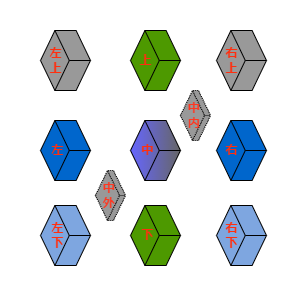

# 汉字：从简化到深化的新探索

*龚文光* 

(wen_gong@vanguard.com)

## 摘要
本文提出了一种研究汉字的新方法： 用物理学、网络分析和自然系统的视角，计算分析了6000多个汉字，识别出422个可作为基本构建块的“元字”。利用受物理学启发的“字矩阵”模型，我们拆解汉字在十一个空间位置上，以发现汉字组成结构及语义扩展的系统性模式。

研究发现汉字具有自然系统的特性：涌现复杂性、自组织性和适应性韧性。斐波那契数列提供了组织框架，帮助我们理解汉字从简单象形字到复杂抽象字的演化。通过多个案例研究，我们看到字义从具体领域到抽象领域的有效延伸。

本研究视汉字为一个活系统，它不仅是语言交流工具，也提供理解人类认知的一个窗口，发现语言、思维和自然模式之间的深刻联系。通过优先学习元字，结合人工智能辅助学习方法，我们希望本工作为简化学习中文的过程，深化学习中文的体验，提供参考与尝试。

关键词：汉字，网络分析，自然系统，认知语言学，计算语言学，语言学习，知识组织


# 缘起

对使用字母系统的学生，学习中文汉字尤其是个巨大的挑战。
这种困难主要源于汉字的表意性质，每个汉字代表一个语素（或词），而不是声音。与拼音文字不同，汉字的视觉形式与其发音之间通常没有明显的联系，这要求学生通过机械记忆掌握上千个不同的汉字，以达到基本的读写能力。此外，普通话的声调特性进一步增加了复杂性，音高的变化可能改变词义。汉字的数量庞大、笔画顺序和字形构成的细微差别，以及繁体字和简体字并存的情况，使得学生需要投入长期而专注的努力，才能在书面和口语中达到流利水平。相比于许多其他语言，掌握中文无疑是一项耗时的任务。

现代科学还原论取得了巨大成功，例如物理学中基本粒子的发现和化学中元素周期表的建立，极大地推动了社会与科学进步。本研究试图将还原论应用于汉字的学习与研究中。具体而言，我们采用了以下三种关键方法：
- **网络分析**：借助计算机科学和网络分析技术，本研究旨在揭示大量汉字之间的隐藏关系，从而简化看似混乱复杂的汉字系统。
- **人工智能（AI）辅助**：认识到传统汉字学习中机械记忆的负担，本研究探索利用人工智能来缓解这一难题。目标是开发基于AI的工具，帮助学生记忆汉字的形状、发音和意义，并理解其复杂的交互关系及上下文用法。
- **优化学习过程与体验**：通过结合网络分析和AI辅助技术，本研究的总体目标是减轻学生的学习负担，同时丰富他们的学习体验。

通过结合网络分析、AI辅助技术和计算驱动的方法，本研究旨在为理解和学习汉字提供一种全新的方式，最终使学习过程更加高效、直观且愉快。

# 汉字的计算网络分析

《说文解字》是东汉许慎编撰的一部奠基性著作，代表了对汉字结构和词源进行系统分析的首次尝试 [1,2,3]。许慎识别出540个部首，运用开创性“六书”理论解释汉字的构成，将汉字按照其组成分类为象形、指事、会意、形声，转注，和假借。他的分析主要基于小篆，而其540个部首并非代表字的组成单元。

后来《康熙字典》对汉字进行了系统分析，最终确定了214个部首 [4]，这些部首主要基于共享的视觉成分，通常与意义相关（形旁），许多部首也暗示了发音（声旁）。康熙部首系统被广泛使用，为字典查询提供了有效方法。

在继承许慎和康熙部首的基础上，作者结合计算网络结构，对6190个汉字 [5]（包括3910个HSK常用汉字 [6]）进行了分解。为了系统地分解汉字，作者引入了一种空间分解模型（像个“字矩阵” ，见图1）。该模型将每个汉字表示为一个最多包含11个不同位置组件的矩阵。这些位置定义为：上、下、左、右、中、左上、右上、左下、右下、中内、中外。矩阵中的每个位置可以由字组件（部首、笔画或更复杂的字）占据，也可以为空。这11组件的矩阵提供了一致的且结构化的表示方式，来描述任何汉字的组成。

每个汉字的分解过程涉及一系列分解步骤，采用层次化方法完成，这种层次化方法确保了对汉字结构的一致分析。首先，将汉字拆分为其主要组成部分，并将其分配到矩阵中的适当位置。如果某个组成部分本身较为复杂，则进一步递归分解为其子部分，并将其分配到表示该组件的子矩阵中的相应位置。这种层次化分解持续进行，直到识别出最基本的组成部分，指那些无法合理进一步拆分的部分（如图2所示）。这些组成部分代表了在层次化分解过程中浮现的基本构建单元， 成为“元素字”集的候选者。通过设定频率阈值，获得422个高频出现的，独特的，且不可再分的组成部分，以下为方便起见，简称“元素字”为“元字”。




# 元字分析

表1按笔画数列出了这422识别出的元字集，其中包含245个源自传统康熙部首系统的组成部分，另新增177个元字。这一扩展反映了我们在汉字分解过程中采用了更精细的方法，这些新识别的元字，虽然在标准字典中未被传统地视为独立单元，但在汉字构成中发挥了重要的语音语义作用。例如，像“禺”和“乍”这样的元字，尽管在传统字典中未被归类为部首，但在复合字中表现出一致的语义，对此我们将在后面的案例研究中进一步探讨。

## 元字表

表1： 按笔画数与来源分类的元字, 并明确区分了传统的康熙部首与新识别的组成部分。

 | 笔画数  | 康熙部首 | 元字 |
 |------------|--------------|----------|
 | 1  |  丨丶丿乀乁乚乛亅一 | |乙                                                                                       
 | 2 |  丷亠亻冂冖冫凵⺈刂勹匚匸卩㔾厶讠二人儿入八几刀力匕十卜厂又 |  ⺀乂龴⺁丁七乃九了刁 |
 |3   |  夂夊宀尢屮巛廴彐彑彡彳忄扌氵丬纟艹辶阝饣口囗土士夕大女子寸小尸山川工己巾干幺广廾弋弓犭门飞马 |  亍兀⺌⺍⻏万丈三上下与个丸义久么之乞也习于亏亡刃勺千叉及已乡才  |
  | 4   |  攴攵殳灬爫爻爿牜⺩礻禸罓耂心戈戶户手支文斗斤方无日曰月木欠止歹毋比毛氏气水火爪父片牙牛犬王瓦见贝车长韦风  | 旡朩⺧不丑专中丰为乌云五井亢今介仓以元公六内冈凶分办勾勿匀匹区升午友天太夫少尤尺屯巨巴开  |
  |5 |  氺疋疒癶罒衤钅母玄玉瓜甘生用田白皮皿目矛矢石示禾穴立鸟龙 |  乍刍戋𤴔且丘丙业东乎乐令兄兰冬出击包北半占卡去古句另只可台四央失头宁它尼市布平必斥旦未末本术正由甲申电  |
  |6 |   ⺮⺶聿艮虍覀竹米糸缶网羊羽老而耒耳肉臣自至臼舌舟色虫血行衣西页齐 |  囟尧屰⺷交共各合吉向吕寺并庄式曲  |
  |7 |  豕豸酉卤舛角言谷豆赤走足身辛辰邑釆里麦龟  |  㐬佥呙坙夆奂孚肙员㕻甫良  |
  |8 | 隹黾金阜隶雨青非鱼齿   |   龺幷其奉尚易東责  |
  |9 | 面革韭音食首香骨鬼   |   畐咸柬畏禺  |
  |10 |  高鬥  | |
  |11 |  麻鹿  | |
  |12 |  黍黄黑  | |
  |13 |  鼓   | |
  |14 |  鼻   | |


这个元字集涵盖了三种主要类型的组件：（1）熟悉的表意部首（如氵、水、木、日、月、心、手、口），（2）基本结构部首（如一、丨、丿、丶、乙、口、凵、冂），（3）以及频繁出现且兼具语音和语义信息的部首（如方、占、且、戋、乍、禺、尧、佥）有些康熙部首（如鼓），虽然具有历史意义，但可能需要重新评估其在现代实际应用中的适用性。

这个元字集注重语义的完整性， 为理解和学习汉字构成提供了更为细致的、全面的基础。


## 元字出现频率与分类

对高频元字（出现次数超过23次，此阈值选定是为了包括“气”（意为空气、呼吸和能量），因其在中国哲学和文化中的根本重要性）的分析揭示了汉字构成中的清晰模式。图3频率分布显示，基本人类概念和自然元素周围存在显著的聚集现象。例如，在与人类相关的类别（人-）中，像“口”（嘴，300次出现）和“手”（261次出现）等元素表现出极高的使用率，反映了它们在表达人类行为和经验中的重要性。同样，在自然界相关类别中，“水”（377次出现）和“木”（324次出现）也显示出高频率，表明它们在与自然现象相关的汉字构成中的关键作用。值得注意的是，“亻”（人字旁，213次出现）和“女”（女性，137次出现）也表现出高频率，进一步凸显了汉字构成中以人类为中心的特点。


分类系统揭示了一种围绕主要概念领域的层级组织结构。该系统区分了以人为中心的类别（人-系列），包括生理、心理和行为（衣食住行）方面；自然元素（天文-），包括传统的五行（金木水火土）；以及植物、动物、数学概念和抽象概念的类别。这种分类不仅反映了中国传统哲学对世界的理解，还为理解汉字构成提供了一个系统化的框架。值得注意的是，这些类别内的频率分布表明，与人类经验和基本自然元素相关的字符构成了书写系统的核心构建块，而更专业化或抽象的概念则表现出较低的频率。“气”（24次出现）在本分析中的纳入尤为显著，因为它代表了一个阈值案例，将基本哲学概念与实际的汉字构成模式联系起来。

## 元字可视化分类

图4把元字分类进一步可视化，以揭示汉字分布中的显著模式。从天体元素（天文- ）开始，这些类别贯穿自然现象到人类经验，形成了一条与传统中国哲学原则深刻共鸣的叙事线索。在这一分布中，与人类生理相关的字符（人-生理 , 1106次出现）占据了中心位置，成为连接自然元素与社会结构的桥梁，呼应了古典中国“天人合一”的观念。这一核心位置两侧分别是自然领域——植物（植物- , 558次出现）和动物（动物- , 466次出现）——以及社会领域（社会- , 815次出现）的重要体现。

在天文/自然元素类别（天文- ）中，水（水 , 406次出现）和木（木 , 324次出现）的频率显著高于火（火 ）、金（金 ）和土（土 ），表明它们在汉字构成中的重要性更高。从天体现象到自然元素，再到人类经验，最后到抽象数学概念（数理- ）的系统性递进，揭示了一种优雅的层级结构，映射了中国传统宇宙观的秩序。这种分布模式表明，汉字演化中存在一种潜在的组织原则，既反映了人类认知的发展，也体现了对自然世界的观察。这一关系将通过其与斐波那契数列的联系稍后作进一步探讨。


## 汉字构成模式

对汉字构成的分析揭示了与自然界分子组织极为相似的模式。正如原子通过相互作用结合一样，元字在空间上相互作用以形成更复杂的汉字（见图5）。“体数”列出有几个元字参加组合，“构成模式”列出元字在字矩阵中的空间位置， “频率”列出那种构成模式的出现次数，“范例”列出一个例字的分解。

最常见的排列方式类似于基本的两体相互作用，表现为不同方向上的形声组合：“左-中”（3033个汉字）、“上-下”（732个汉字）、“上-中”（694个汉字）和 “左-右”（568个汉字），等等。这些相对位置虽然用现代方向术语描述，但反映了更为基本的空间关系，超越了从竖排到横排书写系统的历史演变。更复杂的模式展示了类似于物理学中多体相互作用的复杂几何排列。

三体相互作用表现为三角形配置，例如，“上-中-下”（139个汉字）， “左上-右上-下”（51个汉字）和 “左-右上-右下”（46个汉字）；而四体相互作用则表现为对称的包围模式，尽管出现频率较低（23个汉字）。这种三维空间组织使汉字区别于字母书写系统的线性序列，反映了自然系统中观察到的多维相互作用。对简单两体排列的明显偏好，以及随着复杂几何模式频率递减的现象，反映了自然界趋向高效、稳定配置的趋势。这种分布不仅为理解汉字构成原则提供了宝贵的见解，也为基于基本空间关系开发有效的学习策略奠定了基础。


# 汉字中的故事叙述
汉字不仅仅是记录语言的符号，它们是复杂的故事载体，通过其结构编码了观察、智慧和自然法则。基于我们对元字及其构成模式的分析，我们现在探讨这些基本单元如何在多个尺度上组合起来讲述故事——从单个汉字家族到完整的诗歌。正如分子通过其键合与相互作用讲述物质组织的故事，汉字则通过其语义关系和不断演变的组合揭示更深层次的叙事。本节将探讨意义如何通过日益复杂的排列方式浮现：从共享共同元素的汉字家族，到类似网络的复合结构，再到古典诗歌的结晶化结构。每一层次都展示了汉字书写系统如何像自然系统一样，在高效编码信息的同时保持深刻的艺术与哲学一致性。


## 案例研究： 组合汉字

### “日”字家族

元字“日”，意为“太阳”或“日子”，从甲骨文中的象形符号，描绘一个带有中心点的圆形太阳，到其现代形式的演变，展现了在保留核心视觉概念的同时，获得了书法上的简洁性。这种演变不仅反映了古代人对自然现象的直观理解，也体现了汉字在形式简化与意义传承之间的平衡（见图6）。


以下列表显示由元字“日”构建出的汉字及字意解释：

| 拆字 | 字意 | 解释 | 拼音 |
| ------------------- | ---------------- | ----------------------------------------------------------------------------------------------------------------------------------------------------------- | ------------ |
| 日 + 月 = 明 | 明亮 | 日月为天地间两大天然光源 | míng |
| 日 + 正 = 是 | 真实 | 日正当中，无影可寻，万物显真形 | shì |
| 知 + 日 = 智 | 智慧 | 太阳无穷能量，启迪智慧之源 | zhì |
| 日 + 日 + 日 = 晶   | 明亮 / 结晶体 | 日字重复强化光亮与清晰 | jīng |
| 门 + 日 = 间 | 空间 / 间隔 | 门框间透入的光线显示空间 | jiān |
| 日 + 寸 = 时 | 时间 | 古代以日影测量时间 | shí |
| 日 + 生 = 星 | 恒星 | 恒星与太阳共生 | xīng |
| 丿 + 日 = 白 | 白色 | 太阳散发纯净洁白的光线 | bái |
| 日 + 一 = 旦 | 黎明 | 日出地平线 | dàn |
| 九 + 日 = 旭 | 朝阳 | 清晨太阳，光芒万丈 | xù |
| 日 + 十 = 早 | 早晨 | 清晨时分，日挂树梢 | zǎo |
| 日 + 干 = 旱 | 干旱 | 烈日导致干旱 | hàn |
| 三 + 八 + 日 = 春  | 春季 | 阳光普照大地，种子破土，万物竞生，象征春天 | chūn |

图7对“春”字进一步解释，通过其组成部分展示了高效的语义编码：其中“三”代表多重含义，生命萌发的繁茂、层层冻土；“八”表示分裂或破开；“日”则象征太阳。这些元素共同捕捉了春天到来的动态过程，增强的阳光、大地层次与新生生命的相互作用。这种结构展示了汉字如何在一个元字“日”单一且连贯的形式中叠加多重相关意义。


### “坙”字家族

元字“坙”展示了中文书写系统如何保存人类创新的基本原则。除了其基本含义“核心”和“轻盈”之外，这个字还记录了人类认知中的一次关键转变：即人们认识到效率来源于优化的结构，而非单纯的物质堆积。从实心石轮到带辐条的木制车轮的设计演变，不仅代表了技术的进步，也标志着概念上的突破, 即核心原则往往通过简化而非叠加得以显现（见图8）。


以下列表显示由元字“坙”构建出的汉字及字意解释：

| 拆字 | 字意 | 解释 | 拼音 |
| -------------- | ------------------------ | ---------------------------------------------------------- | ------------ |
| 气 + 坙 = 氢 | 氢气 | 最简单的化学元素，核心仅含一个质子 | qīng |
| 艹 + 坙 = 茎 | 植物茎 | 支撑植物整体结构的重要部分 | jīng |
| 纟 + 坙 = 经 | 经典 / 经络 | 贯穿文化或人体的核心内容与脉络结构 | jīng |
| 坙 + 力 = 劲 | 力量 / 劲力 | 核心纤维产生的力量与韧劲 | jìn |
| 坙 + 页 = 颈 | 颈部 | 连接身体与头部的关键枢纽 | jǐng |
| 彳 + 坙 = 径 | 捷径 / 半径 | 从中心直达外围的最短路径 | jìng |
| 车 + 坙 = 轻 | 轻巧 | 精简结构以实现轻便高效 | qīng |

这一元字家族展示了汉字书写系统,在跨代传递复杂原则方面的能力。每个衍生汉字都将“结构效率”这一核心概念扩展到不同领域，从原子物理（氢）到生物系统（茎），不仅保存了最终结果，还保留了创新背后的深层原则。


### “禺”字家族

元字“禺”代表了中文书写系统中一个基本的“连接”或“结合”概念，作为各种类型连接与交互的语义载体发挥作用（见图9）。


以下列表显示由元字“禺”构建出的汉字及字意解释：

| 拆字 | 字意 | 解释 | 拼音 |
| -------------- | ---------------------------------------------------------- | ---------------------------------------------------------------------------------------------------------- | ------------ |
| 亻 + 禺 = 偶 | 伴侣，偶然，偶数 | 捕捉有意的配对，包含着偶然因素，而“偶数”则暗示平衡稳定的状态 | ǒu |
| 宀 + 禺 = 寓 | 寓所，隐喻 | 物理空间促成相互的联系 | yù |
| 辶 + 禺 = 遇 | 遇见，相遇 | 通过动态会合产生的联系 | yù |
| 禺 + 心 = 愚 | 无法连接 | 认知维度冻结，导致认知缺陷 | yú |
| 阝 + 禺 = 隅 | 角落，交界 | 空间联系的表现 | yú |
| 耒 + 禺 = 耦 | 连接的根系 | 植物系统展示联系 | ǒu |

这一元字家族展示了中文书写系统如何将不同类型的连接概念化, 从物理上的连接到空间关系，再到认知上的关联, 所有这些都源自于一个单一的基本概念：“结合”。


### “乍”字家族

元字“乍”代表了工作、创造和转化的基本概念。其历史形态暗示了制作或转化材料的过程，作为各种生产活动的语义载体发挥作用（见图10）。


以下列表显示由元字“乍”构建出的汉字及字意解释：

| 拆字 | 字意 | 解释 | 拼音 |
| -------------- | ---------------------- | ------------------------------------------------------ | ------------ |
| 亻 + 乍 = 作 | 制作，行动 | 直接的人类生产活动 | zuò |
| 日 + 乍 = 昨 | 昨天 | 通过已完成的工作寓意过去的时间 | zuó |
| 乍 + 心 = 怎 | 如何？ | 解决问题的心理过程 | zěn |
| 火 + 乍 = 炸 | 爆炸，煎炸 | 不同规模和形态的能量转换 | zhà |
| 讠 + 乍 = 诈 | 欺骗 | 沟通中努力的误用 | zhà |
| 口 + 乍 = 咋 | 如何 | 质疑过程的口头表达 | zǎ |
| 酉 + 乍 = 酢 | 醋 | 通过工作实现化学转化 | zuò |
| ⺮ + 乍 = 笮 | 压榨 | 对材料施加的物理做工 | zé |
| 穴 + 乍 = 窄 | 凹陷，狭窄 | 通过限制实现的空间转换 | zhǎi |

这一元字族展示了“工作/转化”的基本概念如何生成跨越物理、化学、心理、时间和社会领域的汉字, 正如能量在自然界中以不同形式表现一样。

### “寺”字家族

元字“寺”，最初描绘的是寺庙或权威场所，作为语义载体，代表了有序的结构和有节制的互动。其源于寺庙设计的建筑背景暗示了平衡、等级和神圣空间的规划原则（见图11）。


以下列表显示由元字“寺”构建出的汉字及字意解释：

| 拆字 | 字意 | 解释 | 拼音 |
| -------------- | ------------------------------------- | ---------------------------------------------------------------------------------------------------------------------------------------------------------------------------------------------------- | ------------ |
| 日 + 寺 = 時 | 时间作为宇宙法则 | 寺庙通过仪式测量太阳运行，揭示时间作为一种不可逃避的宇宙秩序，这一基本原则万物遵循，也支配万物存在 | shí |
| 牜 + 寺 = 特 | 特殊 / 非凡 | 牛作为珍贵农业资产献给寺庙，象征最高形式的祭祀与敬畏 | tè |
| 亻 + 寺 = 侍 | 以仪式礼节服务 | 以寺庙内外庭的空间层级关系为模型，展现服务关系 | shì |
| 扌 + 寺 = 持 | 坚持 / 维持秩序 | 反映寺庙建筑结构力的平衡分布与持续均衡 | chí |
| 彳 + 寺 = 待 | 在适当位置等待 | 如同寺庙仪式中规定的站位，象征时空中的纪律性定位 | dài |
| ⺮ + 寺 = 等 | 有序分级 / 分类 | 映射寺庙建筑对神圣空间按等级和功能的清晰划分 | děng |
| 山 + 寺 = 峙 | 巍然屹立 | 象征寺庙佛塔垂直向上的庄严存在，体现精神与道德的升华 | zhì |
| 忄 + 寺 = 恃 | 自信依赖 | 如同寺庙的地基，代表延伸至心理领域的可靠支撑 | shì |
| 讠 + 寺 = 诗 | 诗歌如神圣建筑 | 以寺庙般的精准排列文字，创造超越意义的结构 | shī |


这一元字家族揭示了寺庙建筑中的结构与秩序原则如何延伸至宇宙时间（時）、仪式意义（特）、社会等级（侍）以及艺术表达（诗）。这种从具体到抽象领域的扩展，展示了汉字形成过程中精妙的隐喻思维。


### "睪"字家族

元字"睪" (gāo) 代表了生命精髓、根本性以及内在能量的核心概念。其历史形态暗示了生命力或精粹的本质，作为生成复杂意义的语义载体发挥作用（见图12）。


以下列表显示由元字"睪"构建出的汉字及字意解释：

| 拆字 | 字意 | 解释 | 拼音 |
|------------|----------------|----------------------------------------------------| --------|
| 扌 + 睪 = 择 | 选择，挑选 | 从众多选项中选出最精华的部分，体现智慧的选择 | zé |
| 纟 + 睪 = 绎 | 梳理，整理 | 对复杂内容进行细致的分析和梳理，使其条理清晰 | yì |
| 言 + 睪 = 译 | 翻译，传递语义信息 | 将精髓的意义转化为新的语言或形式 | yì |
| 氵 + 睪 = 泽 | 恩泽，润泽 | 水滋润与利益万物，为生命的发生，存在，发展提供基础，象征慈悲与利他 | zé |
| 采 + 睪 = 释 | 解释，理解，释放 | 通过观察和分辨，揭示事物的真相，释放束缚 | shì |
| 马 + 睪 = 驿 | 传递，转运 | 古代驿站系统，信息和物资在各站之间传递精华和要义，保持连贯性的同时实现远距离传递 | yì |

这一元字族展示了"生命精髓/根本性"的基本概念如何生成跨越智慧、语言、慈悲、选择、整理、觉察和传递等领域的汉字，正如自然界中的核心元素在不同条件下表现出多样性一样。

特别值得注意的是，"驿"字整合了动力（马）与本质传递（睪）的概念，体现了古代中国如何通过驿站系统确保重要信息的精准传递，既保留信息的精髓，又实现了空间上的远距离连接。这一传递系统不仅是物理上的连接，更是思想和治理精髓的传播网络。


## 案例研究：拼音不能代表汉字

在汉语中，声音（声 ）、形式（形 ）和意义（意 ）共同构成了一个充满活力的、既独立又互补的系统。过度强调任何一个方面而忽视其他方面，都是低效、误导且不明智的。尽管拼音系统通过引入拉丁语音元素，无疑增强了汉语的发音功能，但完全依赖拼音，甚至放弃汉字，将导致语义信息和文化智慧的巨大损失。以下通过简单的同音现象，来示范纯表音系统的局限性：

单字同音现象：
- mā : 妈（母亲）、蚂（蚂蚁）、马（mǎ , 马）、骂（mà , 喊叫或咒骂）
- shì : 是（是的）、事（事情）、市（市场）、式（样式）、世（世界）
- yì : 意（意义）、义（正义）、艺（艺术）、易（变化）

复合词歧义：
- 拼音“xiansheng”可能表示：
  - 先生（老师/先生）
  - 献身（牺牲自己）

汉字以其优雅与复杂，同时编码了视觉和听觉信息，并保留了关键的语义。这种形式与功能的和谐统一，使汉语体系得以延续进化数千年。未来的方向在于发展这一精妙的书写系统，同时审慎地引进现代工具如拼音、人工智能，让汉语更易学，更易用，更丰富。


## 案例研究： 汉字与词组

正如物质会自发组织，形成越来越复杂的结构，从原子到分子，再到分子簇，语言在不同尺度上也表现出类似的涌现特性。元字作为基本单位，承载着基础意义并具有组合属性。这些汉字进一步构成复合字和词组，类似于具有稳定语义联系的分子。在更高层次的组织中，这些语言分子排列成复杂结构，如诗歌，这种结构就像分子簇一样，展现出超越其组成部分总和的特性。这种意义生成的自然层级体系，展示了汉语具有一种活生生的、自组织系统的本质。

### “子”字家族

元字“子”，最初描绘了一个张开双臂的孩子，既作为语义成分，又作为语音成分参与汉字的构成。其视觉演变保留了“后代”的核心意义，同时扩展到了更广泛的生长与养育领域（见图12）。


以下列表显示由元字“子”构建出的汉字及字意解释：

以下列表显示由元字"子"构建出的汉字及字意解释：

| 拆字 | 字意 | 解释 | 拼音 |
| ------------------- | -------------------- | ------------------------------------------------------------------------------------- | ------------ |
| 女 + 子 = 好 | 好，良好 | 孩子与母亲在一起象征根本的善良与美好 | hǎo |
| 耂 + 子 = 孝 | 孝顺 | 长辈在上，晚辈在下，表示尊敬与关怀的人文观 | xiào |
| 子 + 小 = 孙 | 孙子 | 小孩子代表代际延续 | sūn |
| 木 + 子 = 李 | 李树 | 果实作为自然的后代 | lǐ |
| 米 + 子 = 籽 | 种子 | 谷物的后代，农业繁殖 | zǐ |
| 禾 + 子 = 季 | 季节 | 农作物周期以生长阶段为标志 | jì |
| 宀 + 子 = 字 | 文字 | 屋中孩儿，象征知识的培育，也隐喻汉字宝贵 | zì |
| 小 + 冖 + 子 = 学 | 学习，研究 | 孩子在遮蔽处（冖）从小开始，体现教育的本质 | xué |
| 子 + 瓜 = 孤 | 孤独，隔绝 | 如同脱离藤蔓的瓜果，表示与群体分离的状态 | gū |
| 乃 + 子 = 孕 | 怀孕 | 子在乃中，象征胎儿在母体中孕育生长 | yùn |
| 子 + 亥 = 孩 | 孩子 | 子与亥（十二生肖之末）结合，表示新生命的开始 | hái |
| 亻 + 子 = 仔 | 幼崽，小孩 | 人（亻）与子结合，表示年幼的动物或人 | zǎi |

### “子”字网络

这一分析揭示了“子”如何从其具体的“孩子”含义延伸到一个涵盖自然、社会和抽象领域的极其丰富的语义网络。在基础层面上，“子”捕捉了核心的人际关系（父子、子女）和生物生长（种子、子宫）。随后，其语义范围显著扩展，涵盖了从宇宙尺度的基本粒子（量子、原子）到数学抽象的精确性（因子、子集）。该字的多功能性还体现在其应用于日常物品（筷子、房子）、时间概念（日子、甲子），甚至文化历史背景（日本鬼子）中。尤其引人注目的是，“子”在其多样化的领域中始终保持着与生长、基础性和归属感的核心关联。无论是描述后代（孙子）、知识传承（弟子），还是物质的微小单元（原子）。这种从具体到抽象意义的语义辐射，同时保留核心概念联系，体现了嵌入汉字演变和复合字词形成中的精妙隐喻思维（见图13）。


以下列表显示由元字“子”构建出的汉字词组及语义解释：

| 类别 | 词组 | 语义说明 |
|------|---------|----------|
| 人际关系-身份标识 | 父子、母子、男子、女子、孩子、儿子、妻子、老爷子 | 基本身份与性别标识 |
| 人际关系-传承 | 子女、子孙、子弟、子嗣 | 家族传承与后代 |
| 人际关系-学术 | 学子、弟子、才子 | 学习与传承关系 |
| 人际关系-尊称 | 老子、君子、庄子、夫子、孔子、孟子、墨子、韩非子、诸子百家 | 对智者、哲人的尊称 |
| 人际关系-昵称 | 游子、呆子、傻子 | 带有感情色彩的称谓 |
| 人际关系-贬称 | 洋鬼子、毛子、日本鬼子 | 带有敌意的称谓 |
| 科学-数学 | 因子、系数子、子集、分子 | 数学基本概念 |
| 科学-物理粒子 | 光子、量子、原子、电子、粒子、分子、玻色子、费米子、介子、胶子、声子、引力子、离子、中子、质子、核子 | 物理学基本粒子概念 |
| 科学-生物学 | 种子、精子、卵子、脑子、孢子、瓜子、壳子、命根子、芽子、胚子、子宫 | 生物学相关概念与器官 |
| 动物 | 狮子、兔子、蚊子 | 生物体 |
| 物品-工具类 | 筷子、刀子、叉子、勺子、镜子、梯子、架子、子弹 | 使用工具 |
| 物品-容器类 | 箱子、瓶子、罐子、盒子、柜子 | 储存容器 |
| 物品-服饰类 | 裤子、鞋子、袜子、帽子、带子 | 服装与配饰 |
| 物品-家具类 | 桌子、凳子、房子 | 家具与建筑 |
| 物品-交通工具 | 车子 | 交通工具 |
| 时间概念 | 日子、子时、甲子 | 时间单位与周期 |
| 情感概念 | 性子 | 性格与情绪特征 |
| 职业与身份-特殊 | 戏子、刀把子 | 特定职业或社会角色的称谓 |


元字"子"丰富的语义网络源于其作为"基本单元"或"种子"的核心概念 ： 一个可以在不同领域中生成、分类和连接概念的基本构建元素。这个核心含义主要体现在以下几个方面：

1. 作为自然界单元：
   - 物理粒子（原子、量子）
   - 生物种子（种子、精子）
   - 基本物件（桌子作为家具单位）
   - 动物个体（狮子作为生物单位）

2. 作为生成单元：
   - 生物繁衍（孩子、子孙）
   - 知识传承（弟子）
   - 生长潜能（芽子）

3. 作为分类单元：
   - 社会角色（父子、戏子）
   - 数学要素（因子）
   - 工具单位（刀子、子弹）

这种"基本单元"的概念解释了为什么"子"字自然而然地适用于现代科学术语，并且在词语构建中持续保持其丰富的生成力。正如种子蕴含着生长和发展的潜能，元字"子"在物理、生物、社会和抽象领域中，既能产生新的含义，又始终保持着"基本单元"的核心语义。

## 案例研究： 诗歌象征文字的殿堂

本节探讨古典中国诗歌，如何通过极少的汉字使用，实现显著的语义密度。这些诗歌能够跨越千年流传至今，展示了汉语选择与进化的强大原则：以最少的结构承载最大的意义，从而创造出持久的语言艺术作品。

### 诗歌作为神圣的建筑
`讠 + 寺 = 诗`：这一优雅的构字方式，捕捉了诗歌的本质: 构建语言文字的殿堂，从精心挑选的字、词、句中，创造出超越其组成部分的意义空间。正如寺庙通过建筑原理，将物理空间转化为神圣领域，中国古典诗歌则通过精确的结构安排来创造意义。

当作者向多个人工智能系统，查询具有代表性的中国诗歌时，以下两首杰作频繁出现，表明它们在中国文学知识库中的特殊地位。


```
《登鹳雀楼》
王之涣

白日依山尽，
黄河入海流。
欲穷千里目，
更上一层楼。
```


```
《静夜思》
李白

床前明月光，
疑是地上霜。
举头望明月，
低头思故乡。
```


### 诗歌的建筑原则

### 5.4.2.1 基础（地基）
元字作为构建块:
- 自然元素：山、河、日、月
- 基本动作：上、望、举、低
- 核心概念：目、光、头、楼

### 5.4.2.2 纵向递进（层进）
物质与精神的提升, 每一层都增添了新的意义维度:
- 《登鹳雀楼》：字面上的攀登映射意识的扩展
- 《静夜思》：从地面（霜）到天空（月）再到内心（思）的流动


### 5.4.2.3 神圣空间（空间）
这两首诗通过极简手段创造出广阔的心理景观：
- 水平延展：千里目、入海流
- 垂直维度：一层楼、举头望
- 内在领域：思故乡

### 诗歌的阴阳表达

这两首诗通过互补的方式共同构成了一个完整的认知框架：

| 方面 | 阳 - 《登鹳雀楼》 | 阴 - 《静夜思》 |
|--------|---------------------|-------------------|
| 天体 | 日落 (白日依山) | 月光映照 (明月光) |
| 运动 | 向上进取 (更上一层楼) | 循环动作 (举头...低头) |
| 哲学 | 积极追求超越 | 被动接受感悟 |
| 情感 | 对远方的向往 | 思乡与连接 |

### 诗歌的进化考验

这两首诗留传久远，家喻户晓，可以归因于以下几个因素：

#### 5.4.4.1 结构效率
- 语义密度 ：以最少的空间承载最大的意义（20字）
- 递进建构 ：从观察到洞见
- 信息压缩 ：每个汉字蕴含多层次的意义
- 记忆设计 ：节奏和意象支持记忆

#### 5.4.4.2 文化传播载体
- 教育价值
  - 易懂的汉字（易懂）与精湛的技艺（难工）相结合
  - 清晰的结构支持记忆（朗朗上口）
  - 普遍的主题确保相关性（代代相传）
- 认知共鸣
  - 符合基本思维模式
  - 具象与抽象元素的平衡
  - 情感与洞见的融合

#### 5.4.4.3 互补智慧路径
这些杰作编码了两种理解本质的方法：

- 《登鹳雀楼》：通过努力实现超越
  - 物理上的攀升作为理解的隐喻
  - 积极面对局限
  - 通过有意行动扩展视野
- 《静夜思》：通过反思获得洞见
  - 静观揭示深刻联系
  - 自然现象唤起情感真理
  - 静谧作为通往深刻理解的途径


### 诗歌小结

这些诗歌展示了中国古典诗歌的精妙架构，通过精心安排的极简元素创造出持久的意义结构。它们跨越千年，不仅反映了其在编码智慧方面的卓越效率，也体现了其与人类经验和理解的基本模式的共鸣。如同精心设计的庙宇殿堂，它们将简单的元素转化为深邃的意义空间，对文化和文明产生了深远的影响。


# 汉字的自然演化

在关于“元字可视化分类”和“汉字构成模式”的前二章节中，我们观察到元字如何反映人类对自然的认知，以及元字如何像物理世界中的原子分子一样相互作用，构建复杂的汉字。在此，我们继续探讨汉字如何自然演化。

## 历史背景
历史传说中, 仓颉是公元前27世纪黄帝时期的一位史官, 结绳记事是当时记录信息的主要方法, 他对结绳记事法的局限性感到失望。仓颉从对动物的足迹、地貌和星辰等等自然万物的观察中受到启发，他通过画画以捕捉每件事物的特征来记事交流，从而创造了汉字书写系统。值得一提的是:人类多种语言(包括中文)起源于象形符号。仓颉造字无疑是汉字书写系统中一项里程碑式的事件，但从语言的宏观发展角度，汉字更是代代相传、自然演化的产物，任何人工设计的作品都必须经受实践与时间的检验。

## 自然生长模式：斐波那契数列

从向日葵种子排列到鹦鹉螺壳，从蕨类植物的叶子到螺旋星系，自然界中斐波那契模式的图像到处可见。它揭示了一种普遍的生长与组织原则。斐波那契数列（1, 1, 2, 3, 5, 8, 13, 21, 34, ...）为理解这一演化提供了一个组织框架。它反映了自然界在简单基础上发展复杂系统的高效性（见图16）。


正如自然系统从简单到复杂通过可预测的模式演化，汉字演化或许有相似的生长模式? 
这里没有严格的数学对应关系，而是用这种隐喻方式来提示复杂性如何以系统化的方式从简单性中涌现。

作者以下借用这一序列来组织汉字的类似自然进展：从简单的象形文字到复杂的复合汉字，从具体物体到抽象概念。这种自然进展不仅仅是一个组织框架，它还反映了人类认知本身如何从基本感知发展到复杂抽象的过程。
作者用斐波那契数代表基本元素字（元字）表达形式的每一层级，每一层级都引入新的元字，这些元字像扩展的螺旋，成为更丰富构语言表达的构建块。整个斐波那契数列代表了汉字渐进复杂的表达形式。

## 元字层级

下文列出了前9个层级的元字集合。具有独立意义的康熙部首在“部首形式映射”中注明（例如，灬表示火）。

### 1 (一): 气（无形元字）

“气”元字表示从无形到有形的显现（无中生有），表示原始的能量和力量概念。
炁是气的一种罕见古体形式，使用较少，但其下部的部首（灬）暗示了其与火和能量相关的语义。
部首形式映射 ：气是一个部首，所有包含气的汉字都与基本的核元素、化学元素或气态物质相关，例如：
氢（氢气）、氦（氦气）、氧（氧气）、汽（蒸汽）、氛（大气）。

### 1 (一): 点、线（低维有形元字）

基本部首元字 ：丶（点）、一（横线）、丨（竖线）、丿（东北向斜线）、乀（东南向斜线）。
表示可见的简单形式（即点状或线状的有形对象），虽然本身不具有独立的语义，但与其他构成部分结合后衍生出意义。以下以第一个元字“气”为例说明：
气 + 丿 = 氕 ：氕是氢的最常见的稳定同位素，含有一个质子（即1个核子）。
气 + 刂 = 氘 ：氘是氢的一种稳定同位素，占自然界中氢的0.02%，含有一个质子和一个中子（即2个核子）。
气 + 川 = 氚 ：氚是氢的一种放射性同位素，含有一个质子和两个中子（即3个核子）。在此，丿、刂、川分别表示相应氢同位素中的1、2、3个核子。


### 2 (二): 日, 月（二元元字）

第一对自然元字, 表示两个可见的天体，是时间与光明概念的基础，抽象后构成基本的、阴阳对立的、二元哲学概念。
这两个元字均可作为部首使用。值得注意的是，当“月”作为部首时，它也表示身体部位的肉或肉体概念。这很可能是历史上的一种巧合，“月”被用作“肉”的简化书写形式。

### 3 (三): 天, 地, 人 （三体元字）

这三重领域，构建了人类认知与心理活动的基本空间与存在框架，是定位与关系的核心参照点。
部首形式映射 ：土对应地，亻对应人。


### 5 (五): 金, 木, 水, 火, 土（五行元字）

古代哲学中描述物理与物质世界的五大基本元素（五行），表示自然界物质的基本形态。
部首形式映射 ：钅对应金，氵和冫对应水，灬对应火；木和土在作为部首时通常以较窄的形式出现，但语义保持不变。


### 8 (八): 春, 夏, 秋, 冬, 东, 南, 西, 北 （季节与方向元字）

八元字表示完整的方位与周期变化系统, 是位置/方向与时间概念的基础。


### 13 (十三): 生, 鼠, 牛, 虎, 兔, 龙, 蛇, 马, 羊, 猴, 鸡, 狗, 猪（生命形式元字）

生物生命是复杂的自然现象，以十二生肖元字表达基本的生物概念和对象。

部首形式映射 ：牜对应牛，虫是蛇及其他昆虫的部首，犭是许多动物（如猴、狗、猪）的部首；羊、⺶、⺷是羊的不同部首变体形式，马的部首在使用时通常较窄。


### 21 (二十一): 数量化与测量元字

- 数字系统（15个元字）构成了所有量化描述的基础 ：
  - 基本数字 ：零（0）、一（1）、二（2）、三（3）、四（4）、五（5）、六（6）、七（7）、八（8）、九（9）、十（10）。
  - 大数量单位 ：百（100）、千（1000）、万（10,000）、亿（100,000,000）。
- 物理单位（6个汉字） ：
  - 时间测量 ：秒（s）、分（m）、时（h）。
  从最小单位（秒）到最大单位（小时）的递进，反映了自然周期和人类活动模式。
  - 长度测量 ：寸（cm）、丈（m）、里（km）。
  中国传统长度单位，尺度从人体参考（寸）延伸到地理距离（里）。

这一层级代表了系统化测量与计数的概念出现。


### 34 (三十四): 人体形态与动作元字

- 基本部位元字 ：
心(忄), 头, 首, 面, 口, 目, 眉, 鼻, 耳, 舌, 牙, 齿, 手(扌), 又, 足, 血, 肉, 身, 尸, 骨, 皮, 毛(彡)。
- 动作指示元字 ：
言(讠), 看, 听, 思, 食(饣), 走(辶), 立。
- 身份标识元字 ：
男, 女, 子, 自, 己。

部首形式映射 ：
忄对应心，扌和又对应手，辶对应足，讠对应言，饣对应食。这些部首通常（但不总是）出现在动作语境中，例如分别表示情感思考、持握、行走、交流等。目、口、足、骨、耳也常作为部首出现。其中一些汉字（如首、面）在不同语境中既可作为名词（头、脸），也可作为量词/分类词使用。

这一层级引入了描述人体结构、人类存在、与行为的基本概念。


总而言之：这九个层级展示了汉字如何从基本概念，自然地演化为复杂的人类表达方式，反映了自然系统中发现的复杂性梯度。

## 讨论与启示

### 汉字书写系统作为活生生的体系

通过计算网络与物理启发式分析，我们看到汉字书写系统是一个活生生的、自组织的体系，它间接地反映了自然生长模式。这一视角带来了以下几个关键洞见：

#### 6.4.1.1 复杂性涌现

- 就像生物系统从简单的原子分子相互作用中涌现一样，复杂的汉字也从基本的元字组合中涌现出来。
- 元字之间的关系基于语义需求自然演化，而非随意分配，因为元字任意组合不一定生成有意义的汉字。
- 新的意义通过系统的组合模式涌现。
- 汉字的演化遵循类似于斐波那契序列中观察到的自然生长模式。
- 从基本概念（气、点、线、日、月、天 。。。）到复杂的人类概念的演进，展示了从简单到复杂、循序渐进的、有机的发展过程。

#### 6.4.1.2 自组织原则

- 汉字在没有中心化设计的情况下形成稳定模式。
- 元字组合遵循自然效率原则。
- 语义关系通过有机使用模式发展。
- 系统既表现出稳定性（保留核心意义），又具有适应性（生成新组合）。
- 元字家族展示了自然聚类和关系模式。

#### 6.4.1.3 适应性韧性

- 汉字系统在保持连贯性的同时允许创新。
- 元字组合在表达新概念时展现出显著的灵活性。
- 古老元素字符仍然适用于现代技术术语。
- 元字核心语义基础支持无限扩展。

### 实际应用

#### 6.4.2.1 学习策略
- 首先学习400个元字，打下认知基础。
- 缩减基础汉字数量，以降低学习汉语的门槛。
- 聚焦学习元字集，及其核心概念。
- 认识汉字系统结构，而非死记硬背成千上万个独立汉字。
- 理解元字的自然组合模式，自然地扩大汉字词汇量。

#### 6.4.2.2 教育应用
- 推动跨学科的概念式学习方法。
- 打破语言、数学和科学之间的人为壁垒。
- 通过元字分析使STEM导向教育更早普及。
- 利用元字演化教授系统思维。
- 借助自然模式增强记忆和理解。

#### 6.4.2.3 现代应用
- 数字字体设计中的元字设计原则。
- 基于组件模式优化输入法。
- 基于元字组件关系的自然语言处理模型。
- AI在元字识别与生成中的应用。
- 新技术术语的开发。
- 科学概念的跨文化交流。


### 其他自然语言的基础研究

本研究对汉字的分析方法与洞见，也为研究其他自然语言提供了工具，有借鉴的方向。

#### 6.4.3.1 计算方法
- 应用网络分析研究语义关系和构词模式。
- 探索词汇中的自然聚类和组织原则。
- 通过计算模型分析语言演化。
- 映射不同语言中的概念层级。

#### 6.4.3.2 物理学启发式分析
- 使用还原论方法识别基本语言元素。
- 将语言视为复杂的自适应系统进行研究。
- 应用自组织原则理解语言演化。
- 探讨语言结构中的普遍模式。

#### 6.4.3.3 增强学习框架
- 通过识别核心模式和元素，简化语言学习。
- 创建超越特定语言的概念式学习方法。
- 开发利用自然联想的多模态学习体验。
- 通过共享概念基础构，建跨语言桥梁。

#### 6.4.3.4 AI增强应用
- 利用AI实现个性化、多语言学习体验。
- 创建语言关系的互动可视化工具。
- 开发基于概念的跨语言翻译工具。
- 构建动态、上下文感知的语言学习环境。


本研究表明，将语言视为活生生的、不断演化的系统，而非固定规则的集合，为学习、教学和研究开辟了新的可能性。
汉字形成与演化中揭示的自然原则，可以为多种语言和学科的理论理解与实际应用提供有效的指导。

# 结论

本研究展示了在汉字学习中，简化与深入理解可以相辅相成。通过计算网络分析识别出422个元字，我们显著简化了学习的挑战，将初始记忆负担从数千个汉字减少到一组可管理的基础元字。然而，这种简化并未导致理解的缩减，而是以多种关键方式丰富了我们的认知：

- 从机械记忆到深度理解
  - 不再孤立地死记硬背数千个汉字
  - 学习者掌握元字形成的系统模式
  - 理解复杂意义如何从简单元素中涌现
  - 认识语言中的自然组织原则

- 从静态理解到动态理解
  - 汉字被揭示为一个活生生、不断演化的体系
  - 清晰展现意义如何从具体扩展到抽象
  - 欣赏系统对新概念的适应能力
  - 认识汉字演化中的内在逻辑

- 从碎片化知识到整合性知识
  - 语言与自然模式之间的联系
  - 融合语言学、哲学、和科学洞见
  - 架起传统智慧与现代分析之间的桥梁
  - 跨学科的知识组织理解

- 从表面结构到深层结构
  - 超越简单的视觉组件，进入语义网络
  - 认识复杂的隐喻思维
  - 理解系统化的意义延伸
  - 欣赏文化与认知模式

  这种更深层次的理解通过以下方式丰富了学习体验： 
  - 使汉字学习更加直观和系统化
  - 揭示不同知识领域之间的联系
  - 促进对文化与哲学维度的了解、理解、和欣赏
  - 支持与书写系统的创造性互动
  
本研究表明，真正的简化并非仅仅来自削减，而是源于揭示潜在的模式与原则。通过将汉字视为一个自然演化的体系，我们不仅在学习中获得了实际优势，还深化了对人类认知如何组织和传递知识的理解。这种方法为以下领域开辟了新的可能性：
  - 基于自然模式的AI增强学习工具
  - 复杂概念的跨文化交流
  - 传统智慧与现代分析的融合
  - 更直观教学方法的开发

本研究成功表明，从简化到深入理解的过程并非一种权衡，而是一种协同效应, 减少复杂性的同时，帮助认识更深层次的模式与更丰富的意义。这一观察与洞见，不仅对汉语学习具有重要意义，也为我们如何研究复杂系统提供了普遍启示。

# 致敬

本研究谨献给已故的李政道教授（T.D. Lee），他开创性的努力为众多中国学生留美学习和研究打开了大门，架起了东西方科学传统之间的桥梁。他的远见与支持，使包括作者在内的许多学者，得以在全球科学对话中贡献力量。

本研究也献给作者的父母（龚永权，文国芳），他们在艰难困苦中培养了作者的求知欲。他们始终如一的奉献与支持，将被永远铭记在心。

# 致谢

本文是作者与多个人工智能助手共同协作的成果， 它们包括：来自Anthropic的Claude 3.5 [10]，来自Google的Gemini 2[11]，和来自阿里巴巴的Qwen2.5-Max [12]。作者拥有在软件开发、物理学和汉语领域的知识与洞察力，与人工智能的分析能力相结合，促成了本文中对汉字提出的全新视角与方法论的发展。这种协作展示了人类与人工智能在研究与学习中的合作潜力，尤其是在跨学科研究中，将传统知识与现代计算技术相融合的前景。

# References

[1] https://www.wikiwand.com/en/articles/Chinese_characters

[2] 說文解字 : https://www.shuowen.org/

[3] Sears, Richard. Chinese Etymology research website at
https://hanziyuan.net/

[4] Kangxi radicals : https://en.wikipedia.org/wiki/Kangxi_radicals

[5] CC-CEDICT dictionary dataset :
https://www.mdbg.net/chinese/dictionary?page=cc-cedict

[6] 书同文 汉字网 HSK 汉语水平考试汉字列表 :
https://hanzi.unihan.com.cn/School/HSK

[7] 漢語拆字字典 : https://github.com/kfcd/chaizi

[8] https://www.wikiwand.com/en/articles/Fibonacci_sequence

[9] Google ImageFx text-to-image generation tool:
https://labs.google/fx/tools/image-fx

[10] Claude 3.5 Sonnet : https://claude.ai/

[11] Gemini 2.0 : https://gemini.google.com/app

[12] Qwen 2.5-Max : https://chat.qwenlm.ai/


# Appendix

*to be reviewed and refined*


### “畐”字家族

元字“畐”代表了中文书写系统中一个基本的“富足”或“丰盈”概念，作为各种类型财富、资源和祝福的语义载体发挥作用（见图10）。

 

“畐”的结构由**一 + 口 + 田**组成，象征着拥有土地、粮食和家庭的繁荣生活。这一核心意义被广泛应用于衍生汉字中，涵盖了物质财富、精神祝福、空间扩展以及动态关系等多个层面。以下列表显示由元字“畐”构建出的汉字及字意解释：

| 拆字       | 字意               | 解释                                                                                         | 拼音 |
|------------|--------------------|----------------------------------------------------------------------------------------------|------|
| 辶 + 畐 = 逼 | 强迫，逼迫         | 动态的压力迫使行动，暗示资源分配或生存竞争中的紧迫感                                       | bī   |
| 忄 + 畐 = 愊 | 内心充实，情感深厚 | 心灵层面的富足，强调内在的情感丰富与满足                                                   | bì   |
| 木 + 畐 = 楅 | 束缚，约束         | 木材与富足结合，可能指对资源的管理或限制，如捆绑木材以维持秩序                             | fú   |
| 勹 + 畐 = 匐 | 爬行，匍匐         | 身体贴近地面的动作，可能隐喻从土地中获取资源的原始行为                                     | fú   |
| 巾 + 畐 = 幅 | 宽度，布幅         | 布料的宽度象征扩展的空间或覆盖范围，体现资源的广度                                         | fú   |
| 礻 + 畐 = 福 | 福气，幸福         | 祭祀与富足结合，表达祈求上天赐予丰收、平安和福祉的愿望                                     | fú   |
| 艹 + 畐 = 葍 | 草本植物           | 草类植物与富足结合，可能象征生命力旺盛的植被，寓意自然界的丰饶                             | fú   |
| 虫 + 畐 = 蝠 | 蝙蝠               | 蝙蝠因其谐音“福”而被视为吉祥动物，象征好运和富足                                           | fú   |
| 车 + 畐 = 辐 | 车轮辐条           | 车轮的辐条象征支撑与扩展，体现资源分布和功能的多样性                                       | fú   |
| 畐 + 刂 = 副 | 副手，辅助         | 刀具与富足结合，可能暗示分割资源或提供支持的行为，延伸为辅助或次要之意                     | fù   |
| 宀 + 畐 = 富 | 富有，富裕         | 屋顶与富足结合，直接表达拥有土地、粮食和家庭所带来的物质财富                               | fù   |

---

#### 解释与总结
“畐”字家族展示了中文书写系统如何将“富足”这一核心概念具体化并应用于不同领域。从物质层面的财富（如**富**）、精神层面的祝福（如**福**），到空间扩展（如**幅**）和动态关系（如**逼**），这些字符共同揭示了一个深刻的哲学观念：真正的富足不仅限于物质资源，还包括心灵、社会和自然界的和谐与平衡。

通过这一元字家族，我们可以看到古代中国人如何将农业社会的核心价值观——土地、粮食和家庭——融入文字之中，并将其扩展到更广泛的文化和哲学领域。这种高度抽象又具体化的表意方式，正是汉字系统的独特魅力所在。


### “甫”字家族


元字“甫”在中文书写系统中代表了一个基本的“初始”或“孕育”概念，作为各种类型生长、支持和发展的语义载体发挥作用（见图11）。  
  

“甫”的原始意义与田地、耕种和生长密切相关，象征着万物从土地中萌发的生命力。这一核心意义被广泛应用于衍生汉字中，涵盖了时间、空间、动作以及情感等多个层面。以下列表显示由元字“甫”构建出的汉字及字意解释：

| 拆字       | 字意               | 解释                                                                                         | 拼音 |
|------------|--------------------|----------------------------------------------------------------------------------------------|------|
| 日 + 甫 = 晡 | 傍晚，黄昏         | 太阳与初始结合，可能指一天中接近尾声但仍有余辉的时间段                                       | bū   |
| 辶 + 甫 = 逋 | 逃亡，躲避         | 动态的移动与初始结合，暗示逃避或逃离的行为                                                   | bū   |
| 口 + 甫 = 哺 | 喂养，哺育         | 嘴巴与初始结合，表达通过喂食来滋养生命的动作                                                 | bǔ   |
| 扌 + 甫 = 捕 | 捕捉，逮住         | 手与初始结合，强调用手抓住或控制某物的动作                                                   | bǔ   |
| 土 + 甫 = 埔 | 平地，田野         | 土地与初始结合，直接表达肥沃的土地或开阔的平地                                               | pǔ   |
| 忄 + 甫 = 悑 | 内心忧虑，恐惧     | 心灵与初始结合，可能指内心的不安或对未知事物的担忧                                           | bù   |
| 甫 + 寸 = 尃 | 广泛，分布         | 尺寸与初始结合，暗示范围的扩展或事物的分散                                                   | fǔ   |
| 月 + 甫 = 脯 | 肉干，腌肉         | 肉与初始结合，表达保存食物以延长其使用期限的概念                                             | fǔ   |
| 车 + 甫 = 辅 | 辅助，帮助         | 车辆与初始结合，可能指提供支撑或协助的功能，如车轮的辅助作用                                 | fǔ   |
| 甫 + 阝 = 郙 | 古代地名           | 阜（山丘）与初始结合，特指古代某些地理区域或城邑                                             | fǔ   |
| 鬲 + 甫 = 鬴 | 古代炊具           | 炊具与初始结合，可能指用于烹饪或盛放食物的器皿                                               | fǔ   |
| 疒 + 甫 = 痡 | 病痛，肿胀         | 疾病与初始结合，表达身体因疾病而出现的不适或异常状态                                         | bū   |
| 钅 + 甫 = 铺 | 铺设，商店         | 金属与初始结合，可能指铺设金属材料或经营金属制品的场所                                       | pù   |
| 勹 + 甫 = 匍 | 匍匐，爬行         | 包裹与初始结合，表达贴近地面爬行的动作，常用于形容低姿态的移动                               | pú   |
| 艹 + 甫 = 莆 | 地名，草地         | 草与初始结合，表达植被茂盛的区域，也用于特定地名（如莆田）                                   | pú   |
| 酉 + 甫 = 酺 | 聚饮，庆祝         | 酒与初始结合，表达通过饮酒聚会来庆祝丰收或喜庆的活动                                         | pú   |
| 囗 + 甫 = 圃 | 菜园，田园         | 围墙与初始结合，表达围起来种植作物的土地，特指菜园或果园                                     | pǔ   |
| 氵 + 甫 = 浦 | 河边，水滨         | 水与初始结合，表达河流入海处或靠近水域的地方                                                 | pǔ   |
| 讠 + 甫 = 誧 | 古代称谓，赞美     | 言语与初始结合，可能指用语言表达尊敬或赞美的称呼                                             | bǔ   |

---

#### 解释与总结
“甫”字家族展示了中文书写系统如何将“初始”这一核心概念具体化并应用于不同领域。从时间上的开端（如**晡**）、空间上的延展（如**埔**），到动作的支持（如**辅**）和情感的波动（如**悑**），这些字符共同揭示了一个深刻的哲学观念：万物皆有起点，而每一个起点都蕴含着成长、发展和变化的可能性。

通过这一元字家族，我们可以看到古代中国人如何将自然界的规律——如植物的萌芽、人类的成长和工具的使用——融入文字之中，并将其扩展到更广泛的文化和哲学领域。例如：
- **哺**和**脯**体现了生命延续和资源保存的重要性；
- **辅**和**铺**反映了社会协作和技术发展的需求；
- **圃**和**莆**则突出了农业文明对土地的依赖和珍视。

这种高度抽象又具体化的表意方式，正是汉字系统的独特魅力所在。同时，“甫”字家族也提醒我们关注事物的起源及其后续影响，从而更好地理解语言、文化和历史之间的深层联系。

---

### “田”字家族

元字“田”在中文书写系统中代表了一个基本的“土地”或“耕种”概念，作为各种类型资源、边界和生产的语义载体发挥作用（见图12）。  
  

“田”的原始意义与农业社会的核心价值密切相关，象征着肥沃的土地、粮食生产以及人类赖以生存的基础。这一核心意义被广泛应用于衍生汉字中，涵盖了空间划分、资源管理、农业生产以及抽象思维等多个层面。以下列表显示由元字“田”构建出的汉字及字意解释：

| 拆字       | 字意               | 解释                                                                                         | 拼音 |
|------------|--------------------|----------------------------------------------------------------------------------------------|------|
| 夂 + 田 = 备 | 准备，完备         | 表示通过耕种土地来储备资源，强调事先做好充分的准备                                           | bèi  |
| 田 + 各 = 略 | 策略，概要         | 各自分配田地的方式，引申为计划或简要说明                                                     | lüè  |
| 田 + 半 = 畔 | 边缘，岸边         | 半块田地的边缘，指田野或水域的边界                                                           | pàn  |
| 田 + 介 = 界 | 边界，界限         | 田地之间的分界线，引申为空间或领域的划分                                                     | jiè  |
| 田 + 寿 = 畴 | 田地，类别         | 长寿的土地，象征世代相传的耕地，也用于分类事物                                               | chóu |
| 玄 + 田 = 畜 | 家畜，饲养         | 玄妙的土地孕育生命，引申为养殖家畜以提供食物和劳动力                                         | chù/xù |
| 亻 + 田 = 佃 | 租种，佃农         | 人与田结合，表示租用土地耕种的人                                                             | diàn |
| 勹 + 田 = 甸 | 草原，郊外         | 包裹住的田地，特指开垦过的草地或边远地区                                                     | diàn |
| 采 + 田 = 番 | 轮流，番号         | 在田地上采集收获，多次循环使用，引申为次序或编号                                             | fān  |
| 大 + 田 = 奋 | 努力，奋发         | 大片田地需要辛勤劳动，象征付出努力实现目标                                                   | fèn  |
| 田 + 木 = 果 | 果实，结果         | 树木生长在田间，结出果实，象征成果或结局                                                     | guǒ  |
| 一 + 田 + 凵 = 画 | 绘画，图画         | 一块田地被围起来，象征规划或绘制图案                                                         | huà  |
| 田 + 夋 = 畯 | 勤劳，耕耘         | 耕作田地的辛勤劳作，象征勤奋和努力                                                           | jùn  |
| 田 + 糸 = 累 | 累积，劳累         | 丝线缠绕在田地上，象征积累的过程或因劳动而疲惫                                               | lěi/lèi/léi |
| 雨 + 田 = 雷 | 雷电               | 雨水滋润田地，伴随雷声，象征自然力量对农业的影响                                             | léi  |
| 田 + 土 = 里 | 村庄，内部         | 土地围绕田地形成村落，象征乡村或内部结构                                                     | lǐ   |
| 卯 + 田 = 留 | 留下，停留         | 卯时播种的田地，象征留下或停留的行为                                                         | liú  |
| 田 + 亡 = 甿 | 农民，流亡         | 田地荒废导致农民流亡，象征失去家园的状态                                                     | méng |
| 艹 + 田 = 苗 | 幼苗，禾苗         | 草木从田地中生长出来，象征新生植物或希望                                                     | miáo |
| 亠 + 田 = 亩 | 亩，面积单位       | 顶部的点横象征测量工具，与田结合表示土地面积                                                 | mǔ   |
| 田 + 力 = 男 | 男性，男人         | 力量与田地结合，象征从事体力劳动的男人                                                       | nán  |
| 田 + 心 = 思 | 思考，思想         | 心灵与田地结合，象征内心像田地一样需要耕耘，产生思考                                         | sī   |
| 田 + 丁 = 町 | 小块田地，城镇     | 丁状的小田地，特指日本等地的小块农田或小镇                                                   | tǐng/dīng |
| 田 + 月 = 胃 | 胃                 | 田地形状类似胃部，象征消化器官                                                               | wèi  |
| 纟 + 田 = 细 | 细微，细致         | 丝线穿过田地的细密纹理，象征精细或纤细                                                       | xì   |
| 田 + 共 = 異 | 不同，差异         | 共同耕种田地却产生不同结果，象征差异性                                                       | yì   |

---

#### 解释与总结
“田”字家族展示了中文书写系统如何将“土地”这一核心概念具体化并应用于不同领域。从空间划分（如**界**）、资源管理（如**畴**），到农业生产（如**畝**）和抽象思维（如**思**），这些字符共同揭示了一个深刻的哲学观念：土地不仅是物质财富的来源，也是文化、社会和思想发展的根基。

通过这一元字家族，我们可以看到古代中国人如何将农业社会的核心价值观——如土地的利用、家庭的延续和社区的协作——融入文字之中，并将其扩展到更广泛的文化和哲学领域。例如：
- **亩**和**畴**体现了对土地面积和分类的精确管理；
- **男**和**佃**反映了传统社会中的性别分工和经济活动；
- **思**和**畝**则突出了人类精神世界与自然环境的互动。

这种高度抽象又具体化的表意方式，正是汉字系统的独特魅力所在。同时，“田”字家族也提醒我们关注自然资源的重要性，从而更好地理解语言、文化和历史之间的深层联系。


### “攵”字家族

元字“攵”在中文书写系统中代表了一个基本的“行动”或“施加影响”的概念，作为各种类型行为、动作和交互的语义载体发挥作用（见图13）。  
  

“攵”最初是象形文字，表示手持工具进行敲打、推动或施加力量的动作。这一核心意义被广泛应用于衍生汉字中，涵盖了从具体的身体动作到抽象的社会行为等多个层面。以下列表显示由元字“攵”构建出的汉字及字意解释：

| 拆字       | 字意               | 解释                                                                                         | 拼音 |
|------------|--------------------|----------------------------------------------------------------------------------------------|------|
| 艍 + 攵 = 敬 | 尊敬，敬重         | 艍（谨慎）与行动结合，表达通过行为表现出尊重和虔诚                                           | jìng |
| 每 + 攵 = 敏 | 敏捷，聪明         | 每次行动迅速而准确，象征灵敏和机智                                                           | mǐn  |
| 贝 + 攵 = 败 | 失败，打败         | 贝（财富）与行动结合，表达失去或摧毁的行为                                                   | bài  |
| 分 + 攵 = 攽 | 分开，分散         | 分割的动作，象征分离或分配                                                                   | fēn   |
| 尚 + 攵 = 敞 | 宽敞，敞开         | 尚（高远）与行动结合，表达开放或扩展的行为                                                   | chǎng|
| 束 + 攵 = 敕 | 命令，敕令         | 束缚与行动结合，象征权威性的指令或约束                                                       | chì  |
| 舌 + 攵 = 敌 | 敌人，对抗         | 舌头与行动结合，象征言语冲突或敌对行为                                                       | dí   |
| 享 + 攵 = 敦 | 厚道，敦促         | 享受与行动结合，表达促进或加强的行为                                                         | dūn  |
| 方 + 攵 = 放 | 放置，释放         | 方向与行动结合，象征移动物体或将某物置于某处                                                 | fàng |
| 己 + 攵 = 改 | 改变，改正         | 自己与行动结合，表达自我修正或改变现状的行为                                                 | gǎi  |
| 工 + 攵 = 攻 | 进攻，攻克         | 工具与行动结合，象征使用工具进行攻击或解决问题                                               | gōng |
| 古 + 攵 = 故 | 故事，原因         | 古代与行动结合，表达过去的事件或因果关系                                                     | gù   |
| 孝 + 攵 = 教 | 教育，教导         | 孝顺与行动结合，象征通过行为传授知识或价值观                                                 | jiào |
| 求 + 攵 = 救 | 拯救，救助         | 请求与行动结合，表达帮助他人脱离困境的行为                                                   | jiù  |
| 佥 + 攵 = 敛 | 收敛，聚集         | 共同与行动结合，象征将分散的事物集中起来                                                     | liǎn |
| 木 + 攵 = 枚 | 枚举，单个         | 树木与行动结合，表达逐一列举或计数的行为                                                     | méi  |
| 王 + 攵 = 玫 | 玫瑰               | 玉石与行动结合，特指一种美丽的花卉                                                           | méi  |
| 牛 + 攵 = 牧 | 放牧，畜牧         | 牛与行动结合，象征管理牲畜或放牧的行为                                                       | mù   |
| 丩 + 攵 = 收 | 收集，收获         | 缠绕与行动结合，表达将事物聚集或获取成果的行为                                               | shōu |
| 娄 + 攵 = 数 | 数字，计算         | 娄（累积）与行动结合，象征计数或统计的行为                                                   | shù  |
| 交 + 攵 = 效 | 效果，效仿         | 交互与行动结合，表达模仿或产生结果的行为                                                     | xiào |
| 巳 + 攵 = 攺 | 修改，更正         | 巳（完成）与行动结合，象征调整或完善的行为                                                   | gēng |
| 正 + 攵 = 政 | 政治，政府         | 正直与行动结合，表达治理国家或实施政策的行为                                                 | zhèng|
| 子 + 攵 = 孜 | 勤奋，孜孜不倦     | 子（孩子）与行动结合，象征持续努力或勤奋的行为                                               | zī   |

---

#### 解释与总结
“攵”字家族展示了中文书写系统如何将“行动”这一核心概念具体化并应用于不同领域。从具体的物理动作（如**放**、**收**），到抽象的社会行为（如**教**、**政**），这些字符共同揭示了一个深刻的哲学观念：人类的行为不仅是生存的基础，也是文化、社会和思想发展的驱动力。

通过这一元字家族，我们可以看到古代中国人如何将日常生活中的动作——如敲打、推动、管理——融入文字之中，并将其扩展到更广泛的文化和哲学领域。例如：
- **改**和**攻**体现了个人和社会变革的力量；
- **教**和**政**反映了教育和治理的重要性；
- **收**和**数**则突出了资源管理和逻辑思维的价值。

这种高度抽象又具体化的表意方式，正是汉字系统的独特魅力所在。同时，“攵”字家族也提醒我们关注行动的意义，从而更好地理解语言、文化和历史之间的深层联系。


#### Semantic Network of “攵”: A Deeper Dive
To further solidify the importance of “攵,” let’s break down its semantic network into key thematic clusters:

1. Physical Actions
Characters like 放 (fàng) , 收 (shōu) , and 攻 (gōng) emphasize tangible, observable actions:

放 : Placing or releasing something, often with intention.
收 : Gathering or collecting, symbolizing control and organization.
攻 : Striking or overcoming obstacles, reflecting effort and determination.
These characters highlight the practical, everyday uses of “攵.”

2. Social and Ethical Actions
Characters like 敬 (jìng) , 教 (jiào) , and 政 (zhèng) focus on interpersonal and societal behaviors:

敬 : Respecting others through deliberate actions.
教 : Teaching or guiding, emphasizing the transmission of knowledge and values.
政 : Governing or managing, underscoring the role of leadership in shaping communities.
These examples show how “攵” extends beyond individual actions to encompass collective responsibilities.

3. Abstract and Cognitive Actions
Characters like 改 (gǎi) , 效 (xiào) , and 数 (shù) delve into intellectual and transformative processes:

改 : Changing or improving oneself or one’s circumstances.
效 : Producing results or imitating successful models.
数 : Counting or calculating, representing logical reasoning and precision.
These characters reveal the mental and conceptual dimensions of action.

4. Emotional and Relational Actions
Characters like 敌 (dí) , 救 (jiù) , and 孜 (zī) explore emotions and relationships:

敌 : Opposing or resisting, reflecting conflict and tension.
救 : Saving or helping, highlighting compassion and altruism.
孜 : Persisting tirelessly, symbolizing dedication and passion.
These examples underscore the emotional and relational aspects of human behavior.

### “殳”字家族

元字“殳”在中文书写系统中代表了一个基本的“击打”或“施力”的概念，作为各种类型动作、工具和力量交互的语义载体发挥作用（见图14）。  
  

“殳”的原始意义与古代兵器密切相关，它是一种长柄武器，用于敲击或投掷。这一核心意义被广泛应用于衍生汉字中，涵盖了从具体的物理动作到抽象的社会行为等多个层面。以下列表显示由元字“殳”构建出的汉字及字意解释：

| 拆字       | 字意               | 解释                                                                                         | 拼音 |
|------------|--------------------|----------------------------------------------------------------------------------------------|------|
| 讠 + 殳 = 设 | 设置，设计         | 言语与击打结合，表达通过计划或安排来实现目标的行为                                           | shè  |
| 氵 + 殳 = 没 | 淹没，消失         | 水与击打结合，象征水流冲击导致淹没或消失                                                     | méi/mò |
| 舟 + 殳 = 般 | 般配，般若         | 船与击打结合，象征船桨划水的动作，引申为匹配或智慧                                           | bān  |
| 亥 + 殳 = 㱾 | 古代祭祀用具       | 亥（猪）与击打结合，特指祭祀仪式中的打击乐器或工具                                           | yǐn  |
| 羊 + 殳 = 羖 | 山羊               | 羊与击打结合，象征驱赶或管理山羊的行为                                                       | yì   |
| 月 + 殳 = 股 | 大腿，股份         | 肉体与击打结合，象征身体部位受到力量的作用，引申为大腿或部分所有权                           | gǔ   |
| 区 + 殳 = 殴 | 殴打，攻击         | 区域与击打结合，表达在特定范围内实施打击的行为                                               | ōu   |
| 声 + 殳 = 殸 | 古代乐器           | 声音与击打结合，象征通过敲击发出声音的乐器                                                   | píng |
| 艹 + 殳 = 芟 | 割草，清除         | 草与击打结合，表达用工具割除杂草或清理障碍的行为                                             | shān |
| 木 + 殳 = 杸 | 古代量器           | 树木与击打结合，象征用木制工具测量或划分容量                                                 | chí  |
| 扌 + 殳 = 投 | 投掷，投放         | 手与击打结合，象征用手投掷物体或将某物放置到远处                                             | tóu  |
| 㐆 + 殳 = 殷 | 殷切，殷勤         | 返回与击打结合，象征反复用力的行为，引申为恳切或热情                                         | yīn  |
| 彳 + 殳 = 役 | 劳役，服役         | 行走与击打结合，象征被迫从事体力劳动或服务的行为                                             | yì   |
| 医 + 殳 = 殹 | 古代医疗器具       | 医疗与击打结合，特指古代用以治疗的工具或方法                                                 | yì   |
| 祋 + 殳 = 祋 | 古代祭祀活动       | 祭祀与击打结合，象征通过敲击乐器或工具进行宗教仪式                                           | shū  |
| 女 + 殳 = 𡚾 | 古代女性称谓       | 女性与击打结合，特指某种与女性相关的社会角色或身份                                           | yín  |
| 臼 + 工 + 殳 = 毁 | 毁坏，破坏         | 工具与击打结合，象征使用工具进行破坏或摧毁的行为                                             | huǐ  |
| 尸 + 共 + 殳 = 殿 | 殿堂，宫殿         | 屋顶与击打结合，象征建筑物中用于举行重要仪式或活动的空间                                     | diàn |

---

#### 解释与总结
“殳”字家族展示了中文书写系统如何将“击打”这一核心概念具体化并应用于不同领域。从具体的物理动作（如**殴**、**投**），到抽象的社会行为（如**役**、**毁**），这些字符共同揭示了一个深刻的哲学观念：力量不仅是改变物质状态的手段，也是推动社会变革和个人成长的重要因素。

通过这一元字家族，我们可以看到古代中国人如何将日常生活中的动作——如敲击、投掷、驱赶——融入文字之中，并将其扩展到更广泛的文化和哲学领域。例如：
- **殳**本身象征武器和力量，体现了古代社会对武力和防御的重视。
- **役**和**设**反映了劳动和社会组织的重要性。
- **殷**和**毁**则突出了情感和行动的力量。

这种高度抽象又具体化的表意方式，正是汉字系统的独特魅力所在。同时，“殳”字家族也提醒我们关注力量的意义，从而更好地理解语言、文化和历史之间的深层联系。


### “戈”字家族

元字“戈”在中文书写系统中代表了一个基本的“武器”或“冲突”的概念，作为各种类型战斗、防御和行动的语义载体发挥作用（见图15）。  
  

“戈”的原始意义与古代兵器密切相关，它是一种长柄武器，常用于刺击、砍杀或防御。这一核心意义被广泛应用于衍生汉字中，涵盖了从具体的战争行为到抽象的社会互动等多个层面。以下列表显示由元字“戈”构建出的汉字及字意解释：

| 拆字       | 字意               | 解释                                                                                         | 拼音 |
|------------|--------------------|----------------------------------------------------------------------------------------------|------|
| 戈 + 戈 = 戔 | 微小，削减         | 两把戈相交，象征削减或微小的事物                                                             | jiān |
| 咠 + 戈 = 戢 | 收藏，停止         | 言语与武器结合，表达停止战斗或将武器收藏起来的行为                                           | jí   |
| 𦣻 + 戈 = 戛 | 打击，戛然而止     | 头部与武器结合，象征敲击或突然停止的动作                                                     | jiá  |
| 廾 + 戈 = 戒 | 戒备，戒除         | 双手与武器结合，表达警惕或放弃某种行为的状态                                                 | jiè  |
| 甚 + 戈 = 戡 | 平定，戡乱         | 极端与武器结合，象征用武力平息动乱或解决问题                                                 | kān  |
| 翏 + 戈 = 戮 | 杀戮，戮力         | 鸟羽与武器结合，象征集体行动中的杀戮或共同努力                                               | lù   |
| 爿 + 戈 = 戕 | 残害，杀害         | 床板与武器结合，象征暴力伤害或残害他人                                                       | qiāng|
| 十 + 戈 = 戎 | 军队，战争         | 数字与武器结合，象征军事力量或战争行为                                                       | róng |
| 又 + 戈 = 戏 | 游戏，戏剧         | 手与武器结合，象征模拟战斗或娱乐活动                                                         | xì   |
| 寅 + 戈 = 戭 | 远征，征战         | 时间与武器结合，象征长途征战或远行                                                           | yín  |
| 亻 + 戈 = 伐 | 讨伐，砍伐         | 人与武器结合，象征攻击敌人或砍伐树木的行为                                                   | fá   |
| 戈 + 刂 = 划 | 划分，计划         | 武器与刀结合，象征切割或规划的行为                                                           | huà/huá |
| 占 + 戈 = 战 | 战争，战斗         | 占领与武器结合，象征争夺领土或资源的冲突                                                     | zhàn |
| 扌 + 戈 = 找 | 寻找，找回         | 手与武器结合，象征用手寻找或恢复某物                                                         | zhǎo |
| 音 + 戈 = 戠 | 古代乐器           | 声音与武器结合，象征通过敲击发出声音的乐器                                                   | zhí  |

---

| 拆字       | 字意               | 解释                                                                                         | 拼音 |
|------------|--------------------|----------------------------------------------------------------------------------------------|------|
| 鬥 + 戈 = 𩰎 | 古代战斗工具       | 斗争与武器结合，特指古代战斗中使用的复杂工具                                                 | -    |
| 呈 + 戈 = 𢧄 | 古代祭祀用具       | 呈现与武器结合，象征仪式中展示的武器或工具                                                   | -    |
| 十 + 木 + 戈 = 栽 | 种植，栽种         | 树木与武器结合，象征种植或安置的行为                                                         | zāi  |
| 丿 + 扌 + 戈 = 我 | 自我，我           | 斜线、手与武器结合，象征自我防卫或个人身份                                                   | wǒ   |
| 十 + 衣 + 戈 = 裁 | 裁剪，裁决         | 衣服与武器结合，象征切割布料或做出决定的行为                                                 | cái  |
| 羽 + 隹 + 戈 = 戳 | 刺穿，戳破         | 羽毛与武器结合，象征用尖锐物体刺穿或穿透                                                     | chuō |
| 十 + 異 + 戈 = 戴 | 戴上，承载         | 异体与武器结合，象征佩戴物品或承担责任                                                       | dài  |
| 口 + 一 + 戈 = 或 | 或者，或许         | 口与武器结合，象征选择或可能性                                                               | huò  |
| 十 + 隹 + 戈 = 截 | 截断，拦截         | 鸟类与武器结合，象征切断或阻止的行为                                                         | jié  |
| 十 + 口 + 戈 = 哉 | 感叹词             | 口与武器结合，象征感叹或疑问的语气                                                           | zāi  |
| 十 + 车 + 戈 = 载 | 载运，记载         | 车辆与武器结合，象征运输货物或记录事件                                                       | zài  |
| 十 + 酉 + 戈 = 酨 | 古代酒器           | 酒与武器结合，特指古代盛酒的器具                                                             | shān |
| 十 + 車 + 戈 = 載 | 同“载”，承载       | 车辆与武器结合，象征运输或记录                                                               | zài  |

---

#### 解释与总结
“戈”字家族展示了中文书写系统如何将“武器”这一核心概念具体化并应用于不同领域。从具体的战争行为（如**战**、**伐**），到抽象的社会互动（如**戒**、**或**），这些字符共同揭示了一个深刻的哲学观念：武器不仅是冲突的工具，也是秩序、保护和创造力的象征。

通过这一元字家族，我们可以看到古代中国人如何将日常生活中的动作——如战斗、防御、裁决——融入文字之中，并将其扩展到更广泛的文化和哲学领域。例如：
- **戈**本身象征武器和力量，体现了古代社会对武力和防御的重视。
- **戒**和**戢**反映了对和平与克制的追求。
- **战**和**伐**则突出了冲突和征服的力量。

这种高度抽象又具体化的表意方式，正是汉字系统的独特魅力所在。同时，“戈”字家族也提醒我们关注力量的意义，从而更好地理解语言、文化和历史之间的深层联系。

### “皿”字家族

元字“皿”在中文书写系统中代表了一个基本的“容器”或“器皿”的概念，作为各种类型盛装、储存和使用的语义载体发挥作用（见图16）。  
  

“皿”的原始意义与古代生活中的器物密切相关，它象征着用于盛放食物、液体或其他物品的器具。这一核心意义被广泛应用于衍生汉字中，涵盖了从具体的器皿到抽象的容纳和保护等多个层面。以下列表显示由元字“皿”构建出的汉字及字意解释：

| 拆字       | 字意               | 解释                                                                                         | 拼音 |
|------------|--------------------|----------------------------------------------------------------------------------------------|------|
| 央 + 皿 = 盎 | 充满，丰盈         | 中央与容器结合，象征容器中充满内容物，表达富足或充盈的状态                                   | àng  |
| 成 + 皿 = 盛 | 盛装，繁荣         | 完成与容器结合，象征将物品放入容器中，引申为繁荣或兴盛                                       | shèng/chéng |
| 次 + 皿 = 盗 | 偷盗，窃取         | 次序与容器结合，象征非法获取他人容器中的物品                                                 | dào  |
| 羊 + 皿 = 盖 | 覆盖，遮掩         | 羊与容器结合，象征用盖子遮住容器，防止内容物暴露                                             | gài  |
| 禾 + 皿 = 盉 | 古代酒器           | 禾苗与容器结合，特指古代用于盛酒或调和酒水的器具                                             | hé   |
| 去 + 皿 = 盍 | 何不，为何         | 去除与容器结合，象征疑问语气，常用于古文中的反问句                                           | hé   |
| 合 + 皿 = 盒 | 盒子，容器         | 合拢与容器结合，象征封闭式的盛装工具                                                         | hé   |
| 灰 + 皿 = 盔 | 头盔，保护         | 灰烬与容器结合，象征坚硬的保护性器具，如头盔                                                 | kuī  |
| 明 + 皿 = 盟 | 盟约，誓言         | 光明与容器结合，象征公开承诺或约定的行为                                                     | méng |
| 子 + 皿 = 孟 | 长子，孟春         | 孩子与容器结合，象征家族中的长子或一年四季中的第一个月                                       | mèng |
| 舟 + 皿 = 盘 | 盘子，盘旋         | 船与容器结合，象征宽大而浅的盛装工具，也用于形容环绕的动作                                   | pán  |
| 分 + 皿 = 盆 | 盆子，盆景         | 分割与容器结合，象征较大的盛装器具，也可用于装饰性的植物栽培                                 | pén  |
| 丿 + 皿 = 血 | 血液，血缘         | 斜线与容器结合，象征从身体流出的液体，特指血液                                               | xuè  |
| 土 + 卜 + 皿 = 盐 | 盐，调味品         | 土地、占卜与容器结合，象征通过煮盐提取并储存的调味品                                         | yán  |
| 水 + 皿 = 益 | 增加，益处         | 水与容器结合，象征容器中水量增加，引申为好处或利益                                           | yì   |
| 夃 + 皿 = 盈 | 充满，盈余         | 丰厚与容器结合，象征容器中装满内容物，表达充裕或多余的状态                                   | yíng |
| 于 + 皿 = 盂 | 古代盛器           | 于是与容器结合，特指古代用于盛放食物或水的器具                                               | yú   |
| 戋 + 皿 = 盏 | 小杯子，灯盏       | 微小与容器结合，象征小型的盛装器具，如茶杯或油灯盏                                           | zhǎn |
| 中 + 皿 = 盅 | 小杯子，盅子       | 中央与容器结合，象征小巧精致的盛装器具                                                       | zhōng |
| 穴 + 皿 = 𥥊 | 古代储藏器         | 穴洞与容器结合，特指古代用于储存粮食或其他物品的器具                                         | -    |
| 必 + 皿 = 𥁑 | 古代祭祀用具       | 必然与容器结合，象征仪式中不可或缺的器具                                                     | -    |
| 日 + 皿 = 昷 | 温暖，温润         | 太阳与容器结合，象征温暖或柔和的状态                                                         | wēn  |

---

#### 解释与总结
“皿”字家族展示了中文书写系统如何将“容器”这一核心概念具体化并应用于不同领域。从具体的器皿（如**盒**、**盆**），到抽象的容纳和保护（如**盟**、**益**），这些字符共同揭示了一个深刻的哲学观念：容器不仅是物质世界的工具，也是社会关系、文化传统和思想发展的象征。

通过这一元字家族，我们可以看到古代中国人如何将日常生活中的动作——如盛装、储存、保护——融入文字之中，并将其扩展到更广泛的文化和哲学领域。例如：
- **皿**本身象征容器和盛装，体现了古代社会对实用性和功能性的重视。
- **盒**和**盔**反映了对安全和保护的需求。
- **盟**和**益**则突出了合作和增长的价值。

这种高度抽象又具体化的表意方式，正是汉字系统的独特魅力所在。同时，“皿”字家族也提醒我们关注容器的意义，从而更好地理解语言、文化和历史之间的深层联系。

### “厶”字家族

元字“厶”在中文书写系统中代表了一个基本的“私有”或“个体”的概念，作为各种类型个人、私密和独特性的语义载体发挥作用（见图17）。  
  

“厶”的原始意义与古代社会中的私人财产或个人利益密切相关，它象征着个体的专属领域或独特的存在。这一核心意义被广泛应用于衍生汉字中，涵盖了从具体的个人行为到抽象的社会关系等多个层面。以下列表显示由元字“厶”构建出的汉字及字意解释：

| 拆字       | 字意               | 解释                                                                                         | 拼音 |
|------------|--------------------|----------------------------------------------------------------------------------------------|------|
| 厶 + 口 = 台 | 平台，高处         | 容器与口结合，象征一个可以承载事物的平台或高地                                               | tái  |
| 八 + 厶 = 公 | 公共，公正         | 分开与私有结合，象征超越个体利益的公共性或公平性                                             | gōng |
| 又 + 厶 = 厷 | 古代测量工具       | 手与私有结合，特指用于测量土地或物品的器具                                                   | guī  |
| 厶 + 勹 = 勾 | 钩子，勾画         | 包裹与私有结合，象征弯曲或连接的动作                                                         | gōu  |
| 弓 + 厶 = 弘 | 宏大，弘扬         | 弓箭与私有结合，象征力量的扩展或精神的传播                                                   | hóng |
| 丿 + 厶 = 么 | 小，疑问           | 斜线与私有结合，象征微小的事物或表达疑问的语气                                               | me   |
| 土 + 厶 = 去 | 离开，去除         | 土地与私有结合，象征离开某地或将某物移除                                                     | qù   |
| 禾 + 厶 = 私 | 私人，自私         | 禾苗与私有结合，象征个人的利益或所属                                                       | sī   |
| 且 + 厶 = 县 | 县，行政区划       | 且与私有结合，象征地方治理或行政单位                                                         | xiàn |
| 厶 + 矢 = 矣 | 古代语气词         | 箭矢与私有结合，常用于古文中表示陈述或感叹的语气                                             | yǐ   |
| 二 + 厶 = 云 | 云朵，说话         | 数字与私有结合，象征天空中的云彩或言语的表达                                                 | yún  |
| 厶 + 儿 = 允 | 允许，答应         | 孩子与私有结合，象征同意或认可的行为                                                         | yǔn  |
| 一 + 厶 + 土 = 至 | 到达，极致         | 一、私有与土地结合，象征到达某地或达到极点的状态                                             | zhì  |
| 厶 + 厶 + 厶 = 厽 | 积累，堆积         | 多个私有结合，象征积累或叠加的过程                                                           | léi  |
| 厶 + 大 + 三 = 叁 | 数字三             | 私有、大与数字结合，特指数字“三”                                                             | sān  |
| 厶 + 大 + 彡 = 参 | 参加，参与         | 私有、大与装饰结合，象征加入或参与的行为                                                     | cān  |
| 厶 + 月 + 匕 + 匕 = 能 | 能力，能够         | 私有、月亮与匕首结合，象征个人的能力或可能性                                                 | néng |

---

#### 解释与总结
“厶”字家族展示了中文书写系统如何将“私有”这一核心概念具体化并应用于不同领域。从具体的个人行为（如**私**、**去**），到抽象的社会关系（如**公**、**允**），这些字符共同揭示了一个深刻的哲学观念：个体不仅是社会的基本单位，也是文化、思想和行动的起点。

通过这一元字家族，我们可以看到古代中国人如何将日常生活中的动作——如占有、分享、参与——融入文字之中，并将其扩展到更广泛的文化和哲学领域。例如：
- **厶**本身象征私有和个人，体现了古代社会对个体权益的关注。
- **公**和**允**反映了对公共性和公平性的追求。
- **参**和**能**则突出了个体在集体中的作用和能力。

这种高度抽象又具体化的表意方式，正是汉字系统的独特魅力所在。同时，“厶”字家族也提醒我们关注个体的意义，从而更好地理解语言、文化和历史之间的深层联系。

### “几”字家族

元字“几”在中文书写系统中代表了一个基本的“微小”或“接近”的概念，作为各种类型细微、基础和可能性的语义载体发挥作用（见图18）。  
  

“几”的原始意义与古代生活中的低矮家具或细微事物密切相关，它象征着贴近地面的小物件或微不足道的存在。这一核心意义被广泛应用于衍生汉字中，涵盖了从具体的物体到抽象的可能性和变化等多个层面。以下列表显示由元字“几”构建出的汉字及字意解释：

| 拆字       | 字意               | 解释                                                                                         | 拼音 |
|------------|--------------------|----------------------------------------------------------------------------------------------|------|
| 月 + 几 = 肌 | 肌肉，肌体         | 肉体与微小结合，象征人体中柔软而富有弹性的组织                                               | jī   |
| 木 + 几 = 机 | 机器，机会         | 树木与微小结合，象征精巧的工具或关键时刻                                                     | jī   |
| 几 + 夂 = 処 | 古代官职           | 微小与行走结合，特指古代负责执行命令的官员                                                   | chǔ  |
| 几 + 鸟 = 鳳 | 凤凰，祥瑞         | 微小与鸟结合，象征传说中的神鸟凤凰，寓意吉祥                                                 | fèng |
| 登 + 几 = 凳 | 凳子，座椅         | 攀登与微小结合，象征低矮的坐具                                                               | dèng |
| 几 + 木 = 朵 | 花朵，云朵         | 微小与树木结合，象征自然界中小而美的事物，如花或云                                           | duǒ  |
| 几 + 乂 = 风 | 风，风气           | 微小与交错结合，象征空气流动或社会氛围                                                       | fēng |
| 鸟 + 几 = 凫 | 野鸭，凫水         | 鸟类与微小结合，象征小型水禽或在水中漂浮的动作                                               | fú   |
| 虍 + 几 = 虎 | 老虎，猛兽         | 虎纹与微小结合，象征强大而威严的动物                                                         | hǔ   |
| 几 + 皇 = 凰 | 凰，凤凰           | 微小与光辉结合，象征传说中的雌性凤凰，寓意高贵                                               | huáng|
| 口 + 几 = 叽 | 小声，叽喳         | 口与微小结合，象征轻微的声音或琐碎的言语                                                     | jī   |
| 讠 + 几 = 讥 | 讥讽，嘲笑         | 言语与微小结合，象征用尖锐的语言批评或讽刺他人                                               | jī   |
| 饣 + 几 = 饥 | 饥饿，饥荒         | 食物与微小结合，象征缺乏食物的状态                                                           | jī   |
| 岂 + 几 = 凯 | 凯旋，胜利         | 微小与岂结合，象征军队得胜归来或成功的喜悦                                                   | kǎi  |
| 亠 + 几 = 亢 | 高亢，亢奋         | 头顶与微小结合，象征高昂的情绪或状态                                                         | kàng |
| 任 + 几 = 凭 | 凭借，依靠         | 任务与微小结合，象征依赖某种力量或条件                                                       | píng |
| 冖 + 几 = 冗 | 冗余，多余         | 覆盖与微小结合，象征不必要的重复或累赘                                                       | rǒng |
| 几 + 又 = 殳 | 武器，打击         | 微小与手结合，象征手持武器进行敲击或攻击                                                     | shū  |
| 禾 + 几 = 秃 | 秃头，无毛         | 禾苗与微小结合，象征植物失去叶子或人类失去头发                                               | tū   |
| 口 + 口 + 几 = 咒 | 咒语，诅咒         | 口与微小结合，象征用语言施加诅咒或祈祷                                                       | zhòu |
| 钅 + 几 + 口 = 铅 | 铅，金属           | 金属与微小结合，特指一种柔软的重金属                                                         | qiān |
| 舟 + 几 + 口 = 船 | 船，船只           | 船只与微小结合，象征水上交通工具                                                             | chuán|

---

#### 解释与总结
“几”字家族展示了中文书写系统如何将“微小”这一核心概念具体化并应用于不同领域。从具体的物体（如**凳**、**朵**），到抽象的可能性（如**机**、**凭**），这些字符共同揭示了一个深刻的哲学观念：微小的事物不仅是世界的基础，也是变化和发展的起点。

通过这一元字家族，我们可以看到古代中国人如何将日常生活中的细节——如低矮的家具、轻柔的声音、微弱的力量——融入文字之中，并将其扩展到更广泛的文化和哲学领域。例如：
- **几**本身象征微小和基础，体现了古代社会对细节的关注。
- **机**和**凭**反映了对机遇和依赖的理解。
- **风**和**咒**则突出了无形但强大的影响力。

这种高度抽象又具体化的表意方式，正是汉字系统的独特魅力所在。同时，“几”字家族也提醒我们关注细微之处的意义，从而更好地理解语言、文化和历史之间的深层联系。


### “且”字家族

元字“且”在中文书写系统中代表了一个基本的“基础”或“延续”的概念，作为各种类型支撑、连接和扩展的语义载体发挥作用（见图19）。  
  

“且”的原始意义与古代生活中的祭坛或地基密切相关，它象征着稳固的基础、持续的状态或事物的延续性。这一核心意义被广泛应用于衍生汉字中，涵盖了从具体的物体到抽象的关系和状态等多个层面。以下列表显示由元字“且”构建出的汉字及字意解释：

| 拆字       | 字意               | 解释                                                                                         | 拼音 |
|------------|--------------------|----------------------------------------------------------------------------------------------|------|
| 钅 + 且 = 鉏 | 锄头，耕作工具     | 金属与基础结合，象征用于翻土的农具                                                           | chú  |
| 米 + 且 = 粗 | 粗糙，粗大         | 谷物与基础结合，象征未经精细加工的状态                                                       | cū   |
| 歹 + 且 = 殂 | 死亡，逝去         | 残缺与基础结合，象征生命的终结或消逝                                                         | cú   |
| 女 + 且 = 姐 | 姐姐，女性长辈     | 女性与基础结合，象征家庭中年长的女性成员                                                     | jiě  |
| 犭 + 且 = 狙 | 猿猴，狙猎         | 野兽与基础结合，象征灵巧的动物或埋伏狩猎的行为                                               | jū   |
| 疒 + 且 = 疽 | 疽疮，恶疾         | 疾病与基础结合，象征皮肤或组织上的顽固病症                                                   | jū   |
| 罒 + 且 = 罝 | 捕鸟网，捕捉       | 网与基础结合，象征用于捕捉鸟类的工具                                                         | jū   |
| 艹 + 且 = 苴 | 苴麻，草垫         | 草与基础结合，象征植物纤维制成的物品                                                         | jū   |
| 走 + 且 = 趄 | 跛行，艰难行走     | 行走与基础结合，象征因身体不便而缓慢移动的状态                                               | jū   |
| 口 + 且 = 咀 | 咀嚼，品味         | 口与基础结合，象征用牙齿反复咬碎食物的动作                                                   | jǔ   |
| 氵 + 且 = 沮 | 沮丧，阻滞         | 水与基础结合，象征水流受阻或情绪低落的状态                                                   | jǔ/jù |
| 忄 + 且 = 怚 | 心绪不宁，忧虑     | 心与基础结合，象征内心的不安或困扰                                                           | jǔ   |
| 亻 + 且 = 伹 | 古代人名           | 人与基础结合，特指某个具体的人物                                                             | jǔ   |
| 山 + 且 = 岨 | 小山，丘陵         | 山与基础结合，象征低矮的山体或地形                                                           | jǔ   |
| 虫 + 且 = 蛆 | 蛆虫，幼虫         | 昆虫与基础结合，象征腐烂物质中滋生的小型生物                                                 | qū   |
| 且 + 厶 = 县 | 县，行政区划       | 私有与基础结合，象征地方治理或行政单位                                                       | xiàn |
| 宀 + 且 = 宜 | 合适，适宜         | 屋顶与基础结合，象征适合居住或使用的状态                                                     | yí   |
| 且 + 力 = 助 | 帮助，协助         | 力量与基础结合，象征提供支持或援助的行为                                                     | zhù  |
| 禾 + 且 = 租 | 租金，租赁         | 禾苗与基础结合，象征土地或物品的使用权交换                                                   | zū   |
| 王 + 且 = 珇 | 玉器，装饰品       | 玉石与基础结合，象征精美的工艺品或饰品                                                       | zǔ   |
| 礻 + 且 = 祖 | 祖先，祖宗         | 祭祀与基础结合，象征家族的根源或先辈                                                         | zǔ   |
| 纟 + 且 = 组 | 组织，组合         | 丝线与基础结合，象征将多个部分连接成整体的行为                                               | zǔ   |
| 讠 + 且 = 诅 | 诅咒，咒骂         | 言语与基础结合，象征用语言施加恶意或祈求不幸                                                 | zǔ   |
| 阝 + 且 = 阻 | 阻碍，阻挡         | 山坡与基础结合，象征阻止前进或发展的行为                                                     | zǔ   |

---

#### 解释与总结
“且”字家族展示了中文书写系统如何将“基础”这一核心概念具体化并应用于不同领域。从具体的物体（如**鉏**、**苴**），到抽象的关系（如**宜**、**助**），这些字符共同揭示了一个深刻的哲学观念：基础不仅是事物的起点，也是持续发展和稳定的关键。

通过这一元字家族，我们可以看到古代中国人如何将日常生活中的动作——如耕作、咀嚼、组织——融入文字之中，并将其扩展到更广泛的文化和哲学领域。例如：
- **且**本身象征基础和延续，体现了古代社会对稳固性和持续性的重视。
- **祖**和**组**反映了对根源和协作的关注。
- **沮**和**阻**则突出了阻碍和困难的存在。

这种高度抽象又具体化的表意方式，正是汉字系统的独特魅力所在。同时，“且”字家族也提醒我们关注基础的重要性，从而更好地理解语言、文化和历史之间的深层联系。


### “乂”字家族

元字“乂”在中文书写系统中代表了一个基本的“治理”或“交错”的概念，作为各种类型秩序、连接和行动的语义载体发挥作用（见图20）。  
  

“乂”的原始意义与古代社会中的治理和秩序密切相关，它象征着通过交叉的动作实现管理、协调或平衡。这一核心意义被广泛应用于衍生汉字中，涵盖了从具体的动作到抽象的社会关系等多个层面。以下列表显示由元字“乂”构建出的汉字及字意解释：

| 拆字       | 字意               | 解释                                                                                         | 拼音 |
|------------|--------------------|----------------------------------------------------------------------------------------------|------|
| 走 + 乂 = 赵 | 姓氏，奔跑         | 行走与治理结合，象征快速移动或特指赵姓                                                       | zhào |
| 艹 + 乂 = 艾 | 艾草，止息         | 草与治理结合，象征用于治疗或驱邪的植物                                                       | ài   |
| 几 + 乂 = 风 | 风，风气           | 微小与交错结合，象征空气流动或社会氛围                                                       | fēng |
| 八 + 乂 = 父 | 父亲，长辈         | 分开与治理结合，象征家庭中的权威角色                                                         | fù   |
| 冂 + 乂 = 冈 | 山冈，高地         | 包围与治理结合，象征连绵起伏的山岭                                                           | gāng |
| 气 + 乂 = 気 | 气体，气息         | 气流与治理结合，象征生命能量或物质状态                                                       | qì   |
| 匚 + 乂 = 区 | 区域，区分         | 容器与治理结合，象征划分空间或分类的行为                                                     | qū   |
| 乂 + 木 = 杀 | 杀戮，结束         | 交错与树木结合，象征切断或终结生命的行为                                                     | shā  |
| 亠 + 乂 = 文 | 文字，文化         | 头顶与治理结合，象征记录思想或表达文明的符号                                                 | wén  |
| 乂 + 布 = 希 | 希望，稀少         | 交错与布料结合，象征珍贵而稀有的事物                                                         | xī   |
| 凵 + 乂 = 凶 | 凶险，危险         | 容器与治理结合，象征不利或危险的状态                                                         | xiōng|
| 乂 + 乂 = 爻 | 易经爻辞，变化     | 交错与交错结合，象征《易经》中的卦象变化或动态平衡                                           | yáo  |
| 乂 + 有 = 肴 | 肴馔，美食         | 交错与拥有结合，象征精心准备的食物或宴席                                                     | yáo  |
| 丶 + 乂 = 义 | 义气，正义         | 点与治理结合，象征道德原则或正当行为                                                         | yì   |
| 一 + 乂 = 丈 | 丈量，长度单位     | 一与治理结合，象征测量距离或高度的行为                                                       | zhàng|
| 冂 + 乂 + 乂 = 网 | 网络，网状         | 包围与交错结合，象征交织成网的结构或系统                                                     | wǎng |
| 乂 + 乂 + 乂 + 乂 = 㸚 | 密集，繁多         | 多重交错结合，象征复杂而密集的状态                                                           | lǐ   |

---

#### 解释与总结
“乂”字家族展示了中文书写系统如何将“治理”这一核心概念具体化并应用于不同领域。从具体的动作（如**杀**、**丈**），到抽象的关系（如**文**、**义**），这些字符共同揭示了一个深刻的哲学观念：治理不仅是维持秩序的手段，也是连接万物、推动变化的关键。

通过这一元字家族，我们可以看到古代中国人如何将日常生活中的动作——如切割、划分、组织——融入文字之中，并将其扩展到更广泛的文化和哲学领域。例如：
- **乂**本身象征治理和交错，体现了古代社会对秩序和协调的追求。
- **文**和**义**反映了文化和道德的核心价值。
- **网**和**爻**则突出了复杂系统和动态变化的存在。

这种高度抽象又具体化的表意方式，正是汉字系统的独特魅力所在。同时，“乂”字家族也提醒我们关注治理的意义，从而更好地理解语言、文化和历史之间的深层联系。

### “斤”字家族

元字“斤”在中文书写系统中代表了一个基本的“斧头”或“砍伐”的概念，作为各种类型切割、分解和创造的语义载体发挥作用（见图21）。  

  

“斤”的原始意义与古代生活中的工具密切相关，它象征着用于砍伐、加工木材或其他材料的斧头。这一核心意义被广泛应用于衍生汉字中，涵盖了从具体的物理动作到抽象的分析和创新等多个层面。以下列表显示由元字“斤”构建出的汉字及字意解释：

| 拆字       | 字意               | 解释                                                                                         | 拼音 |
|------------|--------------------|----------------------------------------------------------------------------------------------|------|
| 斤 + 丶 = 斥 | 斥责，排斥         | 点与斧头结合，象征用语言或行动驱逐他人                                                       | chì  |
| 父 + 斤 = 斧 | 斧头，工具         | 父亲与斧头结合，象征强有力的切割工具                                                         | fǔ   |
| 匚 + 斤 = 匠 | 工匠，匠心         | 容器与斧头结合，象征精通某种技艺的人才                                                       | jiàng|
| 辶 + 斤 = 近 | 接近，靠近         | 行走与斧头结合，象征逐渐接近的状态                                                           | jìn  |
| 革 + 斤 = 靳 | 姓氏，紧固         | 皮革与斧头结合，象征坚韧或特指某个姓氏                                                       | jìn  |
| 礻 + 斤 = 祈 | 祈祷，祈求         | 祭祀与斧头结合，象征向神灵祈求庇佑的行为                                                     | qí   |
| 爿 + 斤 = 斨 | 古代兵器           | 床板与斧头结合，特指一种古代用于战斗的武器                                                   | qiāng|
| 艹 + 斤 = 芹 | 芹菜，植物         | 草与斧头结合，象征一种常见的蔬菜                                                             | qín  |
| 扌 + 斤 = 折 | 折断，折损         | 手与斧头结合，象征用手切断或破坏某物                                                         | zhé  |
| 其 + 斤 = 斯 | 此，这里           | 其他与斧头结合，象征指示代词，表达“这个”或“这里”                                             | sī   |
| 戶 + 斤 = 所 | 场所，所以         | 户口与斧头结合，象征特定的空间或逻辑上的结果                                                 | suǒ  |
| 口 + 斤 = 听 | 听取，聆听         | 口与斧头结合，象征用耳朵接收声音或意见                                                       | tīng |
| 木 + 斤 = 析 | 分析，剖析         | 树木与斧头结合，象征将整体分解为部分的过程                                                   | xī   |
| 氵 + 斤 = 沂 | 沂水，河流         | 水与斧头结合，象征水流或特定的地名                                                           | yí   |
| 忄 + 斤 = 忻 | 欣喜，愉快         | 心与斧头结合，象征内心的喜悦或满足                                                           | xīn  |
| 日 + 斤 = 昕 | 黎明，清晨         | 太阳与斧头结合，象征日出时分或新的一天的开始                                                 | xīn  |
| 斤 + 欠 = 欣 | 欣赏，欣喜         | 斧头与气息结合，象征愉悦的情感或欣赏的态度                                                   | xīn  |
| 车 + 斤 = 斩 | 斩杀，斩断         | 车辆与斧头结合，象征用锋利的工具切断或终结某物                                               | zhǎn |
| 石 + 斤 = 斫 | 砍伐，雕琢         | 石头与斧头结合，象征用工具雕刻或加工硬质材料                                                 | zhuó |
| 立 + 木 + 斤 = 新 | 新鲜，新奇         | 站立、树木与斧头结合，象征通过砍伐旧事物创造新的状态                                         | xīn  |

---

#### 解释与总结
“斤”字家族展示了中文书写系统如何将“斧头”这一核心概念具体化并应用于不同领域。从具体的切割动作（如**折**、**斩**），到抽象的分析和创新（如**析**、**新**），这些字符共同揭示了一个深刻的哲学观念：斧头不仅是破坏的工具，也是创造和变革的象征。

通过这一元字家族，我们可以看到古代中国人如何将日常生活中的动作——如砍伐、雕刻、分解——融入文字之中，并将其扩展到更广泛的文化和哲学领域。例如：
- **斤**本身象征斧头和力量，体现了古代社会对工具和技术的重视。
- **匠**和**析**反映了对技艺和智慧的追求。
- **昕**和**欣**则突出了新生和喜悦的存在。

这种高度抽象又具体化的表意方式，正是汉字系统的独特魅力所在。同时，“斤”字家族也提醒我们关注工具的意义，从而更好地理解语言、文化和历史之间的深层联系。

### “由”字家族

元字“由”在中文书写系统中代表了一个基本的“来源”或“途径”的概念，作为各种类型起源、通道和过程的语义载体发挥作用（见图22）。  
  

“由”的原始意义与古代生活中的路径或缘由密切相关，它象征着事物的起点、经过的通道或发展的轨迹。这一核心意义被广泛应用于衍生汉字中，涵盖了从具体的物体到抽象的过程和关系等多个层面。以下列表显示由元字“由”构建出的汉字及字意解释：

| 拆字       | 字意               | 解释                                                                                         | 拼音 |
|------------|--------------------|----------------------------------------------------------------------------------------------|------|
| 扌 + 由 = 抽 | 抽取，抽出         | 手与来源结合，象征用手提取或移除某物                                                         | chōu |
| ⺮ + 由 = 笛 | 笛子，乐器         | 竹与来源结合，象征通过竹管发声的乐器                                                         | dí   |
| 辶 + 由 = 迪 | 启迪，引导         | 行走与来源结合，象征指引方向或启发智慧                                                       | dí   |
| 共 + 由 = 黄 | 黄色，黄帝         | 共同与来源结合，象征土地的颜色或中华民族的始祖                                               | huáng|
| 尸 + 由 = 届 | 到达，届满         | 容器与来源结合，象征到达某个时间点或地点                                                     | jiè  |
| 广 + 由 = 庙 | 庙宇，祭祀场所     | 房屋与来源结合，象征供奉神灵或祖先的建筑                                                     | miào |
| 丂 + 由 = 甹 | 古代地名           | 路径与来源结合，特指某个具体的地方                                                           | pīng |
| 山 + 由 = 岫 | 山洞，山峦         | 山与来源结合，象征山中自然形成的洞穴或连绵的山岭                                             | xiù  |
| 衤 + 由 = 袖 | 衣袖，袖口         | 衣服与来源结合，象征衣物上覆盖手臂的部分                                                     | xiù  |
| 氵 + 由 = 油 | 油脂，润滑         | 水与来源结合，象征液体状的脂肪或润滑物质                                                     | yóu  |
| 由 + 阝 = 邮 | 邮政，传递         | 来源与山坡结合，象征信息或物品的传递系统                                                     | yóu  |
| 钅 + 由 = 铀 | 铀，金属元素       | 金属与来源结合，特指一种放射性化学元素                                                       | yóu  |
| 木 + 由 = 柚 | 柚子，水果         | 树木与来源结合，象征一种大型的柑橘类水果                                                     | yòu  |
| 鼠 + 由 = 鼬 | 鼬鼠，动物         | 鼠类与来源结合，象征一种小型哺乳动物                                                         | yòu  |
| 女 + 由 = 妯 | 妯娌，姐妹         | 女性与来源结合，象征家庭中兄弟的妻子之间的关系                                               | zhóu |
| 车 + 由 = 轴 | 车轴，中心         | 车辆与来源结合，象征车轮旋转的中心部件                                                       | zhóu |
| 宀 + 由 = 宙 | 宇宙，空间         | 屋顶与来源结合，象征广阔的空间或时间的无限延伸                                               | zhòu |
| 忄 + 由 = 怞 | 心情愉悦，欢喜     | 心与来源结合，象征内心的喜悦或满足                                                           | tián |
| 由 + 月 = 胄 | 头盔，甲胄         | 来源与月亮结合，象征保护头部的盔甲或装备                                                     | zhòu |
| 舟 + 由 = 舳 | 船尾，船头         | 船只与来源结合，象征船只的一部分，如船尾或船头                                               | zhú  |

---

#### 解释与总结
“由”字家族展示了中文书写系统如何将“来源”这一核心概念具体化并应用于不同领域。从具体的物体（如**柚**、**铀**），到抽象的过程（如**宙**、**迪**），这些字符共同揭示了一个深刻的哲学观念：来源不仅是事物的起点，也是连接过去与未来的桥梁。

通过这一元字家族，我们可以看到古代中国人如何将日常生活中的动作——如抽取、行走、启迪——融入文字之中，并将其扩展到更广泛的文化和哲学领域。例如：
- **由**本身象征来源和途径，体现了古代社会对因果关系的关注。
- **宙**和**邮**反映了对空间和时间的理解。
- **油**和**柚**则突出了自然界中资源的存在。

这种高度抽象又具体化的表意方式，正是汉字系统的独特魅力所在。同时，“由”字家族也提醒我们关注起源的意义，从而更好地理解语言、文化和历史之间的深层联系。

### “匕”字家族

元字“匕”在中文书写系统中代表了一个基本的“工具”或“转换”的概念，作为各种类型动作、方向和变化的语义载体发挥作用（见图23）。  
  

“匕”的原始意义与古代生活中的刀具或勺子密切相关，它象征着用于切割、搅拌或其他操作的小型工具。这一核心意义被广泛应用于衍生汉字中，涵盖了从具体的物体到抽象的方向和状态变化等多个层面。以下列表显示由元字“匕”构建出的汉字及字意解释：

| 拆字       | 字意               | 解释                                                                                         | 拼音 |
|------------|--------------------|----------------------------------------------------------------------------------------------|------|
| 匕 + 曰 = 旨 | 旨意，美味         | 工具与言语结合，象征传达意图或表达美味的状态                                                 | zhǐ  |
| 止 + 匕 = 此 | 此处，这里         | 停止与工具结合，象征特定的地点或当前的位置                                                   | cǐ   |
| 丬 + 匕 = 北 | 北方，背离         | 床板与工具结合，象征方向或背对的状态                                                         | běi  |
| 匕 + 匕 = 比 | 比较，对比         | 工具与工具结合，象征将两个事物进行比较的行为                                                 | bǐ   |
| 是 + 匕 = 匙 | 勺子，工具         | 正确与工具结合，象征用于舀取或搅拌的器具                                                     | chí  |
| 耂 + 匕 = 老 | 老人，年长         | 衰老与工具结合，象征经历时间洗礼的人                                                         | lǎo  |
| 人 + 匕 = 仑 | 条理，次序         | 人类与工具结合，象征整理或安排的逻辑顺序                                                     | lún  |
| 宀 + 匕 = 它 | 它，他物           | 屋顶与工具结合，象征非人的事物或指代动物                                                     | tā   |
| 尸 + 匕 = 尼 | 尼姑，亲近         | 尸体与工具结合，象征佛教女性修行者或亲近的关系                                               | ní   |
| 牜 + 匕 = 牝 | 雌性，母兽         | 牛与工具结合，象征雌性动物或母性特征                                                         | pìn  |
| 匕 + 页 = 顷 | 顷刻，顷间         | 工具与头部结合，象征短暂的时间或瞬间的变化                                                   | qǐng |
| 一 + 夕 + 匕 = 死 | 死亡，终结         | 简单、夜晚与工具结合，象征生命的结束或终结的状态                                             | sǐ   |
| 匕 + 矢 + 聿 = 肄 | 学习，练习         | 工具、箭矢与笔结合，象征反复学习或训练的过程                                                 | yì   |
| 匕 + 禾 + 页 = 颖 | 聪颖，谷穗         | 工具、禾苗与头部结合，象征智慧或植物顶端的果实                                               | yǐng |
| 匕 + 矢 + 龴 + 疋 = 疑 | 怀疑，疑问         | 工具、箭矢与复杂部件结合，象征不确定或怀疑的状态                                             | yí   |
| 厶 + 月 + 匕 + 匕 = 能 | 能力，能够         | 私有、月亮与双重工具结合，象征个人的能力或可能性                                             | néng |

---

#### 解释与总结
“匕”字家族展示了中文书写系统如何将“工具”这一核心概念具体化并应用于不同领域。从具体的物体（如**匙**、**牝**），到抽象的动作和状态（如**比**、**能**），这些字符共同揭示了一个深刻的哲学观念：工具不仅是物理世界的辅助手段，也是推动变化、建立秩序和解决问题的关键。

通过这一元字家族，我们可以看到古代中国人如何将日常生活中的动作——如切割、搅拌、比较——融入文字之中，并将其扩展到更广泛的文化和哲学领域。例如：
- **匕**本身象征工具和转换，体现了古代社会对实用性与效率的追求。
- **比**和**疑**反映了对差异性和不确定性的关注。
- **死**和**能**则突出了生命终结与潜能释放的对立统一。

这种高度抽象又具体化的表意方式，正是汉字系统的独特魅力所在。同时，“匕”字家族也提醒我们关注工具的意义，从而更好地理解语言、文化和历史之间的深层联系。

### “各”字家族

元字“各”在中文书写系统中代表了一个基本的“到达”或“分别”的概念，作为各种类型路径、区分和归属的语义载体发挥作用（见图24）。  
  

“各”的原始意义与古代生活中的方向或目标密切相关，它象征着个体前往某个特定地点或实现某种目的的动作。这一核心意义被广泛应用于衍生汉字中，涵盖了从具体的行动到抽象的归属感和分类等多个层面。以下列表显示由元字“各”构建出的汉字及字意解释：

| 拆字       | 字意               | 解释                                                                                         | 拼音 |
|------------|--------------------|----------------------------------------------------------------------------------------------|------|
| 田 + 各 = 略 | 策略，概要         | 土地与到达结合，象征对资源进行规划或简要说明的行为                                           | lüè  |
| 足 + 各 = 路 | 道路，途径         | 脚与到达结合，象征行走的通道或方法                                                           | lù   |
| 讠 + 各 = 詻 | 古代方言           | 言语与到达结合，特指某些地区使用的语言或表达方式                                             | luò  |
| 月 + 各 = 胳 | 胳膊，手臂         | 肉体与到达结合，象征人体上肢的一部分                                                         | gē   |
| 扌 + 各 = 挌 | 捺压，按压         | 手与到达结合，象征用手施加压力的动作                                                         | là   |
| 木 + 各 = 格 | 格式，格局         | 树木与到达结合，象征划分空间或建立规范的行为                                                 | gé   |
| 艹 + 各 = 茖 | 草本植物           | 草与到达结合，象征生长于特定环境的植物                                                       | luò  |
| 角 + 各 = 觡 | 兽角，角质         | 角落与到达结合，象征动物头部的硬质结构                                                       | gé   |
| 门 + 各 = 阁 | 楼阁，高台         | 房屋与到达结合，象征高层建筑或重要场所                                                       | gé   |
| 骨 + 各 = 骼 | 骨骼，骨架         | 骨头与到达结合，象征支撑身体的硬质组织                                                       | gé   |
| 豸 + 各 = 貉 | 貉子，动物         | 兽类与到达结合，象征一种小型哺乳动物                                                         | hé   |
| 土 + 各 = 垎 | 地名，古地         | 土地与到达结合，特指某个具体的地方                                                           | luò  |
| 宀 + 各 = 客 | 客人，宾客         | 屋顶与到达结合，象征来访者或暂时居住的人                                                     | kè   |
| 火 + 各 = 烙 | 烙印，烙铁         | 火焰与到达结合，象征通过高温留下痕迹或加工物品                                               | lào  |
| 酉 + 各 = 酪 | 乳酪，奶制品       | 酒与到达结合，象征发酵后制成的奶类食品                                                       | lào  |
| 贝 + 各 = 赂 | 贿赂，赠送         | 货币与到达结合，象征用财物影响他人决策的行为                                                 | lù   |
| 氵 + 各 = 洛 | 洛阳，河流         | 水与到达结合，象征水流经过的地点或特定的地名                                                 | luò  |
| 纟 + 各 = 络 | 经络，网络         | 丝线与到达结合，象征交织成网的结构或系统                                                     | luò  |
| 各 + 隹 = 雒 | 雒鸟，古地名       | 到达与鸟类结合，象征传说中的神鸟或特定的地名                                                 | luò  |
| 马 + 各 = 骆 | 骆驼，沙漠之舟     | 马与到达结合，象征适应恶劣环境的大型哺乳动物                                                 | luò  |

---

#### 解释与总结
“各”字家族展示了中文书写系统如何将“到达”这一核心概念具体化并应用于不同领域。从具体的动作（如**路**、**烙**），到抽象的归属感（如**客**、**络**），这些字符共同揭示了一个深刻的哲学观念：到达不仅是物理上的移动，也是心理上的归宿和逻辑上的分类。

通过这一元字家族，我们可以看到古代中国人如何将日常生活中的动作——如行走、标记、分类——融入文字之中，并将其扩展到更广泛的文化和哲学领域。例如：
- **各**本身象征到达和分别，体现了古代社会对目标和归属的关注。
- **格**和**络**反映了对秩序和连接的理解。
- **骆**和**貉**则突出了自然界中生物的存在。

这种高度抽象又具体化的表意方式，正是汉字系统的独特魅力所在。同时，“各”字家族也提醒我们关注方向的意义，从而更好地理解语言、文化和历史之间的深层联系。


### “艮”字家族

元字“艮”在中文书写系统中代表了一个基本的“停止”或“界限”的概念，作为各种类型限制、边界和转变的语义载体发挥作用（见图25）。  
  

“艮”的原始意义与古代生活中的山峰或障碍物密切相关，它象征着阻挡前进的力量或划定范围的边界。这一核心意义被广泛应用于衍生汉字中，涵盖了从具体的物理界限到抽象的心理状态等多个层面。以下列表显示由元字“艮”构建出的汉字及字意解释：

| 拆字       | 字意               | 解释                                                                                         | 拼音 |
|------------|--------------------|----------------------------------------------------------------------------------------------|------|
| 辶 + 艮 = 退 | 后退，撤退         | 行走与停止结合，象征向后移动或放弃某事的行为                                                 | tuì  |
| 木 + 艮 = 根 | 根本，根源         | 树木与停止结合，象征植物扎根于土地或事物的基础                                               | gēn  |
| 足 + 艮 = 跟 | 跟随，脚跟         | 脚与停止结合，象征跟随他人或脚步接触地面的部分                                               | gēn  |
| 疒 + 艮 = 痕 | 痕迹，伤痕         | 疾病与停止结合，象征留在物体表面的印记或伤口                                                 | hén  |
| 彳 + 艮 = 很 | 很多，非常         | 行走与停止结合，象征程度上的强调或极致的状态                                                 | hěn  |
| 犭 + 艮 = 狠 | 狠毒，凶狠         | 兽类与停止结合，象征强烈的攻击性或冷酷无情的态度                                             | hěn  |
| 忄 + 艮 = 恨 | 怨恨，仇恨         | 心与停止结合，象征内心的不满或敌意                                                           | hèn  |
| 艮 + 卩 = 即 | 即使，靠近         | 停止与节制结合，象征接近某个目标或条件                                                       | jí   |
| 艮 + 旡 = 既 | 既然，已经         | 停止与气息结合，象征完成某种状态或事实的存在                                                 | jì   |
| 又 + 艮 = 艰 | 艰难，艰苦         | 手与停止结合，象征困难或不易完成的任务                                                       | jiān |
| 艮 + 土 = 垦 | 开垦，耕种         | 停止与土地结合，象征将荒地变为可耕地的行为                                                   | kěn  |
| 艮 + 心 = 恳 | 恳切，真诚         | 停止与心结合，象征真心实意的态度或请求                                                       | kěn  |
| 丶 + 艮 = 良 | 良好，善良         | 点与停止结合，象征优秀的品质或道德                                                           | liáng|
| 卯 + 艮 = 卿 | 卿相，尊称         | 时间与停止结合，象征古代对高级官员的敬称                                                     | qīng |
| 阝 + 艮 = 限 | 限制，界限         | 山坡与停止结合，象征划定范围或约束行为                                                       | xiàn |
| 目 + 艮 = 眼 | 眼睛，视野         | 眼睛与停止结合，象征视觉器官或观察的能力                                                     | yǎn  |
| 土 + 艮 = 垠 | 边界，尽头         | 土地与停止结合，象征空间的极限或边缘                                                         | yín  |
| 钅 + 艮 = 银 | 银子，金属         | 金属与停止结合，象征一种贵重金属或货币                                                       | yín  |

---

#### 解释与总结
“艮”字家族展示了中文书写系统如何将“停止”这一核心概念具体化并应用于不同领域。从具体的动作（如**退**、**根**），到抽象的状态（如**很**、**限**），这些字符共同揭示了一个深刻的哲学观念：停止不仅是运动的终结，也是新开始的起点，更是秩序和边界的体现。

通过这一元字家族，我们可以看到古代中国人如何将日常生活中的动作——如停止、扎根、限制——融入文字之中，并将其扩展到更广泛的文化和哲学领域。例如：
- **艮**本身象征停止和界限，体现了古代社会对秩序和约束的关注。
- **根**和**垠**反映了对基础和边界的理解。
- **银**和**眼**则突出了自然界和社会中价值与感知的存在。

这种高度抽象又具体化的表意方式，正是汉字系统的独特魅力所在。同时，“艮”字家族也提醒我们关注界限的意义，从而更好地理解语言、文化和历史之间的深层联系。

### “辛”字家族

元字“辛”在中文书写系统中代表了一个基本的“辛苦”或“辛辣”的概念，作为各种类型劳苦、刺激和区分的语义载体发挥作用（见图26）。  
  

“辛”的原始意义与古代生活中的劳动和调味品密切相关，它象征着辛勤的付出或辛辣的味道。这一核心意义被广泛应用于衍生汉字中，涵盖了从具体的感官体验到抽象的辨别和管理等多个层面。以下列表显示由元字“辛”构建出的汉字及字意解释：

| 拆字       | 字意               | 解释                                                                                         | 拼音 |
|------------|--------------------|----------------------------------------------------------------------------------------------|------|
| 宀 + 辛 = 宰 | 主宰，屠宰         | 屋顶与辛苦结合，象征掌控全局或进行宰杀的行为                                                 | zǎi  |
| 舌 + 辛 = 辞 | 辞职，辞别         | 舌头与辛苦结合，象征用语言表达告别或放弃某事                                                 | cí   |
| 古 + 辛 = 辜 | 辜负，罪过         | 古代与辛苦结合，象征违背承诺或承担过错                                                       | gū   |
| 辛 + 束 = 辣 | 辛辣，刺激         | 辛苦与束缚结合，象征强烈的味道或刺激性的感受                                                 | là   |
| 尸 + 辛 = 屖 | 古代官职           | 尸体与辛苦结合，特指古代负责祭祀或礼仪的官员                                                 | xīn  |
| 立 + 十 = 辛 | 辛苦，辛劳         | 站立与数字结合，象征持续的劳作或艰难的状态                                                   | xīn  |
| 钅 + 辛 = 锌 | 锌，金属元素       | 金属与辛苦结合，特指一种化学元素                                                              | xīn  |
| 辛 + 瓜 + 辛 = 瓣 | 瓣膜，瓜瓣         | 辛苦与瓜果结合，象征植物果实的分片或器官的薄膜                                               | bàn  |
| 尸 + 口 + 辛 = 辟 | 开辟，避免         | 尸体、口与辛苦结合，象征开辟新路径或避开危险的行为                                           | pì/bì|
| 辛 + 丶+丿 + 辛 = 辨 | 辨别，分辨         | 辛苦与点撇结合，象征通过观察或思考区分事物的能力                                             | biàn |
| 辛 + 纟 + 辛 = 辫 | 辫子，发辫         | 辛苦与丝线结合，象征编织成束的头发或其他条状物                                               | biàn |
| 辛 + 讠 + 辛 = 辩 | 辩论，辩解         | 辛苦与言语结合，象征通过语言进行争论或解释的行为                                             | biàn |
| 辛 + 力 + 辛 = 辦 | 办理，办理事务     | 辛苦与力量结合，象征完成任务或处理事务的行为                                                 | bàn  |

---

#### 解释与总结
“辛”字家族展示了中文书写系统如何将“辛苦”这一核心概念具体化并应用于不同领域。从具体的感官体验（如**辣**、**锌**），到抽象的辨别和管理（如**辨**、**辦**），这些字符共同揭示了一个深刻的哲学观念：辛苦不仅是体力上的付出，也是心理上的努力和智慧的体现。

通过这一元字家族，我们可以看到古代中国人如何将日常生活中的动作——如劳动、调味、辨别——融入文字之中，并将其扩展到更广泛的文化和哲学领域。例如：
- **辛**本身象征辛苦和辛辣，体现了古代社会对劳动价值和味觉体验的关注。
- **辨**和**辦**反映了对分析和执行能力的理解。
- **宰**和**辜**则突出了权力与责任的存在。

这种高度抽象又具体化的表意方式，正是汉字系统的独特魅力所在。同时，“辛”字家族也提醒我们关注劳动的意义，从而更好地理解语言、文化和历史之间的深层联系。


### “卜”字家族

元字“卜”在中文书写系统中代表了一个基本的“占卜”或“选择”的概念，作为各种类型预测、决定和方向的语义载体发挥作用（见图27）。  
  

“卜”的原始意义与古代生活中的占卜活动密切相关，它象征着通过特定方法预测未来或做出决策的行为。这一核心意义被广泛应用于衍生汉字中，涵盖了从具体的占卜工具到抽象的选择和行动等多个层面。以下列表显示由元字“卜”构建出的汉字及字意解释：

| 拆字       | 字意               | 解释                                                                                         | 拼音 |
|------------|--------------------|----------------------------------------------------------------------------------------------|------|
| 卜 + 口 = 占 | 占卜，占据         | 占卜与口结合，象征通过言语或符号预测未来的动作                                               | zhàn |
| 卜 + 贝 = 贞 | 贞洁，坚定         | 占卜与货币结合，象征坚定不移的态度或纯洁的品质                                               | zhēn |
| 衤 + 卜 = 补 | 修补，补充         | 衣服与占卜结合，象征修复破损或填补不足的行为                                                 | bǔ   |
| 夂 + 卜 = 处 | 处理，处所         | 行走与占卜结合，象征解决问题或指代某个地点                                                   | chǔ/chù |
| 走 + 卜 = 赴 | 前往，奔赴         | 行走与占卜结合，象征快速前往某地或完成任务的行为                                             | fù   |
| 圭 + 卜 = 卦 | 卦象，易经         | 占卜与圭结合，象征《易经》中的卦象或预测系统                                                 | guà  |
| 钅 + 卜 = 钋 | 钋，化学元素       | 金属与占卜结合，特指一种放射性化学元素                                                       | pō   |
| 亻 + 卜 = 仆 | 仆人，仆从         | 人类与占卜结合，象征为他人服务的角色                                                         | pú   |
| 扌 + 卜 = 扑 | 扑打，扑灭         | 手与占卜结合，象征用手拍打或消灭某物的行为                                                   | pū   |
| 木 + 卜 = 朴 | 朴素，朴实         | 树木与占卜结合，象征未经雕琢的自然状态或简朴的品质                                           | pǔ/piáo |
| 夕 + 卜 = 外 | 外部，外面         | 夜晚与占卜结合，象征外部环境或远离中心的地方                                                 | wài  |
| 臣 + 卜 = 卧 | 卧倒，卧床         | 眼睛与占卜结合，象征躺下休息或身体平躺的状态                                                 | wò   |
| 卜 + 又 = 攴 | 击打，敲击         | 占卜与手结合，象征用手敲击或施加力量的动作                                                   | pū   |
| 卜 + 一 = 上 | 上方，上面         | 占卜与一结合，象征位置较高或向上移动的方向                                                   | shàng|
| 一 + 卜 = 下 | 下方，下面         | 一与占卜结合，象征位置较低或向下移动的方向                                                   | xià  |
| 土 + 卜 + 皿 = 盐 | 盐，调味品         | 土地、占卜与容器结合，象征通过煮盐提取并储存的调味品                                         | yán  |
| 卜 + 日 + 木 = 桌 | 桌子，桌面         | 占卜、太阳与树木结合，象征用于放置物品的家具                                                 | zhuō |
| 卜 + 日 + 十 = 卓 | 卓越，杰出         | 占卜、太阳与数字结合，象征超越平凡或达到卓越的状态                                           | zhuó |

---

#### 解释与总结
“卜”字家族展示了中文书写系统如何将“占卜”这一核心概念具体化并应用于不同领域。从具体的预测行为（如**占**、**卦**），到抽象的选择和方向（如**上**、**下**），这些字符共同揭示了一个深刻的哲学观念：占卜不仅是对未来的探索，也是对当下决策和方向的指引。

通过这一元字家族，我们可以看到古代中国人如何将日常生活中的动作——如预测、选择、行动——融入文字之中，并将其扩展到更广泛的文化和哲学领域。例如：
- **卜**本身象征占卜和选择，体现了古代社会对未知世界的敬畏和探索。
- **卓**和**贞**反映了对卓越和坚定品质的追求。
- **赴**和**扑**则突出了行动力和执行力的存在。

这种高度抽象又具体化的表意方式，正是汉字系统的独特魅力所在。同时，“卜”字家族也提醒我们关注决策的意义，从而更好地理解语言、文化和历史之间的深层联系。


### “矢”字家族

元字“矢”在中文书写系统中代表了一个基本的“箭矢”或“方向”的概念，作为各种类型速度、精准和目标的语义载体发挥作用（见图28）。  
  

“矢”的原始意义与古代生活中的弓箭密切相关，它象征着快速飞行的箭头或明确的方向性。这一核心意义被广泛应用于衍生汉字中，涵盖了从具体的武器到抽象的目标导向和状态描述等多个层面。以下列表显示由元字“矢”构建出的汉字及字意解释：

| 拆字       | 字意               | 解释                                                                                         | 拼音 |
|------------|--------------------|----------------------------------------------------------------------------------------------|------|
| 疒 + 矢 = 疾 | 疾病，迅速         | 疾病与箭矢结合，象征快速传播的状态或身体不适                                                 | jí   |
| 矢 + 委 = 矮 | 矮小，低矮         | 箭矢与委曲结合，象征高度较低或身材短小的状态                                                 | ǎi   |
| 矢 + 豆 = 短 | 短暂，短小         | 箭矢与豆类结合，象征长度不足或时间短暂                                                       | duǎn |
| 矢 + 乔 = 矫 | 矫正，矫健         | 箭矢与高大结合，象征调整偏差或身体灵活有力                                                   | jiǎo/jiáo |
| 矢 + 巨 = 矩 | 规矩，标准         | 箭矢与巨大结合，象征用于测量或规范行为的工具                                                 | jǔ   |
| 匸 + 矢 = 医 | 医生，医疗         | 容器与箭矢结合，象征通过治疗恢复健康的行为                                                   | yī   |
| 厶 + 矢 = 矣 | 古代语气词         | 私有与箭矢结合，常用于古文中表示陈述或感叹的语气                                             | yǐ   |
| 矢 + 曾 = 矰 | 古代箭名           | 箭矢与曾经结合，特指某种古代使用的箭类武器                                                   | zēng |
| 矢 + 口 = 知 | 知识，知道         | 箭矢与口结合，象征通过学习获得信息或理解某事                                                 | zhī  |
| 矢 + 隹 = 雉 | 雉鸡，野鸡         | 箭矢与鸟类结合，象征一种羽毛艳丽的野生鸟类                                                   | zhì  |
| 匕 + 矢 + 聿 = 肄 | 学习，练习         | 工具、箭矢与笔结合，象征反复学习或训练的过程                                                 | yì   |
| 方 + 丿 + 一 + 矢 = 族 | 家族，族群         | 方向、斜线、一与箭矢结合，象征具有共同血缘或文化的人群                                       | zú   |
| 匕 + 矢 + 龴 + 疋 = 疑 | 怀疑，疑问         | 工具、箭矢与复杂部件结合，象征不确定或怀疑的状态                                             | yí   |

---

#### 解释与总结
“矢”字家族展示了中文书写系统如何将“箭矢”这一核心概念具体化并应用于不同领域。从具体的武器（如**矰**、**雉**），到抽象的目标导向（如**知**、**族**），这些字符共同揭示了一个深刻的哲学观念：箭矢不仅是物理上的投射工具，也是心理上追求目标和解决问题的象征。

通过这一元字家族，我们可以看到古代中国人如何将日常生活中的动作——如射击、矫正、学习——融入文字之中，并将其扩展到更广泛的文化和哲学领域。例如：
- **矢**本身象征箭矢和方向，体现了古代社会对精准和目标的关注。
- **矩**和**矫**反映了对规范和调整的理解。
- **知**和**疑**则突出了知识探索和思维判断的存在。

这种高度抽象又具体化的表意方式，正是汉字系统的独特魅力所在。同时，“矢”字家族也提醒我们关注目标的意义，从而更好地理解语言、文化和历史之间的深层联系。


### “歹”字家族

元字“歹”在中文书写系统中代表了一个基本的“不好”或“残缺”的概念，作为各种类型破坏、死亡和不幸的语义载体发挥作用（见图29）。  
  

“歹”的原始意义与古代生活中的不幸事件或破损状态密切相关，它象征着不完整、危险或负面的结果。这一核心意义被广泛应用于衍生汉字中，涵盖了从具体的破坏行为到抽象的厄运和终结等多个层面。以下列表显示由元字“歹”构建出的汉字及字意解释：

| 拆字       | 字意               | 解释                                                                                         | 拼音 |
|------------|--------------------|----------------------------------------------------------------------------------------------|------|
| 歹 + 台 = 殆 | 危险，几乎         | 不好与平台结合，象征接近危险或失败的状态                                                     | dài  |
| 歹 + 臭 = 殠 | 腐烂，恶臭         | 不好与气味结合，象征腐朽或令人厌恶的状态                                                     | jiù  |
| 歹 + 且 = 殂 | 死亡，逝去         | 不好与基础结合，象征生命的终结或消逝                                                         | cú   |
| 一 + 夕 = 歹 | 不好，残缺         | 简单与夜晚结合，象征不吉利或破损的状态                                                       | dǎi  |
| 歹 + 千 = 歼 | 歼灭，消灭         | 不好与数量结合，象征彻底摧毁或清除某物的行为                                                 | jiān |
| 歹 + 堇 = 殣 | 死亡，枯萎         | 不好与谨慎结合，象征生命结束或植物枯萎的状态                                                 | jǐn  |
| 歹 + 刂 = 列 | 排列，分裂         | 不好与刀结合，象征分割或排列成行的动作                                                       | liè  |
| 歹 + 勿 = 歾 | 死亡，灭亡         | 不好与禁止结合，象征生命的终结或事物的毁灭                                                   | mò   |
| 歹 + 朱 = 殊 | 特殊，不同         | 不好与红色结合，象征与众不同的特质或结果                                                     | shū  |
| 歹 + 㐱 = 殄 | 消灭，灭绝         | 不好与众多结合，象征大规模的毁灭或终结                                                       | tiǎn |
| 歹 + 旬 = 殉 | 殉职，殉情         | 不好与时间结合，象征为某种信念或情感献出生命的行为                                           | xùn  |
| 歹 + 央 = 殃 | 灾祸，殃及         | 不好与中央结合，象征灾难降临或波及他人                                                       | yāng |
| 歹 + 直 = 殖 | 繁殖，滋生         | 不好与直结合，象征生物繁衍或问题扩散的过程                                                   | zhí  |

---

#### 解释与总结
“歹”字家族展示了中文书写系统如何将“不好”这一核心概念具体化并应用于不同领域。从具体的破坏行为（如**歼**、**殄**），到抽象的厄运和终结（如**殆**、**殃**），这些字符共同揭示了一个深刻的哲学观念：坏事不仅是对现状的破坏，也是对秩序和生命的威胁。

通过这一元字家族，我们可以看到古代中国人如何将日常生活中的动作——如破坏、死亡、繁殖——融入文字之中，并将其扩展到更广泛的文化和哲学领域。例如：
- **歹**本身象征不好和残缺，体现了古代社会对危险和不幸的关注。
- **殆**和**殃**反映了对风险和灾难的理解。
- **殖**和**殊**则突出了生命延续和独特性的存在。

这种高度抽象又具体化的表意方式，正是汉字系统的独特魅力所在。同时，“歹”字家族也提醒我们关注不幸的意义，从而更好地理解语言、文化和历史之间的深层联系。


### “冂”字家族

元字“冂”在中文书写系统中代表了一个基本的“覆盖”或“包围”的概念，作为各种类型保护、界限和范围的语义载体发挥作用（见图30）。  
  

“冂”的原始意义与古代生活中的遮蔽物或边界密切相关，它象征着用某种形式将事物包裹、围住或划定范围的动作。这一核心意义被广泛应用于衍生汉字中，涵盖了从具体的物理覆盖到抽象的范围界定等多个层面。以下列表显示由元字“冂”构建出的汉字及字意解释：

| 拆字       | 字意               | 解释                                                                                         | 拼音 |
|------------|--------------------|----------------------------------------------------------------------------------------------|------|
| 冂 + 乂 = 冈 | 山冈，高地         | 覆盖与交错结合，象征连绵起伏的山岭或高地                                                     | gāng |
| 冂 + 丨 = 巾 | 巾布，头巾         | 覆盖与直线结合，象征用于包裹或装饰的布料                                                     | jīn  |
| 冂 + 八 + 口 = 冏 | 困窘，明亮         | 覆盖、分开与口结合，象征困境或光亮的状态                                                     | jiǒng|
| 人 + 冂 = 内 | 内部，里面         | 人类与覆盖结合，象征某个空间或物体的内部区域                                                 | nèi  |
| 冂 + 一 + 口 = 同 | 相同，一致         | 覆盖、一与口结合，象征统一或共同的状态                                                       | tóng |
| 冂 + 乂 + 乂 = 网 | 网络，网状         | 覆盖与多重交错结合，象征交织成网的结构或系统                                                 | wǎng |
| 冂 + 大 = 央 | 中央，中心         | 覆盖与大结合，象征位于中间或核心的位置                                                       | yāng |
| 土 + 口 + 冂 = 周 | 周围，周全         | 土地、口与覆盖结合，象征环绕某物或全面考虑的行为                                             | zhōu |

---

#### 解释与总结
“冂”字家族展示了中文书写系统如何将“覆盖”这一核心概念具体化并应用于不同领域。从具体的物理覆盖（如**巾**、**网**），到抽象的范围界定（如**内**、**周**），这些字符共同揭示了一个深刻的哲学观念：覆盖不仅是对事物的保护或限制，也是对秩序和结构的体现。

通过这一元字家族，我们可以看到古代中国人如何将日常生活中的动作——如包裹、围住、划定范围——融入文字之中，并将其扩展到更广泛的文化和哲学领域。例如：
- **冂**本身象征覆盖和包围，体现了古代社会对安全和边界的关注。
- **网**和**周**反映了对复杂系统和整体性的理解。
- **央**和**同**则突出了中心和统一的重要性。

这种高度抽象又具体化的表意方式，正是汉字系统的独特魅力所在。同时，“冂”字家族也提醒我们关注界限的意义，从而更好地理解语言、文化和历史之间的深层联系。

### “缶”字家族

元字“缶”在中文书写系统中代表了一个基本的“容器”或“器皿”的概念，作为各种类型盛装、储存和使用的语义载体发挥作用（见图31）。  
  

“缶”的原始意义与古代生活中的陶器或瓦罐密切相关，它象征着用于盛放液体、食物或其他物品的器具。这一核心意义被广泛应用于衍生汉字中，涵盖了从具体的器物到抽象的容纳和保护等多个层面。以下列表显示由元字“缶”构建出的汉字及字意解释：

| 拆字       | 字意               | 解释                                                                                         | 拼音 |
|------------|--------------------|----------------------------------------------------------------------------------------------|------|
| 缶 + 工 = 缸 | 缸，水缸           | 容器与工艺结合，象征用于储水或发酵的大容量陶器                                               | gāng |
| 缶 + 雚 = 罐 | 罐子，容器         | 容器与鸟类结合，象征小型的盛装器具，如罐头或茶罐                                             | guàn |
| 殸 + 缶 = 罄 | 罄尽，空无         | 容器与敲击结合，象征用罄的声音表达空竭或完成的状态                                           | qìng |
| 缶 + 夬 = 缺 | 缺少，缺失         | 容器与决断结合，象征不完整或不足的状态                                                       | quē  |
| 勹 + 缶 = 匋 | 古代陶器           | 容器与包裹结合，特指一种古代用于祭祀或日常生活的陶制器具                                     | táo  |
| 爫 + 缶 = 䍃 | 古代酒器           | 容器与爪结合，象征一种用于盛酒或饮用的器具                                                   | yáo  |
| 穴 + 缶 = 窑 | 窑洞，窑炉         | 容器与洞穴结合，象征烧制陶器的场所或居住的洞窟                                               | yáo  |
| 缶 + 或 = 𦈸 | 古代乐器           | 容器与可能结合，特指一种古代用于敲击发声的乐器                                               | -    |
| 賏 + 缶 = 罌 | 大缸，瓮           | 容器与珠宝结合，象征大型的盛装器具，如瓮或大缸                                               | yīng |
| 𣪠 + 缶 = 罊 | 罄尽，空竭         | 容器与敲击结合，象征彻底用尽或耗光的状态                                                     | qìng |

---

#### 解释与总结
“缶”字家族展示了中文书写系统如何将“容器”这一核心概念具体化并应用于不同领域。从具体的器物（如**缸**、**罐**），到抽象的容纳和保护（如**缺**、**窑**），这些字符共同揭示了一个深刻的哲学观念：容器不仅是物质世界的工具，也是文化和思想发展的象征。

通过这一元字家族，我们可以看到古代中国人如何将日常生活中的动作——如盛装、储存、敲击——融入文字之中，并将其扩展到更广泛的文化和哲学领域。例如：
- **缶**本身象征容器和盛装，体现了古代社会对实用性和功能性的重视。
- **窑**和**缺**反映了对创造和缺失的理解。
- **罄**和**罌**则突出了资源管理和大规模储存的存在。

这种高度抽象又具体化的表意方式，正是汉字系统的独特魅力所在。同时，“缶”字家族也提醒我们关注容器的意义，从而更好地理解语言、文化和历史之间的深层联系。

### “夂”字家族

元字“夂”在中文书写系统中代表了一个基本的“到达”或“行动”的概念，作为各种类型方向、进程和结果的语义载体发挥作用（见图32）。  
  

“夂”的原始意义与古代生活中的脚步或行进密切相关，它象征着前往某个目的地的动作或完成某项任务的过程。这一核心意义被广泛应用于衍生汉字中，涵盖了从具体的移动行为到抽象的目标达成等多个层面。以下列表显示由元字“夂”构建出的汉字及字意解释：

| 拆字       | 字意               | 解释                                                                                         | 拼音 |
|------------|--------------------|----------------------------------------------------------------------------------------------|------|
| 夂 + 田 = 备 | 准备，完备         | 行动与土地结合，象征为未来做好安排或使事物齐全的状态                                         | bèi  |
| 几 + 夂 = 処 | 古代官职           | 微小与行动结合，特指古代负责执行命令的官员                                                   | chǔ  |
| 夂 + 卜 = 处 | 处理，处所         | 行动与占卜结合，象征解决问题或指代某个地点                                                   | chǔ/chù |
| 夂 + 冫 = 冬 | 冬天，寒冷         | 行动与冰结合，象征四季中的最后一个季节或低温状态                                             | dōng |
| 夂 + 丰 = 夆 | 高大，茂盛         | 行动与丰收结合，象征高大或繁茂的状态                                                         | fēng |
| 夂 + 口 = 各 | 各自，每个         | 行动与口结合，象征不同的个体或目标                                                           | gè   |
| 丰 + 夂 = 麦 | 麦子，谷物         | 丰收与行动结合，象征一种重要的粮食作物                                                       | mài  |
| 夂 + 木 = 条 | 条理，条状         | 行动与树木结合，象征有序排列或细长形状的事物                                                 | tiáo |
| 夂 + 力 = 务 | 任务，务必         | 行动与力量结合，象征需要完成的工作或必须做到的事情                                           | wù   |
| 頁 + 夂 = 夏 | 夏天，夏季         | 行动与头部结合，象征四季中的第二个季节或炎热的气候                                           | xià  |

---

#### 解释与总结
“夂”字家族展示了中文书写系统如何将“到达”这一核心概念具体化并应用于不同领域。从具体的移动行为（如**处**、**务**），到抽象的方向感和时间划分（如**冬**、**夏**），这些字符共同揭示了一个深刻的哲学观念：行动不仅是物理上的位移，也是心理上追求目标和解决问题的体现。

通过这一元字家族，我们可以看到古代中国人如何将日常生活中的动作——如行走、准备、收获——融入文字之中，并将其扩展到更广泛的文化和哲学领域。例如：
- **夂**本身象征到达和行动，体现了古代社会对目标和过程的关注。
- **备**和**务**反映了对计划和责任的理解。
- **冬**和**夏**则突出了自然界中时间和季节的存在。

这种高度抽象又具体化的表意方式，正是汉字系统的独特魅力所在。同时，“夂”字家族也提醒我们关注行动的意义，从而更好地理解语言、文化和历史之间的深层联系。

### “豕”字家族

元字“豕”在中文书写系统中代表了一个基本的“猪”或“家畜”的概念，作为各种类型畜牧、生活和文化的语义载体发挥作用（见图33）。  
  

“豕”的原始意义与古代生活中的家养猪密切相关，它象征着一种重要的家畜资源，为人类提供肉食和其他生活必需品。这一核心意义被广泛应用于衍生汉字中，涵盖了从具体的动物到抽象的家庭和文化等多个层面。以下列表显示由元字“豕”构建出的汉字及字意解释：

| 拆字       | 字意               | 解释                                                                                         | 拼音 |
|------------|--------------------|----------------------------------------------------------------------------------------------|------|
| 豕 + 巴 = 豝 | 野猪，母猪         | 猪与巴结合，象征野生或雌性的猪类动物                                                         | bā   |
| 辶 + 豕 = 逐 | 追逐，驱赶         | 行走与猪结合，象征追赶或驱赶某物的行为                                                       | zhú  |
| 宀 + 豕 = 家 | 家庭，家园         | 屋顶与猪结合，象征以猪为代表的家畜成为家庭生活的重要部分                                     | jiā  |
| 八 + 豕 = 㒸 | 古代祭祀用具       | 分开与猪结合，特指古代用于祭祀仪式的器具                                                     | suì  |
| 立 + 豕 = 豙 | 猪站立，古字       | 站立与猪结合，象征猪直立的形象或特定的文化符号                                               | yíng |
| 豕 + 希 = 豨 | 小猪，稀有         | 猪与希望结合，象征年幼的猪或珍贵的存在                                                       | xī   |
| 豕 + 壹 = 豷 | 猪叫声，喧闹       | 猪与唯一结合，象征猪发出的声音或嘈杂的状态                                                   | yì   |
| 纟 + 彑 + 豕 = 缘 | 缘分，边缘         | 丝线、头部与猪结合，象征联系或边界的概念                                                     | yuán |
| 丷 + 夫 + 豕 = 豢 | 饲养，豢养         | 分开、人与猪结合，象征人类驯养家畜的行为                                                     | huàn |

---

#### 解释与总结
“豕”字家族展示了中文书写系统如何将“猪”这一核心概念具体化并应用于不同领域。从具体的动物形象（如**豕**、**豝**），到抽象的家庭和文化象征（如**家**、**豢**），这些字符共同揭示了一个深刻的哲学观念：猪不仅是物质生活的重要资源，也是家庭和社会结构的象征。

通过这一元字家族，我们可以看到古代中国人如何将日常生活中的动作——如饲养、追逐、祭祀——融入文字之中，并将其扩展到更广泛的文化和哲学领域。例如：
- **豕**本身象征猪和家畜，体现了古代社会对农业和畜牧业的依赖。
- **家**和**豢**反映了家庭和养殖的重要性。
- **缘**和**逐**则突出了联系和行动的意义。

这种高度抽象又具体化的表意方式，正是汉字系统的独特魅力所在。同时，“豕”字家族也提醒我们关注猪在传统文化中的多重角色，从而更好地理解语言、文化和历史之间的深层联系。

### “勺”字家族

元字“勺”在中文书写系统中代表了一个基本的“舀取”或“引导”的概念，作为各种类型动作、工具和方向的语义载体发挥作用（见图34）。  
  

“勺”的原始意义与古代生活中的舀水工具密切相关，它象征着用于盛装液体或其他物质的小型器具。这一核心意义被广泛应用于衍生汉字中，涵盖了从具体的工具到抽象的动作和状态等多个层面。以下列表显示由元字“勺”构建出的汉字及字意解释：

| 拆字       | 字意               | 解释                                                                                         | 拼音 |
|------------|--------------------|----------------------------------------------------------------------------------------------|------|
| 火 + 勺 = 灼 | 灼烧，炽热         | 火焰与舀取结合，象征高温灼烧或强烈的热度                                                     | zhuó |
| 白 + 勺 = 的 | 目标，明确         | 白色与舀取结合，象征清晰的目标或所属关系                                                     | de/dí/dì |
| 豸 + 勺 = 豹 | 豹子，猛兽         | 兽类与舀取结合，象征一种速度快且凶猛的动物                                                   | bào  |
| 木 + 勺 = 杓 | 杓子，舀具         | 树木与舀取结合，象征用木头制成的舀水工具                                                     | sháo |
| 革 + 勺 = 靮 | 马缰绳，控制       | 皮革与舀取结合，象征驾驭马匹的工具或约束行为                                                 | diào |
| 王 + 勺 = 玓 | 美玉，装饰         | 玉石与舀取结合，象征精美的饰品或珍贵的物品                                                   | dí  |
| 钅 + 勺 = 钓 | 钓鱼，垂钓         | 金属与舀取结合，象征用钩子捕捉鱼类的行为                                                     | diào |
| 艹 + 勺 = 芍 | 芍药，植物         | 草与舀取结合，象征一种美丽的花卉或药用植物                                                   | sháo |
| 女 + 勺 = 妁 | 古代女性称谓       | 女性与舀取结合，特指某种与女性相关的社会角色                                                 | yuē |
| 纟 + 勺 = 约 | 约定，约束         | 丝线与舀取结合，象征达成协议或限制行为                                                       | yuē  |
| 礻 + 勺 = 礿 | 古代祭祀           | 祭祀与舀取结合，象征特定的祭祀仪式或活动                                                     | yuè |
| 氵 + 勺 = 汋 | 水流，涌动         | 水与舀取结合，象征水流的状态或动态的变化                                                     | chuò |
| 酉 + 勺 = 酌 | 斟酌，考虑         | 酒与舀取结合，象征斟酒或仔细权衡的行为                                                       | zhuó |

---

#### 解释与总结
“勺”字家族展示了中文书写系统如何将“舀取”这一核心概念具体化并应用于不同领域。从具体的工具（如**杓**、**钓**），到抽象的动作和状态（如**约**、**酌**），这些字符共同揭示了一个深刻的哲学观念：舀取不仅是物理上的获取，也是心理上选择和决策的体现。

通过这一元字家族，我们可以看到古代中国人如何将日常生活中的动作——如舀水、钓鱼、斟酒——融入文字之中，并将其扩展到更广泛的文化和哲学领域。例如：
- **勺**本身象征舀取和引导，体现了古代社会对资源利用和分配的关注。
- **约**和**酌**反映了对约定和权衡的理解。
- **豹**和**灼**则突出了速度和力量的存在。

这种高度抽象又具体化的表意方式，正是汉字系统的独特魅力所在。同时，“勺”字家族也提醒我们关注选择的意义，从而更好地理解语言、文化和历史之间的深层联系。

### “彐”字家族

元字“彐”在中文书写系统中代表了一个基本的“手”或“动作”的概念，作为各种类型操作、控制和变化的语义载体发挥作用（见图35）。  
  

“彐”的原始意义与古代生活中的手势或手动操作密切相关，它象征着用手完成的动作或对事物的掌控。这一核心意义被广泛应用于衍生汉字中，涵盖了从具体的手部行为到抽象的操作和状态等多个层面。以下列表显示由元字“彐”构建出的汉字及字意解释：

| 拆字       | 字意               | 解释                                                                                         | 拼音 |
|------------|--------------------|----------------------------------------------------------------------------------------------|------|
| 小 + 彐 = 当 | 当前，应当         | 手与微小结合，象征承担某事或处于某个时间点的状态                                             | dāng/dàng |
| 女 + 彐 = 妇 | 妇女，已婚女性     | 手与女性结合，象征已婚女性或家庭主妇的角色                                                   | fù   |
| 丨+ 丿 + 彐 = 归 | 回归，归属         | 手与方向结合，象征返回原点或归属于某处的行为                                                 | guī  |
| 扌 + 彐 = 扫 | 扫除，清扫         | 手与手结合，象征用工具清除垃圾或障碍的动作                                                   | sǎo/sào |
| 雨 + 彐 = 雪 | 雪花，降雪         | 手与雨水结合，象征寒冷天气中降落的白色晶体                                                   | xuě  |
| 彐 + 寸 = 寻 | 寻找，探索         | 手与长度结合，象征用手测量或寻找某物的行为                                                   | xún  |
| 彐 + 火 = 灵 | 灵魂，灵活         | 手与火焰结合，象征生命力或机敏的状态                                                         | líng |
| 彐 + 水 = 录 | 记录，收录         | 手与水结合，象征用水清洗后记录或整理信息的行为                                               | lù   |
| 彐 + 丨 = 肀 | 古代祭祀器具       | 手与直线结合，特指一种用于仪式的器具                                                         | sù   |
| 彐 + 冖 + 巾 = 帚 | 扫帚，清洁工具     | 手、覆盖与布结合，象征用于清扫的工具                                                         | zhǒu |
| 氵 + 彐 + 冖 + 又 = 浸 | 浸泡，浸湿         | 水、手、覆盖与再次结合，象征液体渗透或浸泡物体的状态                                         | jìn  |
| 亻 + 彐 + 冖 + 又 = 侵 | 侵略，侵占         | 人、手、覆盖与再次结合，象征非法进入或夺取他人资源的行为                                     | qīn  |

---

#### 解释与总结
“彐”字家族展示了中文书写系统如何将“手”这一核心概念具体化并应用于不同领域。从具体的动作（如**扫**、**寻**），到抽象的状态和过程（如**灵**、**侵**），这些字符共同揭示了一个深刻的哲学观念：手不仅是物理上的工具，也是心理上掌控和创造的象征。

通过这一元字家族，我们可以看到古代中国人如何将日常生活中的动作——如清扫、记录、侵略——融入文字之中，并将其扩展到更广泛的文化和哲学领域。例如：
- **彐**本身象征手和动作，体现了古代社会对手工劳动和操作的关注。
- **灵**和**归**反映了对生命和归属的理解。
- **侵**和**浸**则突出了力量和渗透的存在。

这种高度抽象又具体化的表意方式，正是汉字系统的独特魅力所在。同时，“彐”字家族也提醒我们关注手的意义，从而更好地理解语言、文化和历史之间的深层联系。

### “甘”字家族

元字“甘”在中文书写系统中代表了一个基本的“甜美”或“满足”的概念，作为各种类型愉悦、和谐和享受的语义载体发挥作用（见图36）。  
  

“甘”的原始意义与古代生活中的味道和感受密切相关，它象征着令人愉悦的甜味或内心满足的状态。这一核心意义被广泛应用于衍生汉字中，涵盖了从具体的感官体验到抽象的心理状态等多个层面。以下列表显示由元字“甘”构建出的汉字及字意解释：

| 拆字       | 字意               | 解释                                                                                         | 拼音 |
|------------|--------------------|----------------------------------------------------------------------------------------------|------|
| 木 + 甘 = 柑 | 柑橘，水果         | 树木与甜美结合，象征一种酸甜可口的水果                                                       | gān  |
| 氵 + 甘 = 泔 | 泔水，剩饭汤       | 水与甜美结合，象征带有残渣的剩饭汤或不纯净的液体                                             | gān  |
| 艹 + 甘 = 苷 | 苷类，植物成分     | 草与甜美结合，象征植物中具有特殊味道的化学物质                                               | gān  |
| 酉 + 甘 = 酣 | 酣畅，尽兴         | 酒与甜美结合，象征饮酒后畅快淋漓的状态                                                       | hān  |
| 甘 + 阝 = 邯 | 邯郸，地名         | 甜美与山坡结合，特指中国河北省的一座古城                                                     | hán  |
| 甘 + 木 = 某 | 某某，未知         | 甜美与树木结合，象征不确定的人或事物                                                         | mǒu  |
| 扌 + 甘 = 拑 | 夹住，钳制         | 手与甜美结合，象征用手夹住或固定某物的行为                                                   | qián |
| 钅 + 甘 = 钳 | 钳子，工具         | 金属与甜美结合，象征用于夹持或固定的工具                                                     | qián |
| 甘 + 山 + 欠 = 嵌 | 嵌入，镶嵌         | 甜美、山与气息结合，象征将某物嵌入另一物体中的动作                                           | qiàn |
| 甘 + 舌 = 甛 | 古代甜味           | 甜美与舌头结合，象征古代对甜味的描述                                                         | tián |
| 舌 + 甘 = 甜 | 甜美，甜蜜         | 舌头与甜美结合，象征令人愉悦的味道或幸福的感受                                               | tián |

---

#### 解释与总结
“甘”字家族展示了中文书写系统如何将“甜美”这一核心概念具体化并应用于不同领域。从具体的感官体验（如**柑**、**甜**），到抽象的心理状态（如**酣**、**嵌**），这些字符共同揭示了一个深刻的哲学观念：甜美不仅是味觉上的享受，也是心理上满足和和谐的体现。

通过这一元字家族，我们可以看到古代中国人如何将日常生活中的感受——如品尝甜食、饮酒尽兴、嵌入装饰——融入文字之中，并将其扩展到更广泛的文化和哲学领域。例如：
- **甘**本身象征甜美和满足，体现了古代社会对美好生活的向往。
- **甜**和**酣**反映了对愉悦和畅快的理解。
- **嵌**和**钳**则突出了精确和控制的存在。

这种高度抽象又具体化的表意方式，正是汉字系统的独特魅力所在。同时，“甘”字家族也提醒我们关注甜美的意义，从而更好地理解语言、文化和历史之间的深层联系。

### “至”字家族

元字“至”在中文书写系统中代表了一个基本的“到达”或“极致”的概念，作为各种类型终点、极限和目标的语义载体发挥作用（见图37）。  
  

“至”的原始意义与古代生活中的目标达成或极限状态密切相关，它象征着某物到达目的地或某种状态达到顶点的动作。这一核心意义被广泛应用于衍生汉字中，涵盖了从具体的物理到达（如**到**、**窒**）到抽象的目标实现和极致状态（如**臻**、**侄**）等多个层面。以下列表显示由元字“至”构建出的汉字及字意解释：

| 拆字       | 字意               | 解释                                                                                         | 拼音 |
|------------|--------------------|----------------------------------------------------------------------------------------------|------|
| 至 + 刂 = 到 | 到达，抵达         | 到达与刀结合，象征某人或某物成功到达某地或完成某事                                           | dào  |
| 口 + 至 = 咥 | 咥咬，咀嚼         | 到达与口结合，象征用嘴咬合或咀嚼食物的行为                                                   | dié/xì |
| 土 + 至 = 垤 | 小土堆，高地       | 到达与土地结合，象征地面隆起的小土丘或高地                                                   | dié  |
| 宀 + 至 = 室 | 房间，居所         | 到达与屋顶结合，象征人们居住或活动的空间                                                     | shì   |
| 尸 + 至 = 屋 | 房屋，住所         | 到达与尸体结合，象征遮蔽身体的建筑物或住所                                                   | wū   |
| 至 + 秦 = 臻 | 达到，臻于完美     | 到达与秦结合，象征事物达到极高的境界或完美的状态                                             | zhēn |
| 亻 + 至 = 侄 | 侄子，亲属         | 到达与人类结合，象征家族中晚辈男性成员                                                       | zhí  |
| 木 + 至 = 桎 | 桎梏，束缚         | 到达与树木结合，象征限制自由的枷锁或束缚                                                     | zhì  |
| 穴 + 至 = 窒 | 窒息，阻塞         | 到达与洞穴结合，象征空气流通受阻或呼吸困难的状态                                             | zhì  |
| 至 + 夊 = 致 | 导致，致力         | 到达与行动结合，象征促成某事发生或全力以赴的行为                                             | zhì  |
| 虫 + 至 = 蛭 | 水蛭，吸血虫       | 到达与昆虫结合，象征一种寄生性生物，常吸附在宿主身上吸血                                     | zhì  |
| 至 + 阝 = 郅 | 古代地名           | 到达与山坡结合，特指某个具体的地方                                                           | zhì  |

---

#### 解释与总结
“至”字家族展示了中文书写系统如何将“到达”这一核心概念具体化并应用于不同领域。从具体的物理动作（如**到**、**窒**），到抽象的目标达成和极致状态（如**臻**、**致**），这些字符共同揭示了一个深刻的哲学观念：到达不仅是空间上的位移，也是心理上追求目标和实现理想的体现。

通过这一元字家族，我们可以看到古代中国人如何将日常生活中的动作——如行走、建造、束缚——融入文字之中，并将其扩展到更广泛的文化和哲学领域。例如：
- **至**本身象征到达和极致，体现了古代社会对目标和极限的关注。
- **室**和**屋**反映了对居住和安全的理解。
- **桎**和**窒**则突出了限制和困境的存在。

这种高度抽象又具体化的表意方式，正是汉字系统的独特魅力所在。同时，“至”字家族也提醒我们关注目标的意义，从而更好地理解语言、文化和历史之间的深层联系。

### “肙”字家族

元字“肙”在中文书写系统中代表了一个基本的“小而圆”的概念，作为各种类型小巧、精致和循环的语义载体发挥作用（见图38）。  
  

“肙”的原始意义与古代生活中的小型圆形物体或状态密切相关，它象征着一种精巧、柔和且具有循环特性的存在。这一核心意义被广泛应用于衍生汉字中，涵盖了从具体的物品到抽象的状态和动作等多个层面。以下列表显示由元字“肙”构建出的汉字及字意解释：

| 拆字       | 字意               | 解释                                                                                         | 拼音 |
|------------|--------------------|----------------------------------------------------------------------------------------------|------|
| 扌 + 肙 = 捐 | 捐赠，捐献         | 手与肙结合，象征用手送出财物或资源的行为                                                     | juān |
| 女 + 肙 = 娟 | 娟秀，美好         | 女性与肙结合，象征女性柔美、秀丽的形象                                                       | juān |
| 忄 + 肙 = 悁 | 忧愁，愤懑         | 心与肙结合，象征内心的忧伤或不满的情绪                                                       | yuān |
| 氵 + 肙 = 涓 | 涓流，细水         | 水与肙结合，象征细小的水流或涓滴的状态                                                       | juān |
| 火 + 肙 = 焆 | 火焰微弱，温热     | 火与肙结合，象征火焰微弱或温暖的状态                                                         | yuān |
| 肙 + 鸟 = 鹃 | 杜鹃，鸟名         | 肙与鸟类结合，象征一种以叫声闻名的鸟类                                                       | juān |
| 犭 + 肙 = 狷 | 狷急，偏激         | 兽类与肙结合，象征性格急躁或行为偏执的状态                                                   | juàn |
| 目 + 肙 = 睊 | 注视，凝视         | 眼睛与肙结合，象征专注地看某物或注视的动作                                                   | yuān |
| 纟 + 肙 = 绢 | 绢布，丝织品       | 丝线与肙结合，象征柔软细腻的丝织品                                                           | juàn |
| 革 + 肙 = 鞙 | 古代马具           | 皮革与肙结合，特指一种用于马匹的装饰性器具                                                   | xuān |
| 马 + 肙 = 駽 | 青黑色马           | 马与肙结合，象征一种毛色青黑的马                                                             | yuān |
| 囗 + 月 = 肙 | 小而圆，肙形       | 包围与月亮结合，象征形状小巧且圆润的状态                                                     | yuān |
| 虫 + 肙 = 蜎 | 蠕动的小虫         | 昆虫与肙结合，象征一种细小且蠕动的生物                                                       | yuān |

---

#### 解释与总结
“肙”字家族展示了中文书写系统如何将“小而圆”这一核心概念具体化并应用于不同领域。从具体的物品（如**绢**、**捐**），到抽象的状态和情绪（如**娟**、**悁**），这些字符共同揭示了一个深刻的哲学观念：小巧不仅是形态上的特征，也是精致、柔和与循环的象征。

通过这一元字家族，我们可以看到古代中国人如何将日常生活中的观察——如细小的水流、柔美的女性、精致的丝织品——融入文字之中，并将其扩展到更广泛的文化和哲学领域。例如：
- **肙**本身象征小而圆，体现了古代社会对精巧和柔和的关注。
- **涓**和**绢**反映了对细腻和流动的理解。
- **悁**和**狷**则突出了情感和性格的存在。

这种高度抽象又具体化的表意方式，正是汉字系统的独特魅力所在。同时，“肙”字家族也提醒我们关注细节的意义，从而更好地理解语言、文化和历史之间的深层联系。

### “及”字家族

元字“及”在中文书写系统中代表了一个基本的“到达”或“触及”的概念，作为各种类型延伸、连接和获取的语义载体发挥作用（见图39）。  
  

“及”的原始意义与古代生活中的动作密切相关，它象征着用手或身体接触某物，或将某种状态延伸至目标的行为。这一核心意义被广泛应用于衍生汉字中，涵盖了从具体的物理接触（如**吸**、**扱**）到抽象的扩展和层级（如**级**、**极**）等多个层面。以下列表显示由元字“及”构建出的汉字及字意解释：

| 拆字       | 字意               | 解释                                                                                         | 拼音 |
|------------|--------------------|----------------------------------------------------------------------------------------------|------|
| 土 + 及 = 圾 | 垃圾，废弃物       | 土地与触及结合，象征堆积在地面的废弃物品                                                     | jī   |
| 亻 + 及 = 伋 | 古代人名           | 人类与触及结合，特指某个具体的人物                                                           | jí   |
| 山 + 及 = 岌 | 岌岌可危，险峻     | 山峰与触及结合，象征高耸且危险的状态                                                         | jí   |
| 木 + 及 = 极 | 极限，极致         | 树木与触及结合，象征事物达到顶点或极限的状态                                                 | jí   |
| 氵 + 及 = 汲 | 汲取，汲取水       | 水与触及结合，象征用水桶或其他工具提取液体的行为                                             | jí   |
| 纟 + 及 = 级 | 等级，层次         | 丝线与触及结合，象征分层排列或逐步递进的状态                                                 | jí   |
| 艹 + 及 = 芨 | 芨草，植物         | 草与触及结合，象征一种生长于特定环境的植物                                                   | jī   |
| 革 + 及 = 靸 | 靸鞋，拖鞋         | 皮革与触及结合，象征一种方便穿脱的鞋子                                                       | sǎ  |
| 足 + 及 = 趿 | 拖鞋，趿拉         | 脚与触及结合，象征穿着拖鞋行走的动作                                                         | tā   |
| 口 + 及 = 吸 | 吸收，吸入         | 口与触及结合，象征用嘴或器具吸取空气或液体的行为                                             | xī   |
| 扌 + 及 = 扱 | 扫除，清理         | 手与触及结合，象征用手清理或整理某物的行为                                                   | rǎng |

---

#### 解释与总结
“及”字家族展示了中文书写系统如何将“到达”这一核心概念具体化并应用于不同领域。从具体的物理接触（如**吸**、**扱**），到抽象的延伸和层级（如**级**、**极**），这些字符共同揭示了一个深刻的哲学观念：到达不仅是空间上的触碰，也是心理上追求目标和实现延伸的体现。

通过这一元字家族，我们可以看到古代中国人如何将日常生活中的动作——如触摸、汲取、分级——融入文字之中，并将其扩展到更广泛的文化和哲学领域。例如：
- **及**本身象征到达和触及，体现了古代社会对目标和连接的关注。
- **极**和**汲**反映了对极限和资源利用的理解。
- **圾**和**趿**则突出了废弃物和日常行为的存在。

这种高度抽象又具体化的表意方式，正是汉字系统的独特魅力所在。同时，“及”字家族也提醒我们关注延伸的意义，从而更好地理解语言、文化和历史之间的深层联系。

### “亢”字家族

元字“亢”在中文书写系统中代表了一个基本的“高”或“向上”的概念，作为各种类型提升、支撑和对抗的语义载体发挥作用（见图40）。  
  

“亢”的原始意义与古代生活中的高度和力量密切相关，它象征着向上延伸的状态或对某种挑战的应对能力。这一核心意义被广泛应用于衍生汉字中，涵盖了从具体的物理高度（如**坑**、**杭**）到抽象的对抗与支持（如**抗**、**伉**）等多个层面。以下列表显示由元字“亢”构建出的汉字及字意解释：

| 拆字       | 字意               | 解释                                                                                         | 拼音 |
|------------|--------------------|----------------------------------------------------------------------------------------------|------|
| 土 + 亢 = 坑 | 坑洞，低洼         | 土地与高结合，象征地面凹陷或低洼的状态                                                       | kēng |
| 木 + 亢 = 杭 | 杭州，船           | 树木与高结合，特指中国浙江省的一座城市或用于渡水的船只                                       | háng |
| 月 + 亢 = 肮 | 肮脏，污秽         | 肉体与高结合，象征不洁净或腐败的状态                                                         | āng  |
| ⺮ + 亢 = 笐 | 古代竹制器具       | 竹子与高结合，特指一种古代用于晾晒或支撑的竹制工具                                           | gǎng |
| 口 + 亢 = 吭 | 吭咽，发声         | 口与高结合，象征用喉咙发出声音或吞咽的动作                                                   | háng/kēng |
| 舟 + 亢 = 航 | 航行，航行         | 船只与高结合，象征水上交通工具或航行的行为                                                   | háng |
| 氵 + 亢 = 沆 | 沆瀣一气，沆瀣     | 水与高结合，象征水流广阔或某种负面关系的状态                                                 | hàng |
| 亻 + 亢 = 伉 | 伉俪，夫妻         | 人类与高结合，象征夫妻之间平等且和谐的关系                                                   | kàng |
| 扌 + 亢 = 抗 | 抗拒，抵抗         | 手与高结合，象征用手阻挡或反抗某事的行为                                                     | kàng |
| 火 + 亢 = 炕 | 火炕，取暖设备     | 火焰与高结合，象征一种用于取暖或睡觉的土制平台                                               | kàng |
| 犭 + 亢 = 犺 | 犷悍，凶猛         | 兽类与高结合，象征野兽的强悍或性格的凶猛状态                                                 | hàn  |

---

#### 解释与总结
“亢”字家族展示了中文书写系统如何将“高”这一核心概念具体化并应用于不同领域。从具体的物理高度（如**坑**、**杭**），到抽象的对抗与和谐（如**抗**、**伉**），这些字符共同揭示了一个深刻的哲学观念：高不仅是空间上的提升，也是心理上追求卓越和面对挑战的体现。

通过这一元字家族，我们可以看到古代中国人如何将日常生活中的动作——如建造、航行、抗拒——融入文字之中，并将其扩展到更广泛的文化和哲学领域。例如：
- **亢**本身象征高和向上，体现了古代社会对高度和力量的关注。
- **航**和**伉**反映了对探索和和谐的理解。
- **抗**和**肮**则突出了对抗和不洁的存在。

这种高度抽象又具体化的表意方式，正是汉字系统的独特魅力所在。同时，“亢”字家族也提醒我们关注高度的意义，从而更好地理解语言、文化和历史之间的深层联系。

### “臼”字家族

元字“臼”在中文书写系统中代表了一个基本的“容器”或“捣碎”的概念，作为各种类型盛装、加工和破坏的语义载体发挥作用（见图41）。  
  

“臼”的原始意义与古代生活中的石制工具密切相关，它象征着用于捣碎谷物或其他物质的器具。这一核心意义被广泛应用于衍生汉字中，涵盖了从具体的工具使用（如**舀**、**毁**）到抽象的状态变化（如**舅**、**舊**）等多个层面。以下列表显示由元字“臼”构建出的汉字及字意解释：

| 拆字       | 字意               | 解释                                                                                         | 拼音 |
|------------|--------------------|----------------------------------------------------------------------------------------------|------|
| 爫 + 臼 = 舀 | 舀取，舀水         | 手爪与容器结合，象征用手从容器中舀取液体或物品的行为                                           | yǎo  |
| 臼 + 工 + 殳 = 毁 | 毁坏，破坏         | 容器、工具与武器结合，象征彻底破坏某物或使其失去功能的状态                                     | huǐ  |
| 刀 + 臼 = 臽 | 坑陷，陷阱         | 刀与容器结合，象征地面凹陷或人为设置的陷阱                                                     | xiàn |
| 千 + 臼 = 臿 | 古代农具           | 千与容器结合，特指一种古代用于挖掘或翻土的工具                                                 | chā  |
| 臼 + 男 = 舅 | 舅舅，母系亲属     | 容器与男性结合，象征母亲一方的兄弟或家族关系                                                   | jiù  |
| 臼 + 又 = 叟 | 老人，长者         | 容器与手结合，象征年长者或经验丰富的老人                                                       | sǒu  |
| 艹 + 隹 + 臼 = 舊 | 旧，陈旧           | 草、鸟与容器结合，象征过去的事物或状态                                                         | jiù  |
| 臼 + 鸟 = 䳔 | 古代鸟名           | 容器与鸟类结合，特指一种古代文献中提到的鸟类                                                   | jiù  |

---

#### 解释与总结
“臼”字家族展示了中文书写系统如何将“容器”这一核心概念具体化并应用于不同领域。从具体的工具使用（如**舀**、**毁**），到抽象的关系和状态（如**舅**、**舊**），这些字符共同揭示了一个深刻的哲学观念：容器不仅是物理上的盛装工具，也是心理上承载记忆和关系的象征。

通过这一元字家族，我们可以看到古代中国人如何将日常生活中的动作——如捣碎、舀取、挖掘——融入文字之中，并将其扩展到更广泛的文化和哲学领域。例如：
- **臼**本身象征容器和捣碎，体现了古代社会对资源加工和利用的关注。
- **舅**和**舊**反映了对家族关系和时间流逝的理解。
- **毁**和**舀**则突出了破坏与获取的存在。

这种高度抽象又具体化的表意方式，正是汉字系统的独特魅力所在。同时，“臼”字家族也提醒我们关注容器的意义，从而更好地理解语言、文化和历史之间的深层联系。

### “佥”字家族

元字“佥”在中文书写系统中代表了一个基本的“共同”或“一致”的概念，作为各种类型合作、验证和选择的语义载体发挥作用（见图42）。  
  

“佥”的原始意义与古代生活中的集体决策或共识密切相关，它象征着多人达成一致意见或共同行动的状态。这一核心意义被广泛应用于衍生汉字中，涵盖了从具体的协作行为（如**捡**、**检**）到抽象的判断和状态（如**险**、**脸**）等多个层面。以下列表显示由元字“佥”构建出的汉字及字意解释：

| 拆字       | 字意               | 解释                                                                                         | 拼音 |
|------------|--------------------|----------------------------------------------------------------------------------------------|------|
| 氵 + 佥 = 澰 | 古代水名           | 水与共同结合，特指某个具体的地方或河流                                                       | qiān |
| 亻 + 佥 = 俭 | 节俭，节约         | 人类与共同结合，象征合理使用资源或克制消费的行为                                             | jiǎn |
| 扌 + 佥 = 捡 | 捡拾，拾取         | 手与共同结合，象征用手拾起某物或收集物品的行为                                               | jiǎn |
| 木 + 佥 = 检 | 检查，检验         | 树木与共同结合，象征对事物进行核查或评估的行为                                               | jiǎn |
| 佥 + 刂 = 剑 | 剑，兵器           | 共同与刀结合，象征一种用于战斗或防身的锋利武器                                               | jiàn |
| 佥 + 攵 = 敛 | 收敛，聚集         | 共同与敲击结合，象征将分散的事物集中起来或控制情绪的状态                                     | liǎn |
| 月 + 佥 = 脸 | 脸面，面部         | 肉体与共同结合，象征人的面部或表情                                                           | liǎn |
| ⺮ + 佥 = 签 | 签名，签条         | 竹子与共同结合，象征用竹片制成的标记或签署文件的行为                                         | qiān |
| 阝 + 佥 = 险 | 危险，险峻         | 山坡与共同结合，象征潜在的风险或困难的状态                                                   | xiǎn |
| 马 + 佥 = 验 | 验证，检验         | 马与共同结合，象征通过实践或观察确认某事的真实性                                             | yàn  |

---

#### 解释与总结
“佥”字家族展示了中文书写系统如何将“共同”这一核心概念具体化并应用于不同领域。从具体的协作行为（如**捡**、**检**），到抽象的判断和状态（如**险**、**验**），这些字符共同揭示了一个深刻的哲学观念：共同不仅是集体行动的基础，也是达成一致和实现目标的关键。

通过这一元字家族，我们可以看到古代中国人如何将日常生活中的动作——如捡拾、检查、收敛——融入文字之中，并将其扩展到更广泛的文化和哲学领域。例如：
- **佥**本身象征共同和一致，体现了古代社会对协作和共识的关注。
- **俭**和**敛**反映了对节制和约束的理解。
- **剑**和**险**则突出了力量和挑战的存在。

这种高度抽象又具体化的表意方式，正是汉字系统的独特魅力所在。同时，“佥”字家族也提醒我们关注合作的意义，从而更好地理解语言、文化和历史之间的深层联系。


### “豸”字家族

元字“豸”在中文书写系统中代表了一个基本的“兽类”或“野兽”的概念，作为各种类型动物、特性和象征的语义载体发挥作用（见图43）。  
  

“豸”的原始意义与古代生活中的野生动物密切相关，它象征着一种非家养的动物，通常具有凶猛或神秘的特性。这一核心意义被广泛应用于衍生汉字中，涵盖了从具体的动物种类（如**豹**、**貂**）到抽象的象征和特性（如**貌**、**貔**）等多个层面。以下列表显示由元字“豸”构建出的汉字及字意解释：

| 拆字       | 字意               | 解释                                                                                         | 拼音 |
|------------|--------------------|----------------------------------------------------------------------------------------------|------|
| 豸 + 干 = 豻 | 野猪，古代兽名     | 兽类与干结合，象征一种古代文献中提到的野猪或其他类似动物                                       | hàn  |
| 豸 + 勺 = 豹 | 豹子，猛兽         | 兽类与舀取结合，象征一种速度快且凶猛的猫科动物                                                 | bào  |
| 豸 + 才 = 豺 | 豺狼，野兽         | 兽类与才能结合，象征一种狡猾而凶残的犬科动物                                                   | chái |
| 豸 + 召 = 貂 | 貂皮，珍贵动物     | 兽类与召唤结合，象征一种毛皮珍贵的小型哺乳动物                                                 | diāo |
| 豸 + 各 = 貉 | 貉子，动物         | 兽类与到达结合，象征一种适应性强的小型哺乳动物                                                 | hé   |
| 豸 + 亘 = 貆 | 古代兽名           | 兽类与永恒结合，特指某种古代文献中提到的动物                                                   | huán |
| 豸 + 白 + 儿 = 貌 | 外貌，面貌         | 兽类与白、儿结合，象征人的面部特征或外在形象                                                   | mào  |
| 豸 + 莫 = 貘 | 獏，食蚁兽         | 兽类与莫测结合，象征一种以蚂蚁为食的奇特动物                                                   | mò   |
| 豸 + 𣬉 = 貔 | 貔貅，神兽         | 兽类与特殊部件结合，象征传说中能驱邪避灾的瑞兽                                                 | pí/xiū |

---

#### 解释与总结
“豸”字家族展示了中文书写系统如何将“兽类”这一核心概念具体化并应用于不同领域。从具体的动物形象（如**豹**、**貉**），到抽象的象征和特性（如**貌**、**貔**），这些字符共同揭示了一个深刻的哲学观念：兽不仅是自然界的一部分，也是人类文化中力量、智慧和神秘的象征。

通过这一元字家族，我们可以看到古代中国人如何将日常生活中的观察——如捕猎、驯养、崇拜——融入文字之中，并将其扩展到更广泛的文化和哲学领域。例如：
- **豸**本身象征兽类和野性，体现了古代社会对自然界的敬畏和探索。
- **豹**和**貂**反映了对速度和珍贵的理解。
- **貔**和**貌**则突出了神话和外在形象的存在。

这种高度抽象又具体化的表意方式，正是汉字系统的独特魅力所在。同时，“豸”字家族也提醒我们关注动物的意义，从而更好地理解语言、文化和历史之间的深层联系。


### “尤”字家族

元字“尤”在中文书写系统中代表了一个基本的“突出”或“特别”的概念，作为各种类型卓越、异常和关注的语义载体发挥作用（见图44）。  
  

“尤”的原始意义与古代生活中的独特性或异常状态密切相关，它象征着某种事物因其特性而显得与众不同或引人注目的状态。这一核心意义被广泛应用于衍生汉字中，涵盖了从具体的异常现象（如**扰**、**忧**）到抽象的卓越和关注（如**优**、**訧**）等多个层面。以下列表显示由元字“尤”构建出的汉字及字意解释：

| 拆字       | 字意               | 解释                                                                                         | 拼音 |
|------------|--------------------|----------------------------------------------------------------------------------------------|------|
| 京 + 尤 = 就 | 成就，完成         | 城市与突出结合，象征达到目标或完成某事的状态                                                 | jiù  |
| 禾 + 尤 + 旨 = 稽 | 稽查，稽核         | 谷物、突出与旨意结合，象征对事物进行核查或深思的行为                                         | jī   |
| 尤 + 丿 = 龙 | 龙，神兽           | 突出与斜撇结合，象征传说中具有强大能力的神秘生物                                             | lóng |
| 扌 + 尤 = 扰 | 扰乱，干扰         | 手与突出结合，象征用手制造混乱或影响他人行为                                                 | rǎo  |
| 亻 + 尤 = 优 | 优秀，优异         | 人类与突出结合，象征超越一般水平的品质或能力                                                 | yōu  |
| 忄 + 尤 = 忧 | 忧愁，忧虑         | 心与突出结合，象征内心深处的烦恼或不安                                                       | yōu  |
| 犭 + 尤 = 犹 | 犹豫，迟疑         | 兽类与突出结合，象征行动上的迟缓或心理上的不决                                               | yóu  |
| 月 + 尤 = 肬 | 肬肿，肿胀         | 肉体与突出结合，象征身体局部因异常而肿大的状态                                               | yóu  |
| 讠 + 尤 = 訧 | 古代用语，责备     | 言语与突出结合，象征通过语言表达不满或批评的行为                                             | yóu  |

---

#### 解释与总结
“尤”字家族展示了中文书写系统如何将“突出”这一核心概念具体化并应用于不同领域。从具体的异常现象（如**扰**、**腫**），到抽象的卓越和关注（如**优**、**憂**），这些字符共同揭示了一个深刻的哲学观念：突出不仅是外在的显眼，也是内在的独特性和重要性的体现。

通过这一元字家族，我们可以看到古代中国人如何将日常生活中的观察——如异常、优秀、忧虑——融入文字之中，并将其扩展到更广泛的文化和哲学领域。例如：
- **尤**本身象征突出和特别，体现了古代社会对独特性和卓越的关注。
- **优**和**龙**反映了对卓越和神秘的理解。
- **扰**和**忧**则突出了干扰和不安的存在。

这种高度抽象又具体化的表意方式，正是汉字系统的独特魅力所在。同时，“尤”字家族也提醒我们关注独特性的意义，从而更好地理解语言、文化和历史之间的深层联系。

### “申”字家族

元字“申”在中文书写系统中代表了一个基本的“延伸”或“表达”的概念，作为各种类型扩展、沟通和审查的语义载体发挥作用（见图45）。  
  

“申”的原始意义与古代生活中的拉伸、传递信息密切相关，它象征着某种状态或动作从一点向另一点延展的行为。这一核心意义被广泛应用于衍生汉字中，涵盖了从具体的物理延伸（如**伸**、**曳**）到抽象的表达和审查（如**神**、**审**）等多个层面。以下列表显示由元字“申”构建出的汉字及字意解释：

| 拆字       | 字意               | 解释                                                                                         | 拼音 |
|------------|--------------------|----------------------------------------------------------------------------------------------|------|
| 申 + 易 = 畅 | 畅通，顺畅         | 延伸与变化结合，象征流动无阻或心情舒畅的状态                                                 | chàng|
| 土 + 申 = 坤 | 坤，地             | 延伸与土地结合，象征大地或女性柔顺的力量                                                     | kūn  |
| 亻 + 申 = 伸 | 伸展，延长         | 人类与延伸结合，象征身体或物体向外延展的动作                                                 | shēn |
| 口 + 申 = 呻 | 呻吟，痛苦         | 延伸与口结合，象征因疼痛或不适发出的声音                                                     | shēn |
| 纟 + 申 = 绅 | 绅士，布带         | 延伸与丝线结合，象征一种身份地位的象征或腰间的装饰布带                                       | shēn |
| 礻 + 申 = 神 | 神灵，精神         | 延伸与祭祀结合，象征超自然的存在或人的内在力量                                               | shén |
| 宀 + 申 = 审 | 审查，审视         | 延伸与屋顶结合，象征对事物进行仔细检查或评估的行为                                           | shěn |
| 月 + 申 = 胂 | 胂肿，肿胀         | 延伸与肉结合，象征身体局部因异常而肿大的状态                                                 | shēn |
| 申 + 丿 = 曳 | 拖曳，拉扯         | 延伸与斜撇结合，象征用手拖拉或移动某物的行为                                                 | yè   |

---

#### 解释与总结
“申”字家族展示了中文书写系统如何将“延伸”这一核心概念具体化并应用于不同领域。从具体的物理延伸（如**伸**、**曳**），到抽象的表达和审查（如**神**、**审**），这些字符共同揭示了一个深刻的哲学观念：延伸不仅是空间上的延展，也是心理上沟通、探索和判断的体现。

通过这一元字家族，我们可以看到古代中国人如何将日常生活中的动作——如拉伸、发声、审查——融入文字之中，并将其扩展到更广泛的文化和哲学领域。例如：
- **申**本身象征延伸和表达，体现了古代社会对沟通和扩展的关注。
- **神**和**绅**反映了对精神和身份的理解。
- **审**和**呻**则突出了判断和痛苦的存在。

这种高度抽象又具体化的表意方式，正是汉字系统的独特魅力所在。同时，“申”字家族也提醒我们关注延伸的意义，从而更好地理解语言、文化和历史之间的深层联系。

### “尧”字家族

元字“尧”在中文书写系统中代表了一个基本的“高远”或“卓越”的概念，作为各种类型高度、智慧和超越的语义载体发挥作用（见图46）。  
  

“尧”的原始意义与古代生活中的崇高地位或非凡成就密切相关，它象征着一种超越普通水平的高度或能力。这一核心意义被广泛应用于衍生汉字中，涵盖了从具体的物理动作（如**浇**、**烧**）到抽象的状态和品质（如**晓**、**饶**）等多个层面。以下列表显示由元字“尧”构建出的汉字及字意解释：

| 拆字       | 字意               | 解释                                                                                         | 拼音 |
|------------|--------------------|----------------------------------------------------------------------------------------------|------|
| 氵 + 尧 = 浇 | 浇灌，浇水         | 水与高远结合，象征用水滋润植物或倾注液体的行为                                               | jiāo |
| 亻 + 尧 = 侥 | 侥幸，幸运         | 人类与高远结合，象征因偶然因素而获得好处或成功                                               | jiǎo |
| 扌 + 尧 = 挠 | 挠痒，挠动         | 手与高远结合，象征用手抓挠某物或干扰某事的行为                                               | náo  |
| 足 + 尧 = 跷 | 踢腿，跷脚         | 脚与高远结合，象征用脚抬起或踢动的动作                                                       | qiáo |
| 尧 + 羽 = 翘 | 翘起，翘首         | 高远与羽毛结合，象征物体一端向上抬起或期待的心情                                             | qiáo/qiào |
| 饣 + 尧 = 饶 | 富饶，丰富         | 食物与高远结合，象征资源充足或慷慨大方的状态                                                 | ráo  |
| 纟 + 尧 = 绕 | 缠绕，围绕         | 丝线与高远结合，象征将某物环绕或包裹起来的行为                                               | rào  |
| 火 + 尧 = 烧 | 燃烧，点燃         | 火焰与高远结合，象征火焰炽热燃烧或破坏某物的行为                                             | shāo |
| 日 + 尧 = 晓 | 破晓，知晓         | 太阳与高远结合，象征黎明时分或对事物的理解和明白                                             | xiǎo |

---

#### 解释与总结
“尧”字家族展示了中文书写系统如何将“高远”这一核心概念具体化并应用于不同领域。从具体的物理动作（如**浇**、**绕**），到抽象的状态和品质（如**晓**、**饶**），这些字符共同揭示了一个深刻的哲学观念：高远不仅是空间上的高度，也是心理上追求卓越和理解的体现。

通过这一元字家族，我们可以看到古代中国人如何将日常生活中的动作——如浇水、燃烧、缠绕——融入文字之中，并将其扩展到更广泛的文化和哲学领域。例如：
- **尧**本身象征高远和卓越，体现了古代社会对智慧和成就的关注。
- **晓**和**饶**反映了对光明和富足的理解。
- **侥**和**烧**则突出了偶然性和破坏性的存在。

这种高度抽象又具体化的表意方式，正是汉字系统的独特魅力所在。同时，“尧”字家族也提醒我们关注高远的意义，从而更好地理解语言、文化和历史之间的深层联系。

### “孚”字家族

元字“孚”在中文书写系统中代表了一个基本的“孵化”或“信任”的概念，作为各种类型孕育、依靠和浮动的语义载体发挥作用（见图47）。  
  

“孚”的原始意义与古代生活中的孵化过程或人与人之间的信赖密切相关，它象征着一种孕育生命或建立信任的行为。这一核心意义被广泛应用于衍生汉字中，涵盖了从具体的孵化动作（如**孵**、**乳**）到抽象的信任和依赖（如**俘**、**浮**）等多个层面。以下列表显示由元字“孚”构建出的汉字及字意解释：

| 拆字       | 字意               | 解释                                                                                         | 拼音 |
|------------|--------------------|----------------------------------------------------------------------------------------------|------|
| 卵 + 孚 = 孵 | 孵化，孵育         | 卵与信任结合，象征通过温暖使卵发育成幼体的过程                                               | fū   |
| 禾 + 孚 = 稃 | 谷壳，糠皮         | 谷物与信任结合，象征包裹谷粒的外壳或废弃部分                                                 | fú   |
| 亻 + 孚 = 俘 | 俘虏，战俘         | 人类与信任结合，象征在战争中被俘获的人                                                       | fú   |
| 爪 + 子 = 孚 | 抓住，信任         | 手爪与孩子结合，象征用手抓住某物或建立信任的关系                                             | fú   |
| 木 + 孚 = 桴 | 桴筏，木船         | 树木与信任结合，象征用木材制成的漂浮工具                                                     | fú   |
| 氵 + 孚 = 浮 | 漂浮，浮动         | 水与信任结合，象征物体在液体表面漂浮的状态                                                   | fú   |
| 艹 + 孚 = 莩 | 草籽，草花         | 草与信任结合，象征植物的种子或花朵                                                           | fú   |
| 孚 + 阝 = 郛 | 外城，边城         | 信任与山坡结合，象征围绕城市外围的防御性城墙                                                 | fú   |
| 月 + 孚 = 脬 | 腹胀，肿胀         | 肉体与信任结合，象征腹部因异常而膨胀的状态                                                   | pāo  |
| 孚 + 乙 = 乳 | 乳汁，哺乳         | 信任与弯曲结合，象征母亲哺育婴儿的行为                                                       | rǔ   |

---

#### 解释与总结
“孚”字家族展示了中文书写系统如何将“孵化”这一核心概念具体化并应用于不同领域。从具体的孵化行为（如**孵**、**乳**），到抽象的信任和依赖（如**俘**、**浮**），这些字符共同揭示了一个深刻的哲学观念：孵化不仅是生命的开始，也是心理上依靠和信任的体现。

通过这一元字家族，我们可以看到古代中国人如何将日常生活中的观察——如孵化、漂浮、哺育——融入文字之中，并将其扩展到更广泛的文化和哲学领域。例如：
- **孚**本身象征孵化和信任，体现了古代社会对生命延续和人际关系的关注。
- **浮**和**桴**反映了对漂浮和移动的理解。
- **俘**和**郛**则突出了控制和防御的存在。

这种高度抽象又具体化的表意方式，正是汉字系统的独特魅力所在。同时，“孚”字家族也提醒我们关注信任的意义，从而更好地理解语言、文化和历史之间的深层联系。

### “辰”字家族

元字“辰”在中文书写系统中代表了一个基本的“时间”或“星辰”的概念，作为各种类型时刻、力量和自然现象的语义载体发挥作用（见图48）。  
  

“辰”的原始意义与古代生活中的天体运行或特定的时间点密切相关，它象征着一天中的某个时刻（如早晨）或天空中的星辰。这一核心意义被广泛应用于衍生汉字中，涵盖了从具体的时间标记（如**晨**、**唇**）到抽象的力量和现象（如**振**、**震**）等多个层面。以下列表显示由元字“辰”构建出的汉字及字意解释：

| 拆字       | 字意               | 解释                                                                                         | 拼音 |
|------------|--------------------|----------------------------------------------------------------------------------------------|------|
| 宀 + 辰 = 宸 | 宸宇，帝王居所     | 屋顶与星辰结合，象征帝王居住的宫殿或权力中心                                                 | chén |
| 日 + 辰 = 晨 | 清晨，早晨         | 太阳与星辰结合，象征日出时分或一天的开始                                                     | chén |
| 辰 + 口 = 唇 | 嘴唇，口部         | 星辰与口结合，象征人体面部用于说话和进食的部位                                               | chún |
| 辰 + 寸 = 辱 | 羞辱，侮辱         | 星辰与长度结合，象征因某种行为而受到的屈辱或贬低                                             | rǔ  |
| 女 + 辰 = 娠 | 孕育，怀孕         | 女性与星辰结合，象征女性怀有胎儿的状态                                                       | shēn |
| 辰 + 虫 = 蜃 | 蜃景，海市蜃楼     | 星辰与昆虫结合，象征由光线折射形成的虚幻景象                                                 | shèn |
| 扌 + 辰 = 振 | 振动，振奋         | 手与星辰结合，象征用手摇动某物或激发精神的行为                                               | zhèn |
| 雨 + 辰 = 震 | 震动，震撼         | 雨水与星辰结合，象征自然界中的震动或心理上的冲击                                             | zhèn |

---

#### 解释与总结
“辰”字家族展示了中文书写系统如何将“时间”这一核心概念具体化并应用于不同领域。从具体的时间标记（如**晨**、**娠**），到抽象的力量和现象（如**振**、**震**），这些字符共同揭示了一个深刻的哲学观念：时间不仅是自然界中不可逆的流动，也是人类生活中重要的节奏和力量的体现。

通过这一元字家族，我们可以看到古代中国人如何将日常生活中的观察——如日出、孕育、振动——融入文字之中，并将其扩展到更广泛的文化和哲学领域。例如：
- **辰**本身象征时间和星辰，体现了古代社会对宇宙规律和生命节律的关注。
- **晨**和**娠**反映了对新生和开始的理解。
- **振**和**震**则突出了力量和变化的存在。

这种高度抽象又具体化的表意方式，正是汉字系统的独特魅力所在。同时，“辰”字家族也提醒我们关注时间的意义，从而更好地理解语言、文化和历史之间的深层联系。


### “乃”字家族

元字“乃”在中文书写系统中代表了一个基本的“延续”或“连接”的概念，作为各种类型继承、产生和转变的语义载体发挥作用（见图49）。  
  

“乃”的原始意义与古代生活中的传承或因果关系密切相关，它象征着某种状态或行为从一个阶段延续到另一个阶段的过程。这一核心意义被广泛应用于衍生汉字中，涵盖了从具体的延续动作（如**仍**、**扔**）到抽象的孕育和转变（如**孕**、**秀**）等多个层面。以下列表显示由元字“乃”构建出的汉字及字意解释：

| 拆字       | 字意               | 解释                                                                                         | 拼音 |
|------------|--------------------|----------------------------------------------------------------------------------------------|------|
| 亻 + 乃 = 仍 | 仍然，依旧         | 人类与延续结合，象征某事继续存在或保持不变的状态                                             | réng |
| 女 + 乃 = 奶 | 奶奶，乳汁         | 女性与延续结合，象征母亲哺育婴儿的行为或年长女性的称谓                                       | nǎi  |
| 气 + 乃 = 氖 | 氖气，化学元素     | 气体与延续结合，特指一种稀有气体元素                                                         | nǎi  |
| 艹 + 乃 = 艿 | 草本植物           | 草与延续结合，象征一种生长于特定环境的植物                                                   | rě   |
| 鼎 + 乃 = 鼐 | 古代鼎器           | 鼎与延续结合，特指一种用于祭祀或烹饪的大型青铜器                                             | nài  |
| 扌 + 乃 = 扔 | 扔掉，投掷         | 手与延续结合，象征用手丢弃或投掷某物的行为                                                   | rēng |
| 禾 + 乃 = 秀 | 秀丽，优秀         | 谷物与延续结合，象征植物抽穗开花或人的卓越品质                                               | xiù  |
| 乃 + 子 = 孕 | 怀孕，孕育         | 延续与孩子结合，象征女性怀有胎儿或事物逐渐形成的状态                                         | yùn  |

---

#### 解释与总结
“乃”字家族展示了中文书写系统如何将“延续”这一核心概念具体化并应用于不同领域。从具体的延续动作（如**扔**、**仍**），到抽象的孕育和转变（如**孕**、**秀**），这些字符共同揭示了一个深刻的哲学观念：延续不仅是时间上的接续，也是生命和文化传承的重要体现。

通过这一元字家族，我们可以看到古代中国人如何将日常生活中的动作——如投掷、哺育、抽穗——融入文字之中，并将其扩展到更广泛的文化和哲学领域。例如：
- **乃**本身象征延续和连接，体现了古代社会对传承和因果的关注。
- **孕**和**秀**反映了对生命和成长的理解。
- **扔**和**氖**则突出了动作和物质的存在。

这种高度抽象又具体化的表意方式，正是汉字系统的独特魅力所在。同时，“乃”字家族也提醒我们关注延续的意义，从而更好地理解语言、文化和历史之间的深层联系。

### “兀”字家族

元字“兀”在中文书写系统中代表了一个基本的“高耸”或“独立”的概念，作为各种类型突出、独特和光亮的语义载体发挥作用（见图50）。  
  

“兀”的原始意义与古代生活中的高地或孤立物体密切相关，它象征着一种从周围环境中脱颖而出的状态或动作。这一核心意义被广泛应用于衍生汉字中，涵盖了从具体的物理形态（如**髠**、**虺**）到抽象的光亮和起源（如**光**、**元**）等多个层面。以下列表显示由元字“兀”构建出的汉字及字意解释：

| 拆字       | 字意               | 解释                                                                                         | 拼音 |
|------------|--------------------|----------------------------------------------------------------------------------------------|------|
| ⺌ + 兀 = 光 | 光亮，光明         | 高耸与光芒结合，象征明亮的光线或希望的状态                                                   | guāng|
| 兀 + 虫 = 虺 | 虺蛇，毒蛇         | 高耸与昆虫结合，象征一种体型较小但毒性强烈的蛇类                                             | huǐ  |
| 髟 + 兀 = 髡 | 剃发，髡刑         | 高耸与毛发结合，象征剃去头发的行为或古代的一种刑罚                                           | kūn  |
| 扌 + 兀 = 扤 | 推动，摇动         | 高耸与手结合，象征用手推动某物或使其摇晃的动作                                               | wù   |
| 一 + 兀 = 元 | 开始，首要         | 高耸与一结合，象征事物的起点或最重要的部分                                                   | yuán |

---

#### 解释与总结
“兀”字家族展示了中文书写系统如何将“高耸”这一核心概念具体化并应用于不同领域。从具体的物理形态（如**髠**、**虺**），到抽象的光亮和起源（如**光**、**元**），这些字符共同揭示了一个深刻的哲学观念：高耸不仅是空间上的突出，也是心理上超越平凡和追求卓越的体现。

通过这一元字家族，我们可以看到古代中国人如何将日常生活中的观察——如高地、剃发、推动物体——融入文字之中，并将其扩展到更广泛的文化和哲学领域。例如：
- **兀**本身象征高耸和独立，体现了古代社会对独特性和高度的关注。
- **光**和**元**反映了对光明和起源的理解。
- **虺**和**髠**则突出了危险和惩罚的存在。

这种高度抽象又具体化的表意方式，正是汉字系统的独特魅力所在。同时，“兀”字家族也提醒我们关注突出的意义，从而更好地理解语言、文化和历史之间的深层联系。

### “兀”字家族

元字“兀”在中文书写系统中代表了一个基本的“高耸”或“独立”的概念，作为各种类型突出、独特和光亮的语义载体发挥作用（见图50）。  
  

“兀”的原始意义与古代生活中的高地或孤立物体密切相关，它象征着一种从周围环境中脱颖而出的状态或动作。这一核心意义被广泛应用于衍生汉字中，涵盖了从具体的物理形态（如**髠**、**虺**）到抽象的光亮和起源（如**光**、**元**）等多个层面。以下列表显示由元字“兀”构建出的汉字及字意解释：

| 拆字       | 字意               | 解释                                                                                         | 拼音 |
|------------|--------------------|----------------------------------------------------------------------------------------------|------|
| ⺌ + 兀 = 光 | 光亮，光明         | 高耸与光芒结合，象征明亮的光线或希望的状态                                                   | guāng|
| 兀 + 虫 = 虺 | 虺蛇，毒蛇         | 高耸与昆虫结合，象征一种体型较小但毒性强烈的蛇类                                             | huǐ  |
| 髟 + 兀 = 髡 | 剃发，髡刑         | 高耸与毛发结合，象征剃去头发的行为或古代的一种刑罚                                           | kūn  |
| 扌 + 兀 = 扤 | 推动，摇动         | 高耸与手结合，象征用手推动某物或使其摇晃的动作                                               | wù   |
| 一 + 兀 = 元 | 开始，首要         | 高耸与一结合，象征事物的起点或最重要的部分                                                   | yuán |

---

#### 解释与总结
“兀”字家族展示了中文书写系统如何将“高耸”这一核心概念具体化并应用于不同领域。从具体的物理形态（如**髠**、**虺**），到抽象的光亮和起源（如**光**、**元**），这些字符共同揭示了一个深刻的哲学观念：高耸不仅是空间上的突出，也是心理上超越平凡和追求卓越的体现。

通过这一元字家族，我们可以看到古代中国人如何将日常生活中的观察——如高地、剃发、推动物体——融入文字之中，并将其扩展到更广泛的文化和哲学领域。例如：
- **兀**本身象征高耸和独立，体现了古代社会对独特性和高度的关注。
- **光**和**元**反映了对光明和起源的理解。
- **虺**和**髠**则突出了危险和惩罚的存在。

这种高度抽象又具体化的表意方式，正是汉字系统的独特魅力所在。同时，“兀”字家族也提醒我们关注突出的意义，从而更好地理解语言、文化和历史之间的深层联系。

### “幺”字家族

元字“幺”在中文书写系统中代表了一个基本的“细小”或“微弱”的概念，作为各种类型纤细、隐秘和初始的语义载体发挥作用（见图51）。  
  

“幺”的原始意义与古代生活中的细线或微弱的状态密切相关，它象征着一种小巧、精致或尚未完全显现的存在。这一核心意义被广泛应用于衍生汉字中，涵盖了从具体的物理特性（如**幼**、**吆**）到抽象的隐秘和变化（如**幻**、**玄**）等多个层面。以下列表显示由元字“幺”构建出的汉字及字意解释：

| 拆字       | 字意               | 解释                                                                                         | 拼音 |
|------------|--------------------|----------------------------------------------------------------------------------------------|------|
| 幺 + ㇆ = 幻 | 幻觉，虚幻         | 细小与弯曲结合，象征不真实或难以捉摸的状态                                                   | huàn |
| 幺 + 麻 = 麽 | 古代语气词         | 细小与麻结合，特指一种用于表达疑问或强调的语气词                                             | me   |
| 亠 + 幺 = 玄 | 玄妙，深奥         | 细小与覆盖结合，象征深不可测或难以理解的事物                                                 | xuán |
| 口 + 幺 = 吆 | 吆喝，喊叫         | 细小与口结合，象征用声音呼唤或大声说话的行为                                                 | yāo  |
| 山 + 幺 + 幺 = 幽 | 幽静，深远         | 细小与山结合，象征宁静、隐蔽或深远的状态                                                     | yōu  |
| 幺 + 力 = 幼 | 幼小，年幼         | 细小与力量结合，象征尚未成熟或处于早期阶段的状态                                             | yòu  |
| 幺 + 白 + 幺 + 木 = 樂 | 快乐，音乐         | 细小、白色与树木结合，象征愉悦的心情或与音乐相关的行为                                       | lè/yuè |

---

#### 解释与总结
“幺”字家族展示了中文书写系统如何将“细小”这一核心概念具体化并应用于不同领域。从具体的物理特性（如**幼**、**吆**），到抽象的隐秘和变化（如**幻**、**玄**），这些字符共同揭示了一个深刻的哲学观念：细小不仅是形态上的特征，也是心理上对微妙和初始状态的关注。

通过这一元字家族，我们可以看到古代中国人如何将日常生活中的观察——如细线、幼苗、幽静——融入文字之中，并将其扩展到更广泛的文化和哲学领域。例如：
- **幺**本身象征细小和微弱，体现了古代社会对精致和初始的关注。
- **玄**和**幽**反映了对深奥和宁静的理解。
- **幻**和**樂**则突出了变化和愉悦的存在。

这种高度抽象又具体化的表意方式，正是汉字系统的独特魅力所在。同时，“幺”字家族也提醒我们关注细微之处的意义，从而更好地理解语言、文化和历史之间的深层联系。

### “戋”字家族

元字“戋”在中文书写系统中代表了一个基本的“少”或“微小”的概念，作为各种类型减少、浅显和细长的语义载体发挥作用（见图52）。  
  

“戋”的原始意义与古代生活中的少量或细微状态密切相关，它象征着一种不足、浅薄或细长的存在。这一核心意义被广泛应用于衍生汉字中，涵盖了从具体的物理特性（如**浅**、**线**）到抽象的状态和价值（如**贱**、**钱**）等多个层面。以下列表显示由元字“戋”构建出的汉字及字意解释：

| 拆字       | 字意               | 解释                                                                                         | 拼音 |
|------------|--------------------|----------------------------------------------------------------------------------------------|------|
| 歹 + 戋 = 残 | 残缺，不完整       | 少量与不好结合，象征某物因损坏或不足而变得不完整                                             | cán  |
| 戈 + 戈 = 戋 | 少量，微小         | 双戈叠加，象征数量极少或力量薄弱的状态                                                       | jiān |
| 氵 + 戋 = 浅 | 浅显，浅薄         | 少量与水结合，象征深度不足或容易理解的状态                                                   | qiǎn |
| 贝 + 戋 = 贱 | 卑贱，低微         | 少量与货币结合，象征价值低下或地位卑微的状态                                                 | jiàn |
| 足 + 戋 = 践 | 践踏，履行         | 少量与脚结合，象征用脚踩踏某物或执行某事的行为                                               | jiàn |
| 钅 + 戋 = 钱 | 货币，金钱         | 少量与金属结合，象征用于交易的货币或财富                                                     | qián |
| 纟 + 戋 = 线 | 线条，细长         | 少量与丝线结合，象征纤细且连续的物体                                                         | xiàn |
| 戋 + 皿 = 盏 | 小杯，器皿         | 少量与容器结合，象征容量较小的杯子或器皿                                                     | zhǎn |
| 木 + 戋 = 栈 | 栈道，木棚         | 少量与树木结合，象征用木材搭建的简易通道或棚屋                                               | zhàn |

---

#### 解释与总结
“戋”字家族展示了中文书写系统如何将“少”这一核心概念具体化并应用于不同领域。从具体的物理特性（如**浅**、**线**），到抽象的状态和价值（如**贱**、**钱**），这些字符共同揭示了一个深刻的哲学观念：少不仅是数量上的不足，也是心理上对简朴和精炼的关注。

通过这一元字家族，我们可以看到古代中国人如何将日常生活中的观察——如浅水、细线、小额货币——融入文字之中，并将其扩展到更广泛的文化和哲学领域。例如：
- **戋**本身象征少和微小，体现了古代社会对简约和不足的关注。
- **浅**和**践**反映了对表面和行动的理解。
- **钱**和**贱**则突出了财富和地位的存在。

这种高度抽象又具体化的表意方式，正是汉字系统的独特魅力所在。同时，“戋”字家族也提醒我们关注“少”的意义，从而更好地理解语言、文化和历史之间的深层联系。

### “亏”字家族

元字“亏”在中文书写系统中代表了一个基本的“缺失”或“不足”的概念，作为各种类型欠缺、污损和夸大的语义载体发挥作用（见图53）。  
  

“亏”的原始意义与古代生活中的亏损或不完整状态密切相关，它象征着一种未达到预期或失去平衡的状态。这一核心意义被广泛应用于衍生汉字中，涵盖了从具体的物理缺失（如**污**、**杇**）到抽象的夸大和失衡（如**夸**、**咢**）等多个层面。以下列表显示由元字“亏”构建出的汉字及字意解释：

| 拆字       | 字意               | 解释                                                                                         | 拼音 |
|------------|--------------------|----------------------------------------------------------------------------------------------|------|
| 口 + 亏 + 口 = 咢 | 惊愕，惊讶         | 缺失与口结合，象征因意外或震惊而发出的声音或情绪                                             | è    |
| 大 + 亏 = 夸 | 夸张，夸大         | 缺失与大结合，象征过度渲染或言过其实的行为                                                   | kuā  |
| 木 + 亏 = 杇 | 朽木，腐朽         | 缺失与树木结合，象征木材因损坏或腐烂而失去价值                                               | wū   |
| 氵 + 亏 = 污 | 污染，脏污         | 缺失与水结合，象征液体或物体受到污染而变得不洁净                                             | wū   |
| ⺮ + 亏 = 竽 | 古代乐器           | 缺失与竹子结合，特指一种古代用竹制成的管乐器                                                 | yú   |

---

#### 解释与总结
“亏”字家族展示了中文书写系统如何将“缺失”这一核心概念具体化并应用于不同领域。从具体的物理缺失（如**污**、**杇**），到抽象的夸大和失衡（如**夸**、**咢**），这些字符共同揭示了一个深刻的哲学观念：缺失不仅是物质上的不足，也是心理上对失衡和异常的关注。

通过这一元字家族，我们可以看到古代中国人如何将日常生活中的观察——如朽木、污染、惊愕——融入文字之中，并将其扩展到更广泛的文化和哲学领域。例如：
- **亏**本身象征缺失和不足，体现了古代社会对损失和缺陷的关注。
- **污**和**杇**反映了对破坏和腐朽的理解。
- **夸**和**咢**则突出了夸张和情绪的存在。

这种高度抽象又具体化的表意方式，正是汉字系统的独特魅力所在。同时，“亏”字家族也提醒我们关注缺失的意义，从而更好地理解语言、文化和历史之间的深层联系。

### “邑”字家族

元字“邑”在中文书写系统中代表了一个基本的“城邑”或“聚落”的概念，作为各种类型居住、管理和归属的语义载体发挥作用（见图54）。  
  

“邑”的原始意义与古代生活中的城市或村落密切相关，它象征着人类聚集生活的地方以及对某片土地的归属感。这一核心意义被广泛应用于衍生汉字中，涵盖了从具体的地理区域（如**邕**、**祁**）到抽象的情感和状态（如**悒**、**浥**）等多个层面。以下列表显示由元字“邑”构建出的汉字及字意解释：

| 拆字       | 字意               | 解释                                                                                         | 拼音 |
|------------|--------------------|----------------------------------------------------------------------------------------------|------|
| 扌 + 邑 = 挹 | 舀取，捧起         | 城邑与手结合，象征用手舀取或捧起某物的行为                                                   | yì   |
| 户 + 邑 = 扈 | 护卫，随从         | 城邑与门户结合，象征保护或跟随某人行动的角色                                                 | hù   |
| 礻 + 邑 = 祁 | 祁县，祈愿         | 城邑与祭祀结合，特指中国山西省的一座古城或表达祈求的愿望                                     | qí   |
| 忄 + 邑 = 悒 | 忧愁，郁结         | 城邑与心结合，象征内心的忧伤或情绪的压抑                                                     | yì   |
| 氵 + 邑 = 浥 | 湿润，沾湿         | 城邑与水结合，象征地面因水分而湿润的状态                                                     | yì   |
| 衣 + 邑 = 裛 | 包裹，覆盖         | 城邑与衣物结合，象征用布料包裹或遮盖某物的行为                                               | yì   |
| 口 + 巴 = 邑 | 城邑，聚落         | 城邑本身象征人类居住的聚集地或行政单位                                                       | yì   |
| 巛 + 邑 = 邕 | 团结，和谐         | 城邑与水流结合，象征团结一致或和谐共处的状态                                                 | yōng |
| 敝 + 邑 = 鄨 | 古代地名           | 城邑与破败结合，特指某个具体的地方                                                           | bì   |

---

#### 解释与总结
“邑”字家族展示了中文书写系统如何将“城邑”这一核心概念具体化并应用于不同领域。从具体的地理区域（如**祁**、**邕**），到抽象的情感和状态（如**悒**、**浥**），这些字符共同揭示了一个深刻的哲学观念：城邑不仅是人类生活的聚集地，也是心理上归属感和秩序的体现。

通过这一元字家族，我们可以看到古代中国人如何将日常生活中的观察——如居住、管理、守护——融入文字之中，并将其扩展到更广泛的文化和哲学领域。例如：
- **邑**本身象征城邑和聚落，体现了古代社会对居住和归属的关注。
- **祁**和**邕**反映了对地域和团结的理解。
- **悒**和**浥**则突出了情感和自然现象的存在。

这种高度抽象又具体化的表意方式，正是汉字系统的独特魅力所在。同时，“邑”字家族也提醒我们关注居住的意义，从而更好地理解语言、文化和历史之间的深层联系。


### “咸”字家族

元字“咸”在中文书写系统中代表了一个基本的“全部”或“共同”的概念，作为各种类型覆盖、感受和变化的语义载体发挥作用（见图55）。  
  

“咸”的原始意义与古代生活中的普遍性或整体性密切相关，它象征着一种涵盖所有事物的状态或动作。这一核心意义被广泛应用于衍生汉字中，涵盖了从具体的物理特性（如**碱**、**喊**）到抽象的感受和状态（如**感**、**减**）等多个层面。以下列表显示由元字“咸”构建出的汉字及字意解释：

| 拆字       | 字意               | 解释                                                                                         | 拼音 |
|------------|--------------------|----------------------------------------------------------------------------------------------|------|
| 咸 + 心 = 感 | 感觉，情感         | 全部与心结合，象征对外界刺激的感知或内心的情绪                                               | gǎn  |
| 口 + 咸 = 喊 | 呼喊，大声叫       | 全部与口结合，象征用声音表达强烈情绪或呼唤的行为                                             | hǎn  |
| 冫 + 咸 = 减 | 减少，削减         | 全部与冰结合，象征数量或程度的减少                                                           | jiǎn |
| 石 + 咸 = 碱 | 碱性，盐类         | 全部与石头结合，象征一种化学性质为碱性的物质                                                 | jiǎn |
| 咸 + 页 = 顑 | 饥饿，面黄肌瘦     | 全部与头部结合，象征因饥饿而导致面容憔悴的状态                                               | kǎn  |
| 戌 + 口 = 咸 | 咸味，普遍         | 全部与口结合，象征一种带有盐分的味道或涵盖所有的事物                                         | xián |
| ⺮ + 咸 = 箴 | 规劝，箴言         | 全部与竹子结合，象征用于规劝或警示的话语                                                     | zhēn |
| 艹 + 咸 = 葴 | 古代草名           | 全部与草结合，特指一种古代文献中提到的植物                                                   | zhēn |

---

#### 解释与总结
“咸”字家族展示了中文书写系统如何将“全部”这一核心概念具体化并应用于不同领域。从具体的物理特性（如**碱**、**喊**），到抽象的感受和状态（如**感**、**减**），这些字符共同揭示了一个深刻的哲学观念：全部不仅是范围上的涵盖，也是心理上对整体性和普遍性的关注。

通过这一元字家族，我们可以看到古代中国人如何将日常生活中的观察——如呼喊、减少、碱性——融入文字之中，并将其扩展到更广泛的文化和哲学领域。例如：
- **咸**本身象征全部和共同，体现了古代社会对普遍性和整体性的关注。
- **感**和**喊**反映了对情感和声音的理解。
- **减**和**碱**则突出了变化和物质属性的存在。

这种高度抽象又具体化的表意方式，正是汉字系统的独特魅力所在。同时，“咸”字家族也提醒我们关注整体的意义，从而更好地理解语言、文化和历史之间的深层联系。

### “耒”字家族

元字“耒”在中文书写系统中代表了一个基本的“农具”或“耕作”的概念，作为各种类型农业、劳作和收获的语义载体发挥作用（见图56）。  
  

“耒”的原始意义与古代生活中的农业生产密切相关，它象征着一种用于翻土或播种的工具，是人类从事农业活动的重要标志。这一核心意义被广泛应用于衍生汉字中，涵盖了从具体的农具使用（如**耙**、**耕**）到抽象的劳动和损耗（如**耗**、**耘**）等多个层面。以下列表显示由元字“耒”构建出的汉字及字意解释：

| 拆字       | 字意               | 解释                                                                                         | 拼音 |
|------------|--------------------|----------------------------------------------------------------------------------------------|------|
| 耒 + 巴 = 耙 | 耙地，平整土地     | 农具与巴结合，象征用工具整理土地或清除杂草的行为                                             | bà/pá|
| 耒 + 助 = 耡 | 耢地，碎土         | 农具与帮助结合，象征用工具将土壤打碎或平整的动作                                             | pá   |
| 耒 + 井 = 耕 | 耕种，耕作         | 农具与井结合，象征用工具翻土种植作物的行为                                                   | gēng |
| 耒 + 毛 = 耗 | 消耗，耗费         | 农具与毛发结合，象征资源的减少或精力的消耗                                                   | hào  |
| 耒 + 昔 = 耤 | 古代农具           | 农具与过去结合，特指一种古代用于耕作的工具                                                   | zhì  |
| 耒 + 禺 = 耦 | 耦合，协作         | 农具与禺结合，象征两人共同操作农具或合作完成某事的状态                                       | ǒu   |
| 耒 + 旁 = 耪 | 耪地，松土         | 农具与旁边结合，象征用工具松动土壤或准备田地的行为                                           | páng |
| 耒 + 云 = 耘 | 耘田，除草         | 农具与云结合，象征用工具清除田间杂草或管理农田的行为                                         | yún  |

---

#### 解释与总结
“耒”字家族展示了中文书写系统如何将“农具”这一核心概念具体化并应用于不同领域。从具体的农具使用（如**耙**、**耕**），到抽象的劳动和损耗（如**耗**、**耘**），这些字符共同揭示了一个深刻的哲学观念：农具不仅是生产工具，也是人类与自然互动和创造价值的象征。

通过这一元字家族，我们可以看到古代中国人如何将日常生活中的动作——如耕地、除草、协作——融入文字之中，并将其扩展到更广泛的文化和哲学领域。例如：
- **耒**本身象征农具和耕作，体现了古代社会对农业生产的重视。
- **耕**和**耘**反映了对土地管理和作物生长的理解。
- **耗**和**耦**则突出了资源消耗和合作的重要性。

这种高度抽象又具体化的表意方式，正是汉字系统的独特魅力所在。同时，“耒”字家族也提醒我们关注农业的意义，从而更好地理解语言、文化和历史之间的深层联系。

### “弋”字家族

元字“弋”在中文书写系统中代表了一个基本的“射箭”或“捕获”的概念，作为各种类型动作、工具和状态的语义载体发挥作用（见图57）。  
  

“弋”的原始意义与古代生活中的狩猎或防御密切相关，它象征着一种用弓箭捕捉猎物或保护自己的行为。这一核心意义被广泛应用于衍生汉字中，涵盖了从具体的工具和动作（如**杙**、**武**）到抽象的状态和替代（如**代**、**忒**）等多个层面。以下列表显示由元字“弋”构建出的汉字及字意解释：

| 拆字       | 字意               | 解释                                                                                         | 拼音 |
|------------|--------------------|----------------------------------------------------------------------------------------------|------|
| 亻 + 弋 = 代 | 替代，代替         | 射箭与人类结合，象征某人或某物被取代的行为                                                   | dài  |
| 二 + 贝 + 弋 = 贰 | 副手，次级         | 射箭与贝结合，象征数量上的第二或地位上的次要                                                 | èr   |
| 工 + 弋 = 式 | 样式，格式         | 射箭与工艺结合，象征某种固定的模式或规则                                                     | shì  |
| 弋 + 心 = 忒 | 太过，变化         | 射箭与心结合，象征情绪或状态的变化                                                           | tè/tuī |
| 一 + 止 + 弋 = 武 | 武器，武力         | 射箭与停止结合，象征通过力量或武器解决问题的行为                                             | wǔ   |
| 木 + 弋 = 杙 | 木桩，固定         | 射箭与树木结合，象征用于支撑或固定的木制工具                                                 | yì   |

---

#### 解释与总结
“弋”字家族展示了中文书写系统如何将“射箭”这一核心概念具体化并应用于不同领域。从具体的工具和动作（如**杙**、**武**），到抽象的状态和替代（如**代**、**忒**），这些字符共同揭示了一个深刻的哲学观念：射箭不仅是物理上的捕获，也是心理上追求目标和解决问题的体现。

通过这一元字家族，我们可以看到古代中国人如何将日常生活中的观察——如狩猎、防御、替代——融入文字之中，并将其扩展到更广泛的文化和哲学领域。例如：
- **弋**本身象征射箭和捕获，体现了古代社会对精准和效率的关注。
- **武**和**代**反映了对力量和替代的理解。
- **忒**和**贰**则突出了变化和等级的存在。

这种高度抽象又具体化的表意方式，正是汉字系统的独特魅力所在。同时，“弋”字家族也提醒我们关注目标的意义，从而更好地理解语言、文化和历史之间的深层联系。

### “刍”字家族

元字“刍”在中文书写系统中代表了一个基本的“草料”或“粗糙”的概念，作为各种类型简单、未加工和基础状态的语义载体发挥作用（见图58）。  
  

“刍”的原始意义与古代生活中的草料或简陋材料密切相关，它象征着一种未经精细加工的状态或用作基础用途的物品。这一核心意义被广泛应用于衍生汉字中，涵盖了从具体的物质特性（如**皱**、**雏**）到抽象的状态和行为（如**急**、**趋**）等多个层面。以下列表显示由元字“刍”构建出的汉字及字意解释：

| 拆字       | 字意               | 解释                                                                                         | 拼音 |
|------------|--------------------|----------------------------------------------------------------------------------------------|------|
| 刍 + 隹 = 雏 | 幼鸟，雏形         | 草料与鸟类结合，象征尚未成熟的幼鸟或事物的初始形态                                           | chú  |
| 刍 + 心 = 急 | 紧急，迫切         | 草料与心结合，象征因某种原因而产生的紧迫感或焦虑情绪                                         | jí   |
| 走 + 刍 = 趋 | 趋向，奔赴         | 草料与行走结合，象征快速移动或朝某个方向前进的行为                                           | qū   |
| 刍 + 攵 + 灬 = 煞 | 煞尾，结束         | 草料与敲击和火焰结合，象征某事接近尾声或终结的状态                                           | shā  |
| 刍 + 皮 = 皱 | 皱纹，褶皱         | 草料与皮肤结合，象征表面不平整或起皱的状态                                                   | zhòu |
| 纟 + 刍 = 绉 | 绉纱，纹理         | 草料与丝线结合，象征织物表面具有特定纹理或褶皱的布料                                         | zhòu |

---

#### 解释与总结
“刍”字家族展示了中文书写系统如何将“草料”这一核心概念具体化并应用于不同领域。从具体的物质特性（如**皱**、**雏**），到抽象的状态和行为（如**急**、**趋**），这些字符共同揭示了一个深刻的哲学观念：草料不仅是自然界中的基础资源，也是心理上对简单和初始状态的关注。

通过这一元字家族，我们可以看到古代中国人如何将日常生活中的观察——如草料、幼鸟、皱纹——融入文字之中，并将其扩展到更广泛的文化和哲学领域。例如：
- **刍**本身象征草料和粗糙，体现了古代社会对基础和未加工状态的关注。
- **雏**和**皱**反映了对新生和变化的理解。
- **急**和**趋**则突出了紧迫感和行动的存在。

这种高度抽象又具体化的表意方式，正是汉字系统的独特魅力所在。同时，“刍”字家族也提醒我们关注基础的意义，从而更好地理解语言、文化和历史之间的深层联系。

### “呙”字家族

元字“呙”在中文书写系统中代表了一个基本的“圆形”或“包裹”的概念，作为各种类型容器、状态和空间的语义载体发挥作用（见图59）。  
  

“呙”的原始意义与古代生活中的圆形物体或包裹状态密切相关，它象征着一种环绕、容纳或保护的行为或形态。这一核心意义被广泛应用于衍生汉字中，涵盖了从具体的物理特性（如**锅**、**窝**）到抽象的状态和现象（如**祸**、**涡**）等多个层面。以下列表显示由元字“呙”构建出的汉字及字意解释：

| 拆字       | 字意               | 解释                                                                                         | 拼音 |
|------------|--------------------|----------------------------------------------------------------------------------------------|------|
| 钅 + 呙 = 锅 | 锅具，炊具         | 圆形与金属结合，象征用于烹饪食物的器具                                                       | guō  |
| 礻 + 呙 = 祸 | 灾祸，不幸         | 圆形与祭祀结合，象征某种负面事件或不幸的状态                                                 | huò  |
| 口 + 内 = 呙 | 圆形，包裹         | 圆形本身象征一种闭合或环绕的状态                                                             | guō  |
| 氵 + 呙 = 涡 | 漩涡，旋流         | 圆形与水结合，象征液体因旋转而形成的环状流动状态                                             | wō   |
| 穴 + 呙 = 窝 | 窝巢，居所         | 圆形与洞穴结合，象征动物或人类栖息的地方                                                     | wō   |
| 虫 + 呙 = 蜗 | 蜗牛，软体动物     | 圆形与昆虫结合，象征一种带有螺旋壳的缓慢爬行动物                                             | wō   |

---

#### 解释与总结
“呙”字家族展示了中文书写系统如何将“圆形”这一核心概念具体化并应用于不同领域。从具体的物理特性（如**锅**、**窝**），到抽象的状态和现象（如**祸**、**涡**），这些字符共同揭示了一个深刻的哲学观念：圆形不仅是形态上的闭合，也是心理上对保护、循环和包容的关注。

通过这一元字家族，我们可以看到古代中国人如何将日常生活中的观察——如炊具、漩涡、蜗牛——融入文字之中，并将其扩展到更广泛的文化和哲学领域。例如：
- **呙**本身象征圆形和包裹，体现了古代社会对闭合和环绕的关注。
- **锅**和**窝**反映了对容器和居所的理解。
- **祸**和**涡**则突出了负面状态和动态现象的存在。

这种高度抽象又具体化的表意方式，正是汉字系统的独特魅力所在。同时，“呙”字家族也提醒我们关注圆形的意义，从而更好地理解语言、文化和历史之间的深层联系。

### “聿”字家族

元字“聿”在中文书写系统中代表了一个基本的“笔”或“书写”的概念，作为各种类型记录、规则和创造的语义载体发挥作用（见图60）。  
  

“聿”的原始意义与古代生活中的书写工具密切相关，它象征着一种用以记录文字或表达思想的工具。这一核心意义被广泛应用于衍生汉字中，涵盖了从具体的书写行为（如**律**、**肄**）到抽象的规则和建设（如**建**、**津**）等多个层面。以下列表显示由元字“聿”构建出的汉字及字意解释：

| 拆字       | 字意               | 解释                                                                                         | 拼音 |
|------------|--------------------|----------------------------------------------------------------------------------------------|------|
| 廴 + 聿 = 建 | 建设，建立         | 笔与延展结合，象征通过努力实现某种目标或创建某物的行为                                       | jiàn |
| 氵 + 聿 = 津 | 渡口，滋养         | 笔与水结合，象征水流交汇处或提供滋养的地方                                                   | jīn  |
| 彳 + 聿 = 律 | 规律，法则         | 笔与行走结合，象征规范行为或事物运行的规则                                                   | lǜ   |
| 镸 + 聿 = 肆 | 商店，放纵         | 笔与长结合，象征古代用于书写的场所或某种自由无拘束的状态                                     | sì   |
| 匕 + 矢 + 聿 = 肄 | 学习，练习         | 笔与箭矢结合，象征通过反复实践掌握技能或知识的行为                                           | yì   |

---

#### 解释与总结
“聿”字家族展示了中文书写系统如何将“笔”这一核心概念具体化并应用于不同领域。从具体的书写行为（如**律**、**肄**），到抽象的规则和建设（如**建**、**津**），这些字符共同揭示了一个深刻的哲学观念：笔不仅是记录工具，也是人类创造规则、传播文化和推动发展的象征。

通过这一元字家族，我们可以看到古代中国人如何将日常生活中的动作——如书写、学习、制定规则——融入文字之中，并将其扩展到更广泛的文化和哲学领域。例如：
- **聿**本身象征笔和书写，体现了古代社会对记录和表达的关注。
- **建**和**律**反映了对秩序和创造的理解。
- **肆**和**肄**则突出了商业活动和学习的重要性。

这种高度抽象又具体化的表意方式，正是汉字系统的独特魅力所在。同时，“聿”字家族也提醒我们关注书写的意义，从而更好地理解语言、文化和历史之间的深层联系。

### “奂”字家族

元字“奂”在中文书写系统中代表了一个基本的“变化”或“焕发”的概念，作为各种类型转变、更新和状态改变的语义载体发挥作用（见图61）。  
  

“奂”的原始意义与古代生活中的更替或焕然一新的状态密切相关，它象征着一种从旧到新、从静止到动态的变化过程。这一核心意义被广泛应用于衍生汉字中，涵盖了从具体的物理变化（如**涣**、**痪**）到抽象的状态转换（如**唤**、**焕**）等多个层面。以下列表显示由元字“奂”构建出的汉字及字意解释：

| 拆字       | 字意               | 解释                                                                                         | 拼音 |
|------------|--------------------|----------------------------------------------------------------------------------------------|------|
| 口 + 奂 = 唤 | 呼唤，召唤         | 变化与口结合，象征通过声音表达需求或引起注意的行为                                           | huàn |
| 扌 + 奂 = 换 | 更换，替换         | 变化与手结合，象征用手将某物换成另一物的行为                                                 | huàn |
| 氵 + 奂 = 涣 | 涣散，消散         | 变化与水结合，象征液体分散或某种状态逐渐消失的现象                                           | huàn |
| 火 + 奂 = 焕 | 焕发，光彩         | 变化与火焰结合，象征光彩夺目或精神焕发的状态                                                 | huàn |
| 疒 + 奂 = 痪 | 瘫痪，失去行动能力 | 变化与疾病结合，象征身体因病失去正常功能的状态                                               | huàn |

---

#### 解释与总结
“奂”字家族展示了中文书写系统如何将“变化”这一核心概念具体化并应用于不同领域。从具体的物理变化（如**涣**、**痪**），到抽象的状态转换（如**唤**、**焕**），这些字符共同揭示了一个深刻的哲学观念：变化不仅是外在形态的更替，也是心理上对更新和活力的关注。

通过这一元字家族，我们可以看到古代中国人如何将日常生活中的观察——如呼唤、更换、焕发——融入文字之中，并将其扩展到更广泛的文化和哲学领域。例如：
- **奂**本身象征变化和焕发，体现了古代社会对更新和活力的关注。
- **唤**和**换**反映了对沟通和替代的理解。
- **涣**和**痪**则突出了分散和病态的存在。

这种高度抽象又具体化的表意方式，正是汉字系统的独特魅力所在。同时，“奂”字家族也提醒我们关注变化的意义，从而更好地理解语言、文化和历史之间的深层联系。


### "冈"字家族 (claude)

元字"冈"代表了中文书写系统中一个基本的"坚固"或"骨架"概念，作为表达结构性和刚强特质的语义载体发挥作用。这个字最初的字形像一个山脊或脊梁骨，体现了支撑与强度的含义。

以下列表显示由元字"冈"构建出的汉字及字意解释：

| 拆字 | 字意 | 解释 | 拼音 |
| -------------- | ---------------------------------------------------------- | ---------------------------------------------------------------------------------------------------------- | ------------ |
| 山 + 冈 = 岗 | 山岗，岗位 | 从地理意义上的高地延伸到社会意义上的职位，体现了位置的重要性和责任 | gǎng |
| 冈 + 刂 = 刚 | 坚硬，刚强 | 描述物质和性格上的坚韧特质，暗含不屈不挠的气质 | gāng |
| 纟 + 冈 = 纲 | 纲领，纲要 | 借用编织时的主线喻指事物的核心框架和关键要素 | gāng |
| 钅 + 冈 = 钢 | 钢铁，钢材 | 体现了金属中最具代表性的坚固材料，是"冈"的物质化体现 | gāng |

这一元字家族展示了中文书写系统如何将"坚固"这一概念具象化，从自然地理（岗）到物质特性（刚、钢），再到抽象概念（纲），所有这些字都承载着"冈"的核心语义：坚实的骨架与结构。通过不同部首的组合，"冈"字展现出丰富的语义延展，构建出一个互相关联的概念网络。

值得注意的是，这些衍生字在现代汉语中都是高频常用字，它们既保持了"冈"的本义特征，又各自发展出了独特的引申含义。例如"岗位"中的"岗"已经从具体的地理概念转化为抽象的职位概念，"纲领"中的"纲"则从具体的绳索引申为治理和管理的纲常。这种语义的演变展示了汉字系统的生命力和适应性。

### “冈”字家族

元字“冈”在中文书写系统中代表了一个基本的“山脊”或“高地”的概念，作为各种类型坚固、条理和力量的语义载体发挥作用（见图63）。  
  

“冈”的原始意义与古代生活中的山岭或高地密切相关，它象征着一种高耸且连绵的地貌特征，常被视为坚固和不可动摇的象征。这一核心意义被广泛应用于衍生汉字中，涵盖了从具体的物理特性（如**岗**、**钢**）到抽象的条理和力量（如**纲**、**刚**）等多个层面。以下列表显示由元字“冈”构建出的汉字及字意解释：

| 拆字       | 字意               | 解释                                                                                         | 拼音 |
|------------|--------------------|----------------------------------------------------------------------------------------------|------|
| 山 + 冈 = 岗 | 山岗，岗位         | 山脊与山结合，象征地势较高的地方或用于守卫的地点                                             | gǎng |
| 冈 + 刂 = 刚 | 刚强，坚硬         | 山脊与刀结合，象征坚韧不拔的性格或物体的硬度                                                 | gāng |
| 纟 + 冈 = 纲 | 纲领，主线         | 山脊与丝线结合，象征事物的核心部分或统领全局的关键                                           | gāng |
| 钅 + 冈 = 钢 | 钢铁，金属         | 山脊与金属结合，象征一种坚硬且用途广泛的合金材料                                             | gāng |

---

#### 解释与总结
“冈”字家族展示了中文书写系统如何将“山脊”这一核心概念具体化并应用于不同领域。从具体的物理特性（如**岗**、**钢**），到抽象的条理和力量（如**纲**、**刚**），这些字符共同揭示了一个深刻的哲学观念：山脊不仅是地理上的高地，也是心理上对坚固和秩序的关注。

通过这一元字家族，我们可以看到古代中国人如何将日常生活中的观察——如山岭、钢铁、条理——融入文字之中，并将其扩展到更广泛的文化和哲学领域。例如：
- **冈**本身象征山脊和高地，体现了古代社会对坚固和不可动摇的关注。
- **岗**和**钢**反映了对位置和材质的理解。
- **纲**和**刚**则突出了条理和坚韧的存在。


### “柬”字家族

元字“柬”在中文书写系统中代表了一个基本的“挑选”或“筛选”的概念，作为各种类型选择、精炼和条理的语义载体发挥作用（见图64）。  
  

“柬”的原始意义与古代生活中的挑选行为密切相关，它象征着一种从众多选项中选出最优或最合适的动作。这一核心意义被广泛应用于衍生汉字中，涵盖了从具体的物理特性（如**拣**、**楝**）到抽象的精炼和秩序（如**炼**、**练**）等多个层面。以下列表显示由元字“柬”构建出的汉字及字意解释：

| 拆字       | 字意               | 解释                                                                                         | 拼音 |
|------------|--------------------|----------------------------------------------------------------------------------------------|------|
| 扌 + 柬 = 拣 | 挑选，捡取         | 挑选与手结合，象征用手从多个选项中选择某物的行为                                             | jiǎn |
| 火 + 柬 = 炼 | 锻炼，提炼         | 挑选与火焰结合，象征通过高温去除杂质或提升品质的过程                                         | liàn |
| 纟 + 柬 = 练 | 训练，熟练         | 挑选与丝线结合，象征反复练习以达到熟练状态的行为                                             | liàn |
| 柬 + 门 = 阑 | 栏杆，门槛         | 挑选与门结合，象征用于阻挡或分隔空间的结构                                                   | lán  |
| 木 + 柬 = 楝 | 苦楝树，植物       | 挑选与树木结合，特指一种带有苦味果实的植物                                                   | liàn |
| 氵 + 柬 = 湅 | 漂洗，清洗         | 挑选与水结合，象征用清水洗涤某物以去除污垢的行为                                             | liàn |

---

#### 解释与总结
“柬”字家族展示了中文书写系统如何将“挑选”这一核心概念具体化并应用于不同领域。从具体的物理特性（如**拣**、**楝**），到抽象的精炼和秩序（如**炼**、**练**），这些字符共同揭示了一个深刻的哲学观念：挑选不仅是对外部事物的选择，也是心理上对优化和条理的关注。

通过这一元字家族，我们可以看到古代中国人如何将日常生活中的动作——如挑选、锻炼、漂洗——融入文字之中，并将其扩展到更广泛的文化和哲学领域。例如：
- **柬**本身象征挑选和筛选，体现了古代社会对选择和优化的关注。
- **炼**和**练**反映了对精炼和熟练的理解。
- **阑**和**楝**则突出了屏障和植物的存在。


### “屰”字家族


元字“屰”在中文书写系统中代表了一个基本的“反向”或“逆流”的概念，作为各种类型对立、逆转和初始的语义载体发挥作用（见图65）。  
  

“屰”的原始意义与古代生活中的反方向运动或对抗性行为密切相关，它象征着一种与常规或主流相反的状态或动作。这一核心意义被广泛应用于衍生汉字中，涵盖了从具体的物理特性（如**逆**、**朔**）到抽象的时间和状态（如**朔**、**歮**）等多个层面。以下列表显示由元字“屰”构建出的汉字及字意解释：

| 拆字       | 字意               | 解释                                                                                         | 拼音 |
|------------|--------------------|----------------------------------------------------------------------------------------------|------|
| 辶 + 屰 = 逆 | 逆流，反向         | 反向与行走结合，象征与正常方向相反的动作或状态                                               | nì   |
| 屰 + 月 = 朔 | 朔日，月初         | 反向与月亮结合，象征每月初一，即新月出现的日子，也指时间的起点                               | shuò |
| 屰 + 欠 = 欮 | 呼吸困难，阻塞     | 反向与气息结合，象征呼吸不畅或某种阻碍的状态                                                 | sè   |

---

#### 解释与总结
“屰”字家族展示了中文书写系统如何将“反向”这一核心概念具体化并应用于不同领域。从具体的物理特性（如**逆**），到抽象的时间和状态（如**朔**、**歮**），这些字符共同揭示了一个深刻的哲学观念：反向不仅是方向上的对立，也是心理上对变化和初始的关注。

通过这一元字家族，我们可以看到古代中国人如何将日常生活中的观察——如逆流、新月、呼吸困难——融入文字之中，并将其扩展到更广泛的文化和哲学领域。例如：
- **屰**本身象征反向和逆流，体现了古代社会对对立和逆转的关注。
- **逆**和**朔**反映了对方向和时间的理解。
- **歮**则突出了阻碍和不适的存在。


### “凶”字家族

元字“凶”在中文书写系统中代表了一个基本的“危险”或“不祥”的概念，作为各种类型威胁、动荡和负面状态的语义载体发挥作用（见图66）。  
  

“凶”的原始意义与古代生活中的灾难或不吉利的状态密切相关，它象征着一种可能带来伤害、混乱或不幸的力量。这一核心意义被广泛应用于衍生汉字中，涵盖了从具体的物理特性（如**汹**、**酗**）到抽象的情绪和状态（如**匈**）等多个层面。以下列表显示由元字“凶”构建出的汉字及字意解释：

| 拆字       | 字意               | 解释                                                                                         | 拼音 |
|------------|--------------------|----------------------------------------------------------------------------------------------|------|
| 勹 + 凶 = 匈 | 匈奴，外族         | 危险与包裹结合，特指古代北方游牧民族匈奴，象征外来威胁或敌对势力                             | xiōng |
| 氵 + 凶 = 汹 | 汹涌，波涛起伏     | 危险与水结合，象征水流湍急或波涛翻滚的状态                                                   | xiōng |
| 酉 + 凶 = 酗 | 酗酒，醉酒闹事     | 危险与酒结合，象征因饮酒过量而导致的失控行为或冲突                                           | xù   |

---

#### 解释与总结
“凶”字家族展示了中文书写系统如何将“危险”这一核心概念具体化并应用于不同领域。从具体的物理特性（如**汹**、**酗**），到抽象的情绪和状态（如**匈**），这些字符共同揭示了一个深刻的哲学观念：危险不仅是外部环境的威胁，也是心理上对不安和混乱的关注。

通过这一元字家族，我们可以看到古代中国人如何将日常生活中的观察——如洪水、战争、醉酒——融入文字之中，并将其扩展到更广泛的文化和哲学领域。例如：
- **凶**本身象征危险和不祥，体现了古代社会对威胁和灾难的关注。
- **汹**和**酗**反映了对自然力量和失控行为的理解。
- **匈**则突出了外敌入侵和文化冲突的存在。


### “㐬”字家族

元字“㐬”在中文书写系统中代表了一个基本的“流动”或“梳理”的概念，作为各种类型顺畅、整理和条理的语义载体发挥作用（见图67）。  
  

“㐬”的原始意义与古代生活中的流动状态或整理行为密切相关，它象征着一种连续性、通畅性或对事物进行有序排列的动作。这一核心意义被广泛应用于衍生汉字中，涵盖了从具体的物理特性（如**琉**、**硫**）到抽象的条理和整理（如**梳**、**疏**）等多个层面。以下列表显示由元字“㐬”构建出的汉字及字意解释：

| 拆字       | 字意               | 解释                                                                                         | 拼音 |
|------------|--------------------|----------------------------------------------------------------------------------------------|------|
| 王 + 㐬 = 琉 | 琉璃，宝石         | 流动与玉石结合，象征一种晶莹剔透、具有光泽的珍贵材料                                         | liú  |
| 石 + 㐬 = 硫 | 硫磺，化学元素     | 流动与石头结合，特指一种黄色易燃的非金属元素，常用于火药或药物                               | liú  |
| 木 + 㐬 = 梳 | 梳子，梳理         | 流动与树木结合，象征用木材制成的工具，用于整理头发或纤维                                     | shū  |
| 疋 + 㐬 = 疏 | 疏通，分散         | 流动与脚步结合，象征使某物变得通畅或分散的行为                                               | shū  |

---

#### 解释与总结
“㐬”字家族展示了中文书写系统如何将“流动”这一核心概念具体化并应用于不同领域。从具体的物理特性（如**琉**、**硫**），到抽象的条理和整理（如**梳**、**疏**），这些字符共同揭示了一个深刻的哲学观念：流动不仅是物质上的连续运动，也是心理上对顺畅和秩序的关注。

通过这一元字家族，我们可以看到古代中国人如何将日常生活中的观察——如琉璃的光滑、硫磺的熔融、梳理头发——融入文字之中，并将其扩展到更广泛的文化和哲学领域。例如：
- **㐬**本身象征流动和梳理，体现了古代社会对顺畅和整理的关注。
- **琉**和**硫**反映了对材质和化学性质的理解。
- **梳**和**疏**则突出了整理和疏通的存在。

这种高度抽象又具体化的表意方式，正是汉字系统的独特魅力所在。同时，“㐬”字家族也提醒我们关注流动的意义，从而更好地理解语言、文化和历史之间的深层联系。


### “夆”字家族

元字“夆”在中文书写系统中代表了一个基本的“尖锐”或“相遇”的概念，作为各种类型高峰、冲突和机遇的语义载体发挥作用 (见图 AC - *请注意，你需要创建一个图，类似于你提供的“禺”的图，并将其命名为图AC*)。“夆”的原始意义与古代生活中的尖锐物体或交汇点密切相关，它象征着一种突出、锐利的状态或两种事物相会的瞬间。这一核心意义被广泛应用于衍生汉字中，涵盖了从具体的物理特性（如峰 、锋 ）到抽象的相遇和冲突（如逢 、蜂 ）等多个层面。


以下列表格展示了由元字“夆”构建出的汉字及其字意解释：

| 拆字     | 字意   | 解释                                                                                       | 拼音    |
| -------- | ------ | ------------------------------------------------------------------------------------------ | ------- |
| 山 + 夆 = 峰 | 山峰   |  山的尖顶，体现了“夆”的突出、尖锐的含义。                                                   | fēng   |
| 虫 + 夆 = 蜂 | 蜜蜂   |  一种昆虫，其尾部有刺，与“夆”的尖锐含义相关。                                                 | fēng   |
| 钅 + 夆 = 锋 | 锋利   |  指刀剑等器具的尖端或锐利部分，直接体现了“夆”的尖锐含义。                                     | fēng   |
| 辶 + 夆 = 逢 | 相逢   |  表示人或事物的相遇，可以理解为在某个点上“碰头”，与“夆”的尖端相遇的意象有所关联。               | féng   |

“夆”字家族展示了中文书写系统如何从“尖锐”、“突出”或“相遇”这一核心概念出发，扩展到表示自然地形、生物特征、工具特性以及人际互动。这些汉字虽然应用范围不同，但都与“夆”所蕴含的尖锐、突出或相遇的意象有所关联。


### “爻”字家族

元字“爻”在中文书写系统中代表了一个基本的“交错”或“变化”的概念，作为各种类型复杂性、互动和转变的语义载体发挥作用（见图69）。  
  

“爻”的原始意义与古代生活中的交错线条或事物间的相互作用密切相关，它象征着一种动态的变化状态或复杂的交互关系。这一核心意义被广泛应用于衍生汉字中，涵盖了从具体的物理特性（如**驳**、**蠜**）到抽象的结构和状态（如**棥**）等多个层面。以下列表显示由元字“爻”构建出的汉字及字意解释：

| 拆字       | 字意               | 解释                                                                                         | 拼音 |
|------------|--------------------|----------------------------------------------------------------------------------------------|------|
| 马 + 爻 = 驳 | 驳杂，斑驳         | 交错与马结合，象征颜色或形态上的混杂状态                                                     | bó   |
| 木 + 爻 + 木 + 大 + 虫 = 蠜 | 古代虫名，传说中的大虫 | 交错与树木、大、虫结合，特指一种古代文献中提到的巨大昆虫                                     | fán  |
| 木 + 爻 + 木 = 棥 | 栅栏，围栏         | 交错与树木结合，象征用木材制成的用于阻挡或分隔空间的结构                                     | fān  |

---

#### 解释与总结
“爻”字家族展示了中文书写系统如何将“交错”这一核心概念具体化并应用于不同领域。从具体的物理特性（如**驳**、**棥**），到抽象的结构和状态（如**𡥈**、**蠜**），这些字符共同揭示了一个深刻的哲学观念：交错不仅是形态上的复杂性，也是心理上对变化和互动的关注。

通过这一元字家族，我们可以看到古代中国人如何将日常生活中的观察——如斑驳的颜色、交错的木材、复杂的生物——融入文字之中，并将其扩展到更广泛的文化和哲学领域。例如：
- **爻**本身象征交错和变化，体现了古代社会对动态和复杂性的关注。
- **驳**和**棥**反映了对多样性和屏障的理解。
- **蠜**则突出了自然界和人类历史中的存在。

这种高度抽象又具体化的表意方式，正是汉字系统的独特魅力所在。同时，“爻”字家族也提醒我们关注交错的意义，从而更好地理解语言、文化和历史之间的深层联系。


### “奉”字家族

元字“奉”在中文书写系统中代表了一个基本的“奉献”或“承载”的概念，作为各种类型敬献、支持和托举的语义载体发挥作用（见图62）。  
  

“奉”的原始意义与古代生活中的敬献行为密切相关，它象征着一种将某物恭敬地呈上或托起的动作。这一核心意义被广泛应用于衍生汉字中，涵盖了从具体的物理承载（如**捧**、**棒**）到抽象的支持和奉献（如**唪**、**菶**）等多个层面。以下列表显示由元字“奉”构建出的汉字及字意解释：

| 拆字       | 字意               | 解释                                                                                         | 拼音 |
|------------|--------------------|----------------------------------------------------------------------------------------------|------|
| 木 + 奉 = 棒 | 棒子，棍棒         | 奉献与树木结合，象征用木材制成的长条形工具或武器                                             | bàng |
| 王 + 奉 = 琫 | 美玉，珍宝         | 奉献与玉石结合，象征珍贵的宝石或装饰品                                                       | péng |
| 艹 + 奉 = 菶 | 草木茂盛           | 奉献与草结合，象征植物繁茂生长的状态                                                         | péng |
| 口 + 奉 = 唪 | 诵经，念诵         | 奉献与口结合，象征通过声音表达虔诚的行为，常用于宗教场合                                     | fěng |
| 扌 + 奉 = 捧 | 捧起，托举         | 奉献与手结合，象征用手托起或恭敬地举起某物的行为                                             | pěng |

---

#### 解释与总结
“奉”字家族展示了中文书写系统如何将“奉献”这一核心概念具体化并应用于不同领域。从具体的物理承载（如**捧**、**棒**），到抽象的支持和奉献（如**唪**、**菶**），这些字符共同揭示了一个深刻的哲学观念：奉献不仅是物质上的给予，也是心理上对敬重和责任的关注。

通过这一元字家族，我们可以看到古代中国人如何将日常生活中的动作——如托举、敬献、诵经——融入文字之中，并将其扩展到更广泛的文化和哲学领域。例如：
- **奉**本身象征奉献和承载，体现了古代社会对敬重和责任的关注。
- **捧**和**棒**反映了对托举和支持的理解。
- **唪**和**菶**则突出了虔诚和生命力的存在。
